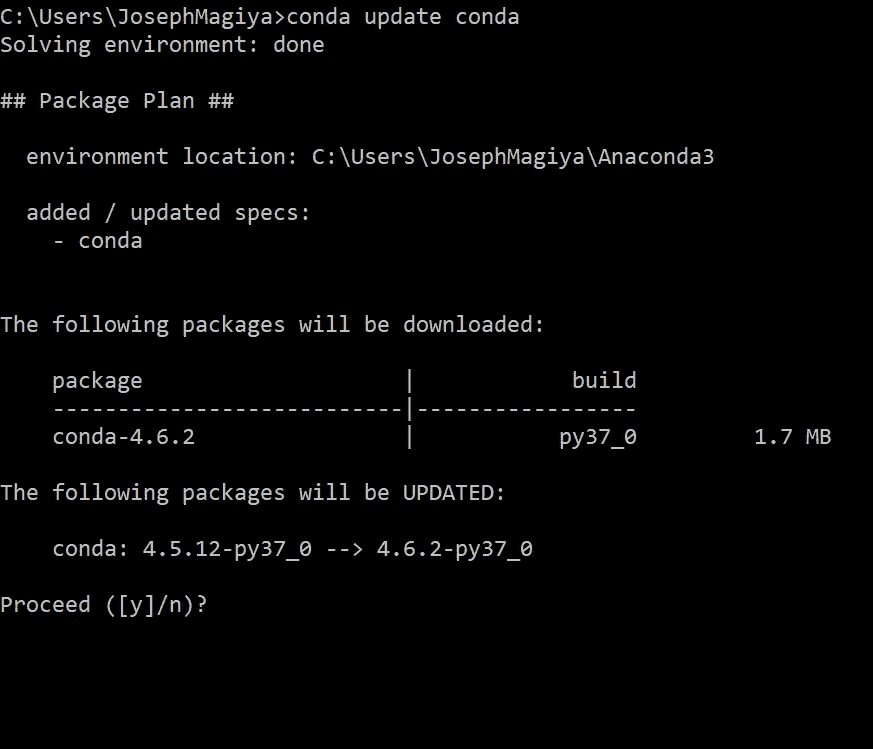
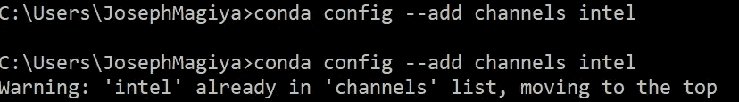
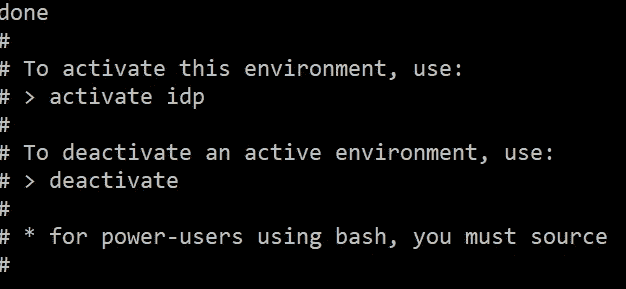

# 使用 Python 时出现英特尔数学内核库(MKL)错误

> 原文：<https://levelup.gitconnected.com/intel-math-kernel-library-mkl-error-using-python-6fbe9cf4aa4e>

我第一次遇到这种情况是在跑自动 ARIMA 的时候。


英特尔 MKL 错误:参数 4 在进入 DLASCL 时不正确。

让我与你分享我的解决方法。

**1。更新 conda**

你至少需要 conda 4.1.11，所以先更新你的 conda。

```
conda update conda
```



**2。告诉 conda 在默认软件包可用时选择英特尔软件包。**

键入以下代码，选择英特尔软件包而非默认软件包:

```
conda config --add channels intel
```

更新后，您将被提示:*“警告:‘英特尔’已经在‘频道’列表中，移动到顶部”*



**3。安装英特尔 Python 发行版**

我建议您在安装时创建一个新环境。如果您想要完整的英特尔发行版，请在命令提示符下键入代码:

```
conda create -n idp intelpython3_full python=3
```

这需要一些时间(喝点水，深呼吸，同时想象所有现在可能发生的事情)。

完成后，您应该会看到:



安装英特尔 Python 发行版

# 奖金

如果你要这么做，那就全力以赴吧！

## 安装英特尔性能库

如果您想要构建一个直接使用性能库的本机扩展，那么您将需要获得一个包含头文件和静态库的开发包。

> ***可用软件包:***
> *mkl —英特尔数学内核库(英特尔 mkl)动态运行时*
> 
> *mkl-devel——用于构建软件的英特尔 mkl 动态运行时和头文件*
> 
> *mkl 静态——用于构建软件的英特尔 mkl 静态库和头文件*
> 
> *mkl-include—仅英特尔 mkl 标题。随着开发包自动安装*

确保将英特尔渠道添加到您的 conda 配置中(见上文)。然后像往常一样使用“conda install”安装我们任何可用的性能库，例如:

```
conda install mkl-devel
```

**干杯！**