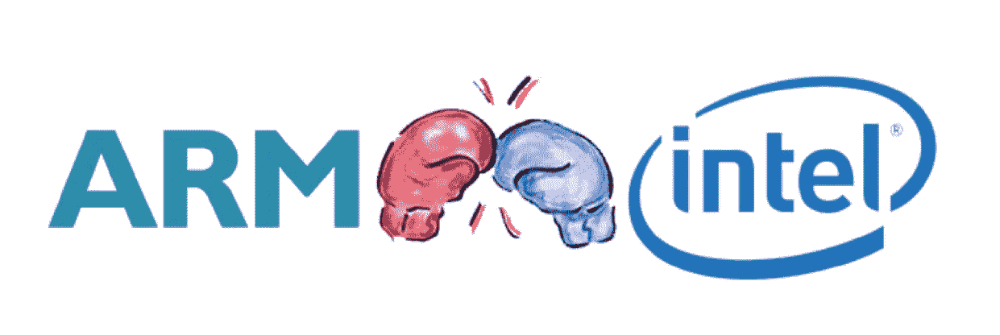
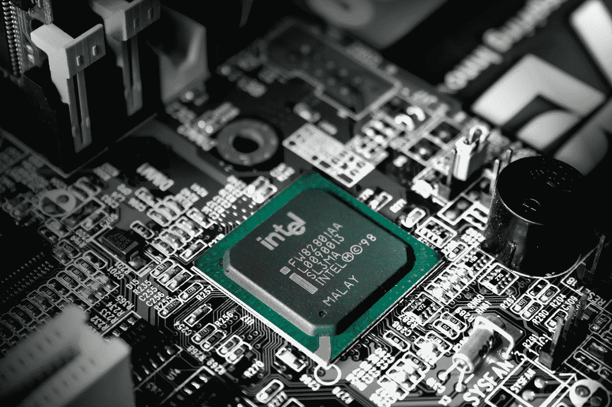
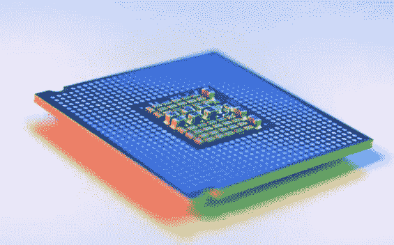
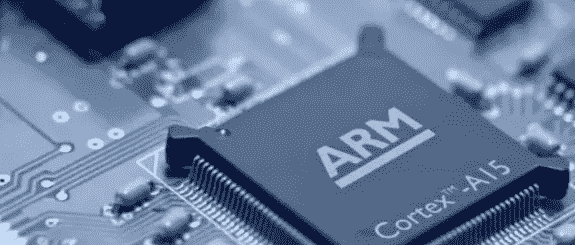
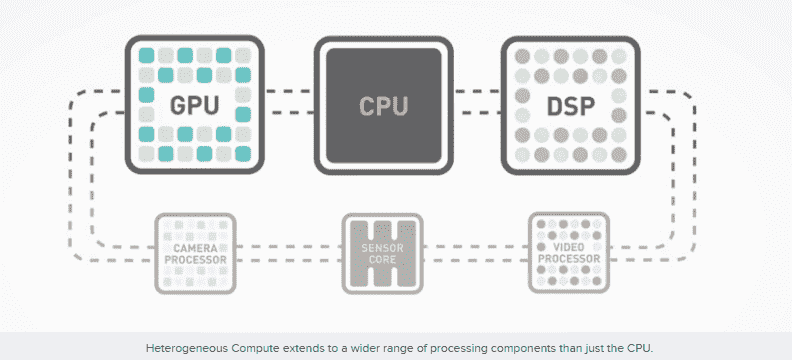
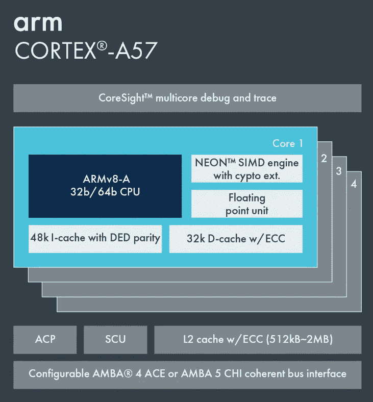

# 英特尔 x86 与 ARM:解释架构和所有关键差异

> 原文：<https://levelup.gitconnected.com/intel-x86-vs-arm-architecture-and-all-key-differences-explained-fb54a04788dc>

ARM 是 Android 和苹果设备中所有现代智能手机使用的最新 CPU 架构。然而，Arm 处理器也正在进入计算机生态系统，如 Arm 上的 Windows 和苹果即将推出的 MAC 定制 CPU。我们很快就会知道谁是两者中的佼佼者，这是你可能需要知道的关于 X86 和 ARM 的一切。

# 处理器架构

一、什么是 CPU？中央处理器(CPU)是你的设备的“大脑”，但它并不完全智能。CPU 只有在得到非常具体的指令(称为指令集)时才能工作，指令集告诉处理器在寄存器和内存之间移动数据，或者使用特定的执行单元执行计算(如乘法或减法)。独特的 CPU 硬件模块需要不同的指令。这些倾向于随着更复杂和更强大的 CPU 而扩展。如果你想要最低功率的 CPU，保持指令集简单是最重要的。然而，更高的性能可以通过更复杂的硬件和指令以功耗为代价获得。这是 Arm 和 Intel 在 CPU 设计方法上的根本区别。

Slejven Djurakovic 在 [Unsplash](https://unsplash.com?utm_source=medium&utm_medium=referral) 上的照片

# 64 位 CPU 架构

传统上，x86 以峰值性能为目标，这是与以更高能效为目标的 Arm 处理器的主要区别。在当今世界，64 位架构已经成为智能手机和个人电脑的主流。这种变化来得不是很快，大约在 2012 年，手机也进行了转变，但这并没有改变我们使用设备的方式，只是让它们更好地处理事情。今天，这两种架构都支持 64 位，但它更适用于智能手机。

早在智能手机之前，个人电脑就已经转向 64 位，但并不是英特尔创造了现代的 x86–64 架构(也称为 x64)。这一荣誉属于 AMD 1999 年的公告，该公告改进了英特尔现有的 x86 架构。

# ARM 架构

ARM 基于 RISC(精简指令集计算),而 Intel (x86)基于 CISC(复杂指令集计算)。Arm 的 CPU 指令是相当原子的，指令数量和微操作之间有非常密切的相关性。相比之下，CISC 提供了更多的指令，其中许多执行多种操作(如优化的数学和数据移动)。这带来了更好的性能，但解码这些复杂的指令需要更多的功耗。

Arm 在 2011 年推出了 ARMv8 64 位架构。Arm 没有扩展其 32 位指令集，而是提供了一个干净的 64 位实现。为此，ARMv8 架构使用两种执行状态:AArch32 和 AArch64。顾名思义，一个用于运行 32 位代码，一个用于运行 64 位代码。ARM 设计的美妙之处在于，处理器在正常执行过程中可以无缝地从一种模式切换到另一种模式。这意味着 64 位指令的解码器是一种新的设计，不需要保持与 32 位时代的兼容性，但处理器作为一个整体保持向后兼容。

# ARM 赢得移动生态系统

上面讨论的架构差异部分解释了这两个芯片巨头当前的成功和面临的问题。Arm 的低功耗方法非常适合移动设备的 3.5W 热设计功耗(TDP)要求，但性能也可以扩展到与英特尔的笔记本电脑芯片相匹配。与此同时，英特尔的 100 瓦 TDP 典型酷睿 i7 在服务器和高性能台式机领域大获全胜，但历史上一直难以降低到 5W 以下。

Arm 架构的一个独特特性在保持移动应用(异构计算)的低 TDP 方面发挥了重要作用。这个想法很简单，构建一个架构，允许不同的 CPU 部件(就性能和功率而言)协同工作以提高效率。异构多处理(HMP)已经在 Android 领域占据重要地位，参见 Snapdragon 810、Exynos 7420 或 Helio X20 等芯片，但异构计算(HC)是下一个发展方向。

你看，处理器可以被设计成更有效地执行某些任务，但是单一的设计很难在所有方面都做到最好。典型的 CPU 可能擅长串行处理，而 GPU 可以处理并行数据流，DSP 更适合实时处理高精度的数据。由于有更广泛的选项可供选择，理论上来说，为任何特定任务选择最佳处理器都会带来更好的性能和能效。

# 在撰写本文时，世界上最快的计算机是基于 ARM 的！

Fugaku 现在是世界上速度最快的超级计算机。作为 TOP500 项目的一部分，日本的 Fugaku 计算机被评为世界上最快的计算机，它采用 A64FX 处理器。Fugaku 位于日本 Wak 市的 RIKEN 计算科学中心。

# 软件兼容性

应用和软件必须针对它们运行的 CPU 架构进行编译，历史上，Arm 上的 Android 或 x86 上的 Windows 等生态系统在多个平台或架构上运行都没有问题。苹果基于 Arm 的 MAC 电脑、谷歌的 Chrome 操作系统和微软基于 Arm 的 Windows 都是软件需要在 Arm 和英特尔架构上运行的现代例子。为两者编译原生软件是新应用和愿意投资重新编译的开发者的一个选择。为了填补空白，这些平台也依赖于代码仿真。换句话说，就是将为一种 CPU 架构编译的代码翻译到另一种架构上运行。与原生应用程序相比，这种方法效率较低，并且会降低性能，但目前可以实现良好的仿真，以确保应用程序正常工作。

经过多年的开发，Arm 上的 Windows 仿真对于大多数应用程序来说都处于相当好的状态。Android 应用程序在英特尔 Chromebooks 上运行也相当不错。Arm Macbooks 是否也能运行，我们还得拭目以待。

我希望你喜欢这篇文章，并从中获得你想要的信息，如果是这样的话，请关注我，以后会有更多这样的帖子。我正在尽我所能为每一个寻找信息的人提供有价值的信息。

# 结束语

如果你对这篇文章有任何问题或建议，请不要犹豫，在评论区回复。喜欢你读的东西吗？为什么不关注我的媒体简讯，这样你就不会错过我未来的任何文章了？很简单，点击[这里](https://kgabeci.medium.com/subscribe)输入你的邮箱地址，然后按订阅。

你喜欢阅读媒体上的文章吗？考虑成为会员，有很多功能，你将获得所有创作者的内容，每月只需 5 美元。使用[这个链接](https://kgabeci.medium.com/membership)，你也帮我赚一小笔佣金，点击成为会员，输入你的信息。