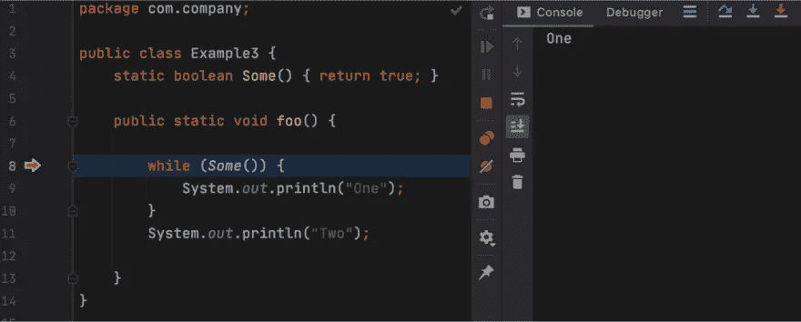
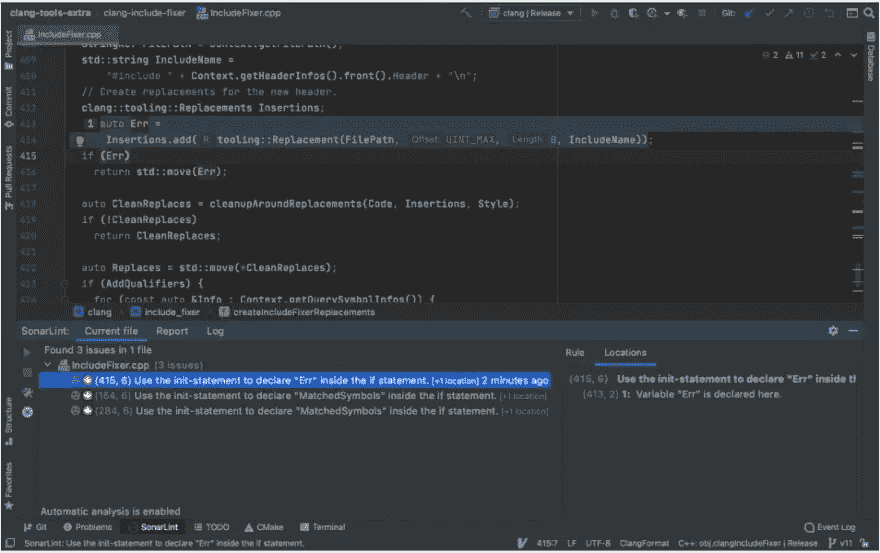
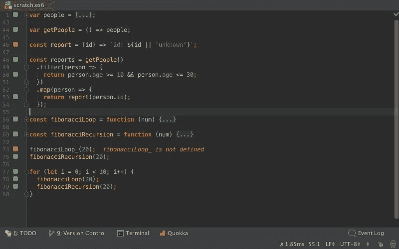

# 提高生产力的 IntelliJ 插件

> 原文：<https://levelup.gitconnected.com/intellij-plugins-to-push-productivity-7dc3e55f094f>

迪伦·费雷拉在 [Unsplash](https://unsplash.com/s/photos/productivity?utm_source=unsplash&utm_medium=referral&utm_content=creditCopyText) 上的照片

今天，我将向您提供一些关于如何增强开发人员的最爱之一——IntelliJ IDE 的建议。我准备的插件是“通用”的，所以在其他 JetBrains IDEs 中也能很好地工作！

# [跳到线](https://plugins.jetbrains.com/plugin/14877-jump-to-line)

这个插件非常适合调试，允许你在调试过程中找到任何一行代码。要建立一个执行点，只需将一个黄色箭头拖放到所选的位置。您也可以从该点开始运行程序，而不执行前面的代码。

# [索纳林](https://plugins.jetbrains.com/plugin/7973-sonarlint)

SonarLint SonarLint 是一个静态代码分析器，它是一种直接在 IDE 中获取代码反馈的方法。就像拼写检查器一样，SonarLint 会即时突出问题，并提供快速修复或清晰的补救指导，帮助您在提交代码之前清理代码。

SonarLint 与大多数 JetBrains IDEs 集成，支持 C、C++、Java、JavaScript、TypeScript、Python、C#、Kotlin、Ruby、HTML & PHP 等语言。

# [Restful 快速请求](https://plugins.jetbrains.com/plugin/16988-restful-fast-request)

这个 IDEA 插件类似于 Postman，可以帮助开发者高效地调试 API。这是一个强大 restful api 工具包插件，帮助您通过现有方法快速生成 url 和参数。通过使用这个插件，你可以确保你的 api 遵循最佳实践，并提高你的生产力！

# [Quokka.js](https://plugins.jetbrains.com/plugin/9667-quokka)

Quokka 是一个快速 JavaScript / TypeScript 原型开发的开发人员生产力工具。当您键入时，运行时值会更新并显示在 IDE 中您的代码旁边。它使 JavaScript / TypeScript 的原型化、学习和测试变得更快。

# [跟我码](https://plugins.jetbrains.com/plugin/14896-code-with-me)

Code with me 是一个协作编码和结对编程服务，捆绑在大多数 IntelliJ IDEs 的最新版本中。

这是一个新的合作开发和结对编程的解决方案。它使开发人员能够与他们的远程同事共享他们在 ide 中打开的项目，并实时地一起工作。在主要功能中，您会发现:同步编辑、跟随模式、完全同步模式、音频和视频通话、智能代码洞察和权限管理。

**注意:**目前与 IntelliJ IDEA 2022.2.2 不兼容

# [Lightrun](https://plugins.jetbrains.com/plugin/16477-lightrun)

Lightrun 是一个非常新的插件，我觉得很有趣。这是一套工具，用于向正在运行的应用程序添加实时信息。它允许您在运行时检测代码级日志、快照和指标，无需热修复、热插拔或重新部署。
在它的特性中，你会发现:添加日志行，添加跟踪代码中任何类型数值的实时指标，以及测量任意代码块的执行时间。值得一查！

有你喜欢的 IntelliJ 插件想推荐吗？请在评论中告诉我！