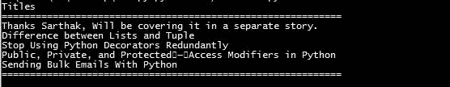

# 使用 API 与媒体交互

> 原文：<https://levelup.gitconnected.com/interacting-with-medium-using-an-api-524c41b2fd74>

## 使用这个 Python 脚本获取您的媒体提要


[Jiroe](https://unsplash.com/@iamjiroe?utm_source=unsplash&utm_medium=referral&utm_content=creditCopyText) 在 [Unsplash](https://unsplash.com/s/photos/api?utm_source=unsplash&utm_medium=referral&utm_content=creditCopyText) 上的照片

API 是我们与媒体交互并从中获取数据的方式之一。在本文中，我们将使用一个 API，并围绕它编写一个 Python 脚本，增强它的用途。

# 剧本的核心

我们将使用一个 API 作为我们应用程序的主要核心。所以，我们神奇的 API 是:

*   [https://medium.com/feed/<用户标识>](https://medium.com/feed/@kaul.sarath)

这个 API 的主要问题是，它给我们提供了 RSS 提要，这有点难以解析。下面是 API 的 RSS 输出。

```
Stories by Sarath Kaul on Medium Stories by Sarath Kaul on Medium [https://medium.com/@kaul.sarath?source=rss-ee4a54b6bda3------2](https://medium.com/@kaul.sarath?source=rss-ee4a54b6bda3------2) [https://cdn-images-1.medium.com/fit/c/150/150/0*46ZdJxIxnag7pMXj](https://cdn-images-1.medium.com/fit/c/150/150/0*46ZdJxIxnag7pMXj). Stories by Sarath Kaul on Medium [https://medium.com/@kaul.sarath?source=rss-ee4a54b6bda3------2](https://medium.com/@kaul.sarath?source=rss-ee4a54b6bda3------2) Medium Mon, 13 Apr 2020 14:37:52 GMT [yourfriends@medium.com](mailto:yourfriends@medium.com) Thanks Sarthak, Will be covering it in a separate story. [https://medium.com/@kaul.sarath/thanks-sarthak-will-be-covering-it-in-a-separate-story-ce28096f41fe?source=rss-ee4a54b6bda3------2](https://medium.com/@kaul.sarath/thanks-sarthak-will-be-covering-it-in-a-separate-story-ce28096f41fe?source=rss-ee4a54b6bda3------2) [https://medium.com/p/ce28096f41fe](https://medium.com/p/ce28096f41fe) Sarath Kaul Mon, 06 Apr 2020 02:58:58 GMT 2020-04-06T02:58:58.665Z <p>Thanks Sarthak, Will be covering it in a separate story.</p> Difference between Lists and Tuple <div class="medium-feed-item"><p class="medium-feed-image"><a href="[https://codeburst.io/difference-between-lists-and-tuple-9153fc329cd?source=rss-ee4a54b6bda3------2](https://codeburst.io/difference-between-lists-and-tuple-9153fc329cd?source=rss-ee4a54b6bda3------2)"></a></p><p class="medium-feed-snippet">Brief differences between two main pillars of data structures</p><p class="medium-feed-link"><a href="[https://codeburst.io/difference-between-lists-and-tuple-9153fc329cd?source=rss-ee4a54b6bda3------2](https://codeburst.io/difference-between-lists-and-tuple-9153fc329cd?source=rss-ee4a54b6bda3------2)">Continue reading on codeburst »</a></p></div> [https://codeburst.io/difference-between-lists-and-tuple-9153fc329cd?source=rss-ee4a54b6bda3------2](https://codeburst.io/difference-between-lists-and-tuple-9153fc329cd?source=rss-ee4a54b6bda3------2) [https://medium.com/p/9153fc329cd](https://medium.com/p/9153fc329cd) programming data-science python lists software-development Sarath Kaul Fri, 27 Mar 2020 14:33:35 GMT 2020-03-27T14:33:35.173Z Stop Using Python Decorators Redundantly <div class="medium-feed-item"><p class="medium-feed-image"><a href="[https://medium.com/better-programming/stop-using-python-decorators-redundantly-2f8467c9eeca?source=rss-ee4a54b6bda3------2](https://medium.com/better-programming/stop-using-python-decorators-redundantly-2f8467c9eeca?source=rss-ee4a54b6bda3------2)"></a></p><p class="medium-feed-snippet">How to set a decorator on every child class function from the parent class</p><p class="medium-feed-link"><a href="[https://medium.com/better-programming/stop-using-python-decorators-redundantly-2f8467c9eeca?source=rss-ee4a54b6bda3------2](https://medium.com/better-programming/stop-using-python-decorators-redundantly-2f8467c9eeca?source=rss-ee4a54b6bda3------2)">Continue reading on Better Programming »</a></p></div> [https://medium.com/better-programming/stop-using-python-decorators-redundantly-2f8467c9eeca?source=rss-ee4a54b6bda3------2](https://medium.com/better-programming/stop-using-python-decorators-redundantly-2f8467c9eeca?source=rss-ee4a54b6bda3------2) [https://medium.com/p/2f8467c9eeca](https://medium.com/p/2f8467c9eeca) data-science software-development python technology programming Sarath Kaul Wed, 04 Mar 2020 23:20:25 GMT 2020-03-04T23:20:25.740Z Public, Private, and Protected — Access Modifiers in Python <div class="medium-feed-item"><p class="medium-feed-image"><a href="[https://medium.com/better-programming/public-private-and-protected-access-modifiers-in-python-9024f4c1dd4?source=rss-ee4a54b6bda3------2](https://medium.com/better-programming/public-private-and-protected-access-modifiers-in-python-9024f4c1dd4?source=rss-ee4a54b6bda3------2)"></a></p><p class="medium-feed-snippet">A detailed view of how we can use access modifiers in Python</p><p class="medium-feed-link"><a href="[https://medium.com/better-programming/public-private-and-protected-access-modifiers-in-python-9024f4c1dd4?source=rss-ee4a54b6bda3------2](https://medium.com/better-programming/public-private-and-protected-access-modifiers-in-python-9024f4c1dd4?source=rss-ee4a54b6bda3------2)">Continue reading on Better Programming »</a></p></div> [https://medium.com/better-programming/public-private-and-protected-access-modifiers-in-python-9024f4c1dd4?source=rss-ee4a54b6bda3------2](https://medium.com/better-programming/public-private-and-protected-access-modifiers-in-python-9024f4c1dd4?source=rss-ee4a54b6bda3------2) [https://medium.com/p/9024f4c1dd4](https://medium.com/p/9024f4c1dd4) software-development python-programming data-science python programming Sarath Kaul Wed, 08 Jan 2020 16:38:53 GMT 2020-03-25T07:06:00.314Z Sending Bulk Emails With Python <div class="medium-feed-item"><p class="medium-feed-image"><a href="[https://levelup.gitconnected.com/sending-bulk-emails-via-python-4592b7ee57a5?source=rss-ee4a54b6bda3------2](/sending-bulk-emails-via-python-4592b7ee57a5?source=rss-ee4a54b6bda3------2)"></a></p><p class="medium-feed-snippet">An automated way to send out your emails</p><p class="medium-feed-link"><a href="[https://levelup.gitconnected.com/sending-bulk-emails-via-python-4592b7ee57a5?source=rss-ee4a54b6bda3------2](/sending-bulk-emails-via-python-4592b7ee57a5?source=rss-ee4a54b6bda3------2)">Continue reading on Level Up Coding »</a></p></div> [https://levelup.gitconnected.com/sending-bulk-emails-via-python-4592b7ee57a5?source=rss-ee4a54b6bda3------2](/sending-bulk-emails-via-python-4592b7ee57a5?source=rss-ee4a54b6bda3------2) [https://medium.com/p/4592b7ee57a5](https://medium.com/p/4592b7ee57a5) gmail email python programming data-science Sarath Kaul Fri, 18 Oct 2019 07:42:37 GMT 2020-02-29T15:33:16.626Z
```

# 增强 API 的结果

为了增强我们 API 的结果，我们将把它转换成 JSON 格式，这样可以很容易地与 Python 一起使用，为此，我们将使用`[rss2json](https://api.rss2json.com/v1/api.json)`。

这个 API 用于将我们的 RSS 提要转换成 JSON。因此，我们将把我们的媒体 API 作为一个 RSS URL 传递给这个转换 API，如下所示:

```
[https://api.rss2json.com/v1/api.json?rss_url=https://medium.com/feed/@kaul.sarath](https://api.rss2json.com/v1/api.json?rss_url=https://medium.com/feed/@kaul.sarath)
```

它将返回如下所示的 JSON 响应:

```
{"status":"ok","feed":{"url":"[https://medium.com/feed/@kaul.sarath](https://medium.com/feed/@kaul.sarath)","title":"Stories by Sarath Kaul on Medium","link":"[https://medium.com/@kaul.sarath?source=rss-ee4a54b6bda3------2](https://medium.com/@kaul.sarath?source=rss-ee4a54b6bda3------2)","author":"","description":"Stories by Sarath Kaul on Medium","image":"[https://cdn-images-1.medium.com/fit/c/150/150/0*46ZdJxIxnag7pMXj](https://cdn-images-1.medium.com/fit/c/150/150/0*46ZdJxIxnag7pMXj)."},"items":[{"title":"Thanks Sarthak, Will be covering it in a separate story.","pubDate":"2020-04-06 02:58:58","link":"[https://medium.com/@kaul.sarath/thanks-sarthak-will-be-covering-it-in-a-separate-story-ce28096f41fe?source=rss-ee4a54b6bda3------2](https://medium.com/@kaul.sarath/thanks-sarthak-will-be-covering-it-in-a-separate-story-ce28096f41fe?source=rss-ee4a54b6bda3------2)","guid":"[https://medium.com/p/ce28096f41fe](https://medium.com/p/ce28096f41fe)","author":"Sarath Kaul","thumbnail":"[https://medium.com/_/stat?event=post.clientViewed&referrerSource=full_rss&postId=ce28096f41fe](https://medium.com/_/stat?event=post.clientViewed&referrerSource=full_rss&postId=ce28096f41fe)","description":"\n<p>Thanks Sarthak, Will be covering it in a separate story.</p>\n\n","content":"\n<p>Thanks Sarthak, Will be covering it in a separate story.</p>\n\n","enclosure":{},"categories":[]},{"title":"Difference between Lists and Tuple","pubDate":"2020-03-27 14:33:35","link":"[https://codeburst.io/difference-between-lists-and-tuple-9153fc329cd?source=rss-ee4a54b6bda3------2](https://codeburst.io/difference-between-lists-and-tuple-9153fc329cd?source=rss-ee4a54b6bda3------2)","guid":"[https://medium.com/p/9153fc329cd](https://medium.com/p/9153fc329cd)","author":"Sarath Kaul","thumbnail":"[https://cdn-images-1.medium.com/max/2600/1*gkncExgxa_rT8GYNHgSghg.jpeg](https://cdn-images-1.medium.com/max/2600/1*gkncExgxa_rT8GYNHgSghg.jpeg)","description":"<div class=\"medium-feed-item\">\n<p class=\"medium-feed-image\"><a href=\"[https://codeburst.io/difference-between-lists-and-tuple-9153fc329cd?source=rss-ee4a54b6bda3------2\](https://codeburst.io/difference-between-lists-and-tuple-9153fc329cd?source=rss-ee4a54b6bda3------2\)"></a></p>\n<p class=\"medium-feed-snippet\">Brief differences between two main pillars of data structures</p>\n<p class=\"medium-feed-link\"><a href=\"[https://codeburst.io/difference-between-lists-and-tuple-9153fc329cd?source=rss-ee4a54b6bda3------2\](https://codeburst.io/difference-between-lists-and-tuple-9153fc329cd?source=rss-ee4a54b6bda3------2\)">Continue reading on codeburst »</a></p>\n</div>","content":"<div class=\"medium-feed-item\">\n<p class=\"medium-feed-image\"><a href=\"[https://codeburst.io/difference-between-lists-and-tuple-9153fc329cd?source=rss-ee4a54b6bda3------2\](https://codeburst.io/difference-between-lists-and-tuple-9153fc329cd?source=rss-ee4a54b6bda3------2\)"></a></p>\n<p class=\"medium-feed-snippet\">Brief differences between two main pillars of data structures</p>\n<p class=\"medium-feed-link\"><a href=\"[https://codeburst.io/difference-between-lists-and-tuple-9153fc329cd?source=rss-ee4a54b6bda3------2\](https://codeburst.io/difference-between-lists-and-tuple-9153fc329cd?source=rss-ee4a54b6bda3------2\)">Continue reading on codeburst »</a></p>\n</div>","enclosure":{},"categories":["programming","data-science","python","lists","software-development"]},{"title":"Stop Using Python Decorators Redundantly","pubDate":"2020-03-04 23:20:25","link":"[https://medium.com/better-programming/stop-using-python-decorators-redundantly-2f8467c9eeca?source=rss-ee4a54b6bda3------2](https://medium.com/better-programming/stop-using-python-decorators-redundantly-2f8467c9eeca?source=rss-ee4a54b6bda3------2)","guid":"[https://medium.com/p/2f8467c9eeca](https://medium.com/p/2f8467c9eeca)","author":"Sarath Kaul","thumbnail":"[https://cdn-images-1.medium.com/max/2600/1*wrII8wPx3atAf6KjQH36RQ.jpeg](https://cdn-images-1.medium.com/max/2600/1*wrII8wPx3atAf6KjQH36RQ.jpeg)","description":"<div class=\"medium-feed-item\">\n<p class=\"medium-feed-image\"><a href=\"[https://medium.com/better-programming/stop-using-python-decorators-redundantly-2f8467c9eeca?source=rss-ee4a54b6bda3------2\](https://medium.com/better-programming/stop-using-python-decorators-redundantly-2f8467c9eeca?source=rss-ee4a54b6bda3------2\)"></a></p>\n<p class=\"medium-feed-snippet\">How to set a decorator on every child class function from the parent class</p>\n<p class=\"medium-feed-link\"><a href=\"[https://medium.com/better-programming/stop-using-python-decorators-redundantly-2f8467c9eeca?source=rss-ee4a54b6bda3------2\](https://medium.com/better-programming/stop-using-python-decorators-redundantly-2f8467c9eeca?source=rss-ee4a54b6bda3------2\)">Continue reading on Better Programming »</a></p>\n</div>","content":"<div class=\"medium-feed-item\">\n<p class=\"medium-feed-image\"><a href=\"[https://medium.com/better-programming/stop-using-python-decorators-redundantly-2f8467c9eeca?source=rss-ee4a54b6bda3------2\](https://medium.com/better-programming/stop-using-python-decorators-redundantly-2f8467c9eeca?source=rss-ee4a54b6bda3------2\)"></a></p>\n<p class=\"medium-feed-snippet\">How to set a decorator on every child class function from the parent class</p>\n<p class=\"medium-feed-link\"><a href=\"[https://medium.com/better-programming/stop-using-python-decorators-redundantly-2f8467c9eeca?source=rss-ee4a54b6bda3------2\](https://medium.com/better-programming/stop-using-python-decorators-redundantly-2f8467c9eeca?source=rss-ee4a54b6bda3------2\)">Continue reading on Better Programming »</a></p>\n</div>","enclosure":{},"categories":["data-science","software-development","python","technology","programming"]},{"title":"Public, Private, and Protected — Access Modifiers in Python","pubDate":"2020-01-08 16:38:53","link":"[https://medium.com/better-programming/public-private-and-protected-access-modifiers-in-python-9024f4c1dd4?source=rss-ee4a54b6bda3------2](https://medium.com/better-programming/public-private-and-protected-access-modifiers-in-python-9024f4c1dd4?source=rss-ee4a54b6bda3------2)","guid":"[https://medium.com/p/9024f4c1dd4](https://medium.com/p/9024f4c1dd4)","author":"Sarath Kaul","thumbnail":"[https://cdn-images-1.medium.com/max/2600/1*oEpqSHbX0ZZXJqbJS-V2Rw.jpeg](https://cdn-images-1.medium.com/max/2600/1*oEpqSHbX0ZZXJqbJS-V2Rw.jpeg)","description":"<div class=\"medium-feed-item\">\n<p class=\"medium-feed-image\"><a href=\"[https://medium.com/better-programming/public-private-and-protected-access-modifiers-in-python-9024f4c1dd4?source=rss-ee4a54b6bda3------2\](https://medium.com/better-programming/public-private-and-protected-access-modifiers-in-python-9024f4c1dd4?source=rss-ee4a54b6bda3------2\)"></a></p>\n<p class=\"medium-feed-snippet\">A detailed view of how we can use access modifiers in Python</p>\n<p class=\"medium-feed-link\"><a href=\"[https://medium.com/better-programming/public-private-and-protected-access-modifiers-in-python-9024f4c1dd4?source=rss-ee4a54b6bda3------2\](https://medium.com/better-programming/public-private-and-protected-access-modifiers-in-python-9024f4c1dd4?source=rss-ee4a54b6bda3------2\)">Continue reading on Better Programming »</a></p>\n</div>","content":"<div class=\"medium-feed-item\">\n<p class=\"medium-feed-image\"><a href=\"[https://medium.com/better-programming/public-private-and-protected-access-modifiers-in-python-9024f4c1dd4?source=rss-ee4a54b6bda3------2\](https://medium.com/better-programming/public-private-and-protected-access-modifiers-in-python-9024f4c1dd4?source=rss-ee4a54b6bda3------2\)"></a></p>\n<p class=\"medium-feed-snippet\">A detailed view of how we can use access modifiers in Python</p>\n<p class=\"medium-feed-link\"><a href=\"[https://medium.com/better-programming/public-private-and-protected-access-modifiers-in-python-9024f4c1dd4?source=rss-ee4a54b6bda3------2\](https://medium.com/better-programming/public-private-and-protected-access-modifiers-in-python-9024f4c1dd4?source=rss-ee4a54b6bda3------2\)">Continue reading on Better Programming »</a></p>\n</div>","enclosure":{},"categories":["software-development","python-programming","data-science","python","programming"]},{"title":"Sending Bulk Emails With Python","pubDate":"2019-10-18 07:42:37","link":"[https://levelup.gitconnected.com/sending-bulk-emails-via-python-4592b7ee57a5?source=rss-ee4a54b6bda3------2](/sending-bulk-emails-via-python-4592b7ee57a5?source=rss-ee4a54b6bda3------2)","guid":"[https://medium.com/p/4592b7ee57a5](https://medium.com/p/4592b7ee57a5)","author":"Sarath Kaul","thumbnail":"[https://cdn-images-1.medium.com/max/688/1*mDE4PXx8N5nvmY25jTiI-A.png](https://cdn-images-1.medium.com/max/688/1*mDE4PXx8N5nvmY25jTiI-A.png)","description":"<div class=\"medium-feed-item\">\n<p class=\"medium-feed-image\"><a href=\"[https://levelup.gitconnected.com/sending-bulk-emails-via-python-4592b7ee57a5?source=rss-ee4a54b6bda3------2\](/sending-bulk-emails-via-python-4592b7ee57a5?source=rss-ee4a54b6bda3------2%5C)"></a></p>\n<p class=\"medium-feed-snippet\">An automated way to send out your emails</p>\n<p class=\"medium-feed-link\"><a href=\"[https://levelup.gitconnected.com/sending-bulk-emails-via-python-4592b7ee57a5?source=rss-ee4a54b6bda3------2\](/sending-bulk-emails-via-python-4592b7ee57a5?source=rss-ee4a54b6bda3------2%5C)">Continue reading on Level Up Coding »</a></p>\n</div>","content":"<div class=\"medium-feed-item\">\n<p class=\"medium-feed-image\"><a href=\"[https://levelup.gitconnected.com/sending-bulk-emails-via-python-4592b7ee57a5?source=rss-ee4a54b6bda3------2\](/sending-bulk-emails-via-python-4592b7ee57a5?source=rss-ee4a54b6bda3------2%5C)"></a></p>\n<p class=\"medium-feed-snippet\">An automated way to send out your emails</p>\n<p class=\"medium-feed-link\"><a href=\"[https://levelup.gitconnected.com/sending-bulk-emails-via-python-4592b7ee57a5?source=rss-ee4a54b6bda3------2\](/sending-bulk-emails-via-python-4592b7ee57a5?source=rss-ee4a54b6bda3------2%5C)">Continue reading on Level Up Coding »</a></p>\n</div>","enclosure":{},"categories":["gmail","email","python","programming","data-science"]}]}
```

# 利用 JSON

我们现在可以将这个 JSON 用于各种目的。例如，获取一个故事和响应标题、类别等等。我们将编写这样一个 Python 脚本，它将获取我们所有故事和回复的标题。

从媒体 API 获取标题



提取标题的输出

您可以用您的处理程序替换`MEDIUM_HANDLER`，获取标题并相应地更改/改进它们。

# 结论和邀请

我希望你喜欢这个故事。你觉得有没有更好的方式和 Medium 沟通？

你可以在 GitHub 上找到这个 API [的源代码库。这有待改进。如果有人想贡献，你可以叉和提出一个问题/公关。希望在那里看到更多的贡献者！](https://github.com/SKAUL05/medipy)