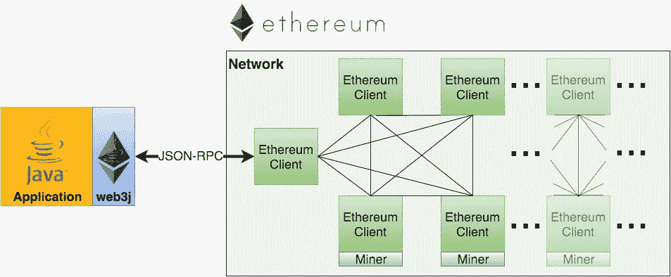

# 使用 Java 和 Web3j 与以太网交互

> 原文：<https://levelup.gitconnected.com/interacting-with-the-ethereum-network-using-java-and-web3j-cea2fe5d8aef>

用 Java 进行 ERC 20 令牌管理的实践指南



来源:https://docs.web3j.io/latest/

# 介绍

**以太坊**是一个去中心化、开源的区块链平台，支持智能合约和去中心化应用(dApps)的创建。作为市值第二大的区块链平台，以太坊因其灵活性和功能而被广泛采用。

**分散应用**，或 dApps，是运行在区块链网络之上的应用。它们提供了各种好处，如透明性、分散性和抗攻击性。由于这些优势，dApps 在各种用例中都很受欢迎，包括游戏、金融、社交媒体等。为了发挥功能，dApps 需要一种方法来与它们运行的区块链通信。这就是以太坊 RPC 节点发挥作用的地方。

为了实现 dApps 和以太坊网络之间的通信，使用了**以太坊 RPC** 节点。这些节点促进了 dApps 和以太坊区块链之间的连接，允许 dApps 在网络上访问信息和进行交易。这样一来，以太坊 RPC 节点就是 dapp 开发中必不可少的元素，每个以太坊客户端都实现了一个 JSON-RPC 规范，为 dapp 提供一组统一的方法供其使用，而不考虑具体的节点或客户端实现。

在这篇博文中，我们将探索如何使用 Web3j 与以太网进行交互，Web3j 是流行的 web 3 抽象库的 Java 实现。我们将讨论连接以太坊节点、使用智能合约和管理 ERC-20 令牌等主题。在本文结束时，您将会更好地理解如何使用 Web3j 在以太网上构建和部署分散式应用程序。

# 使用 Web3j 和 Java 与以太网交互

Web3j 是一个轻量级、高度模块化、反应式、类型安全的 Java 和 Android 库，用于与智能合约交互以及与以太坊网络上的客户端(节点)集成。通过使用 Web3j，开发人员可以轻松地使用以太坊区块链，而无需编写自己的集成代码。您可以在下面的 GitHub 资源库中找到 Web3j 的工作示例:[https://github.com/apappascs/erc20-java-web3j](https://github.com/apappascs/erc20-java-web3j)。

要开始使用 Web3j，您需要使用 Ethereum RPC 端点设置一个 Web3j 提供者。这可以通过下面的代码来完成:

```
public class Web3Provider {
    private static final String PUBLIC_RPC = "https://cloudflare-eth.com";
    public static final Web3j web3j = Web3j.build(new HttpService(PUBLIC_RPC));
}
```

在上面的代码示例中，我们使用的是 Cloudflare 提供的公共以太坊 RPC 端点。然而，你可以使用任何提供者，比如 Alchemy，Infura，比特币基地云，或者 Moralis 等等。

如果您正在寻找以太坊提供者和公共端点的列表，您可以查看 RPC 节点和提供者的[牛逼列表。此资源提供了一个以太坊提供商和公共以太坊 RPC 端点的列表，您可以使用它们来连接到以太坊网络。](https://github.com/arddluma/awesome-list-rpc-nodes-providers)

现在我们已经建立了一个 Web3j 提供者，我们可以开始与以太坊网络交互了。Web3j 提供了大量使用以太坊节点的方法，比如查询以太坊地址的余额或调用智能契约方法。

开发人员可能希望执行的一个常见任务是检查当前的天然气价格。气价是在以太坊网络上执行交易需要支付的乙醚量。您可以使用 Web3j 提供的`ethGasPrice`方法来检索当前的天然气价格，如下例所示:

```
public static BigDecimal getEthGasPrice() throws Exception {
    EthGasPrice ethGasPrice = web3j.ethGasPrice().send();
    return Convert.fromWei(ethGasPrice.getGasPrice().toString(), Convert.Unit.GWEI);
}
```

另一个常见的任务是检查以太坊地址的余额。您可以使用 Web3j 提供的`ethGetBalance`方法来检索给定地址的余额，如下例所示:

```
public static BigDecimal getEthGetBalance(final String walletAddress) throws Exception {
    EthGetBalance ethBalance = web3j.ethGetBalance(walletAddress, DefaultBlockParameterName.LATEST).send();
    return Convert.fromWei(ethBalance.getBalance().toString(), Convert.Unit.ETHER);
}
```

这些只是 Web3j 提供的与以太坊节点交互的许多方法中的几个例子。你可以在 Web3j 文档页面 [https://docs.web3j.io](https://docs.web3j.io) 上找到更多信息。

## ERC-20 令牌管理

https://eips.ethereum.org/EIPS/eip-20[的以太坊改进提案(EIP) 20 中定义了 ERC-20，这是一个在以太坊网络上创建和发行令牌的流行标准。该标准定义了一组规则，任何希望被视为 ERC-20 令牌的以太坊智能合约都必须遵循这些规则，以确保与支持 ERC-20 令牌的其他合约和钱包兼容。](https://eips.ethereum.org/EIPS/eip-20)

要使用 Web3j 处理 ERC-20 令牌，您可以使用`ERC20.load()`方法来加载契约并调用其函数。以下是一些可以使用 Web3j 通过 ERC-20 令牌执行的常见任务的示例:

```
private static final ContractGasProvider contractGasProvider = new DefaultGasProvider();
private static final TransactionManager readOnlyTransactionManager = new ReadonlyTransactionManager(web3j, FROM_ADDRESS);

private static final ERC20 loadERC20Contract(final String contractAddress) {
    return ERC20.load(contractAddress, web3j, readOnlyTransactionManager, contractGasProvider);
}

public static String getName(final String contractAddress) throws Exception {
    return loadERC20Contract(contractAddress).name().send();
}

public static String getSymbol(final String contractAddress) throws Exception {
    return loadERC20Contract(contractAddress).symbol().send();
}

public static BigDecimal getTotalSupply(final String contractAddress) throws Exception {
    BigInteger totalSupply = loadERC20Contract(contractAddress).totalSupply().send();
    return Convert.fromWei(totalSupply.toString(), Convert.Unit.ETHER);
}

public static BigDecimal getBalanceOf(final String contractAddress, final String walletAddress) throws Exception {
    BigInteger balanceOf = loadERC20Contract(contractAddress).balanceOf(walletAddress).send();
    return Convert.fromWei(balanceOf.toString(), Convert.Unit.ETHER);
}
```

方法`name()`返回与给定合同地址相关联的 ERC-20 令牌的名称。`symbol()`方法返回令牌的符号。`totalSupply()`方法返回令牌的总供应量。并且`balanceOf()`方法返回给定钱包地址的 ERC-20 令牌的余额。

## Web3j —查询智能合约的状态

要使用 Web3j 查询智能合约的状态，可以使用`eth_call` JSON-RPC 方法([https://ether eum . org/en/developers/docs/APIs/JSON-RPC/# eth _ call](https://ethereum.org/en/developers/docs/apis/json-rpc/#eth_call))。此方法允许您调用智能协定上的方法来查询其状态，而无需在区块链上创建事务。

要使用`eth_call`，您需要创建一个`Function`对象来表示您想要调用的方法。您可以通过指定方法名、表示方法参数的输入`Type`对象列表和表示方法返回类型的`TypeReference`对象列表来实现这一点。

一旦创建了`Function`对象，就可以使用`FunctionEncoder`类将它编码成可以在`eth_call`请求中使用的十六进制字符串。然后，您可以使用`web3j.ethCall`方法发送`eth_call`请求，将表示调用的`Transaction`对象、契约地址和编码函数指定为参数。

要从`eth_call`请求中获得响应，您可以调用`sendAsync`方法并使用`FunctionReturnDecoder`类将响应值解码成一个表示函数返回值的`Type`对象列表。

以下是如何使用 Web3j 查询智能合约状态的示例:

```
// Solidity Types in smart contract functions
List<Type> inputParameters = Arrays.asList(new Type(value));
List<TypeReference<Type>> outputParameters = Arrays.asList(new TypeReference<Type>() {});
Function function = new Function("functionName", inputParameters, outputParameters);
String encodedFunction = FunctionEncoder.encode(function);
EthCall response = web3j.ethCall(Transaction.createEthCallTransaction(fromWalletAddress, contractAddress, encodedFunction),DefaultBlockParameterName.LATEST).sendAsync().get();
List<Type> result = FunctionReturnDecoder.decode(response.getValue(), function.getOutputParameters());
```

注意:如果进行了无效的函数调用，或者得到了空结果，返回值将是`Collections.emptyList()`的一个实例。

## 其他 web3j 特性

Web3j 提供创建和管理以太坊钱包以及签署交易的功能。您可以创建新的 wallet 文件，或者使用适当的方法从现有的 wallet 文件中加载身份证明。要签署交易，您可以使用`RawTransaction`类型和`TransactionEncoder.signMessage`方法。一旦事务被签名，您就可以使用`Numeric.toHexString`方法对它进行编码，并使用`eth_sendRawTransaction`方法发送它。

以下是如何创建新的以太坊钱包文件并使用 Web3j 签署交易的示例:

```
String fileName = WalletUtils.generateNewWalletFile(
        "your password",
        new File("/path/to/destination"));
Credentials credentials = WalletUtils.loadCredentials(
        "your password",
        "/path/to/walletfile");
EthGetTransactionCount ethGetTransactionCount = web3j.ethGetTransactionCount(
        credentials.getAddress(), DefaultBlockParameterName.LATEST).sendAsync().get();
BigInteger nonce = ethGetTransactionCount.getTransactionCount();
RawTransaction rawTransaction  = RawTransaction.createEtherTransaction(
        nonce, <gas price>, <gas limit>, <toAddress>, <value>);
byte[] signedMessage = TransactionEncoder.signMessage(rawTransaction, credentials);
String hexValue = Numeric.toHexString(signedMessage);
EthSendTransaction ethSendTransaction = web3j.ethSendRawTransaction(hexValue).sendAsync().get();
String transactionHash = ethSendTransaction.getTransactionHash();
```

要查看使用 Web3j 创建和发送原始事务的完整示例，可以参考 web3j GitHub 页面上的集成测试 [CreateRawTransactionIT](https://github.com/web3j/web3j/blob/master/integration-tests/src/test/java/org/web3j/protocol/scenarios/CreateRawTransactionIT.java) 。

Web3j 还提供了与以太坊名称服务(ENS)交互的能力，ENS 是一个建立在以太坊区块链之上的去中心化、开源的命名系统。ENS 允许用户注册和解析以太坊地址的人类可读名称。

要使用 Web3j 处理 ENS，您可以使用 EnsResolver 类，它提供了将 ENS 名称解析为以太坊地址的方法，反之亦然。

下面是一个如何在 Web3j 中使用 EnsResolver 类的示例:

```
EnsResolver ensResolver = new EnsResolver(web3j);
String address = ensResolver.resolve("myname.eth");
String ens = ensResolver.reverseResolve(address);
```

此代码将把 ENS 名称“myname.eth”解析为以太坊地址，然后将该地址反向解析为相应的 ENS 名称。使用 EnsResolver 类简化了在 Java 代码中使用 ENS 名称和地址的过程。

# 概述

总之，Web3j 是一个强大的库，它简化了与以太坊区块链的交互过程，并在 Java 中构建了分散的应用程序。它提供了广泛的功能，包括查询智能合约的状态、管理或创建以太坊钱包、与以太坊名称服务(ENS)交互、部署智能合约以及接收以太坊网络中发生的某些事件的通知。如果你想了解更多关于 Web3j 的知识，可以考虑试试这个库。对于任何对以太坊区块链感兴趣的 Java 开发人员来说，这是一个必不可少的工具，不管他们的以太坊经验水平如何。

# 分级编码

感谢您成为我们社区的一员！在你离开之前:

*   👏为故事鼓掌，跟着作者走👉
*   📰更多内容请查看[升级编码刊物](https://levelup.gitconnected.com/?utm_source=pub&utm_medium=post)
*   🔔关注我们:[推特](https://twitter.com/gitconnected) | [LinkedIn](https://www.linkedin.com/company/gitconnected) | [时事通讯](https://newsletter.levelup.dev)

🚀👉 [**加入升级人才集体，找到一份神奇的工作**](https://jobs.levelup.dev/talent/welcome?referral=true)