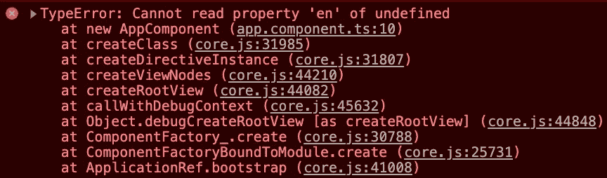
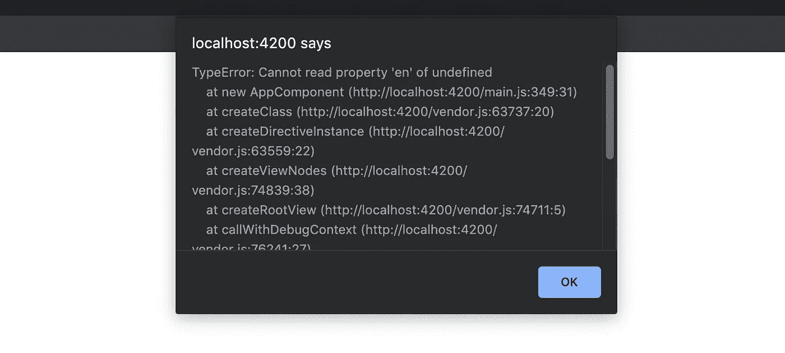

# 用角度误差处理器拦截误差

> 原文：<https://levelup.gitconnected.com/intercept-errors-with-angular-ce445f2e74eb>


迈克尔·盖格在 [Unsplash](https://unsplash.com/s/photos/computer-bug?utm_source=unsplash&utm_medium=referral&utm_content=creditCopyText) 上的照片

作为开发人员，思考我们处理错误的方式很重要。当错误发生时，用户应该得到适当的通知，我们的开发者也应该得到通知，以便帮助修复错误。

网络错误很容易处理，但是 JavaScript 错误通常是沉默的。这些错误是意想不到的，尤其让用户感到烦恼，因为他甚至没有得到关于发生了什么的通知。他可能会抱怨，但大多数时候不会向您提供详细的错误堆栈。然后你必须自己尝试重现错误，或者(这种情况经常发生)你放弃了，认为这只是一次小故障。

该问题的解决方案是存储生产网站中发生的每个错误的堆栈。它将帮助您修复用户报告的错误，并可能发现没有人抱怨过的新错误。让我们来看看如何用 Angular 实现这一点。

# 角度误差处理器

让我们创建一个新的 Angular 应用程序，在主页上有一个基本错误:

```
ng new error-logging
```

标题不会显示，您会在控制台中看到一个描述性很强的错误:



控制台中的这个错误，只要没有传到我们这里，对我们没有太大帮助。用户可能不会将它与他的错误报告一起发送，所以我们需要在错误发生时尽快将它发送给我们自己。

Angular 让我们拦截每一个错误。为此，您需要构建自己的错误处理程序。

我称我的错误处理器*为错误警报器*，因为它就是这么做的。它实现了 Angular *ErrorHandler* ，因此需要有一个 *handleError* 方法。在这种方法中，您可以按照自己的方式处理错误。我只是*提醒*错误堆栈，在现实生活中，我会建议将它发送到服务器并保存在数据库中。但是后端部分不在讨论范围之内。

我现在必须告诉 Angular 在我的模块中使用它:

错误堆栈现在被*警告。*



模块中发生的每一个错误(在应用程序中，如果你在根模块中提供你的错误处理器)都将被拦截。存储它们将为您提供详细的文档，并使错误修复方式更容易。您还可以利用处理程序来通知用户出现了错误。当用户看到错误信息时，通常比页面停止响应时更容易理解。

你可以在这里找到完整的项目[。](https://github.com/Dornhoth/error-logging.git)