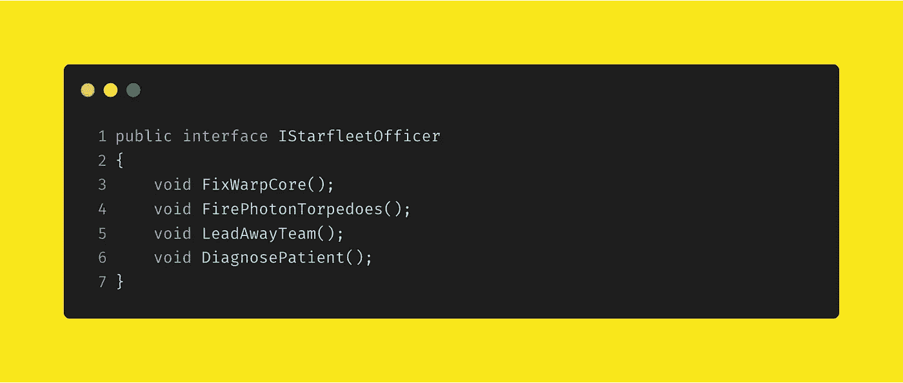
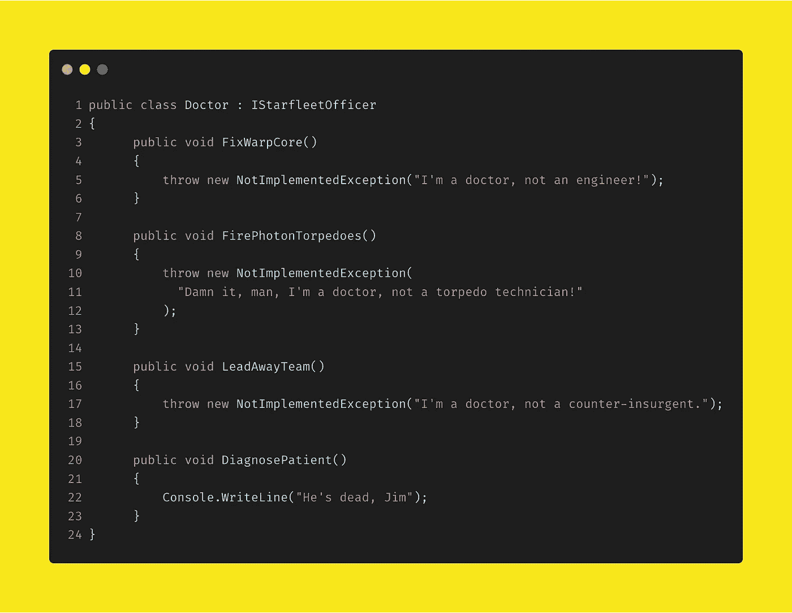
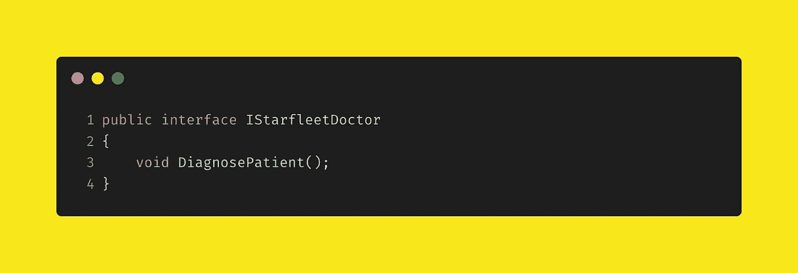
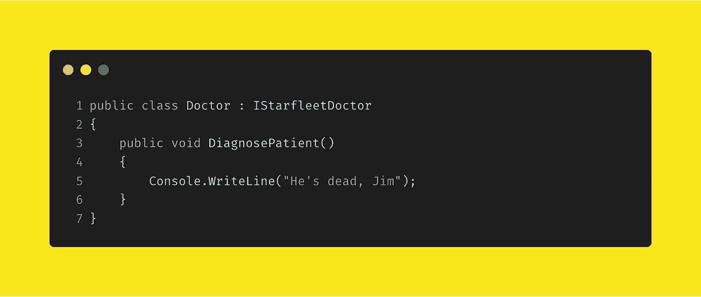
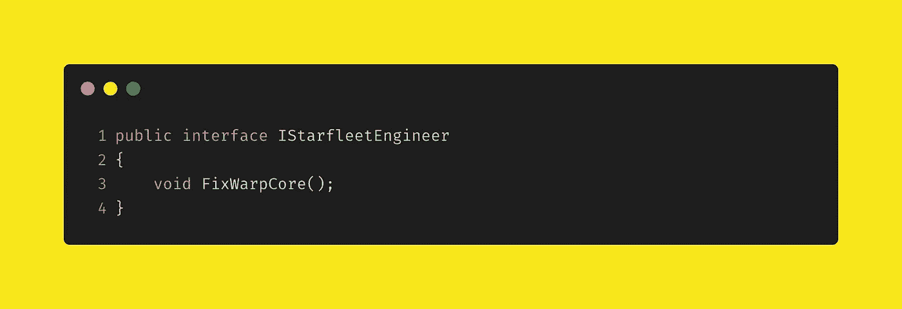
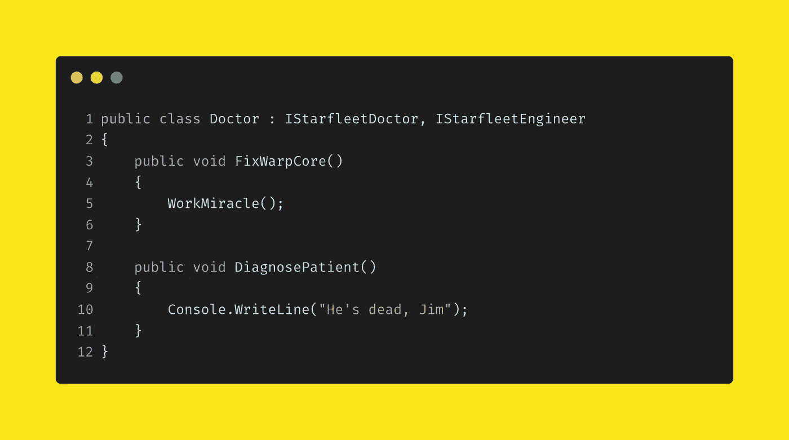

# 界面分离:最后的前沿

> 原文：<https://levelup.gitconnected.com/interface-segregation-the-final-frontier-70e6f781cc92>

界面分离原理是固体中的 **I** ，在我看来，是最容易掌握的原理之一。然而，它经常被忽视。

我最近看了很多《星际迷航》中的**——这是该剧中一个众所周知的 snowclone，它启发了我写这篇短文:**

> 该死，吉姆，我是医生，不是…

伦纳德·麦考伊是一名星际舰队军官，作为探索陌生新世界的一员，他正在执行一项为期五年的任务；但他也是一名医生，经常被要求承担他没有接受过训练的任务，这让他非常惊愕。

让我们用一些代码来模拟骨骼，看看我们能得到什么。

首先，我们将创建一个界面，描述一个典型的星际舰队军官可以执行的功能。

IStarfleetOfficer 定义了星际舰队军官的合同

好吧——看起来很明智。这些都是企业团队成员在某个时候执行的功能，所以让我们模拟好医生并实现这个接口。

医生类，实现 IStarfleet 军官

啊。 *NotImplementedExceptions* 比比皆是。骨头是医生，不是别的。

这当然是一个故意装傻的例子，但是我确信我们都在我们工作的代码库中遇到过这种事情。一个通用的接口，无论是通过设计还是通过有机增长，类明确地不实现不适用的功能。

这就是界面分离原理试图解决的问题。

在我们继续之前，让我们先处理一下*为什么*这是一个问题。当然，如果你有好的异常处理，那么这不是一个问题？是的，它可能看起来有点乱，但它不会伤害任何人。

不幸的是——不管异常是如何处理的，或者代码看起来有多整洁，这都是一个问题，原因有二。

首先，干净整洁的代码很重要——几乎和工作代码一样重要(如果你愿意，你可以在这里签署[声明)。这不是风格问题——我们有风格指南和内部规则——而是关于可维护性的问题。简单明了的代码更容易使用；延伸、保持或移除。](http://manifesto.softwarecraftsmanship.org/)

其次，上面的例子将一个 *Doctor* 类与所有实现 *IStarfleetOfficer* 的函数紧密耦合。我们不喜欢紧耦合。过了一段时间，随着系统的增长(无论是有意的还是通过有机的改变)，对紧密耦合的设计进行简单的改变变得越来越复杂。

好了——这是问题的总结，现在我们如何解决它们。

简单——我们隔离我们的接口。让我们为麦考伊做这件事。

分离 McCoy 的职能

更干净的医生实现

好多了！没有 *NotImplementedException* 并且不需要每次改变 *IStarfleetOfficer* 接口来保持对新需求的考虑时一直添加新的实现。代码更干净，更易维护，并且不与无关的事物紧密耦合。

然而，麦科伊的问题是，在和柯克、斯科特或斯波克抗议之后，他经常能够做到他说他做不到的事情。就好像他只是脾气不好…

我们如何对此建模？我们只是创建了另一个接口。

IStarfleetEngineer 接口，很好地分离

看来麦考伊*终究能创造奇迹*

完美。骨头可以拯救世界，船员们可以去村上里沙好好休息一下

现在我已经经历了对这种方法的一些批评——即代码库被众多的接口“污染”,通常描述很少的功能，并且你最终不得不管理太多的文件。

然而这种批评是站不住脚的。更干净、更易维护的代码的代价，很容易超过代码库中有更多文件带来的任何小的(而且是很小的)不便。

分割你的接口，使实现它们的类实现所有契约的**。那时你会感激它，将来为你工作的开发人员也会感谢你。**

哦——在我受到太多压力之前，我意识到麦考伊从未说过“该死，吉姆”。我是医生，不是……”