# 接口

> 原文：<https://levelup.gitconnected.com/interfaces-82d7a21ee5d7>

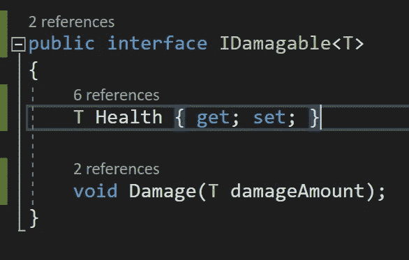

接口类似于抽象类，因为它们强制实现。主要区别在于抽象类更多的是继承类的部分模板，而接口是完整的模板。接口中的一切绝对*必须*被*实现*。接口本身不允许实现，也不能包含字段。当使用一个接口时，你只能使用*方法*和*属性*。接口允许*多态*，这是我将在本文后面讨论的内容。让我们使用一个界面来实现一个通用的健康系统，玩家和敌人都可以使用。

首先创建一个名为 *IDamagable* 的 C#脚本。创建接口时，最好以**I**(IHealable、ILevelUp、IShootable 等)开始命名。这更容易记住你正在使用一个*接口*，而不是一个*类*。

**声明一个接口**

首先，打开 *IDamagable* 脚本，将其从*类*更改为*接口*。然后*删除 Mono 行为*，该接口不能从其他类继承。

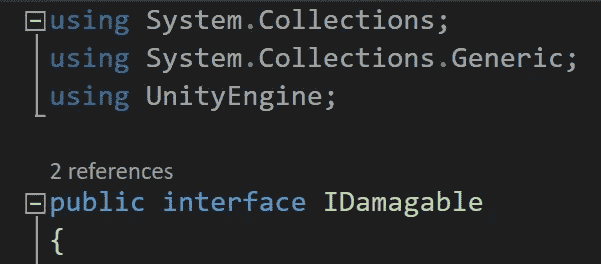

*接口*有一个*访问修饰符*，它被自动假定为*公共*。因为接口不能有字段，这里使用了一个*属性*用于*健康*变量，带有一个*获取*和*设置*值。*接口*也可以使用*方法*，正如这里看到的用*损坏*方法。接口不能有*实现*，所以这里的方法是空的。你可以使用方法*参数*，这样就为传入的伤害量创建了一个。

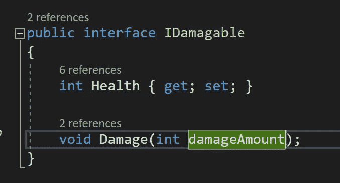

**使用接口**

为你的*玩家*和*敌人*创建对象。

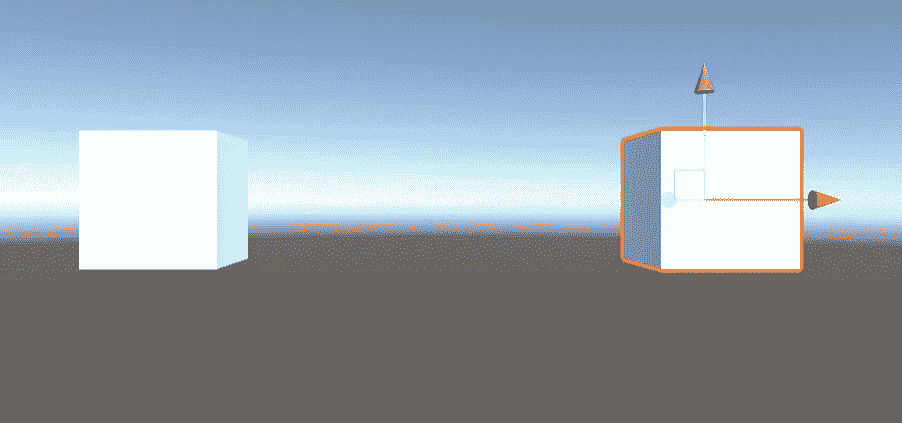

我把这个*苔藓巨人*剧本附加到*敌人*身上，这个剧本*继承了*敌人*职业的*。

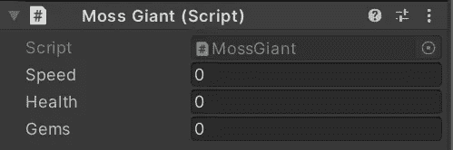

*玩家*脚本附加到玩家对象上。

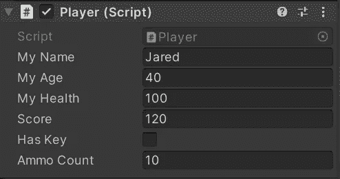

要访问*敌人*类中的接口，在*单声道行为*后放置一个*逗号*，然后键入*接口*的名称。这非常有用，称为*多重继承*，因为脚本已经从 *Mono 行为*继承，但现在也从*接口*继承。虽然一次只能继承一个类，但是可以根据需要继承任意多的接口。我马上看到一个*错误*，是这个界面告诉我必须包含*生命值属性*和附带的*伤害方法*。

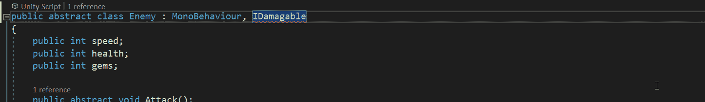

一旦输入了需要的*生命属性*和*伤害方法*，则*界面*不再显示错误。

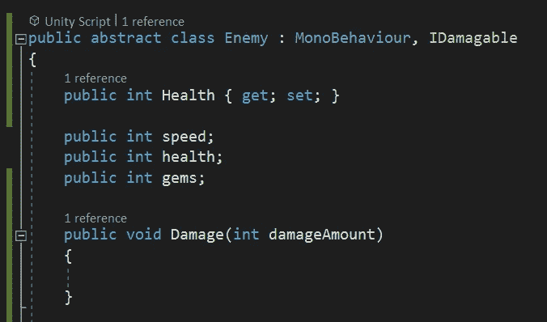

这里在*播放器*脚本中，实现界面的另一种方式是在*上右击*，然后选择*快速动作和重构*。会弹出两个选项来自动实现接口。

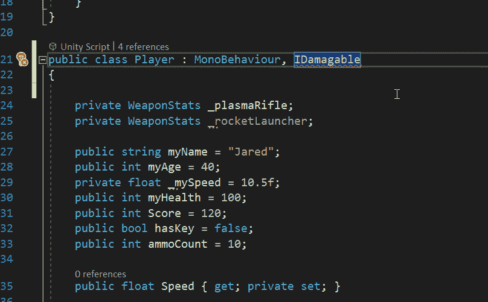

我选择*实现接口*后，自动生成*健康属性*。

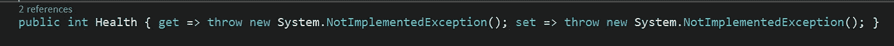

所需的*损坏方法*也会发生同样的事情。

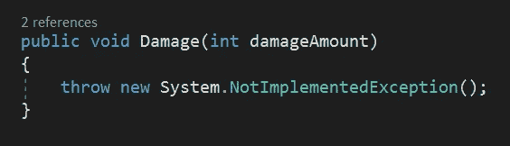

抛出*新系统。NotImplementedException* 方法是一个占位符，直到开发人员可以实现所需的功能。这里我们可以用*从*健康属性*中减去*即将到来的*伤害量* t 来代替。

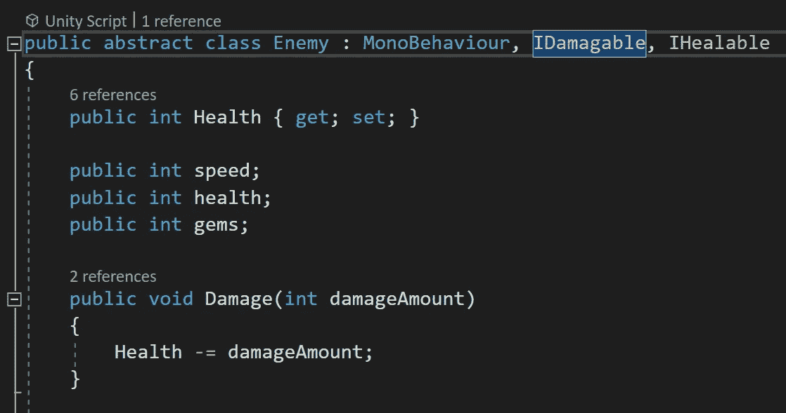

像这样使用多重继承使得游戏设计者能够决定敌人类需要继承什么接口。这些可以是 IDamagable、IShootable、IHealable 或任何你需要的东西。

**多态性**

*多态*的意思是*多种形式*，使用*接口*是一个很大的附加好处。在游戏开发的情况下，这意味着使用*类继承*，其中*基类*定义了*虚拟方法*的基本特征，继承类的*可以自由定制它，或者*覆盖*它，以满足他们的特定需求。基本上，您可以用多种不同的方式实现单个操作，从而使您的代码可重用。*

**通用接口**

通过使*通用*，多态可以与*接口*一起使用。再次查看*idama table*接口，可以看到*伤害方法*有一个变量用于表示*伤害量*，它需要是一个 *int* 值类型。如果你想让某些敌人接受一个 *float* 值，而让玩家接受一个 *int* 值呢？这可以通过使接口*通用化*，并让继承类的*决定它们需要什么样的*值类型*来实现。*

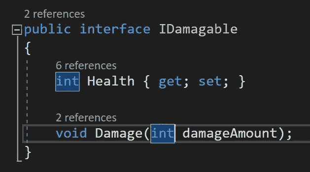

为了使接口*通用*，打开一些 *T 括号*并在接口声明的末尾添加关键字 ***T*** 。现在在伤害方法中，将 *int* 替换为 ***T*** 。

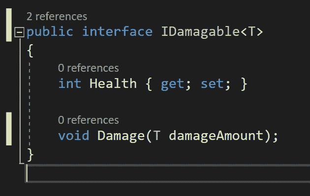

回到*敌人*类，在*接口*上显示一个*错误*，因为我现在需要在这里声明期望的*值类型*。

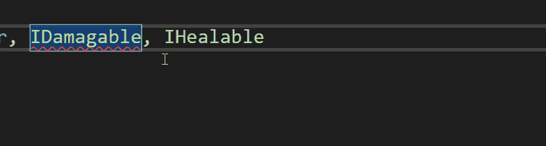

我希望*敌人*类为 *Idamagable* 接口使用一个 *int* 值，所以我打开一些 *T 括号*并输入 *int* 作为值类型。

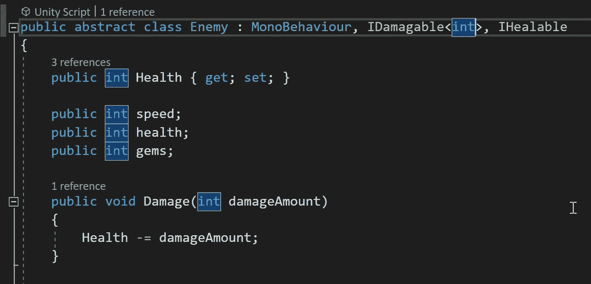

相反地， *player* 类输入 *float* 作为接口所需的类型。

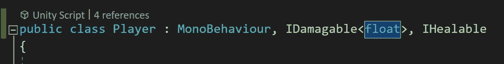

损坏方法必须与此*值类型*匹配。我在这里得到一个*错误*，因为 *IDamagable* 接口中的*健康属性*是一个 *int* 值，错误警告我从一个 *int* 中减去一个 *float* 。

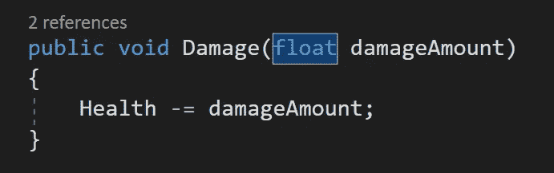

我可以将*玩家*类中的*健康属性*也改为*浮点型*，但是随后另一个*错误*出现，告诉我*值类型*与*接口*中的不匹配。

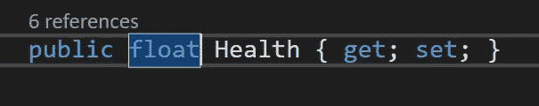

要解决这个问题，在 *IDamagable* 接口中，将 *health 属性*的*值类型*更改为 ***T*** ，通用*类型*。现在，继承类可以自由地将 health 属性声明为它们所需的值类型，而不会发生冲突。

感谢阅读，请在我下次深入*代表*和*事件*时加入我！