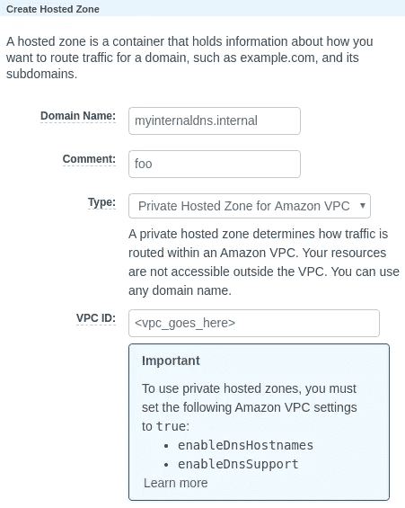
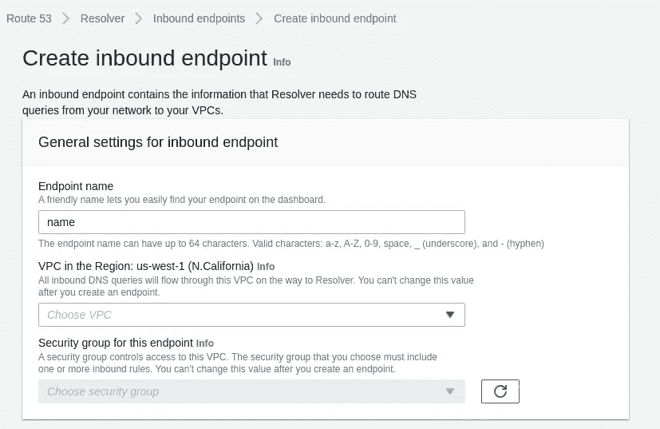
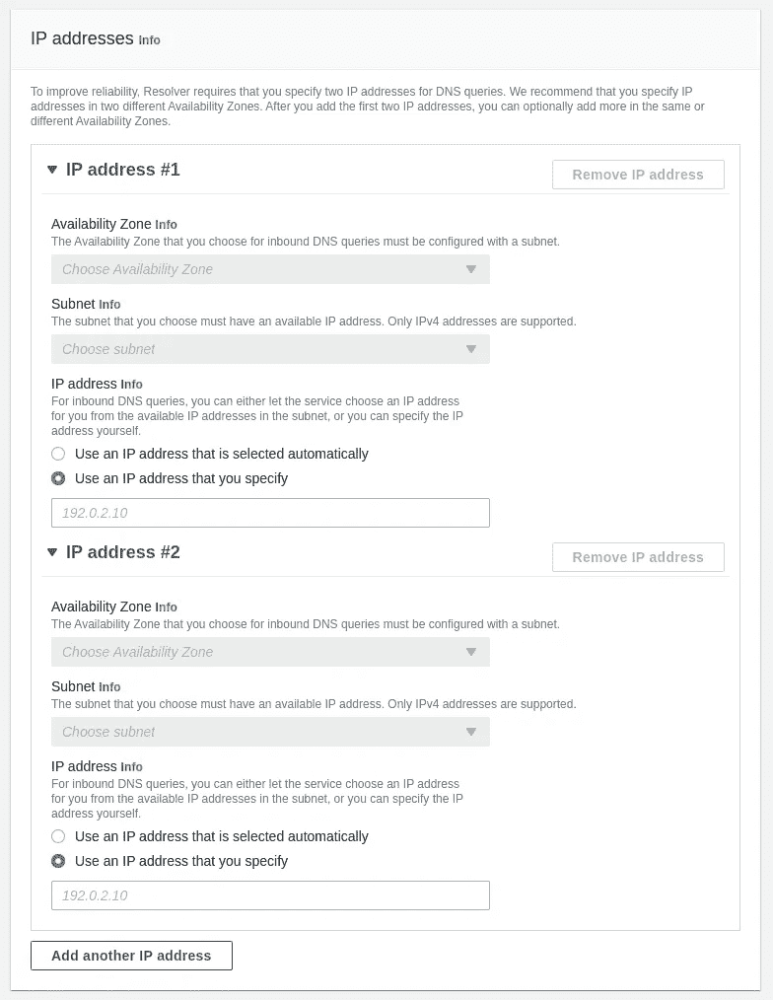
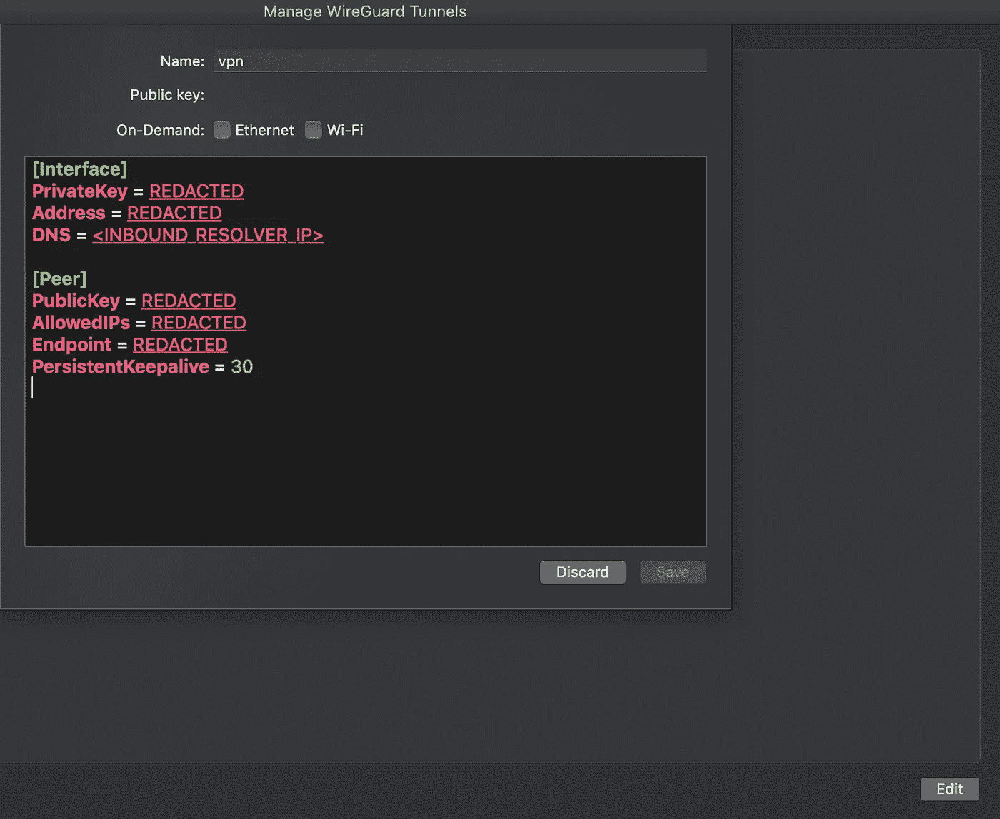

# 使用 Route53 和 Wireguard 的内部 DNS

> 原文：<https://levelup.gitconnected.com/internal-dns-using-route53-and-wireguard-a4d6196f9481>


[科学高清照片](https://unsplash.com/@scienceinhd?utm_source=unsplash&utm_medium=referral&utm_content=creditCopyText)在 [Unsplash](https://unsplash.com/s/photos/servers?utm_source=unsplash&utm_medium=referral&utm_content=creditCopyText)

Wireguard 棒极了。很好用，很容易配置，而且[超快](https://medium.com/@hkdb/wireguard-vs-openvpn-910c3558184c)。自从 Wireguard 第一次被引入以来，它就越来越受欢迎，随着它被纳入 Linux 内核，使用量也在不断增加。

如果您在家中或小型办公室使用 Wireguard，则可以轻松地手动管理隧道两端的端点和主机。如果您在大型企业中实施 Wireguard，您可能希望使用某种形式的内部 DNS 来处理许多主机名条目。

使用像 Bind 或 Windows Server DNS 这样的本地 DNS 服务器对于那些本地资源来说是很好的，但是如果您没有*本地服务器呢？*

在 AWS 中实现带有 Wireguard 的内部 DNS 解析器非常简单，并且使管理所有这些资源变得更加容易。让我们看看如何使用 Wireguard 和 AWS Route53 DNS 进行设置。

## 先决条件

本文假设您已经在客户端主机和 AWS EC2 中的至少一个实例上实现了 Wireguard。您应该能够通过 Wireguard 隧道到达 EC2 实例和该实例所在的 VPC。

如果您目前只能到达终止于隧道另一端的 EC2 实例，那么您可能需要在该实例上启用路由。通过编辑`/etc/sysctl.conf`并添加:

```
net.ipv4.ip_forward = 1
```

如果您需要帮助从头开始设置 Wireguard，Wireguard 团队有一个很好的快速入门工具[在这里](https://www.wireguard.com/quickstart/)。

## 创建私有托管区域

为了在 Route53 中添加内部 DNS 条目，您需要创建一个私有托管区域。访问 Route53 控制台并选择*托管区域*开始。



在 Route53 控制台中创建私有托管区域。

选择一个新域名(仅限内部),并给它一个 TLD，以区别于其他公共区域。的”。“内部”域经常用于此目的。这是有趣的部分，你可以选择任何你想要的内部域名，因为它不会公开解析。

确保您选择了“*亚马逊 VPC 的私人托管区域*”作为类型，然后输入您想要与该区域关联的 VPC ID。

一旦创建了新的区域，您可以随意向其中添加一些记录。您可以添加一些" *A* 记录或" *CNAMEs* "指向 VPC 内部的实例或服务。

关于配置私有托管区域的更多细节可以从 Amazon [这里](https://docs.aws.amazon.com/Route53/latest/DeveloperGuide/hosted-zone-private-creating.html)获得。

## 添加入站 VPC 端点

为了实际解析您新创建的 DNS 名称，您需要指向一个解析器 IP。为了进行内部解析，您需要一个“*入站解析器端点*”。

端点实际上是您选择的 VPC 内的一个 IP 地址，充当专用区域的解析器。这类似于当你改变一个客户端的 DNS 设置到谷歌的*8.8.8.8*解析器，但是你却指向你自己的云解析器。

继续创建一个新的入站端点(*入站*意味着解析器请求将来自您的私有网络，指向 VPC)。



在 Route53 控制台中创建新的入站端点。

在命名新端点、选择它应该驻留的 VPC 并分配安全组之后，我们需要为端点提供 IP 地址。您可以选择自动生成 IP，但是因为我们希望始终将客户端指向同一个解析器，所以我们在这里选择一些静态 IP。

确保使用每个子网和可用性区域内的有效 IP 地址，并且不要与其他正在使用的地址重叠。



在 Route53 控制台中向入站端点添加 IP 地址。

完成 IP 地址部分后，您应该准备好完成端点设置过程。单击“提交”后，您需要等待，直到终端完全运行。


Route53 控制台中的 VPC 端点状态。

一旦获得许可，就该继续前进，配置 Wireguard 客户端使用新端点进行解析了。

## 将端点添加到 Wireguard 配置

如果你在 Mac 上工作，并且使用 App Store 中可用的 [Wireguard 应用程序(你应该这样做)，配置很简单。打开 Wireguard 应用程序，在您现有的 VPN 隧道上单击“*编辑*”。](https://apps.apple.com/us/app/wireguard/id1451685025?mt=12)

您需要在*接口*部分下添加一个 DNS 条目。将`<INBOUND_RESOLVER_ENDPOINT>`替换为新端点的 IP 地址，如下所示:

```
DNS = <INBOUND_RESOLVER_ENDPOINT>
```



在 Mac OS 上配置 Wireguard。

配置更新后，继续保存。隧道应该会自动重新建立连接。

如果您在 Linux 上工作，配置会根据您如何建立隧道而变化。要使用 DNS 密钥，您需要使用`wg-quick`来建立连接。如果你正在开发基于 Debian 的发行版，这里的指南概述了必要的步骤。参考*步骤 2:备选 D* 应提供正确的连接方法。

## 测试一下

更新 Wireguard 配置并重启通道后，您现在应该能够执行查询了。尝试在私有区域的 DNS 记录上运行`dig`或`ping`，以确保正确进行解析。

```
dig host.mydomain.internalping host.mydomain.internal
```

或者，您也可以尝试通过 SSH 使用 FQDN 直接连接到实例。

如果一切正常，你应该能够通过 Wireguard 隧道从你的私有区域解析 DNS 记录。现在，您可以将任何仅供内部使用的资源添加到该区域，客户端只有在连接到隧道时才能解析这些资源。

*感谢阅读！如果你喜欢学习更多关于配置 Wireguard 的知识，请查看*[*wireguard.com*](https://www.wireguard.com/)*了解最新消息和更新。*