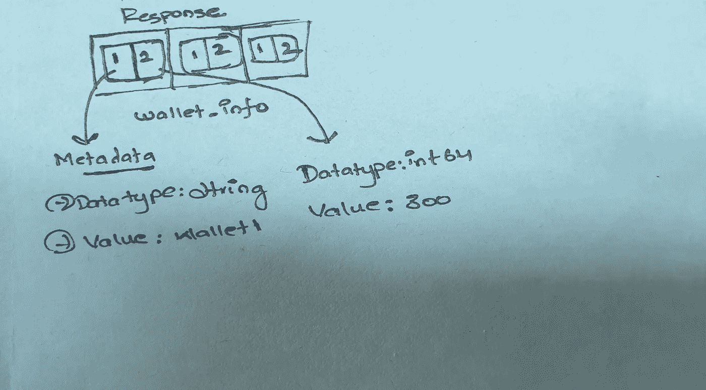

# 协议缓冲区的内部

> 原文：<https://levelup.gitconnected.com/internals-of-protocol-buffers-bb87c59544a3>

随着从单一应用程序开发到基于微服务的应用程序开发的快速过渡，微服务之间的通信已经成为至关重要的核心组件。我们需要某种公共语言模式，在这种模式下，所有依赖的微服务都应该能够进行通信，而不考虑编程语言。

一切都从 XML 开始，然后我们转向 JSON (Javascript Object Notation ),它是一个键值对。JSON 与 REST 配合得很好，并且仍然是微服务通信的首选。但是就像任何其他产品一样，它也有自己的起伏，当涉及到大规模操作时，JSON 也有很多问题。由于本文不打算比较各种各样的数据交换格式，所以我将跳过这一步继续讨论。

考虑到 JSON 引起的问题，开发了协议缓冲区，在本文中，我将讨论一些人们在使用协议缓冲区时犯的常见错误。

假设有两个微服务正在处理用户资料部分。一个是前端服务，一个是后端服务。

**场景**

假设该应用程序有 3 种不同的钱包，用户可以通过点击用户配置文件下的钱包部分来查看他/她的钱包余额。用户一点击检查钱包余额，前端就向后端发出一个网络调用来获取钱包余额。现在让我们比较 JSON 和 proto 请求格式。

**JSON 格式**

```
**Request (can be a get with query params as well)**URL: [http://localhost:8080/getUserWallet](http://localhost:8080/getUserWallet)RequestType: POST{
    "userID":"mouryavenkat"
}**Response**[
    {
        "walletType": "wallet1",
        "walletAmount": 300,
    },
    {
        "walletType": "wallet2",
        "walletAmount": 200,
    },
    {
        "walletType": "wallet1",
        "walletAmount": 500,
    }
]
```

**原型格式**

```
**Request** RPC Method: GetUserWalletDetailsmessage UserWalletRequest {
    string user_id = 1;
}**Response**message WalletInfo {
    string wallet_type = 1;
    int64 wallet_amount = 2;
}message UserWalletResponse {
    repeated WalletInfo wallet_info = 1;
}
```

原型请求和响应存储在客户端和服务端的. proto 文件中。在前端，它根据需要填充所有数据，然后调用 RPC 方法，就像调用函数一样。然后，底层的 GRPC 客户端库将数据整理成二进制格式，并通过网络将数据传输到服务器，然后服务器的 GRPC 客户端库解编数据，并将其交给应用程序来处理请求，当服务器将钱包信息回复到前端时，将重复相同的过程。

这里需要注意的非常重要的一点是编组和解组过程。我们给原型请求和响应中每个字段的编号在编组和解编请求-响应中起着关键作用。

**编组过程**



响应包含多个数据块。到目前为止，在第 1 层，它只包含一个类型为 repeated wallet_info 的块。每个 wallet_info 包含 2 个子字段，钱包类型为序列 1 的字符串，钱包金额为序列 2 的整数类型。

**解组过程**

在解组时，服务器接收它拥有的 proto 文件，而不是通过键名解组，它试图匹配客户机发送的序列顺序。

*   它首先转到 UserWalletResponse 并获得序列 1，这是重复的钱包信息。它首先检查服务器拥有的序列 1 的数据类型是否与客户机序列匹配。如果是，它会尝试深入挖掘，直到找到一个基本数据类型(int、double、string 等)。
*   在我们的例子中，它找到一个 wallet_info 片段，进入每个 wallet 信息块，然后从 1 开始检查 wallet_info 的序列。
*   1 是一个字符串，与服务器的协议相匹配。
*   wallet_info 中的 2 是 int64，与服务器的 proto 相匹配。

由于客户机发送的序列与服务器 proto 拥有的序列相匹配，所以它相应地填充请求数据，并将其传递给应用程序来处理请求。

既然我们已经简要了解了解组的发生，现在让我们来看几个例子。

**情况 1(客户机、服务器具有相同的序列，但字段名称不同)**

```
**Response Structure Client Has**message WalletInfo {
    string wallet_type = 1;
    int64 wallet_amount = 2;
}message UserWalletResponse {
    repeated WalletInfo wallet_info = 1;
}**Response Structure Server Has**message WalletInfo {
    string **type_of_wallet** = 1;
    int64 **wallet_balance** = 2;
}message UserWalletResponse {
    repeated WalletInfo wallet_info = 1;
}
```

如果看到上面。原型文件客户端和服务器都有两个不同的原型，序列相同，但名称不同。如果是对于 JSON，解组肯定会导致不稳定的行为，但是对于 proto，由于序列和数据类型匹配，解组将会成功。

```
**Server sends response as** WalletInfo {
    **type_of_wallet** = "wallet1";
    **wallet_balance** = 300;
}**At client end it will be interpreted as** WalletInfo {
    **wallet_type** = "wallet1";
    **wallet_amount** = 300;
}
```

**案例 2(客户希望更改字段的数据类型)**

所以到目前为止，我们将 wallet_amount 显示为一个整数值，而产品团队希望它显示为一个浮点值，四舍五入到小数点后两位数**(例如:300.27)。**为此，必须更新后端和前端契约，以发送和接收 double(proto 中的 float64 等价物)而不是 integer。

在滚动升级和独立微服务部署的情况下，任何一项服务都必须首先上线。假设后端服务已经首先投入生产。原型现在朝这边看。

```
**Response Structure Client Has**message WalletInfo {
    string wallet_type = 1;
    int64 wallet_amount = 2;
}message UserWalletResponse {
    repeated WalletInfo wallet_info = 1;
}**Response Structure Server Has**message WalletInfo {
    string **type_of_wallet** = 1;
    ***double*** **wallet_balance** = 2;
}message UserWalletResponse {
    repeated WalletInfo wallet_info = 1;
}
```

由于这一更改，wallet info 中序列 2 的数据类型与客户端 wallet info 中的序列 2 不匹配，并且每当客户端库尝试解封响应时，都会导致错误。在客户机接受更新的更改之前，RPC 调用一直在生产中中断。

**注意:永远不要改变字段的数据类型，如果有任何需要，只需添加一个具有较新数据类型的新字段，并要求客户端使用新字段中的值。**

应该是这样

```
message WalletInfo {
    string **type_of_wallet** = 1;
    //deprecated field
    ***int64*** **wallet_balance** = 2;
    ***double*** **double_type_wallet_balance** = 3;}message UserWalletResponse {
    repeated WalletInfo wallet_info = 1;
}
```

原型解组过程最好的部分是它只检查客户机拥有的序列号，如果服务器发送一些额外的数据，它将被忽略。因此，通过这种方式，服务器可以首先投入生产，而客户端可以提取最新的原型，进行所需的应用程序更改，然后投入生产。

现在问题来了，我们能把废弃的字段重新用于其他用途吗？嗯，你可以，但是根据客户的理解，这可能会导致一些不稳定的结果。最好的方法是只增加序列，不要废弃序列。为了给不赞成使用的添加更多的含义，proto 保留了一个名为**的关键字**。

```
message WalletInfo {
    **reserved 2;**
    string **type_of_wallet** = 1;
    ***double*** **double_type_wallet_balance** = 3;}message UserWalletResponse {
    repeated WalletInfo wallet_info = 1;
}
```

这个保留的关键字在某种程度上帮助了我们，没有人会错误地重用一个不推荐使用的序列号。

**案例 3(经典的字符串编组和解组问题。情况 2 的例外)**

考虑这样一种情况，用户试图更新他/她的详细信息，初始原型是这样的。

```
message UserDetails {
    string first_name = 1;
    string last_name = 2;
    string phone_number = 3;
}
```

假设客户机和服务器拥有相同的原型。现在，前端想到将 phone_number 更改为一个重复的字符串，其中用户可以添加他/她使用的所有手机号码。

在没有通知前端服务的情况下，后端将字段类型从**字符串**更新为**重复的** **字符串。**

```
**Client Request Structure**message UserDetails {
    string first_name = 1;
    string last_name = 2;
    string phone_number = 3;
}**Server Request Structure**message UserDetails {
    string first_name = 1;
    string last_name = 2;
    repeated string phone_number = 3;
}
```

如前所述，当服务器试图解包请求时，这应该会失败，但这里不是这种情况。考虑下面的例子

```
**Client Request**UserDetails {
    first_name = "mourya";
    last_name = "venkat";
    phone_number = "99493XXXXX";
}**Server Request**message UserDetails {
    first_name = "mourya";
    last_name = "venkat";
    phone_number = ["9","9","4","9","3","X","X","X","X","X"];
}
```

因此，它试图通过按字符拆分字符串，将字符串转换为重复的字符串，而不是无法解编组。我不完全确定为什么要这样设计，但这是我在生产中遇到的边缘情况之一。