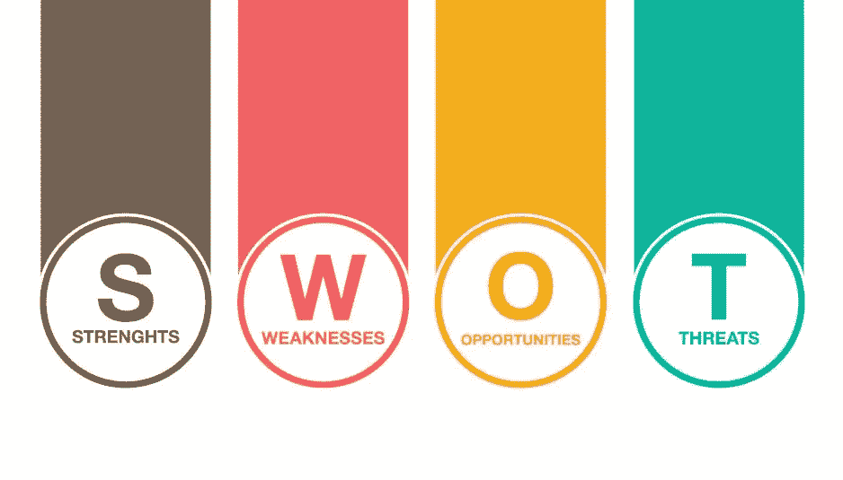

# 软件工程领域实习

> 原文：<https://levelup.gitconnected.com/internship-in-software-engineering-field-62fcdd2f0e55>

如果你已经是一名学生开发人员，或者是一名希望有一天成为软件工程师的学生，那么这篇文章就是为你们准备的！

***“任何事情的专家都曾经是初学者”***

如果你想成为软件工程行业的专家，你必须有一个坚实的基础，这个基础将永远存在。建立基地的最佳时间是你的实习期。我将分享一些关于我们如何从实习中获得最大价值的秘密提示。

实习定义了你是谁，并获得了毕业后确定未来职业道路的经验。

## **准备**

首先，你应该准备好面对面试，并被选中成为公司的实习生。

在一切开始之前，去谷歌一下你自己的名字——你在那里看到了什么？你的 facebook、instagram 页面等等……除了你的自拍或外部资料，还有什么？没有什么能给自己增值的。所以你要超越，直到有人能从你的工作、你的态度、你的贡献中认同你，那你一定是对别人有价值的。

**为您的档案增值**

1.  与 LinkedIn、Twitter 等官方社交平台合作，在那里建立你的模型。
2.  关注推荐大学和网站的在线课程，如 Coursera、edx、udacity、LinkedIn learning、nano degrees 等。
3.  开始写博客，关于你学到的任何简单事情的文章。
4.  成为 HackerRank、GSoC、StackOverflow 等社区的一员。
5.  成为 Hashcode、Kickstart 等在线黑客马拉松的竞争对手。

这将改变你自己的搜索结果。

**准备面试的背景**

1.  早点开始。不管什么时候面试，你都要从现在开始工作。
2.  准备技术面试。
3.  做副业。
4.  利用你的人际网络，或者努力扩大它。
5.  参加黑客马拉松和创意马拉松比赛。

在你被一家公司选中后，在开始工作前还有一件事你应该做。你要用 SWOT 概念来分析自己。

**SWOT 分析**

SWOT 分析是一种有用的技术，可以帮助我们了解**的优势**和**的劣势**，并识别我们面临的**机会**和**威胁**。

**智能目标**

简单来说，你在实习期间应该达到的 smart 目标与你从 SWOT 分析中发现的相关。

从最新技术中获取知识，并获得实践经验。(适应新技术)
·用前两个月的时间了解团队应该如何开展项目。
·第一个月了解公司职能和文化。
学习项目管理工具和设计技巧。
在这段时间里，提高你的表达技巧和沟通技巧。
了解如何在公司以专业的方式完成项目的管理过程。
:在实习期间，提高你的批判性思维能力，解决项目中的现实问题。提高你的能力技能，成为一名合格的大学生。学会成为一名团队成员，为你分配的项目做出贡献，并全力以赴。
·结识不同背景的专家，拓展你的人脉。

实习是决定你职业道路的关键因素。概念和技术在实习中起着重要的作用，因为我们使用的技术每天都在更新。实习是一个从错误中学习的好机会，也是一个在行业中成为好角色的好机会。

***“成功似乎与行动联系在一起。成功的人不断前进。他们会犯错，但不会放弃。”***

*注意:这篇文章只是想分享我希望得到的建议。*