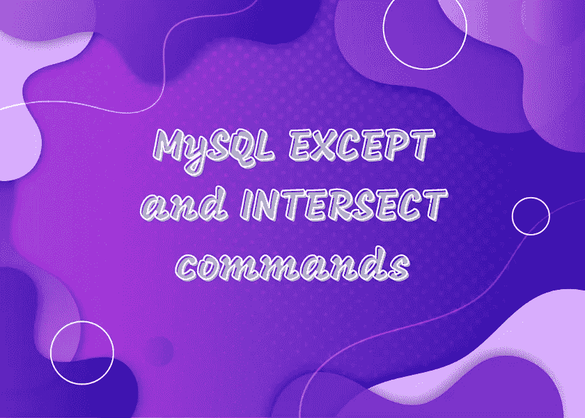
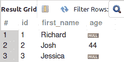
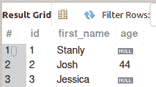

# MySQL 中的相交和例外命令

> 原文：<https://levelup.gitconnected.com/intersect-and-except-commands-in-mysql-2c465b7a1aa9>

MySQL 现在支持`INTERSECT`和`EXCEPT`集合操作符。集合运算符对多个`SELECT`语句的结果进行运算。在本帖中，为了更好地理解，我们将看到使用`INTERSECT`和`EXCEPT`命令的示例查询

当你[订阅 ***OpenLampTech*** 时事通讯](http://openlamptech.substack.com)时，收到一本我的电子书*《给每个人的 10 个 MySQL 技巧】*。



虽然 MySQL 支持`UNION`和`UNION ALL`命令，但该语言中没有`INTERSECT`或`EXCEPT`命令。这通常涉及到变通的查询。然而，MySQL 现在支持`INTERCEPT`和`EXCEPT`集合操作符。

对于示例查询，我使用两个包含任意数据的简单表。

名称表:



和更多名称表:



## MySQL INTERSECT

`INTERSECT`返回所有相关`SELECT`语句共有的那些行。

```
SELECT * FROM more_names
INTERSECT
SELECT * FROM names;
```


## MySQL 除外

`EXCEPT`仅返回第**条第一**条`SELECT`条语句中的那些行，这些行在第二`SELECT`条语句中找不到:

```
SELECT * FROM more_names
EXCEPT
SELECT * FROM names;
```


因此，完全有可能根据`EXCEPT`语句中第一个`SELECT`查询返回不同的结果:

```
SELECT * FROM names
EXCEPT
SELECT * FROM more_names;
```


更多信息请访问官方 MySQL [INTERSECT](https://dev.mysql.com/doc/refman/8.0/en/intersect.html) 和[除了](https://dev.mysql.com/doc/refman/8.0/en/except.html)文档。

感谢你阅读这篇文章。请与同样喜欢它的人分享。

[**用一杯咖啡支持我的内容！**](https://ko-fi.com/joshlovescoffee)

作为一名 PHP 开发人员、SQL 专家和技术博客/作家，Josh Otwell 有着成长的激情。

免责声明:本文中的大多数示例都是在个人发展/学习工作站环境中执行的，不应将 ***视为生产质量或就绪*** 。您的特定目标和需求可能会有所不同。像往常一样，**你能做某事并不意味着你应该做。我的观点是我自己的。**

***我能帮助的更多方面***

*   开博客？我使用 WordPress 的 ***数字猫头鹰散文*** 博客。让我们都在提供的计划上省钱。
*   在[***OpenLampTech***时事通讯](http://openlamptech.substack.com/)中投放价格合理的分类广告，让您的品牌、产品或服务得到应有的关注。
*   需要托管你的下一个网络应用程序或 WordPress 网站吗？我强烈推荐 [Hostinger](https://www.hostg.xyz/aff_c?offer_id=6&aff_id=94641) ，用它们来托管[我的小众鲈鱼钓鱼网站](http://louisianabassnation.com/)。该服务是首屈一指的，他们提供免费的 SSL。
*   作为一名自学成才的开发人员，我逐渐认识到的 5 个事实

***披露*** :本帖部分服务和产品链接为附属链接。在没有额外费用给你，你应该通过点击其中一个购买，我会收到佣金。

当你[订阅***【OpenLampTech】***时事通讯](http://openlamptech.substack.com)时，收到一本我的电子书*《给每个人的 10 个 MySQL 技巧】****绝对免费*** 。

在 ***OpenLampTech*** 时事通讯中，通过可承受的分类广告投放，让您的品牌、产品或服务获得其所需的关注度[。谢谢大家的支持！](https://ko-fi.com/s/7dfe9ce108)

*最初发表于 2022 年 11 月 2 日*[*https://joshuaotwell.com*](https://joshuaotwell.com/intersect-and-except-commands-in-mysql/)*。*