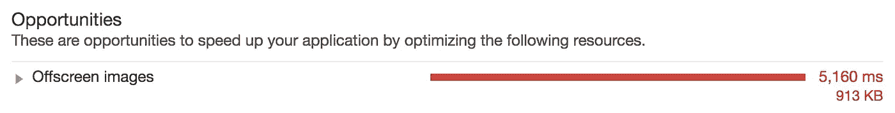

# 交叉点观察器 API:通过延迟加载加速您的 web 应用程序

> 原文：<https://levelup.gitconnected.com/intersection-observer-api-speed-up-your-web-applications-with-lazy-loading-ab6df7ead9ca>

*交叉点观察器可以通过帮助你实现图像的延迟加载来提高你的 web 应用程序的性能。*


在过去的几个月里，我努力提高我的网站的页面速度。我改进了我所有的客户端代码，以便能够在谷歌官方 Chrome 工具 [Lighthouse](https://developers.google.com/web/tools/lighthouse/) 上达到 90 分以上的性能分数，以衡量你的网络应用程序的性能、可访问性、 [progressive web apps](https://www.fabrizioduroni.it/2019/03/03/github-pages-progressive-web-app.html) 合规性等。报告中的最后一件事是关于屏幕外图像的警告，如下面的屏幕截图所示:



所以我点击了报告中的链接，该链接指向一个包含谷歌官方关于屏幕外图片加载指南的页面。该页面的主题是[交叉点观察器 API](https://developer.mozilla.org/en-US/docs/Web/API/Intersection_Observer_API) 以及它如何帮助您仅在特定内容在视窗中可见时才加载它。我还在 Google developer 官方网站上找到了另一篇文章，详细解释了如何利用 Intersection Observer 的能力在 web 应用程序中延迟加载图像。所以你可以想象我“接受了挑战”(就像《我是如何遇见你的母亲》中的巴尼·斯丁森那样)😜)然后我开始为我的网站实现图片的惰性加载。

## 履行

首先，我们先创建一个名为`lazyLoadImages`的函数。这个函数有两个参数:

*   `selector`这是一个字符串，我将使用它来选择我想要观察的所有文档对象
*   `loadCompleted`图像下载后将执行的功能

该函数将从[交叉点观察器 API](https://developer.mozilla.org/en-US/docs/Web/API/Intersection_Observer_API) 创建一个`IntersectionObserver`对象的新实例。这个对象构造函数有两个参数:

*   回调，即在给定当前配置的情况下，当对象变得可见时调用的函数
*   一个配置选项，允许开发人员自定义交叉点观察器如何计算与视口的交叉点

在创建了`IntersectionObserver`对象之后，我通过调用使用 [querySelectorAll](https://developer.mozilla.org/en-US/docs/Web/API/Document/querySelectorAll) 方法选择的文档对象上的`observer(element)`方法，将它附加到我想要观察的 DOM 元素上，并将`selector`作为参数接收。

```
const lazyLoadImages = (selector, loadCompleted) => {
  const intersectionObserver: IntersectionObserver = 
          new IntersectionObserver(
            (entries, observer) => onIntersection(entries, 
                                                  observer,  
                                                  loadCompleted),
            { rootMargin: '50px 0px', threshold: 0.01 }
          )
  document.querySelectorAll(selector)
          .forEach(image => intersectionObserver.observe(image))
}
```

正如你在上面的代码片段中看到的，在交叉点回调中，我调用了`onIntersection`函数。它是做什么的？该函数检查从交叉点观察器接收的`IntersectionObserverEntry`作为参数。如果一个`target` `Element`在视口内，它的`intersectionRatio` >将为 0。当这种情况发生时，我可以移除观察者，并使用`loadImage`函数开始加载图像。

```
const onIntersection = (entries, observer, loadCompleted) => {
  entries.forEach(entry => {
    if (entry.intersectionRatio > 0) {
      observer.unobserve(entry.target)
      loadImage(entry.target, loadCompleted)
    }
  })
}
```

`loadImage`功能通过用`data-src`域中包含的数据设置图像 src 域来下载图像。在下载结束时，我删除了用来隐藏图片的 css 类`lazy`,直到图片下载完毕。然后调用`loadCompleted`函数，调用者可以对图像做任何想做的事情(例如，我做了一个自定义动画，以避免图像显示时出现闪烁效果)。

```
const loadImage = (image, loadCompleted) => {
  image.src = image.dataset.src
  image.onload = () => {
    removeCssClass(image, 'lazy')
    loadCompleted(image)
  }
}
```

这是具有完整流程的最终脚本。

```
import 'intersection-observer'
import { removeCssClass } from './css-class'const lazyLoadImages = (selector, loadCompleted) => {
  const intersectionObserver: IntersectionObserver = 
          new IntersectionObserver(
            (entries, observer) => onIntersection(entries, 
                                                  observer,  
                                                  loadCompleted),
            { rootMargin: '50px 0px', threshold: 0.01 }
          )
  document.querySelectorAll(selector)
          .forEach(image => intersectionObserver.observe(image))
}const onIntersection = (entries, observer, loadCompleted) => {
  entries.forEach(entry => {
    if (entry.intersectionRatio > 0) {
      observer.unobserve(entry.target)
      loadImage(entry.target, loadCompleted)
    }
  })
}const loadImage = (image, loadCompleted) => {
  image.src = image.dataset.src
  image.onload = () => {
    removeCssClass(image, 'lazy')
    loadCompleted(image)
  }
}export { lazyLoadImages }
```

还有一件事我还没讨论。对于还没有实现`IntersectionObserver` API 的浏览器，我们如何支持这种类型的延迟加载呢？答案是[节间观察者 Polyfill](https://github.com/w3c/IntersectionObserver/tree/master/polyfill) 。我把它作为我的项目的一个依赖项来安装。

```
npm install --save intersection-observer
```

这个 [polyfill](https://en.wikipedia.org/wiki/Polyfill_(programming)) 公开了交叉点观察器的普通 javascript 中的特定实现，或者它公开了当前的浏览器实现，如果它已经存在于用户正在使用的浏览器中的话。

## 结论

交叉点观察器是一个强大的 API。它让你实现资源加载的延迟加载，并达到我只有在移动原生应用中才有机会看到的性能和架构应用模式。网络正在用原生应用填补这一空白，而交叉点观察者是另一个证明，90%的现有原生移动应用可以成为强大的网络应用。事实上，在我的日常工作中，我仍然是一名原生移动应用程序开发人员，我仍然在关注 iOS、Android 和 React 原生场景，我仍然在研究苹果、谷歌和脸书发布的所有新工具和 SDK 改进。但是，你知道，技术发展很快，我必须为未来做好准备😌。Sooo，路口观察者万岁！！！有了您的帮助，Web 应用程序的性能将会大大提高💚。

*原载于 2019 年 5 月 7 日*[*https://www . fabrizioduroni . it*](https://www.fabrizioduroni.it/2019/05/08/intersection-observer.html)*。*