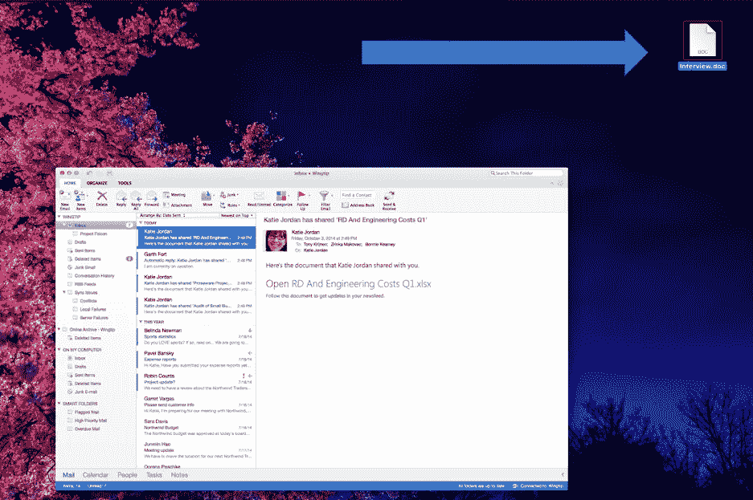

# 当一个 FAANG 的远程演示出现令人捧腹的错误时，发生了什么

> 原文：<https://levelup.gitconnected.com/interview-doc-what-happened-when-a-remote-presentation-by-a-faang-went-hilariously-wrong-39a8a017f56d>

哎呀。[来源](https://i.pinimg.com/736x/34/c7/f1/34c7f136f3e126119a7a8a51220adb82.jpg)

当你将 FAANG 工程师与有限的远程演示经验和大量复杂的机器学习概念结合起来，与完全缺乏缩放经验相结合，并与一大批在线学生一起在一门极其困难的人工智能课程中寻找几个微小的额外学分时，你会得到什么？

一个大的，热闹的混乱。

我最近从佐治亚理工学院计算机科学在线硕士项目(OMSCS)毕业。作为我最后一门课程人工智能的一部分，我发现自己学习了所有的东西，从三向 A*搜索(是的，这实际上是一件事)到高斯混合模型，机器学习基础，寻路，等等。这是一种可笑的折磨。

在课程即将结束时，这位教授——一位异常聪明的人工智能专家，也是谷歌眼镜的发明者——组织了几次机器学习概念和实现的讲座，与在硅谷一家领先但有争议的大型科技公司工作的工程师进行，并用几分额外学分贿赂学生。会谈很棒；信息量极大。有些内容甚至进入了课程的后续部分。然而，会议的实际交付——实际上是其中一个——完全是娱乐性的。

这里描述的特定 FAANG 组织将保持匿名以保护有罪的一方，但足以说他们是数据科学、机器学习和分析领域的行业领导者。他们精心制作、引导和调整的自学算法带来了数十亿美元的收入和大量焦虑驱动的社交媒体参与。也许这些收入中的一部分可以在未来用于培训他们的员工如何向远程观众展示。

讲座开始得很正常，教授和 FAANG 组织的演讲者都加入了电话会议，然后做了自我介绍。简短地提到了一个事实，他们仍然在弄清楚 Zoom 的复杂性(佐治亚理工学院使用蓝战士，我不确定 FAANG 组织是否会进行演示，但根据即将到来的恶作剧，显然不是 Zoom)。

然后，演示者提到该演讲是预先录制的，因为最熟悉该主题的人无法参加会议，并开始加载视频。鉴于演示团队在 Zoom 网络研讨会和共享视频内容方面的有限经验，以及我自己在两年的大部分时间里管理、组织和演示这种远程优先演示的经验，我对将要发生的事情略有所知。

当然是没有声音。[来源](https://helpdeskgeek.com/wp-content/pictures/2021/09/no-sound.jpeg)

…果然，虽然视频在屏幕共享上可见，但没人能听到任何声音。在播放屏幕时，在 Zoom 中共享声音需要几个额外的步骤，由于不熟悉该工具，演示团队对此一无所知。此外，由于电话会议处于网络研讨会模式，没有人监控实时聊天，因此需要几分钟才能解决问题，因为与会者无法取消麦克风静音以警告演示者出现了问题。教授花了几分钟打开实时聊天并捕捉到错误，在大家的帮助下，声音问题最终得以解决。

但是最好的还在后面。

开车时睡着了？[来源](https://www.newyorkcomputerhelp.com/wp-content/uploads/2019/10/things-to-do-on-pc-laptop-when-bored.jpg)

在那个小插曲之后，陈述开始认真地进行，并按计划进行…大约五分钟。

然后，突然，共享他们屏幕的人发生了一些事情。也许他们开始厌倦了。或者焦虑。或者只是有更好的事情要做。但不管是什么原因，他们突然切换到另一个桌面，让视频在这个过程中消失，并开始在他们的电子邮件客户端中点击。

这使得所有 80 多名与会者都坐在了 Outlook 活动窗口的前排，空空的桌面上只有一个 Word 文件，位于屏幕的右上角:这个文件的名字很有趣，叫做“Interview.doc”。主持人仍然不知道这样一个事实，即他们所做的每一次点击现在都显示在 80 多名 OMSCS 学生的观众面前……这些观众开始觉得整个情况相当有趣。

一个模拟图像显示了我们在意外的屏幕共享会议上看到的几乎所有东西。

在那之前，我一直假定演示者是无辜的，特别是因为我是一名教练，经常做远程讲座和培训，见过并解决了几乎所有的技术问题。我明白，真的。但这实在太过分了。

因此，当目前看不见的视频中的演讲者问观众是否有任何问题时，我打开了实时聊天，问了一个我相信每个与会者当时都在想的问题:

> **“真正的问题是，Interview.doc 里有什么？乔治亚理工学院好奇的人们想知道！”**

又过了几秒钟，恐慌和 lulz 开始出现，教授很快再次插话，提醒演示者事实上视频不再向观众展示了。经过这次最后的航向修正，事情终于按计划进行了。

技术上的困难时有发生，当它们发生时，克服它们是很重要的。就像地球上的每一场婚礼、舞台演出或任何其他现场活动一样，没有任何事情会按计划进行，这没关系。重要的是提前采取措施，确保他们能尽可能做好。这里有一些提示，你可以在做远程演示时使用，以避免令人捧腹的错误。

1.  **熟能生巧** —在任何大型(或重要的)远程演示或学习会议之前，进行一次配置与主要活动相似或相同的“预演”会议会有所帮助。这有助于提前解决任何配置问题(例如，无法正确共享声音)。
2.  **在适当的时候预先录制**——这其实是一个很好的主意，如果通过练习变焦提前解决了很多问题，就可以让谈话进行得更顺利。预先录制讲话可以让演示团队有更多时间参与到实时聊天的讨论中，还可以缓解实时设置中经常出现的问题，如麦克风连接、背景噪音等。它还提供了“电影魔术”编辑选项，可以增加生产价值，并确保交付是你喜欢的。
3.  **了解您的工具集** —了解如何在您选择的远程协作工具中完成基本任务(缩放、团队等)。)，包括共享您的屏幕、使与会者静音/取消静音、共享电脑声音以及查看/参与实时聊天。
4.  **定期与观众沟通** —在切换到屏幕共享或有声视频时，始终寻求观众的反馈，以确保技术表现符合预期。如果你在网上研讨会模式下，更是如此，因为与会者不能取消麦克风静音，也不能在实时聊天之外提供即时反馈。打字文本比有声文本需要更长的时间才能显示出来，所以在继续之前，请等待几秒钟，等待观众的肯定。
5.  **在任何情况下，都不要在演示过程中自动驾驶**——即使你在演示中的角色只是分享你的屏幕和广播，也不要对一切都按计划进行而沾沾自喜，并尝试在会议直播时做一点辅助工作。不要在你的电脑上做任何你不打算让你的所有观众都能看到的事情，因为很有可能他们都能看到！

无论如何，作为一名经验丰富的远程演示者，我分享这些技巧不是为了取笑为我们提供这些演示的 FAANG 公司的工程师——材料很棒——我只是提供这些技巧，作为其他人避免在未来重复类似这些愚蠢错误的一种方式。此外，如果我不说知道即使那些通过了 FAANG 的临界不可能面试挑战的人也不能免于偶尔的愚蠢，这是一种解脱，那我就是在撒谎。

说真的，每个人都会遇到这种情况。现在，关于桌面上的那份文件…