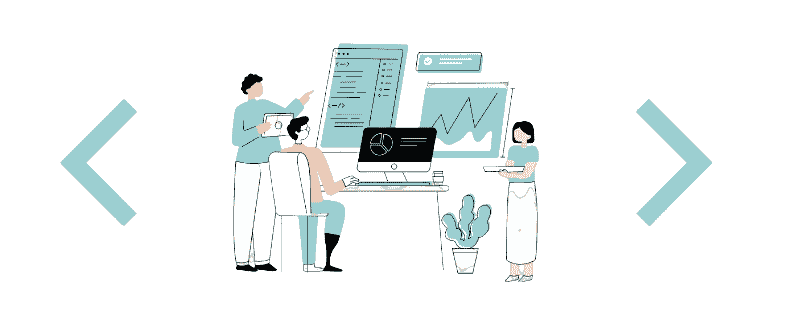

# 面试体验|亚马逊 SDE 2

> 原文：<https://levelup.gitconnected.com/interview-experience-amazon-sde-2-978ecf4e5e93>

## 希望我的经验对你有帮助！🤓

> 上个月，我有机会采访亚马逊。我经历了面试过程，拿到了 offer。我希望我的经历能帮助某人在面试中表现得更好。

一个月前，一名来自亚马逊的招聘人员在 [LinkedIn](https://www.linkedin.com/in/sandeep-kumar-3a26a6194/) 上找到我，希望得到*音乐团队*的一个职位。在那段时间，我也在谷歌面试，并决定尝试与他们合作，因为竞争提供总是有帮助的💁。

# 招聘人员来电

这是一个介绍性的电话，持续了大约 30 分钟。招聘人员解释了在 Covid 期间团队在做什么以及如何成长等。

> 我们在团队内部围绕[工作生活平衡](https://www.quora.com/Is-the-work-life-balance-at-Amazon-as-a-software-engineer-really-that-bad)展开了讨论。他澄清说，这些事情取决于团队，对于亚马逊音乐团队来说，工作与生活的平衡是重中之重。

我们讨论了薪水期望，然后开始安排面试。

> 通常，人们应该在 Hackerrank 上完成一轮在线编码。根据我的个人资料，我被跳过了。

将会有 4 轮面试。每一轮还将包含围绕[亚马逊领导原则](https://www.amazon.jobs/en/principles)之一的问题。

1.  编码
2.  低层次设计
3.  高级设计[移动前端设计]
4.  酒吧聚会

> 我告诉我的招聘人员，我不是后端开发人员，因为该配置文件是前端移动工程师，HLD 轮应该是基于一些什么左右。这帮助我不用花时间阅读系统设计。

# 编码回合

*时长:* 1hr *级别:轻松【个人观点】
领导原则:*归属
*提问* : [Leetcode 讨论](https://leetcode.com/discuss/interview-question/2528777/Amazon-or-L5-or-Bangalore-or-Aug-2022)

这一轮有两个问题。我能够在 25 分钟内解决这两个问题，然后我们转向领导原则问题。到第 35 分钟，这一轮结束。

> 采访者非常友好。我和他聊了聊他的日常工作。我们的讨论给我的印象是，音乐团队确实注重工作与生活的平衡。

 [## 面试问题|亚马逊-2022

### 亚马逊询问的最新面试问题。让我们看看你是否能解决这些问题。

medium.com](https://medium.com/@sandeep.kumar.ece16/interview-questions-amazon-2022-c51c9cec4b87) 

# 低层次设计回合

*持续时间:* 1hr *级别:中硬【个人观点】
领导原则:*好奇心强

我被要求设计并写下构建 **Alexa SDK** 所需的模型、视图模型和类。

Alexa 图像

问题是 SDK 接收语音/文本输入，并根据设备用语音/文本进行响应。我不必构建这方面的 ML/AI，但是模型和 API 应该作为 SDK 的一部分公开。

例如:Alexa 扬声器没有文本输入的范围。一些电视屏幕会要求显示文本作为输出。

> LLD 设计面试没有**正确答案**。更重要的是面试官是否喜欢你解决问题的想法。你应该用适当的解释来支持你的方法，记住系统的可伸缩性和灵活性。

在我的例子中，我完全忽略了 SDK 的*错误处理*方面。采访者指出了这一点，但说不要太担心。

# 设计回合(管理回合)

*时长:1hr
等级:中等【个人观点】
领导原则:信任
问题:*设计一款可以和朋友在线玩的 Ludo 游戏。

我应该**设计用于与后端服务器交互的 API** 。焦点是这个游戏的移动架构。

这与 LLD round 非常相似，但是问题的范围要求我更多地关注设计事物以及它们如何相互作用，而不是组件的实际本质。

> 这一轮是由我未来的经理进行的。他看起来很酷。采访快结束时，我们深入讨论了团队正在做的工作，以及如果我加入，我将如何做出贡献。

> 以上 3 轮是团队配合轮。它们是由你面试的团队成员进行的。一旦你得到了团队的批准，你需要通过由其他团队的人进行的酒吧筹款活动，以检查你是否适合亚马逊本身。

# 酒吧聚会

*时长:1hr
级别:硬【个人观点】
领导原则:交付成果
提问:*[*leet code*](https://leetcode.com/discuss/interview-question/2528950/Amazon-or-Barraiser-Round-or-Grid-navigation)*。*

这一轮有一个问题和多个后续问题。在解决了 2 个后续问题后，我们跳到了领导原则问题。一旦完成，面试官会跳回到最初的问题，进行第三次跟进。我无法将它编码出来，但我们对我的方法的时间和空间复杂性进行了深入的讨论。

> 这是一场相当累人的比赛，结束时我已经筋疲力尽了。我会称赞面试官，因为他能以相当快的速度跟上我和我的解释。

# 个人咆哮

这是我的个人经历，*我只是陈述事实*。人们有过更糟糕的经历，他们在 2005 年被招聘人员捉了鬼。

*   在面试过程中，我的面试在很短的时间内被**重新安排了三次**。
*   有一次，招聘人员联系我，告诉我在接下来的两个小时内有一个职位空缺。我决定继续下去，因为我完全自由，面试官**没有出现**。😒
*   发布面试，花了 **2 周时间终于得到了**的工作机会。一般来说，这不是我会抱怨的事情，但每次我询问时，招聘人员都告诉我要等 2 天。

# 提供😺

我终于得到了亚马逊的报价。经过深思熟虑，基于那里的工作和报酬，我决定加入谷歌。

你可以在下面阅读我在谷歌的经历:

 [## 谷歌面试体验

### 如果你想知道谷歌面试会有什么结果，这篇文章就是为你准备的。

medium.com](https://medium.com/interviewnoodle/google-interview-experience-b2ae92b80a79) 

如果有不清楚的地方，请在评论中告诉我。请继续关注我在 airbnb 的体验(或者你可以关注我🤗).

# 分级编码

感谢您成为我们社区的一员！在你离开之前:

*   👏为故事鼓掌，跟着作者走👉
*   📰查看[升级编码出版物](https://levelup.gitconnected.com/?utm_source=pub&utm_medium=post)中的更多内容
*   🔔关注我们:[Twitter](https://twitter.com/gitconnected)|[LinkedIn](https://www.linkedin.com/company/gitconnected)|[时事通讯](https://newsletter.levelup.dev)

🚀👉 [**加入升级人才集体，找到一份神奇的工作**](https://jobs.levelup.dev/talent/welcome?referral=true)