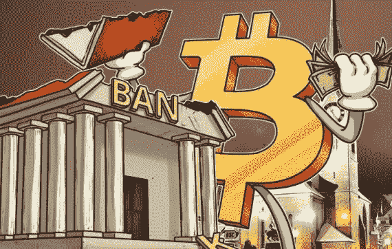
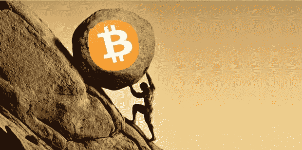
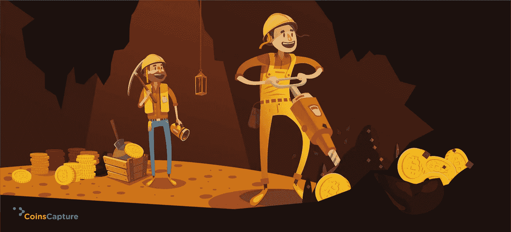
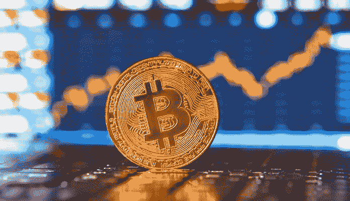

# 加密货币(第二部分):比特币传奇。

> 原文：<https://levelup.gitconnected.com/into-cryptocurrency-part-ii-the-bitcoin-saga-47ae11353b2d>

> “加密货币的现状给人一种狂野西部的感觉。它混乱，有风险，令人兴奋，而且瞬息万变。自最初的加密货币比特币出现以来的短短九年时间里，数百种替代数字货币已经浮出水面。”——****。****

****

# **关键要点**

*   *****比特币*** 是一种数字货币，也是一种运行在被称为 ***区块链*** 协议上的网络。**
*   *****区块链*** 是一种数据库，将数据存储在区块中，然后链接在一起。当新数据进来时，它被输入到一个新的块中。一旦该块被数据填充，它就被链接到前一个块上，这使得数据按时间顺序链接在一起。**
*   **不同类型的信息可以存储在区块链上，但迄今为止最常见的用途是作为交易的分类账。**
*   *****比特币*** 以去中心化的方式使用 ***区块链*** ，这样就没有一个人或团体拥有控制权——而是所有用户集体保留控制权。**
*   **在 ***比特币*** 中，交易被永久记录，任何人都可以查看。**

# **比特币的诞生**

****

**在 2009 年和 2008 年经济危机之后，*(一个真实身份仍然是个谜的人或团体的假定化名)发布了 ***比特币*** ，它是基于 2008 年一篇名为 [***比特币:一种点对点电子现金系统***](https://www.bitcoin.com/bitcoin.pdf) ***的论文开发的。******

***在论文的摘要部分， ***中本聪*** 对这个项目写了如下描述:***

> ***“电子现金的纯点对点版本将允许在线支付直接从一方发送到另一方，而无需通过金融机构。”***

***一开始， ***比特币*** 增长背后的主要原因是，它是一种在传统金融系统之外进行价值交易的全新方法。后来，像它的*****多用途*** 之类的东西帮助了它的成长和流行。*****

# ****比特币:一种基于信仰的资产****

****据 [***约瑟夫·卢宾***](https://www.linkedin.com/in/joseph-lubin-48406489/) 在《每日秀》的采访中，他表示，赋予加密货币价值的东西是人们相信它确实有价值。****

********

> ****“当你让足够多的人相信加密货币时，你就可以像滚雪球一样变成社会真正认为有价值的东西，比如美元。——[***约瑟夫·卢宾***](https://www.linkedin.com/in/joseph-lubin-48406489/)——ether uem 创始人之一，[**ConsenSys**](https://www.linkedin.com/company/consensus-systems-consensys-/)CEO 兼创始人。****

****[***乔·维森塔尔***](https://www.linkedin.com/in/joe-weisenthal-3a04a23/) ***(彭博*** 的一位编辑)认为，思考比特币*的最佳方式是将其视为一种宗教运动。宗教的许多特点和特征都可以在其中找到。首先， ***比特币*** 是由一个无私的神秘人物( ***中本聪*** )创造的。此外，中本聪的著作被视为神圣的文本。还有 Bitcointalk.com****的**和中本聪早期的留言板帖子。***早期对应者为 ***比特币*** 圣人。此外，还有体现在银行家和央行行长身上的魔鬼。********

# ******挖矿(比特币是如何产生的？)******

************

*   ********比特币挖矿**是个人因其服务而获得网络奖励的过程。******
*   *********比特币*矿工**的工作是处理交易，并使用专门的硬件来保护网络，他们可以收集新的比特币，作为完成“块”验证交易的奖励，这些比特币被添加到 [***【区块链】***](https://medium.datadriveninvestor.com/the-blockchain-revolution-bdc22dd2bb5e) 。******
*   *********比特币*** 的创造是以固定的速率完成的。这使得比特币挖矿成为一项竞争非常激烈的业务。当更多的矿商加入网络时，盈利变得越来越困难，矿商必须寻求效率以降低运营成本。******
*   ******采矿奖励支付给首先发现复杂哈希难题解决方案的矿工。******
*   ******随着时间的推移，每年创造的新**比特币**数量会自动减半，直到比特币发行完全停止，总共有**2100 万** **比特币**存在。至此，**比特币**矿工很可能将完全由无数小额交易费支撑。******

# ******比特币为什么有价值？******

******比特币有价值，因为它是一种有用的货币形式。******

************

********比特币**基于 ***数学*** 的属性，具备货币的所有特征(*持久性、便携性、可替代性、稀缺性、可分性和可识别性*)，而不是依赖于黄金和白银等实物属性，或者像法定货币一样对中央机构的信任。******

******简而言之，**比特币的**价值仅直接来自于愿意接受它们作为支付手段的人。******

# ******比特币的价格是由什么决定的？******

******由 ***供给*** 和 ***需求*** 决定。******

************

*   ******只有有限数量的 ***比特币*** 在流通，新的 ***比特币*** 以可预测和递减的速度被创造出来，这意味着需求必须跟随这一通胀水平以保持价格稳定。******
*   ******如果对比特币的需求增加，价格就会上涨，当需求下降时，价格就会下跌。******
*   ******由于 ***比特币*********

# ******资源:******

*   ******[*区块链讲解*](https://www.investopedia.com/terms/b/blockchain.asp) *。*—****。**********
*   ******[*比特币如何运作。*](https://www.investopedia.com/news/how-bitcoin-works/)——[***Investopedia***](https://www.linkedin.com/company/investopedia-ulc/)***。*********
*   ******[*比特币的起源、早期成长和演变。*](https://www.bitcoin.com/get-started/what-is-bitcoin/#1)*——*****。**********
*   ******[*要理解比特币，就把它当成一种基于信仰的资产。*](https://www.bloomberg.com/news/articles/2021-01-21/bitcoin-is-a-faith-based-asset-joe-weisenthal)*——*[***彭博商业周刊***](https://www.bloomberg.com/businessweek) ***。*********
*   ******[*比特币和其他愚蠢的迷因货币的崛起:每日秀*](https://www.youtube.com/watch?v=nRItzSX0aCM) *。(视频)。*******
*   ******[*比特币挖矿如何运作？*](https://www.investopedia.com/tech/how-does-bitcoin-mining-work/)*——*[***Investopedia***](https://www.linkedin.com/company/investopedia-ulc/)***。*********
*   ******[*常见问题*](https://bitcoin.org/en/faq#who-created-bitcoin\)*——*[***Bitcoin.org***](https://bitcoin.org/en/)******

# ******图像:******

*   ******[https://tokensinvaders . com/2019/02/21/his toire-et-contexte-dappartion-du-bit coin/](https://tokensinvaders.com/2019/02/21/histoire-et-contexte-dapparition-du-bitcoin/)******
*   ******[https://www . clearly surely . com/blog/opinion/your-insurance-agent-earns-big-bucks-heres-why-its-ok/attachment/cropped-man-pushing-rock-up-hill-ok-to-use-1024 x625/](https://www.clearlysurely.com/blog/opinion/your-insurance-agent-earns-big-bucks-heres-why-its-ok/attachment/cropped-man-pushing-rock-up-hill-ok-to-use-1024x625/)******
*   ******【https://tr.pinterest.com/pin/835488168367623329/ ******
*   ******[https://bitcoindynamic . com/news/Singapore-fund-increases-bit coin-position-and-accumulations-10-30 亿/](https://bitcoindynamic.com/news/singapore-fund-increases-bitcoin-position-and-accumulates-1-3-billion/)******
*   ******[http://www . petrotahlil . com/Section-news-2/44541-疫情-可能-深化-石化-供应-需求-不平衡-国际能源机构](http://www.petrotahlil.com/Section-news-2/44541-pandemic-could-deepen-petchems-supply-demand-imbalance-iea)******