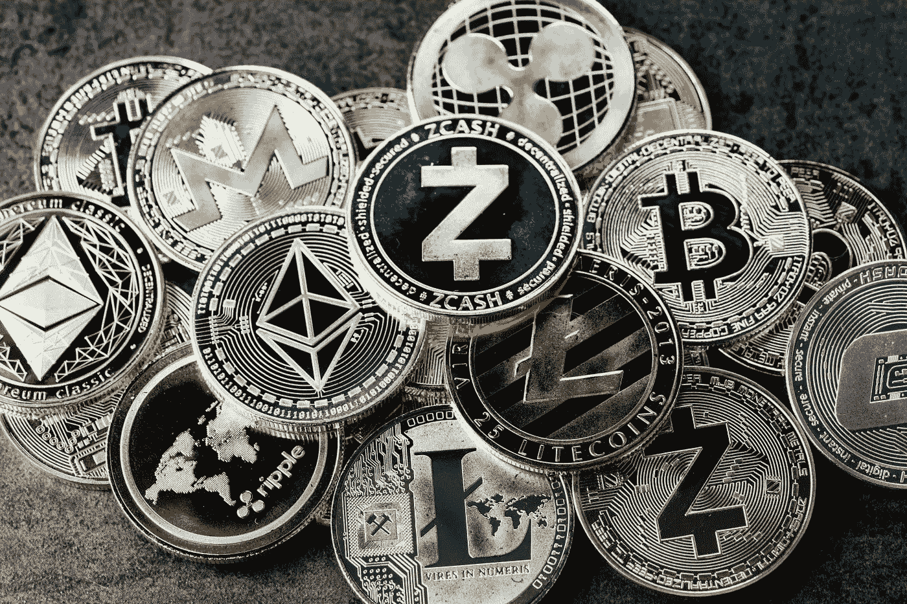
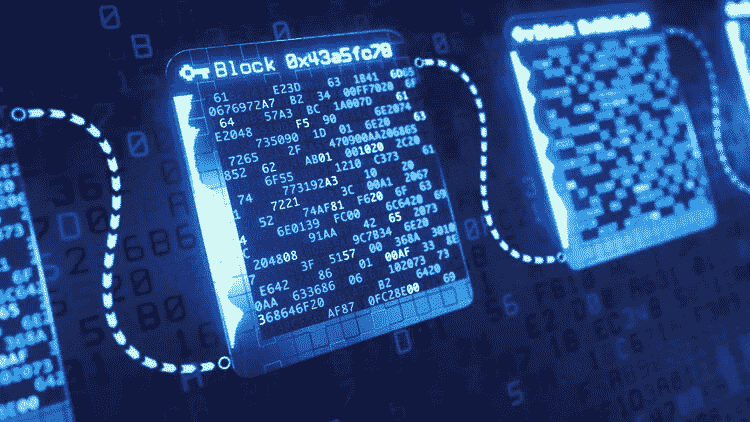
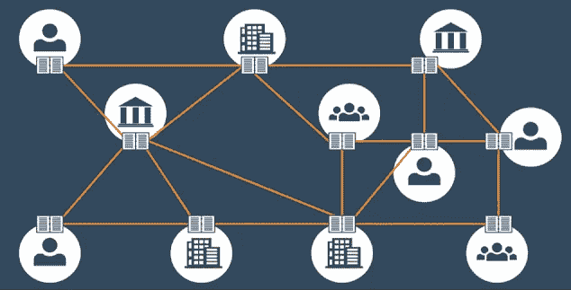
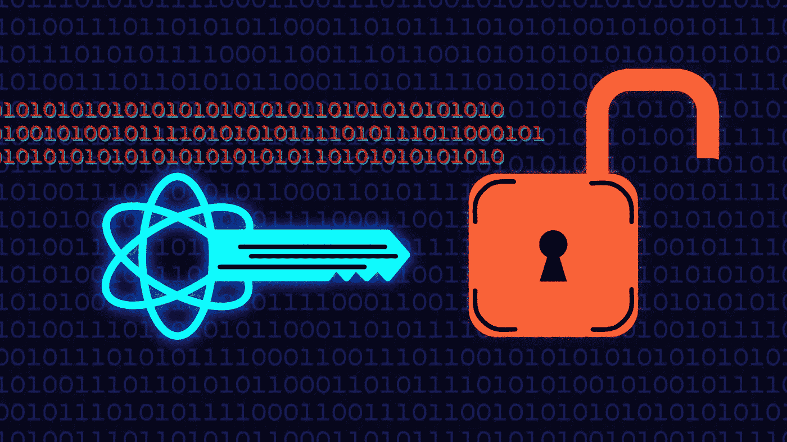

# 加密货币:未来的货币(上)

> 原文：<https://levelup.gitconnected.com/into-cryptocurrency-the-money-of-the-future-part-i-1e7b14ba62b1>

货币和数学一样，是人类独有的创造。在 ***货币*** 的观念发明之前，人们习惯于*易货*商品。换句话说，他们不用钱就用(商品或服务)交换了其他商品或服务。这种方法的主要问题是，你需要找到一个拥有你想要的商品或服务的人，这个人需要愿意与你交换。

为了解决这个问题，人们通过使用金属和贝壳等具有大家都能接受的价值的媒介，达到了货币的最基本概念。这些年来，钱作为一种思想发展起来，并有不同的形式。而**数字革命**(也被称为*第三次工业革命*)的结果是**数字货币**，这又导致了**加密货币**的发明。

> “如今，我们绝大多数的金融交易都不涉及实物交易，而是意味着财富的数据交换。”——[**巴顿·鲍尔森**](https://www.linkedin.com/in/bartonpoulson/?trk=lil_instructor) **。**

# **加密货币**

加密货币是一种*去中心化* ***、*** *不可变* ***、*** *和透明*的数字货币，它利用 ***【区块链】*** 技术，并使用 ***密码术*** 来发挥作用。

> “看起来我们正处在一场创造、储存和使用货币的新革命的早期。”——[***乔纳森·雷辛塔尔***](https://www.linkedin.com/in/reichental/?trk=lil_instructor) *，一位多次获奖的技术领军人物。*

要理解上面的定义，我们需要理解区块链的*和密码术的*指的是什么，意味着什么。**

# **区块链技术**

> **“区块链承诺将像互联网一样成为未来商业运作的基础。”— [*麻省理工学院斯隆管理评论*](https://www2.deloitte.com/content/dam/Deloitte/se/Documents/risk/DI_2019-global-blockchain-survey.pdf)*(2018 年 9 月)。***

****

***区块链*可以描述为保存交易记录的数据结构，也可以描述为以区块形式存储的记录链。**

**最简单地说，*区块链*是一个记录信息的系统，其记录方式使得改变、黑客攻击或欺骗系统变得困难或不可能。**

# ****区块链功能****

**有几个特点和特征使区块链独一无二。主要的 4 个是:**

****

1.  **I**m 可变性:**网络上的每个节点都有一份数字账本的副本。要添加事务，每个节点都需要检查其有效性。如果大多数人认为它是有效的，那么它就会被加入。这确保了透明度，使其没有腐败。任何已验证的记录都是不可逆的，不能更改。**
2.  ****去中心化:**网络是去中心化的，这意味着它没有任何管理机构或个人来管理框架。取而代之的是，一组节点维护网络，使其分散化。**
3.  ****安全性:**因为它消除了对中央机构的需求，所以没有人能够为了自己的利益而改变网络的任何特征。此外，由于所有记录都是单独加密的，这确保了另一层安全。**
4.  ****分发:**所有网络参与者都有一份账本，每个人都维护网络。这将计算能力分布在网络的所有计算机上，以确保更好的结果。**

# *****密码学*****

**在*计算机科学*中，密码术与将普通明文转换成难以理解的文本的过程相关，反之亦然。它是一种以特定的形式存储和传输数据的方法，以便只有它的目标用户才能读取和处理它。**

****

**它旨在实现四个主要目标:**

*   *****保密性:*** *信息除了本该了解的人，其他任何人都不能了解。***
*   *****完整性:*** *信息不能以无法追踪或检测的方式被更改或篡改* ***。*****
*   *****不可否认:*** *发送者在以后的信息传输中不能否认他/她的意图***
*   *****认证:*** 发送方和接收方可以确认对方的身份和信息的来源/目的地。**

# ***密码技术***

**在密码术中，密钥是用于扰乱数据的一条信息，使得它看起来是随机的；通常是一个很大的数字或一串数字和字母。**

****

*****单密钥加密:*** 发送方和接收方共享一个密钥。它用于加密和解密明文。**

*****公钥加密:*** 使用两个不同的密钥对数据进行加密和解密。任何人都可以使用它来加密信息——它被称为公钥。其中另一个称为私钥，用于解密由公钥加密的数据。**

*****哈希函数* :** 该算法中不使用任何密钥。根据纯文本计算固定长度的哈希值，这使得纯文本的内容不可能被恢复。许多操作系统也使用哈希函数来加密密码。**

*****来源:*****

*   **[*密码学的定义*](https://economictimes.indiatimes.com/definition/cryptography#:~:text=Definition%3A%20Cryptography%20is%20associated%20with,can%20read%20and%20process%20it.) *—经济时代。***
*   **[*密码学*](https://searchsecurity.techtarget.com/definition/cryptography) *— SearchSecurity。***
*   **[*什么是公钥加密？*](https://www.cloudflare.com/learning/ssl/how-does-public-key-encryption-work/) *—云闪。***
*   **[*什么是区块链？*](https://www.euromoney.com/learning/blockchain-explained/what-is-blockchain#:~:text=Blockchain%20is%20a%20system%20of,computer%20systems%20on%20the%20blockchain.) *—欧洲货币学习。***
*   **[*补充你对区块链的恐惧。*](https://hackernoon.com/blockchain-technology-explained-introduction-meaning-and-applications-edbd6759a2b2)*——哈克农。***