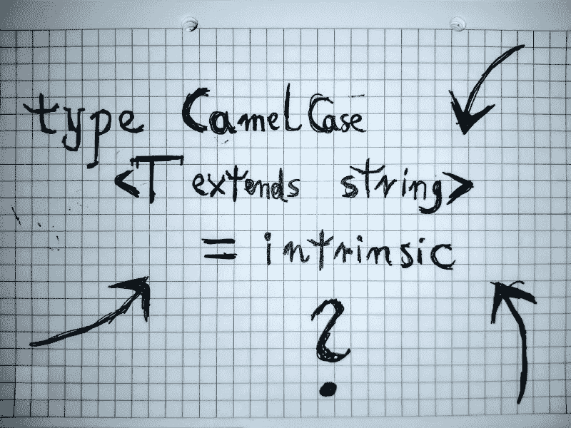

# TypeScript 中的内部类型

> 原文：<https://levelup.gitconnected.com/intrinsic-types-in-typescript-8b9f814410d>

尽管内部类型的概念可能会让读者困惑，但我不会马上定义它们，因为我想用一个实际的例子来介绍这个概念。我想以下面的问题开始这篇文章，这些年来我一直以各种形式问自己:

> 在理想的静态类型语言中，如何使用类型系统的属性来定义字符串的大写类型呢？

我可以用*字符串置换*来代替*字符串大写*，这个问题仍然有效，只要它触及的不是类型的抽象，而是它们的*内在*属性。

# 解决任务

我写上述作业的方式在选择使用的类型系统方面给予了很大的自由。然而，人们必须认识到某些特性的隐含要求，比如泛型、字符串文字或继承。因为有序的字符列表构成了字符串，所以问题“哪种编码适用于字符？”需要立即回答。

我会将类型命名为 *CapitalizedString* ，并将其定义为参数化类型(或泛型类型，取决于所选类型系统的域语言)，其中单个参数 *T* 被约束为字符串类型。字符串中的所有字符都应遵循 UTF-8 编码。人们可以很容易地用伪代码以如下方式写下来:

```
type CapitalizedString<T extends string literal> = ...
```

根据定义，如果所讨论的字符串没有字符，那么操作显然对它没有影响。否则，大写只会改变字符串中的第一个字符，其余部分保持不变。要大写一个字符，类型系统需要特别支持它*，因为由于这种算法的复杂性，在类型系统中显式定义它对于 UTF-8 字符来说听起来不切实际(我发现即使对于 ASCII 字符也不可取)。*

*因此，编译器本身必须提供任何 UTF-8 字符的大写实现，使大写操作成为一个特殊的*操作，或者说是类型系统的一个固有的*属性。在类型定义中有多种声明此类属性的方式，例如:***

```
*intrinsic type Uppercase<T extends character>; 
type Uppercase<T extends character> = intrinsic;*
```

*热心的读者可能会注意到，前面的定义没有明确提供返回类型——因为编译器执行操作，所以没有人事先知道返回类型。类型系统可能将大写定义为一元运算符，接受单个字符，如以下代码片段所示:*

```
*type UppercaseA = uppercase 'a';*
```

*最后，大写字符串类型归结为以下定义:*

```
*type CapitalisedString<T extends string literal> =
    T === '' ? '' : Uppercase<T[0]> + T[1...];*
```

*为了使定义生效，所讨论的类型系统需要:*

*   *两个字符串文字类型相等比较的能力，*
*   *能够访问第 n 个*字符和任意字符串类型的一系列字符，**
*   *在类型定义中使用条件语句的权限。*

# *TypeScript 中的内部类型*

*从 TypeScript 4.1 开始，有 4 种内在类型:`Lowercase`、`Uppercase`、`Capitalize`和`Uncapitalize`，它们都是使用`intrinsic`关键字定义的。在这种语言中，我没有发现任何与案例管理相关的操作符。作为练习，我建议读者研究这些类型，并想出另一种方法来定义`Capitalize`和`Uncapitalize`(提示:关键字`infer`)。此外，人们还能想到其他什么字符串操作呢？*

**

*我使用 TS 的当前类型系统定义 CamelCase 的方式*

*在小写逻辑和大写逻辑之间进行迁移是许多用例中的一种，当在新系统上操作时，它使用类型系统来验证字符串文字的正确性——我个人非常喜欢利用我的工具链来自动执行普通的健全性检查。某些系统，如 SQL 数据库，不关心大小写(在一定程度上)，但对于其他程序则没有这样的保证。*

*另一个观察表明，一些编程语言、框架和库期望变量名符合一些固执己见的标准，如 camel-case 或 snake-case。出于联网的目的，系统中的所有微服务都应该遵循一种预定义的序列化数据的方式，以实现可靠的通信。利用内部类型在编译时生成正确的结构提供了另一层安全检查，可以在将一行代码发布到生产系统之前发现问题。*

# *摘要*

*类型系统的存在并不能保证看似简单的操作的简单性，比如大写或小写。因为我相信编程语言的创造者应该考虑到软件开发者的当代需求来设计它们，所以我不期望类型系统本身是图灵完全的。在设计的系统中表达简单的概念可能需要大量的工作，因此，有些人可能倾向于将概念直接移入编译器领域。*

*我建议研究一些密切相关的主题，如元编程或编译器理论，以充分掌握当今时代软件开发的所有可能性和局限性。总而言之，致力于理解他们所使用的编程语言的程序员应该获得构建充分利用底层类型系统的架构的技能。*

## *后手稿*

*为了满足我的求知欲，我用 E-Prime 写了这篇文章，E-Prime 是英语中没有动词“to be”的一个子集。在我以这种方式创作出更多作品后，我可能会发表一篇关于我所有相关发现的文章。*