# 色彩理论介绍

> 原文：<https://levelup.gitconnected.com/intro-to-color-theory-dce1a63fba01>

有大量心理学和科学文献研究了颜色对我们思维和情感的影响。事实上，有一整个领域叫做色彩心理学，致力于研究作为人类行为决定因素的色彩。了解颜色对人类的一般影响可以帮助我们设计更适合我们的品牌、受众和沟通的体验。

**在本文结束时，您应该能够:**

*   解释颜色理论的基础。
*   解释如何使用颜色模型。
*   解释颜色如何影响情绪和可及性。

# 学习

> 学习解释色彩理论的基础。

# 概观

正如卡梅隆·查普曼在《设计师的色彩理论，第一部分:色彩的意义》中所解释的，“色彩理论本身就是一门科学和艺术，有些人以此为职业，作为色彩顾问，有时也作为品牌顾问。了解颜色对大多数人的影响是一项非常宝贵的专业知识，设计师可以掌握并提供给他们的客户。”

在我们了解每种颜色及其含义之前，让我们先来看看我们通常是如何组织和谈论颜色的。我们可以称一种颜色为暖色、冷色或中性色。

# 暖色

暖色倾向于明亮和充满活力，帮助我们传达激情、快乐、热情和能量。

# 冷色调

另一方面，冷色更柔和，有助于我们在设计中带来平静和专业的感觉。

# 中性颜色

最后，我们有中立者。这些颜色往往会淡化到我们设计的背景中，并受到周围暖色或冷色的影响。

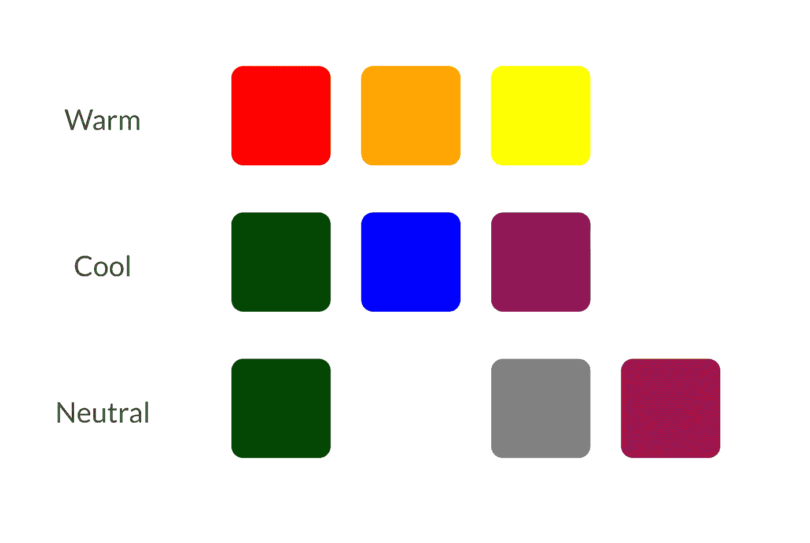

现在我们对颜色是如何组合在一起有了更好的理解，让我们来看看所有的颜色和一些常见的西方颜色解释。虽然这些都是很好的指导方针，但是要认识到背景和文化理解是很重要的。例如，在南非，红色与哀悼联系在一起，但在中国，它代表着庆祝、好运和繁荣。所以，当你使用颜色时，确保你理解你的用户的环境。

# 红色

与火、暴力、战争、爱情、激情、愤怒、重要性和危险有关。

“红色是非常火辣的颜色。它与火、暴力和战争联系在一起。它也与爱和激情联系在一起。在历史上，它与魔鬼和丘比特联系在一起。红色实际上会对人的身体产生影响，提高血压和呼吸频率。它也被证明可以增强人体新陈代谢。

红色可能与愤怒联系在一起，但也与重要性联系在一起(想想颁奖典礼和名人活动的红地毯)。红色也表示危险(这就是为什么停车灯和标志是红色的，警告标签通常也是红色的)。

在西方世界之外，红色有不同的联想。例如，在中国，红色是繁荣和幸福的颜色。它也可以用来吸引好运。在其他东方文化中，新娘在婚礼当天穿红色。然而，在南非，红色是哀悼的颜色。红色也与共产主义联系在一起。

由于[红色]运动的流行，红色已经成为非洲艾滋病意识的象征。

在设计中，红色可以是一种强有力的强调色。如果在设计中用得太多，尤其是以最纯粹的形式，它会产生压倒性的效果。当需要在设计中表现力量或激情时，这是一个很好的颜色。然而，红色可以是非常多才多艺的，更亮的版本更有活力，更暗的色调更有力量和优雅。"

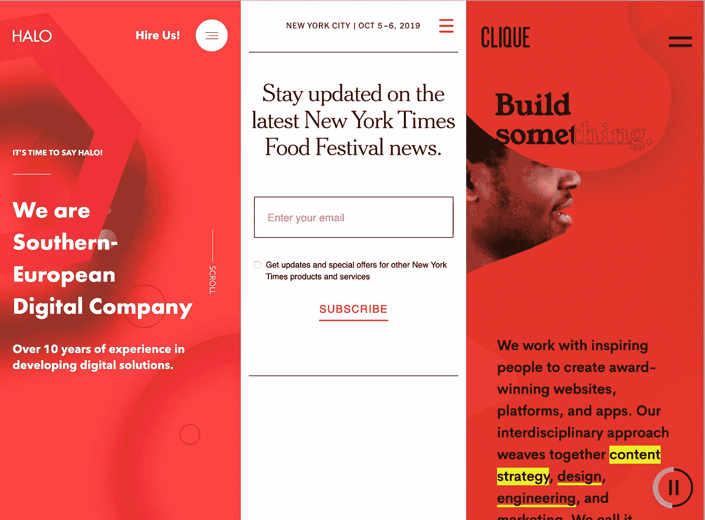

# 柑橘

与地球、秋天、变化、运动、创造力、健康和活力有关。

橙色是一种充满生机和活力的颜色。在其低调的形式，它可以与地球和秋天。因为它与季节的变化有关，橙色通常可以代表变化和运动。橙色也与创造力紧密联系在一起。

因为橙色与同名的水果联系在一起，所以它可以与健康和活力联系在一起。在设计中，橙色不像红色那样具有压倒性的吸引力。人们通常认为它更友好、更有吸引力，而且不那么碍眼。

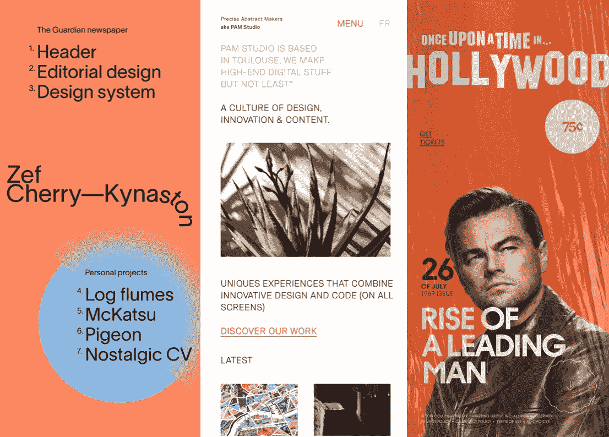

# 黄色

与快乐、阳光、希望和危险联系在一起。

黄色通常被认为是暖色中最明亮、最有活力的颜色。它与快乐和阳光联系在一起。然而，黄色也可能与欺骗和懦弱联系在一起(称某人为黄色就是称他们为懦夫)。

黄色还与希望联系在一起，在一些国家，当有亲人在战争中的家庭展示黄色丝带时，就可以看到这种情况。黄色也与危险联系在一起，尽管没有红色那么强烈。

在一些国家，黄色有非常不同的含义。例如，在埃及，黄色代表哀悼。在日本，它代表勇气，在印度，它是商人的颜色。

在你的设计中，亮黄色能给人一种幸福和快乐的感觉。较柔和的黄色通常被用作婴儿(而不是蓝色或粉红色)和幼儿的中性颜色。浅黄色也比亮黄色给人一种更平静的幸福感。暗黄色和金黄色有时看起来很古色古香，用在需要永恒感的设计中。

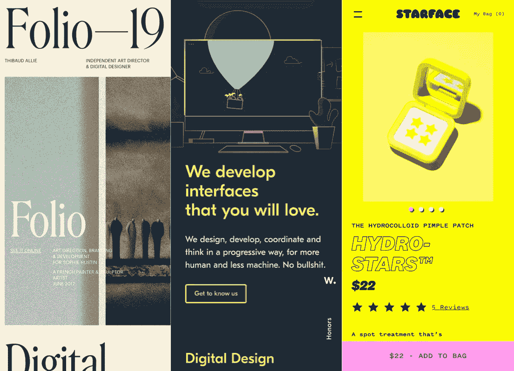

# 格林（姓氏）；绿色的

与新的开始、成长、更新、富足、嫉妒、财富和稳定相关联。

绿色是一种非常朴实的颜色。它可以代表新的开始和成长。它也象征着更新和富足。或者，绿色也可以代表羡慕或嫉妒，以及缺乏经验。

绿色有许多与蓝色相同的镇静属性，但它也融合了黄色的一些能量。在设计中，绿色可以有一个平衡和协调的效果，非常稳定。

它适合与财富、稳定、更新和自然相关的设计。明亮的绿色更有活力，而橄榄绿更能代表自然界。深绿色是最稳定和富裕的代表。

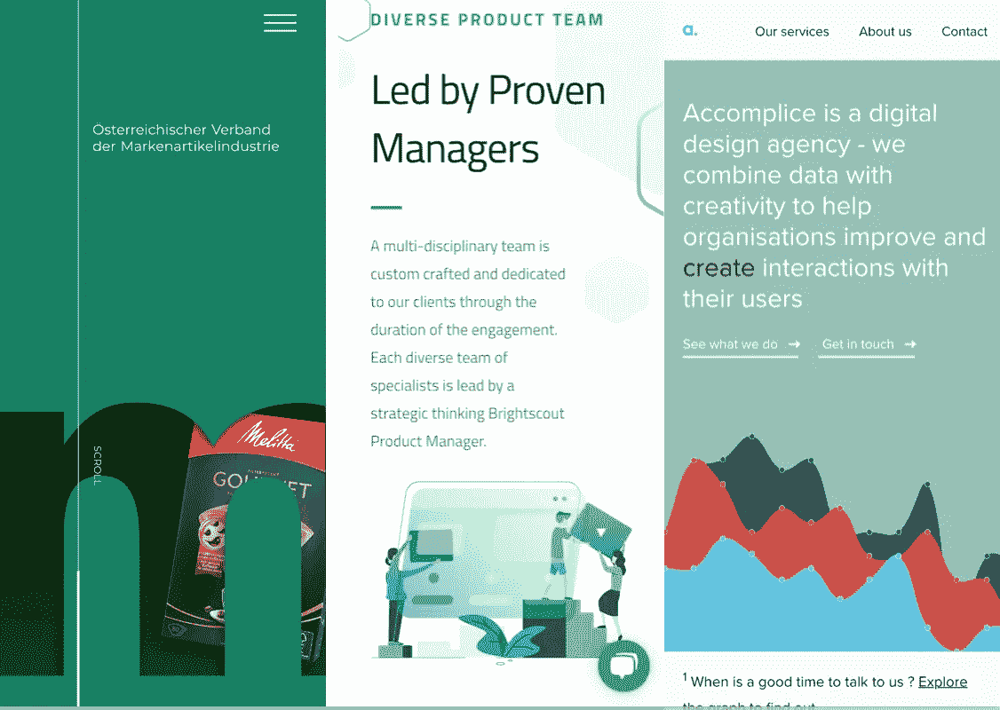

# 蓝色

与悲伤、平静、责任、清新、友好和和平联系在一起。

在英语中，蓝色经常与悲伤联系在一起。蓝色也被广泛用来代表冷静和责任。浅蓝色可以让人耳目一新，感觉友好。深蓝更强烈，更可靠。蓝色也与和平联系在一起，在许多文化和传统中具有精神和宗教内涵(例如，圣母玛利亚通常被描绘成穿着蓝色长袍)。

蓝色的含义受到不同阴影和色调的广泛影响。在设计中，你选择的蓝色的确切色调将会对你的设计给人的感觉产生巨大的影响。浅蓝色通常让人放松和平静。明亮的蓝色会让人充满活力，精神焕发。深蓝和海军蓝一样，非常适合那些注重强度和可靠性的企业网站或设计。

# 紫色

与王权、创造力、想象力、浪漫和奢侈联系在一起。

在古代，用于创造紫色色调的染料是从蜗牛中提取的，非常昂贵，所以只有皇室和非常富有的人才买得起。

紫色是红色和蓝色的结合，具有两者的一些属性。它也与创造力和想象力有关。

在泰国，紫色是寡妇哀悼的颜色。暗紫色传统上与财富和皇室联系在一起，而浅紫色(如薰衣草)被认为更浪漫。

在设计中，暗紫色可以给人一种财富和奢华的感觉。浅紫色更柔和，让人联想到春天和浪漫。

# 黑色

与权力、优雅、正式、邪恶、死亡、神秘和哀悼有关。

黑色是最强烈的中性颜色。从积极的一面来看，它通常与权力、优雅和正式联系在一起。从负面来看，它可能与邪恶、死亡和神秘联系在一起。在许多西方国家，黑色是哀悼的传统颜色。在某些文化中，它还与反叛有关，与万圣节和神秘学有关。

当黑色不仅仅作为强调或文字使用时，它通常用于更前卫的设计，也用于非常优雅的设计。它可以是保守的或现代的，传统的或非传统的，取决于它所搭配的颜色。在设计中，黑色通常用于排版和其他功能部分，因为它是中性的。黑色可以更容易传达设计中的复杂感和神秘感。

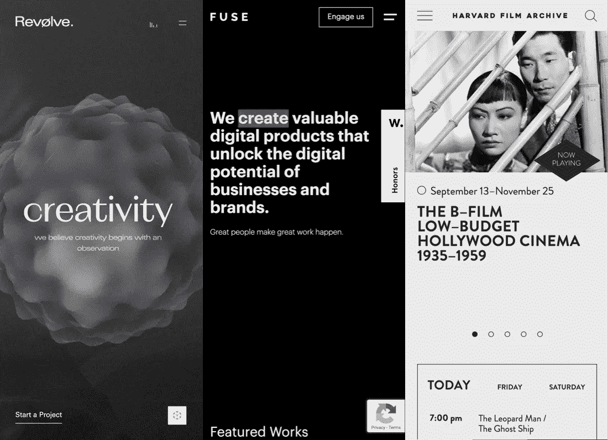

# 怀特（姓氏）

与纯洁、清洁、美德、保健、婚礼、善良和哀悼(在东方文化中)联系在一起。

白色与黑色处于光谱的另一端，但和黑色一样，它可以和任何其他颜色搭配得很好。白色通常与纯洁、清洁和美德联系在一起。在西方，新娘在结婚当天通常穿白色衣服。它还与医疗保健行业有关，尤其是医生、护士和牙医。白色与善良联系在一起，天使经常被描绘成白色。

然而，在东方的大部分地区，白色与死亡和哀悼联系在一起。在印度，这是传统上寡妇可以穿的颜色。

在设计中，白色通常被认为是一种中性背景，让设计中的其他颜色有更大的发言权。不过，它有助于传达干净和简洁，在极简设计中很受欢迎。设计中的白色也可以描绘冬天或夏天，这取决于围绕它的其他设计主题和颜色。

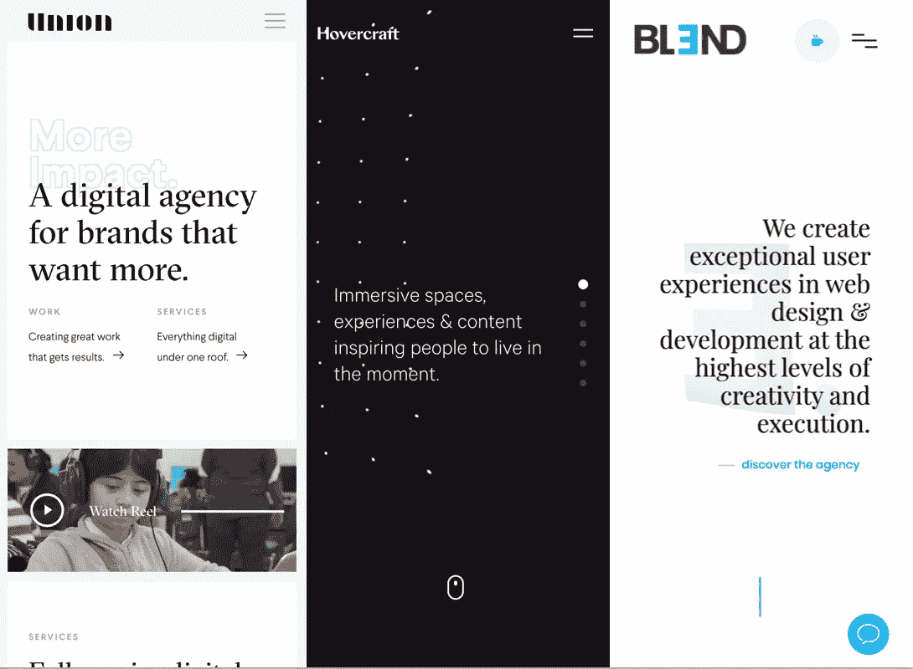

# 灰色的

与喜怒无常、保守、正式和世故联系在一起的。

灰色是一种中性色，通常被认为是色谱中的冷色。它有时会被认为是喜怒无常或令人沮丧的。在一些设计中，浅灰色可以用来代替白色，深灰色可以用来代替黑色。

灰色一般比较保守正式，但也可以很现代。它有时被认为是哀悼的颜色。它通常用在公司设计中，正式和专业是关键。它可以是非常复杂的颜色。纯灰色是黑色的阴影，尽管其他灰色可能混合有蓝色或棕色色调。在设计中，灰色背景非常普遍，灰色排版也是如此。

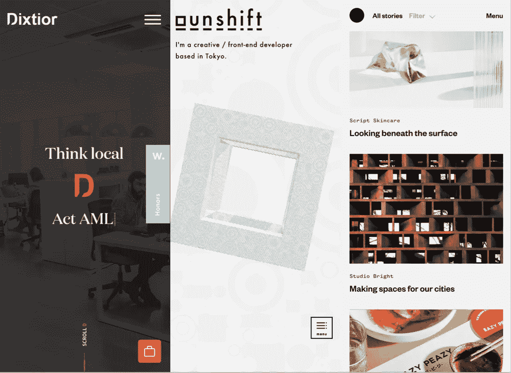

# 褐色的

与土、木、石有关，可靠性、可靠、沉闷。

棕色与土地、木头和石头联系在一起。这是一种完全自然的颜色，也是一种暖色调。棕色可以与可靠、坚定和朴实联系在一起。也可以认为是平淡。

在设计中，棕色通常被用作背景色。这也见于木质纹理，有时也见于石头纹理。它有助于给设计带来温暖和健康的感觉。它有时以最暗的形式代替黑色，用在背景或排版中。

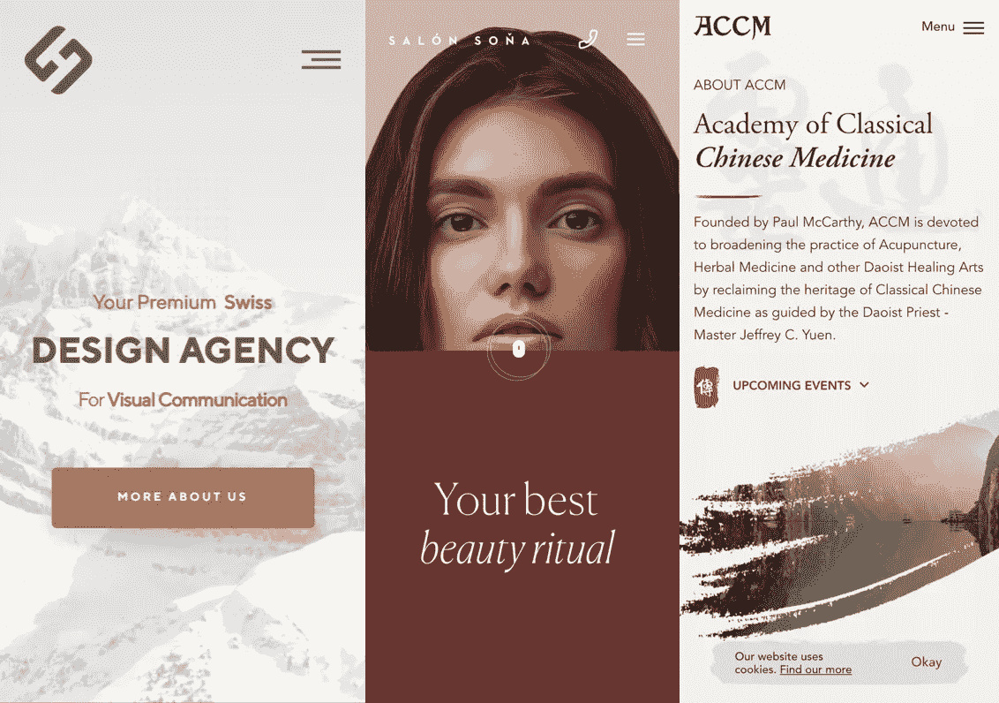

# 颜色应该少用

我们应该只用颜色来吸引人们对页面上最重要元素的注意。

这里有一些用颜色来画出意义的公司的例子。

# 拼趣

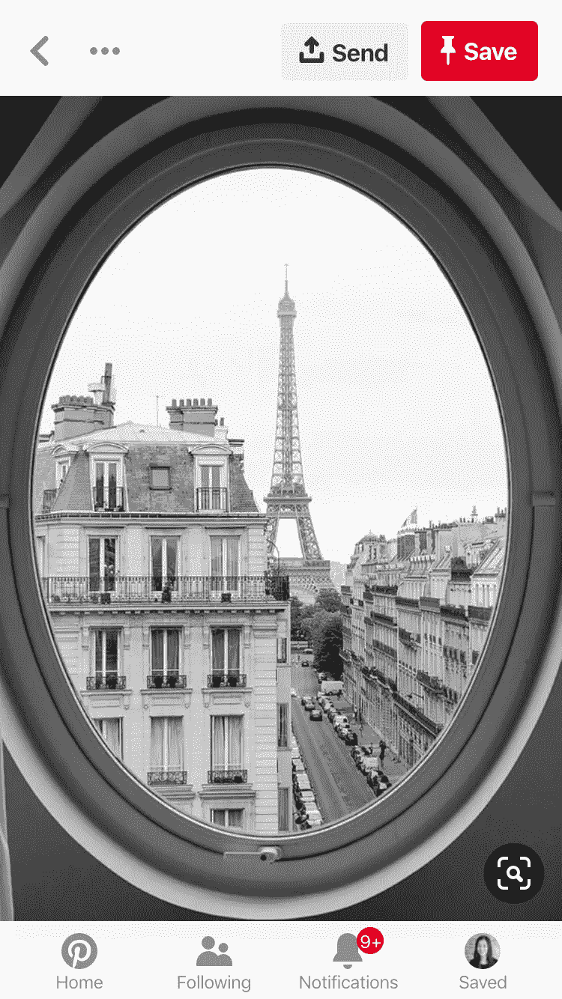

# 视觉

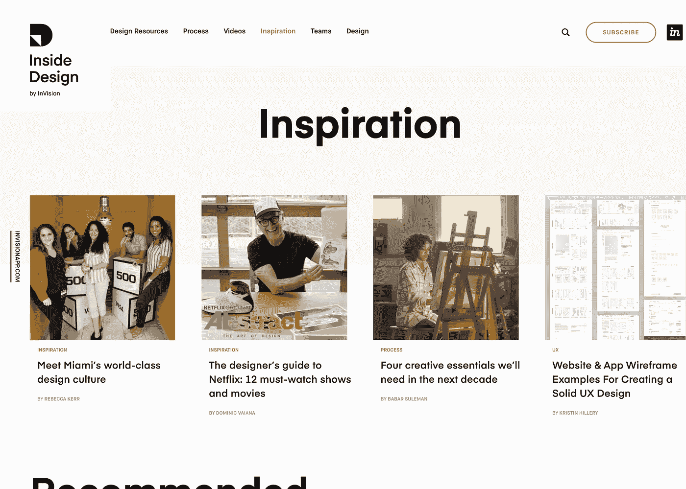

# 学习

> 学习解释如何使用颜色模型。

# 概观

当使用颜色时，我们有几种不同的方法在我们选择的图形设计工具中表现它们。这些表示被称为色彩空间或色彩模型。我们在界面设计中最常用的是 RGB、HSB 和 HSL。让我们依次来看一下其中的每一项。

当使用颜色时，我们有几种不同的方法在我们选择的图形设计工具中表现它们。这些表示被称为色彩空间或色彩模型。我们在界面设计中最常用的是 RGB、HSB 和 HSL。

# RGB

RGB(红、绿、蓝)颜色模型是最常见的颜色模型。红、绿、蓝三种颜色以各种不同的组合加在一起，就产生了一系列的颜色。

RGB 根据三个分量来定义颜色空间。红色、绿色和蓝色的亮度范围都是从 0 到 255，0 代表黑色，255 代表白色。

RGB 很重要，因为它是计算机和显示器解释颜色的方式。这在考虑十六进制代码时特别有用。

然而，从人类的角度来看，我们很难理解这一点。例如，很难去想一个东西应该有多红或多绿。这就是为什么我们有 HSB 和 HSL。

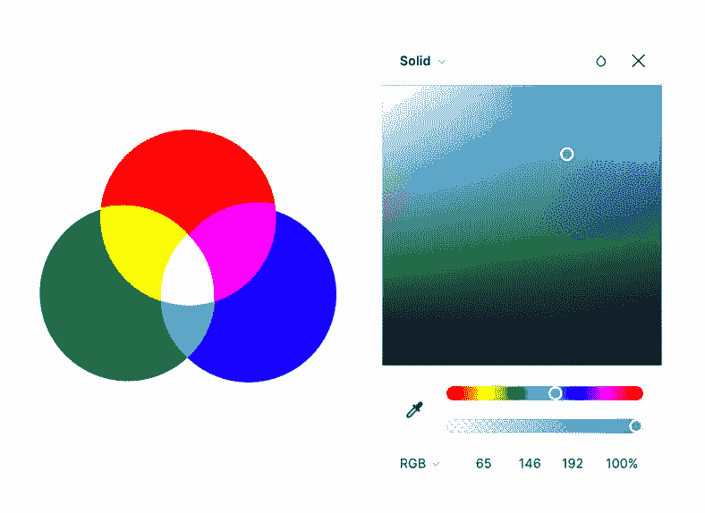

# HSB

HSB 模型也称为 HSV(色调、饱和度、亮度)模型。HSB 模型是由阿尔维·雷·史密斯在 1978 年创建的。这也是一种更人性化的描述颜色的方式。

HSB 颜色模型根据三个组件来定义颜色空间:

第一种是色调，也称为颜色类型，如红色、蓝色或黄色。

HSB 颜色模型的第二个组成部分是饱和度。饱和度就是颜色的强度，颜色有多丰富。范围从 0 到 100%。100%是最亮的强度，0%是灰色阴影。

HSB 颜色模型的第三个组成部分是亮度。亮度就是颜色的亮度。范围从 0 到 100%。根据饱和度，0 始终为黑色。100%将是该颜色的最亮版本。如果饱和度是 0%，亮度 100 将是白色，因为我们得到的是最亮的灰色。

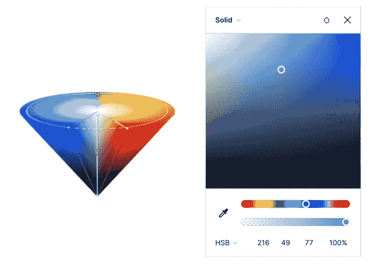

# high-speedlaunch 高速快艇

最后，我们有 HSL。HSL 和 HSB 很像，但又不是一回事。虽然你应该熟悉所有这些色彩空间，但大多数设计师更喜欢 HSL，因为它最接近我们对色彩的理解。

HSL 颜色空间代表:色调，颜色类型(如红色、蓝色或黄色)。在大多数应用中，它的范围从 0 到 360(每个值对应一种颜色。0 表示红色，45 表示橙色，55 表示黄色)。

饱和度，颜色的变化取决于亮度。范围从 0 到 100%(从黑白轴的中心开始)。

亮度(也称亮度或发光度)。白色的量。亮度也将从 0 到 100%变化，但 0 代表黑色，100 代表白色。

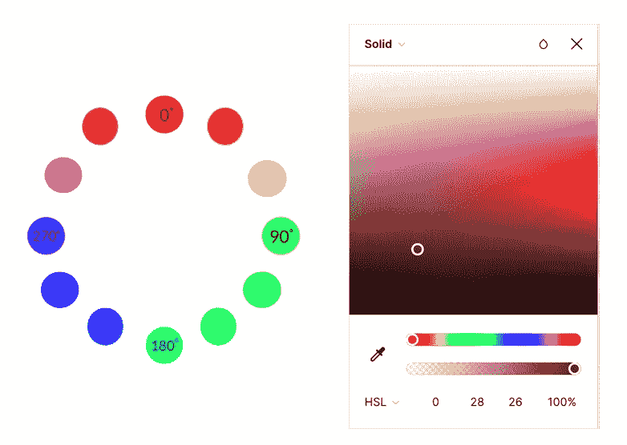

# 十六进制代码

当我们使用颜色选择器时，它们通常会有一个类似这样的字符串:`#FFFFF`。这些小字符串被称为十六进制代码。

我们刚刚介绍的每个颜色模型都可以生成这些十六进制代码。这允许我们在颜色模型之间共享精确的颜色。你可以把它们想象成特定颜色的指纹。

十六进制代码也很有用，因为我们用它们将颜色编码到我们的用户界面中。我们的计算机和浏览器使用十六进制代码来解释和显示颜色。因此，当我们与开发人员合作时，我们给他们我们颜色的十六进制代码，以便他们可以将它们添加到我们的体验中。

十六进制颜色不是你需要记住的东西。

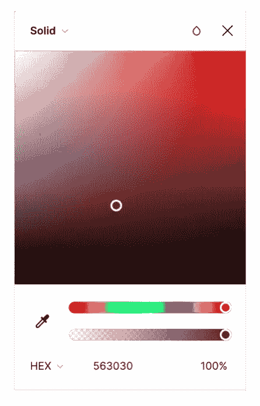

# 学习

> 学习解释颜色如何影响情绪和可及性。

# 概观

当我们为项目选择颜色时，我们需要始终考虑各种用户(包括残障用户)如何从视觉上感知它们。

为了确保我们的调色板是可访问的，我们可以遵循网页内容可访问性指南或 WCAG 的指导。当我们关注颜色可及性时，要记住的关键概念是颜色对比。正如 WCAG 2.0 解释的那样，“色觉缺陷的用户对色调的感知是不同的，这导致了与正常视力用户相比不同的颜色和相对亮度对比度。正因为如此，有效对比度和可读性对于这个人群是不同的。然而，颜色缺陷是如此多样，以至于基于定量数据开出有效的通用颜色对(用于对比)是不可行的。要求良好的亮度对比度通过要求独立于颜色感知的对比度来适应这一点。”

关键的一点是，我们的设计需要有符合这些网页内容可访问性指南的颜色对比。这些将帮助那些有视觉或色觉缺陷的人。

为了提高我们有效利用色彩对比的能力，他们 WCAG 概述了三个层次的对比一致性:A，AA，AAA。

“对于标准文本和视觉效果，3:1 的对比度是推荐的最低水平。本规定中使用 4.5:1 的比率，以说明由中度低视敏度导致的对比度损失，或由老化导致的对比度损失。

选择 4.5:1 的对比率用于 AA 级，因为它补偿了视力损失相当于大约 20/40 视力的用户通常经历的对比敏感度的损失。20/40 通常被报道为大约 80 岁的老年人的典型视力。

选择 7:1 的对比度用于 AAA 级，因为它补偿了视力损失相当于大约 20/80 视力的用户通常经历的对比敏感度的损失。因此，7:1 级别通常为不使用辅助技术的低视力用户体验到的对比敏感度损失提供补偿，并且还为色彩不足提供对比度增强。"

这里的关键要点是，我们需要确保我们的色彩对比度在适当的时候至少达到 AA 级。实际上，这意味着我们需要特别关注如何在排版中使用颜色。如果我们的文字内容没有足够的对比度，那么就无法阅读！

一般来说，文本越大越粗，对比就越不必要。所以，我们把精力集中在 14 和 18px 的文本上。如果我们能通过这些尺寸的 AA 和 AAA 评级，那么我们对我们的色彩对比度很有信心。

为了检查颜色对比度，我们可以使用各种在线工具。在谷歌上快速搜索“色彩对比检查器”会产生大量的结果，但两个可靠的选择是 https://contrast-ratio.com 和 https://snook.ca/technical/colour_contrast/colour.html。

# 糟糕的色彩运用

在下面的例子中，颜色使用不当。例如，颜色的使用很少，绿色和红色的组合很难阅读。

# 更好地利用色彩

在这个例子中，有一种原色。较暗的红色与白色文字形成更大的对比，使其更容易阅读。

# 资源

*   [讲座——色彩理论](https://www.youtube.com/watch?v=26pSU2UHznU)
*   [色彩理论基础知识](https://www.youtube.com/watch?v=L1CK9bE3H_s)
*   【Noobs 的色彩理论
*   [如何使用颜色—颜色基础知识](https://www.youtube.com/watch?v=QkCVrNoqcBU)

# 后续步骤

*   [人类思维设计简介](https://medium.com/@iampika/intro-to-designing-for-the-human-mind-4106ce7c291?)
*   [排版介绍](https://medium.com/@iampika/intro-to-typography-74ed63303f1e)