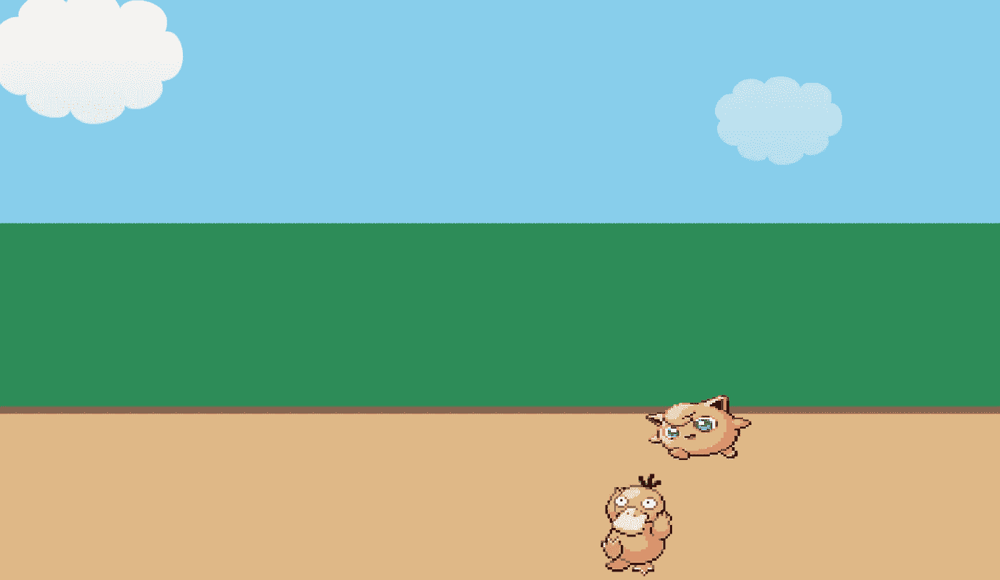

# CSS 动画简介

> 原文：<https://levelup.gitconnected.com/intro-to-css-animation-31be57f4654c>



1998 年怀旧

作为一名开发人员，我喜欢的是有能力创造我脑海中想到的任何东西(当然，在合理的范围内，我未来的食物传送应用程序还不太可能实现)。作为一名全栈开发人员，意味着我不仅可以构建 API 和实现用户认证，还可以开发用户界面，并且*这是乐趣的开始。在这里，我可以锻炼自己艺术/创意的一面，并尝试设计。*

大多数刚起步的开发人员学习 CSS 的基础知识，比如填充:20px，显示:flex，位置:absolute。然而，许多人并没有意识到 CSS 可以为你和你的应用程序提供的众多功能，比如动画！！！

在这篇博客中，我将简要介绍如何制作 CSS 动画。还有，我要以此为契机，重温我最喜欢的童年漫画《神奇宝贝》！这幅插图的主题将是胖丁和 Psyduck 之间的户外神奇宝贝比赛(因为皮卡丘和首发阵容得到了太多的关注)。

我们将要讨论的第一个 CSS 属性是**变换**，它允许你平移、缩放和旋转一个元素。

*   **平移**:在水平(X 轴)和/或垂直(Y 轴)方向移动一个元素。

```
img {
transform: translateX(200px) 
}
//Positive integer - moves img to the right. Negative int moves img to the left.transform: translateY(200px) //positive int-moves img down. Negative int moves img up.transform: translate(200px, -200px) //can enter 2 values, X-axis & Y-axis, respectively. 
```

*   **Scale** :在水平(X 轴)和/或垂直(Y 轴)方向调整元素的大小。大于 1 的值会使其变大，小于 1 的值会使其变小。值为 1 将不起任何作用；比例将会是 1:1。

```
img {
transform: scaleX(3)
}
//Will stretch the img 3 times as big, along the X-axis.transform: scaleY(0.5)
//Will shrink the img along the Y-axis. transform: scale(3)
//Will scale along both X & Y-axis.transform: scale(3, 0.5)//can enter 2 values, X-axis & Y-axis, respectively.
```

*   **旋转**:围绕一个固定点旋转一个元素，由水平(X 轴)、垂直(Y 轴)或 Z 方向的角度指定。

```
img {
transform: rotateX(60deg)
}
//Rotate along the X-axistransform: rotateY(90deg) //Rotate along the Y-axistransform: rotateZ(90deg) //Positive int-Rotate clockwise. Negative int-rotate counter-clockwise
```

我们可以在一行中将转换链接在一起。

```
img {
transform: rotateZ(-90deg) translateY(200px) scale(2)
}
```

接下来是**过渡**。转换描述了元素如何从一种状态改变到下一种状态。它们是最基本的动画形式。创建过渡效果有 4 个特征。

*   **transition-property:** 要添加效果的 CSS 属性
*   **过渡-持续时间:**指定效果持续的时间，以秒为单位
*   **转场-计时-功能:**指定效果的速度曲线。吸收 5 个特征中的一个:

1.  **线性**:效果从开始到结束速度相同
2.  **渐强**:慢速启动效果
3.  **缓出**:慢结束效果
4.  **渐出**:缓慢开始和结束的效果
5.  **三次贝塞尔函数(n，n，n，n)** -在一个三次贝塞尔函数中定义你自己的值，从 0 到 1。你可以利用这个网站来制作你自己的曲线。[https://cubic-bezier.com/](https://cubic-bezier.com/#.17,.67,.83,.67)

*   **过渡延迟**:指定效果的延迟，以秒为单位

```
.square {
  background: red;
  transition-property: background;
  transition-duration: 2s;
  transition-timing-function: linear;
  transition-delay: 1s;
} .square:hover {
  background: green
}// The square originally has a background property of red. Upon hover, there is a 1s delay. Then the red square will linearly transition into green over a duration of 2s. 
```

现在，动画过程的主要事件是**关键帧**。@keyframes 规则指示动画代码，您可以在其中控制动画序列中的步骤。这是我们告诉 CSS 我们希望我们的动画如何工作，我们希望改变什么属性，以及何时改变。

```
.psyduck {
position: absolute;
top: 30px;
left: 0px;
animation-name: drive; //apply the @keyframes animation here
animation-duration: 3s
}@keyframes drive {
from{ transform: translateX(100px) } //initial state
to{ transform: translateX(1300px)} // end state
}
```

上面的代码显示了@keyframes 动画的正确语法。它指定元素的初始状态和元素的结束状态。这个“驱动”动画会将元素从左边的-200 像素移动到右边的 1400 像素。然后，我们获取 psyduck 类元素，并对其应用持续时间为 5 秒的驱动关键帧。

结果会是这样的。

“Psyduck，用混淆！”

下一个动画属性是**动画填充模式**。这告诉 CSS 如何处理动画窗口外的指定元素，换句话说，在动画完成之后和动画开始之前。

动画填充模式可以接受 4 个值中的一个:

*   **无**
*   **forwards:** 即使在动画完成执行后*，元素仍保留其最后的动画属性。*
*   **向后:**动画样式已经应用，*在*动画开始之前。
*   **两者:**向前和向后组合

如果没有动画填充模式，动画看起来会像这样。

无动画填充模式

正如你所看到的，在动画的结尾，Psyduck 被移回到他原来的位置，在左边。使用动画填充模式中的“向前”值，Psyduck 保持在他的最终状态，这在比赛中更真实。

```
.psyduck {
position: absolute;
top: 30px;
left: 0px;
animation-name: drive; 
animation-duration: 3s;
animation-fill-mode: forwards
animation-delay: 2s
}@keyframes drive {
from{ transform: translateX(100px) } //initial state
to{ transform: translateX(1300px)} // end state
}
```

动画填充模式:向前

最后 3 个动画属性是

1.  **动画-迭代-计数:**如何重复动画。可以取整数或“无穷大”。
2.  **动画-计时-功能:**决定动画执行的速度。接受与**过渡计时函数**相同的值(线性、渐强、渐弱、渐弱、三次贝塞尔曲线)
3.  。**动画方向**:决定并改变动画的方向。可以接受 4 个值中的 1 个:

*   **正常:**动画向前播放。
*   **交替:**动画先向前播放，再向后播放。
*   **反转:**倒着玩。
*   **交替倒放:**先倒放，后正放。

还有一种**简写**的方式来编码这些动画属性。

```
.cloud:nth-child(1) {
width: 200px;
top: 120px;
opacity: 0.5;
animation: wind 80s linear infinite reverse
}@keyframes wind {
from{ left: -300px}
to{ left: 100% }
}
```

在云类元素下的“**动画**属性下:

1.  第一个值是动画名称**，**，这里是风**。**
2.  第二个值是动画**持续时间，**为 80 秒。
3.  第三个值是动画**计时函数**，它是线性的。
4.  第四个值是动画**迭代次数**，这里是无穷大。
5.  第 5 个值是动画**方向**，反向。

最后，我们可以将 1 个以上的动画链接在一起。让我们把胖丁加入到比赛中，并添加两个动画，“驾驶”和一个新的“跳跃”。

```
.jigglypuff {
position: absolute;
width: 300px;
height: 200px;
top: -80px;
left: 0px;
animation: drive 3s both infinite linear,
           jump .3s 3 1.2s ease
}@keyframes drive {
from{ transform: translateX(-100px) }
to{ transform: translateX(1300px) }
}@keyframes jump {
0%{ top: -80px } // start of animation
50%{ top: -140px } // halfway through, Jigglypuff is in midair 
100%{ top: -80px } // end of animation
}
```

胖丁将在半空中跳 3 次，每次 0.3 秒。将有 1.2 秒的延迟，计时功能为“ease”。

插图的完整和最终 CSS 如下所示:

```
html, body {
height: 100%;
width:100%;
overflow: hidden;
margin: 0;
}.grass, .sky, .ground {
position: relative;
}.sky {
height: 40%;
background: skyblue;
}.grass {
height: 30%;
background: seagreen;
}.ground {
height: 30%;
background: burlywood;
border-top: 10px solid #8a6856;
border-bottom: 10px solid #8a6856;
box-sizing: border-box;
width: 100%;
}/* ELEMENTS TO ANIMATE */.jigglypuff {
position: absolute;
width: 300px;
height: 200px;
top: -80px;
left: 0px;
animation: drive 3s both infinite linear,
jump .3s 3 1.2s ease
}.psyduck{
position: absolute;
top: 30px;
left: 0px;
animation-name: drive;
animation-duration: 3s;
animation-fill-mode: both;
animation-iteration-count: infinite;
animation-direction: reverse;
}.cloud {
position: absolute;
}.cloud:nth-child(1) {
width: 200px;
top: 120px;
opacity: 0.5;
animation: wind 80s linear infinite reverse
}.cloud:nth-child(2) {
width: 300px;
top: 0;
animation: wind 50s linear infinite reverse
}/* KEYFRAMES */@keyframes drive {
from{ transform: translateX(-100px) }
to{ transform: translateX(1300px)}
}@keyframes jump {
0%{ top: -80px }
50%{ top: -140px }
100%{ top: -80px }
}@keyframes wind {
from{ left: -300px}
to{ left: 100% }
}
```

HTML 看起来像这样:

```
<!DOCTYPE html><html lang="en"><head><meta charset="UTF-8"><meta name="viewport" content="width=device-width, initial-scale=1.0"><meta http-equiv="X-UA-Compatible" content="ie=edge"><link rel="stylesheet" href="style.css"><title>Pokémon Race</title></head><body><div class="sky">
</div><div class="grass"></div><div class="ground">
</div></body></html>
```

维奥拉。成品:

“胖丁，用唱！”