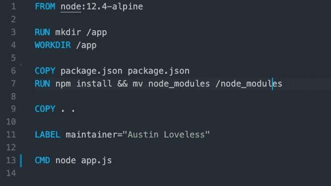

# Docker 简介

> 原文：<https://levelup.gitconnected.com/intro-to-docker-1855b825de5e>

*作者:* [*奥斯洛夫莱斯*](https://www.linkedin.com/in/austin-loveless/)*—2020 年 1 月 8 日*

# Docker 是什么？

Docker 是一个开源社区项目和工具，旨在通过使用容器来简化应用程序的创建、部署和运行。Docker 有点像虚拟机，但不是创建一个完整的虚拟操作系统，Docker 允许应用程序使用与运行它们的系统相同的 Linux 内核，并且只要求应用程序与主机上尚未运行的东西一起移动。

基本上 Docker 是允许我们构建和运行容器的比较流行的工具之一。CoreOS rkt、Mesos Containerizer、LXC Linux 容器和 OpenVZ 是其他容器工具。

# 那么什么是容器呢？

Docker 文档说明

“容器是一个标准的软件单元，它将代码及其所有依赖项打包，以便应用程序能够快速可靠地从一个计算环境运行到另一个计算环境。Docker 容器映像是一个轻量级的、独立的、可执行的软件包，包括运行应用程序所需的一切:代码、运行时、系统工具、系统库和设置。”

“容器映像在运行时成为容器，对于 Docker 容器，映像在 Docker 引擎上运行时成为容器。可用于 Linux 和基于 Windows 的应用程序，容器化的软件将总是运行相同的，不管基础设施如何。容器将软件从其环境中隔离出来，并确保其统一工作，尽管存在差异，例如在开发和阶段之间。”

我发现在试图理解新事物时，比较我已经熟悉的东西更容易。

在某种意义上，您可以将容器视为 GitHub Repo，您将代码的一个版本存储在一个其他开发人员可以下载您的代码并使用您正在使用的代码的地方。

容器是一个可重复的环境，您可以与其他开发人员共享，这样他们就可以像您一样使用相同的环境、运行时和代码库。当您想要将应用程序从本地迁移到云中时，这将变得更加容易。您实际上是在为您的环境创建一个快照或拷贝，并将其放入存储库中，然后将该快照下载到云中的新服务器上。

# Docker 是给谁的？

Docker 允许开发人员使用包含应用程序及其所有依赖项的本地容器在标准化环境中工作。Docker 改进了 CI/CD 的工作流程，并为所有开发人员维护了应用程序的一致性。

在以下情况下，您可以考虑使用 Docker:

*   您希望确保您的开发人员在彼此相同的环境中工作。
*   您希望以快速有效的方式将应用程序迁移到云提供商，如 AWS 及其所有依赖项。
*   您需要维护应用程序的不同版本。您可以有一个单独的容器用于测试、开发和生产，并且可以轻松地部署到每一个容器中。

# Docker 怎么用？

你需要定义一个`Dockerfile`。docker 文件是一个文本文件，包含一组关于如何设置应用程序的说明。这是码头工人形象的蓝图。

假设您有一个 node.js 应用程序，您想对它进行 Dockerize。首先，您需要定义运行时间`node:12.4`。在应用程序将要运行的容器中创建一个目录，然后安装所有的依赖项，并启动应用程序。

下面是一个简单的 node.js Dockerfile 文件的例子。

node.js 的 Dockerfile

我们将运行时间定义为`node:12.4-alpine`。创建一个名为`app`的目录，并将其设置为工作目录。从`package.json`安装 npm 包，然后用`node app.js`启动应用程序。

# 结论

如果你想确保你的所有开发者都在同一个应用上工作，Docker 是很棒的。或者，如果您希望有一个云原生方法，将一个应用程序归档可以让您更容易地将现有应用程序迁移到云中。查看这篇关于创建你的第一个 [Docker 应用程序的文章。](https://medium.com/@awsmeetupgroup/tutorial-docker-and-node-js-2d7fde6eb38b)