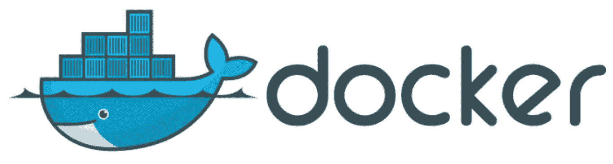
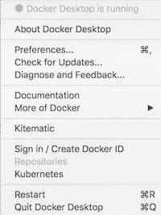
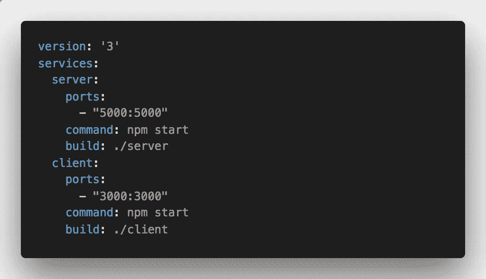

# 面向前端开发人员的 Docker 简介

> 原文：<https://levelup.gitconnected.com/intro-to-docker-for-front-end-developers-22ed1942c4a5>



docker 标志

由于主要从事前端项目，Docker 并不是我经常需要处理的东西，但在过去的几周里。我已经了解了更多，并决定写这篇博文来分享这些基础知识。

# Docker 是什么？

Docker 已经存在了一段时间，但是如果你从来没有使用过它，我想简单地解释一下它是什么可能会比较好。

Docker 是一个工具，**帮助开发者更容易地构建、部署和运行应用程序。**它通过打包应用程序及其所需的一切(库、代码、系统工具等)来实现。)变成虚拟的**容器**。这允许您将应用程序快速部署到任何包含 Docker 的环境中，并且您的代码将会运行。

例如，假设您加入了一个新团队，您必须在您的机器上安装项目所需的所有东西，但由于某种原因，它不能按预期工作。这可能是由许多不同的因素造成的，例如不同的操作系统、不同版本的语言等。

如果项目实际上是在 Docker 容器中运行的，那么您所要做的就是下载这些容器，构建并运行它们！这将节省大量的时间和最终的麻烦，因为它保证工作！

# 好吧，但是，作为一个前端开发人员，我为什么要关心呢？

我一直想研究 Docker，因为我喜欢对不同的技术和工具有一个基本的了解，即使我不经常使用它们。

然而，即使不是出于好奇，我仍然认为更多地了解它是重要的(也是有用的)，原因有几个:

*   **隔离**:通常，每个容器运行一个应用程序或进程。这允许您测试对容器的更改，而不影响运行在不同容器上的应用程序的其他部分。
*   模块化:Docker 帮助微服务架构。应用程序的不同组件(数据库、服务器、前端等。)可以在它们自己的容器上运行，因此您可以从一个容器中部署更改，而不必重新部署所有内容，或者如果需要实现补丁，您可以在不影响应用程序其余部分的情况下构建一个新容器。
*   **标准化运营和环境** : Docker 映像是不可变的，因此您可以在从开发到生产的不同环境中保持一致。
*   **速度**:对于新团队成员来说，他们开始为项目做贡献所需要的只是下载一个 Docker 映像并旋转容器。不再有操作系统之间潜在差异的困扰！

现在我们已经介绍了一些好处，让我们看看如何开始。

# 基本设置

比方说，我们想要使用 Node.js 服务器和 React 前端构建一个非常基本的网站。出于本教程的目的，我们将对服务器和客户端进行分类，下面是我们的做法。

## 第一步:下载 Docker

我们需要从下载 Docker 桌面软件开始，并确保它正在运行。



Docker 桌面

## 第二步:设置

假设我们有一个包含两个文件夹的基本应用程序。一个用于服务器，一个用于客户端。

服务器在 Node.js 中是一个简单的 express 服务器，客户端在 React.js 中使用 [create-react-app](https://github.com/facebook/create-react-app) 。

该程序的基本架构在开始时看起来像这样:

```
my-app
|--server
| |--server.js
| |--node_modules
| |--package.json
|--client
| |--public
| |--src
|   |--App.js
| |--node_modules
| |--package.json
```

让我们从对接服务器开始。

要做到这一点，我们需要在服务器文件夹中创建一个`Dockerfile`文件，我们将在其中编写我们想要运行的命令来创建我们的容器。

```
FROM node:10-alpineADD . /var/appWORKDIR /var/appRUN npm installCMD npm startEXPOSE 5000
```

第一行定义了您想从 [DockerHub](https://hub.docker.com) 中使用的图像。根据您正在开发的语言，您必须选择正确的映像来安装到您的容器中。因为我们是用 JavaScript 开发的，所以我们使用的是节点图像。

第二个命令将服务器文件夹中的文件添加到 docker 容器中位于`/var/app`的文件夹中。

第三个命令将工作目录设置为`/var/app.`

第四个命令安装所有的依赖项。

第五个启动 app。

最后一个命令公开了您在`server.js`文件中使用的端口，因此可以在 Docker 容器之外访问它。

— -

现在让我们为客户端创建一个图像。我们在客户端文件夹中初始化另一个`Dockerfile`，并添加以下命令:

```
FROM node:10-alpineADD . /var/appWORKDIR /var/appENV PATH="/var/app/node_modules/.bin/:${PATH}"RUN npm installRUN npm run build# CMD serve -s buildCMD npm startEXPOSE 3000
```

开始时，通过添加映像和工作目录来设置服务器。

我遇到了一些问题，即使安装后也找不到`node_modules`，所以我们设置了一个 path 环境变量来告诉 Docker 在哪里可以找到它们。

然后，我们安装并构建 React 应用程序。开始时，我们有两个命令:要么是用于生产的`serve -s build`,要么是用于本地开发的`npm start`。

最后，我们公开端口 3000。

## 步骤 3:构建并运行

准备好 docker 文件后，要构建容器，请分别为服务器和客户机运行以下命令:

```
docker build . -t <whatever-name-you-want>
```

这个命令的作用是为这个项目构建 docker 容器，并给它一个带有`-t`标志的自定义名称。

要启动服务器 docker 容器，请运行:

```
docker run -p 5000:5000 <the-name-you-gave>
```

`-p`标志表示可以访问的主机和容器端口，在我们的例子中，服务器的端口是 5000。对于客户端，该命令如下所示:

```
docker run -p 3000:3000 <the-name-you-gave-your-client>
```

您的服务器应该在端口 5000 上启动，您应该能够访问`http://localhost:3000`并在浏览器中看到您的应用程序。

— -

这就是基本的 Docker 设置！🎉

当然，你还可以做更多的事情，例如，在你的`Dockerfile`中添加环境变量，这样你就可以在服务器和客户端之间共享东西，等等…但这不是本教程的重点。

我们可以添加到设置中的另一件事是使用 docker-compose。

# Docker 撰写

Docker Compose 是一个运行多容器 Docker 应用程序的工具。

不用运行 2 个`docker run`命令，我们可以在应用程序的根目录下创建一个`docker-compose.yml`文件来一次启动两个容器。

我们的基本 docker-compose 文件如下所示:



基本 docker-compose.yml 文件

首先，我们指出我们正在使用的文件格式的版本，在我们的例子 3 中。

然后我们定义我们的服务，一个用于服务器，一个用于客户端。

然后，我们定义基本的指令，比如我们需要使之可访问的端口、需要在启动时运行的命令以及它需要服务的构建文件夹。

然后，我们只需要在终端中运行`docker-compose up`，它应该会立刻启动我们的两个容器！

— -

# 使用 Docker 的其他方式

如果您在工作中没有机会使用 Docker，我认为它对以下应用程序仍然非常有用:

*   **研讨会** —如果你正在举办一个研讨会，人们需要下载代码库，dockerising it 会让你把时间花在实际的研讨会上，而不是帮助人们修复系统问题。
*   **现场演示**—现场演示很难，如果出现问题，就更难了。在演讲之前，你的电脑可能会死机，或者出于某种原因，你需要切换笔记本电脑。将您的现场演示归档可能会节省大量时间和压力，因为您需要的所有东西都在一个容器中，您可以在任何地方运行和构建。
*   **个人项目**——如果你想尝试一项技术，但不想把所有东西都安装在本地，你可以使用 Docker 容器，完成后可以直接删除。

— -

# 额外服务:

如果您感兴趣，可以使用一些额外的命令:

## 显示当前正在运行的 Docker 进程:

`docker ps`

## 显示所有 Docker 图像:

`docker images`

## 从电脑中删除图像:

`docker rmi <imageID>`

## 删除图像:

`docker kill <imageID>`

— -

就是这样！希望有帮助！👋

[](https://levelup.gitconnected.com)[](https://gitconnected.com/learn/docker) [## 学习 Docker -最佳 Docker 教程(2019) | gitconnected

### 31 大 Docker 教程-免费学习 Docker。课程由开发人员提交并投票，使您能够…

gitconnected.com](https://gitconnected.com/learn/docker)