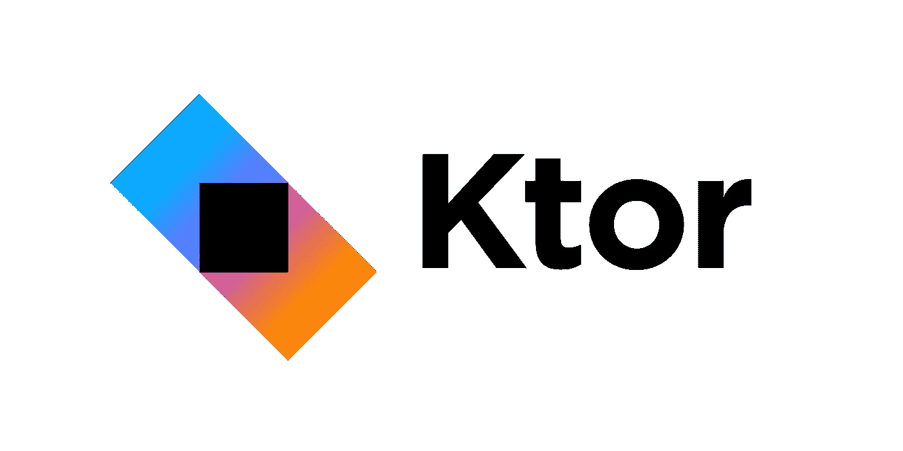
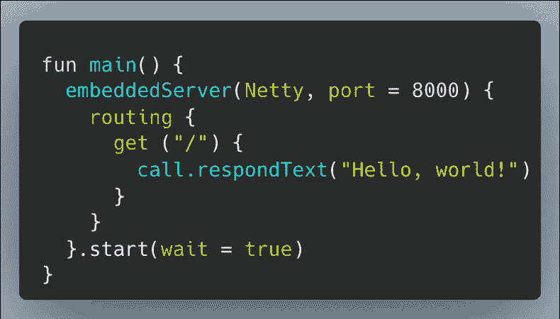
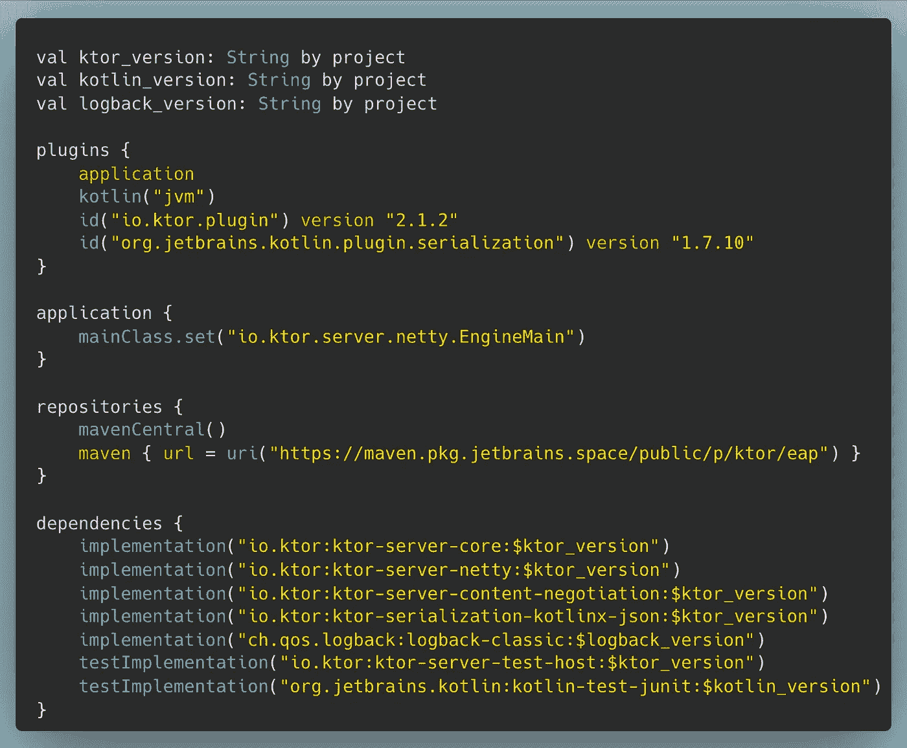
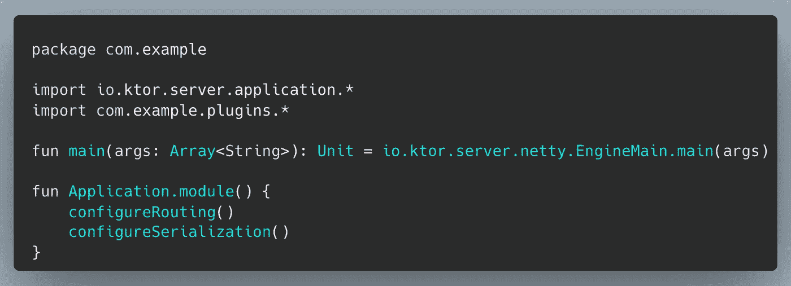
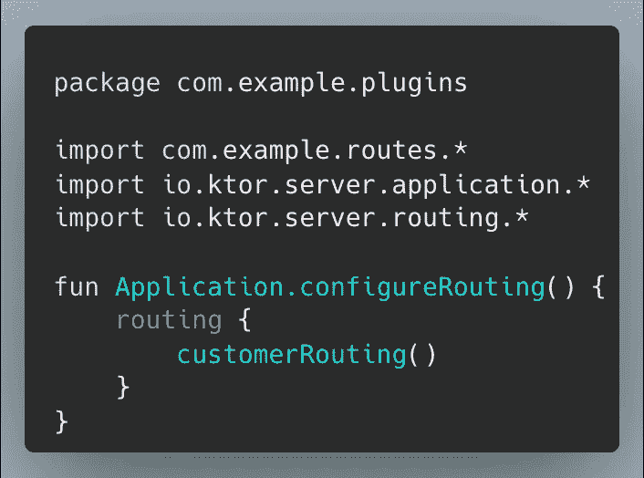
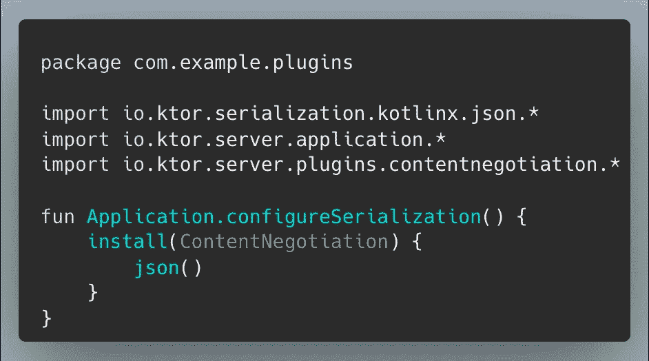
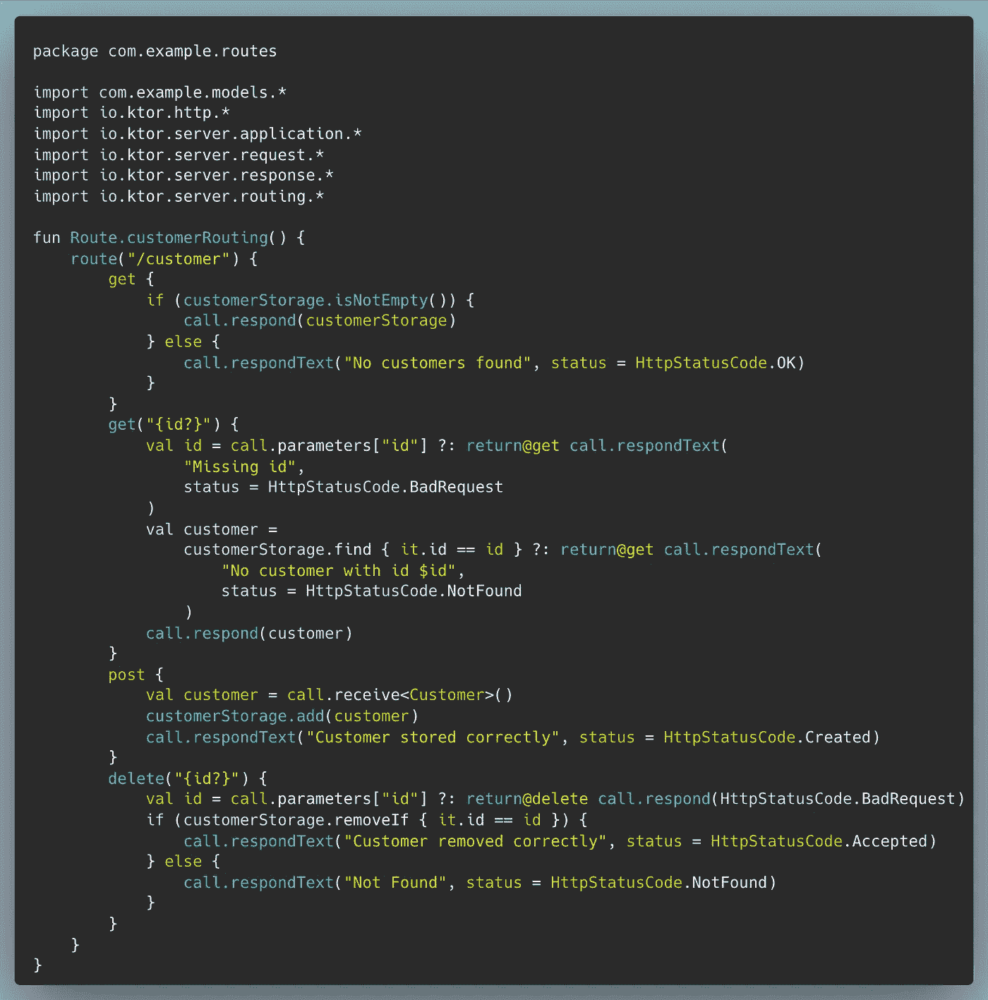

# Ktor 简介

> 原文：<https://levelup.gitconnected.com/intro-to-ktor-60c840e8d691>

Ktor 是由带给你 Kotlin 编程语言的人开发的一个 web 框架。许多开发人员在 Kotlin 中开发新的 web 应用程序时会用到 Spring Boot，但是我想向您展示一个 Ktor 的替代方案！

这是 Ktor 的标语:

> "创建异步客户端和服务器应用程序。从微服务到多平台 HTTP 客户端应用，一切都很简单。开源，免费，又好玩！”

我还没有用 Ktor 构建客户机的经验，所以我将谈谈我的经验并提供一个服务器应用程序的代码示例。

下面是设置 Ktor web 应用程序所需的所有代码。

没什么大不了的。

这种语法让我想起了多年 Ruby 编程中的 Sinatra。定义 RESTful API 的不同端点几乎不需要做什么。

您配置一个嵌入式 HTTP 服务器，设置端口，然后在内部定义您的路由，并启动服务器。很简单。

这是一个超级简单的例子，但我认为它显示了 Ktor 有多简洁，对文件结构的依赖有多少。

Ktor 大量使用了 Kotlin 编程语言中的特性，比如*协程。这些使开发人员能够将长时间运行的任务或 I/O 事务放到单独的线程上，以异步等待或启动。*

当连接到数据库并运行查询或更新时，您将大量使用协程。

# 标准应用示例

既然我们知道了如何编写一个简单的 Hello World REST API。让我们来看一个更标准的应用程序示例。如果你想查看 Ktor 团队提供的代码示例，可以在 GitHub 上查看[。](https://github.com/ktorio/ktor-documentation/tree/2.1.2/codeSnippets/snippets/tutorial-http-api)

`build.gradle.kts`

这是我们引入依赖项并为 gradle 设置主类的地方。我们使用 Netty 服务器和 Ktor 服务器核心包，并需要引入内容协商和序列化(稍后将详细介绍)。

`Application.kt`

我们配置 web 应用程序的主入口点来配置我们的路由和序列化，这两个功能都可以在`src/main/kotlin/com/example/plugins`目录下找到。

`Routing.kt`

下面是我们如何使用最初 Hello World 示例中的`routing`关键字为客户端点设置路由。

`Serialization.kt`

这是我们配置包括序列化在内的内容协商的地方。内容协商配置允许 Ktor 在客户端和服务器之间协商媒体类型。您可以使用 JSON 或 XML 作为您的序列化，我们已经将我们的序列化设置为 JSON。我们也使用 kotlinx 序列化作为例子，但另一种方法是使用 [fasterxml-jackson](https://mvnrepository.com/artifact/com.fasterxml.jackson.core) ，这样您就可以使用`jacksonObjectMapper`。只需将上面安装包中的单词`json`换成`jackson`。

`CustomerRoutes.kt`

在`Route.customerRouting`内部，我们为`/customer` url 定义了 REST 动作。我们为列表或单个客户 id 定义了一个 GET，为创建新客户定义了一个 POST 方法，为销毁现有客户定义了一个 DELETE 端点。

`Customer.kt`

最后但同样重要的是，这是我们的客户模型，它是一个具有`@Serializable`注释的数据类，然后是我们的数据存储，它只是一个内存中的客户列表。

**数据库表单**

在这个示例中，我们没有使用特定的数据库或 ORM，但这里有几个示例可供您使用:

[暴露](https://github.com/JetBrains/Exposed) —最受欢迎，由 JetBrains 开发

Ktorm —一个用于 Kotlin 的轻量级 orm 框架，具有强类型 SQL DSL 和序列 API。

# 结论

希望这能让你对 Ktor 框架有所了解，并且在你的下一个项目中尝试它，或者深入研究并尝试将它引入你的代码库，你会感觉更舒服。作为一个团队，我们与 Ktor 一起度过了许多快乐时光，我希望将它推向极限，看看它是否或何时会崩溃。

如果你喜欢这篇文章，考虑[订阅 Medium](https://medium.com/@ascourter/membership) ！

如果你或你的公司有兴趣找人进行技术面试，那么请在 Twitter ( [@Exosyphon](http://twitter.com/Exosyphon) )上给我发 DM，或者访问我的[网站](https://andrewcourter.com/)。如果你喜欢这样的话题，那么你可能也会喜欢我的 [Youtube 频道](https://www.youtube.com/channel/UCx3Vist13GWLzRPvhUxQ3Jg)。如果你喜欢 3D 打印的东西，去我的 [Etsy 商店](https://www.etsy.com/listing/1273702925/6-sided-fidget-cube)看看。祝您愉快！