# 熊猫简介

> 原文：<https://levelup.gitconnected.com/intro-to-pandas-9e52f9e77d8a>

现在是星期五的早上……你醒来，起床，冲个澡，吃了一顿非常“健康”的早餐，然后你去了办公室(以防你不在家工作……)。你到了办公室，坐在办公桌前。当您听到 outlook 电子邮件通知时，您正准备喝第一口热气腾腾的速溶咖啡...这是 X 先生要求你生成一个数据库的客户，销售，或类似的东西…尽快！

你甚至没有拉伸，但你知道是时候做些体操了…数据体操！

今天的博客是为那些刚刚开始旅程的年轻数据科学家而写的。我们将关注 Python 和 Pandas 的基本应用，以及它们如何帮助我们处理数据。数据科学家的日常工作包括操纵数据，这包括三个部分:**读取数据** , **对数据做一些事情**,**输出数据**。所以让我们首先开始讨论如何获取数据。

# **01 获取数据！**

关于 Pandas 的一个伟大的事情是，它有许多内置函数来读取来自各种数据源的数据: **SQL、Excel、CSV、JSON、HDF5、Parquet、PDF、Pickle、TXT 等**。我们将重点关注前 3 种，这 3 种占您将使用的 90%。让我们开始导入熊猫库。

```
import pandas as pd
```

然后我们从不同的来源阅读:

```
#Reading from Excel file
df = pd.read_excel(example.xlsx', sheet_name='sheet1')
#Reading from CSV file separated with ;
df = pd.read_csv('example.csv',sep = ';')
```

现在，对于 **SQL** ，我们将需要首先设置一个 **ODBC 连接**，并安装 **pyodbc** **库**。要安装这个库，我们只需:pip install pyodbc。安装完成后，我们必须通过以下步骤建立到 SQL Server 的 ODBC 连接:

搜索“odbc”，然后单击 64 位选项。

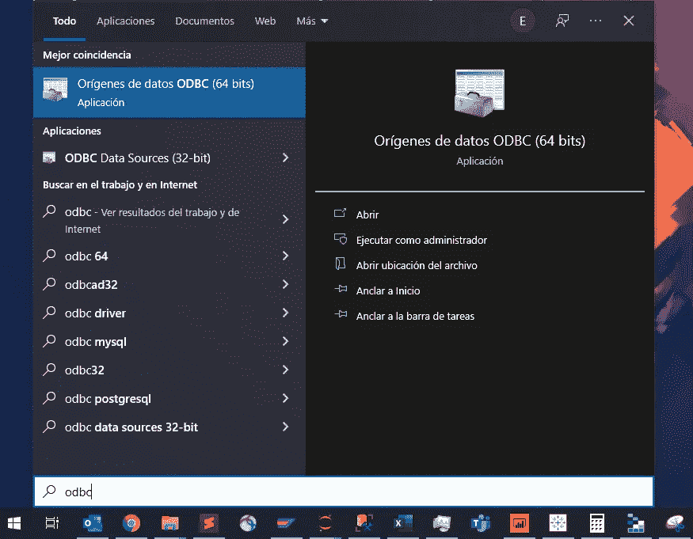

然后，我们将创建一个 SQL Server 连接。

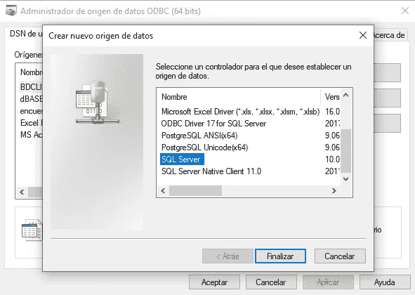

我们按照步骤建立连接。使用以下图片作为指南。

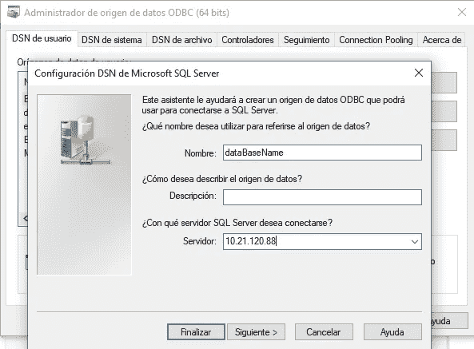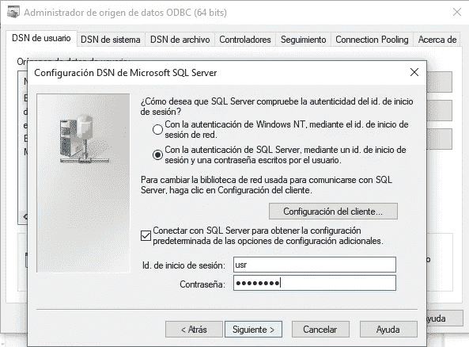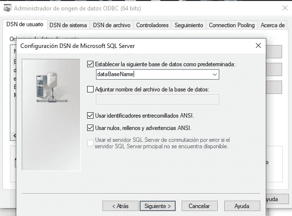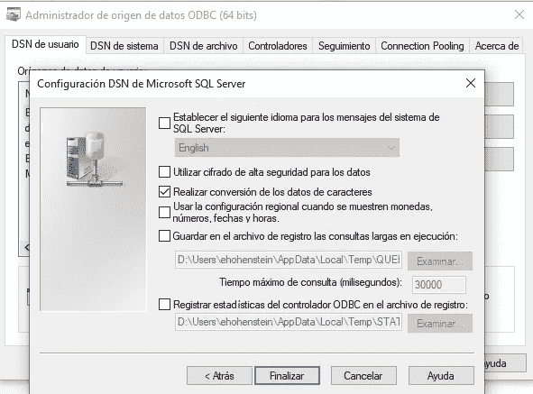

我们建立了 ODBC 连接，我们可以回到 Python 代码，用下面的代码从 SQL 表中读取数据。

```
import pyodbc
server = "10.21.120.88"
database = "dataBaseName"
username = "usr"
password = "password"
#Create connection
cnxn = pyodbc.connect("DRIVER={SQL Server}; SERVER="+server+";DATABASE="+database+";UID="+username+";PWD="+password)
cursor = cnxn.cursor()
#Read with SQL query
df = pd.read_sql("select * from myDataBase",cnxn)
```

如您所见，从 SQL Server 数据库读入数据帧非常简单。该查询只是一个字符串，因此一个好的做法是首先在 SQL Management Studio 中测试它，然后在您的 Python 脚本中使用它。**噪音！**


# 02 数据探索

接下来要做的重要事情是互相了解…探索和熟悉数据。在这篇文章中，我们将看到一个网飞电影数据库。

**读取 CSV 并显示前 3 行**

```
df = pd.read_csv('netflix.csv')
df.head(3)
```


**列出所有列**

```
df.columns
```

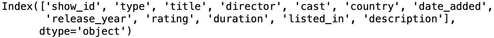

**数值计数**

我们可以使用 **value_counts()** 来浏览具有离散值的列。该函数将列出所有的**唯一值以及它们在数据集中出现的频率**。

```
df["type"].value_counts()
```

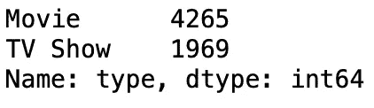

**形容**

对于包含数字数据的列，我们有一个非常简洁的函数，可以显示许多有用的统计数据。

```
df["release_year"].describe()
```

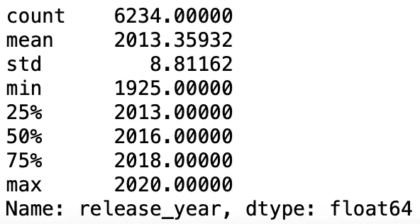

下面是一些你应该自己尝试的简洁函数: **Group by，min()，max()，mean()，sum()**

# 03 可视化数据


有时候看统计数据并不能给我们完整的画面(双关语)。人类是视觉动物，所以让我们通过一些快速的视觉来探索数据集。

**注意:**一定要安装 **matplotlib** 或者用 pip install matplotlib 安装

**直方图**

```
df["release_year"].hist(bins=10)
```

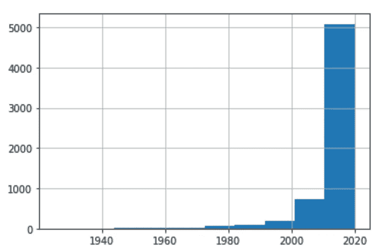

**条形图**

```
df['country'].value_counts().head(5).plot.bar(title="Movies by Country")
```


**线条图**

```
df['release_year'].value_counts().sort_values().tail(20).plot.line(title="Movies released in the last 20 years")
```

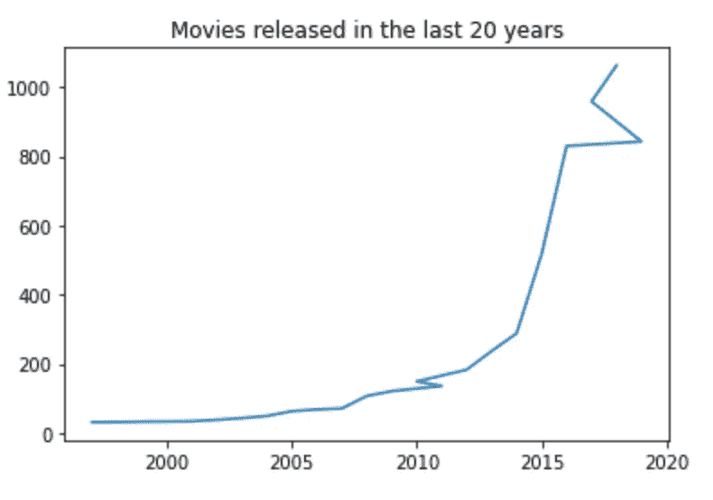

当然，有办法让这些图表变得更好看，甚至更具互动性(我正看着你**神秘地**)。但是通过这几行，我们可以更好地理解我们的数据集。

# 对数据做奇怪的事情！

**Python 和 Pandas 非常适合构建 ETL。**他们可以以多种方式帮助我们清理和转换数据。现在，由于我们几乎从不只从一个数据源读取数据，这里有一些熊猫可以帮助我们**组合不同的数据帧**的方法。当你不得不把一个 SQL 表和一个 CSV 文件混合在一起时，这些函数是很棒的，**但是**如果你的所有数据都驻留在同一个 SQL 服务器上，那就发挥所有的 SQL 大脑肌肉，写下一个热门的查询。不仅仅是为了这个节目，而是因为 SQL 引擎更快、更高效，你可以更好地使用它。这在构建 ETL 时处理大量数据时尤其重要。

**合并(Join)**

```
df = pd.merge(df1, df2, on = ‘keyColum’, how = 'inner')
```

**串联**(记住:它们必须有相同的列名和相同的顺序)

```
df  = pd.concat([df1, df2])
```

**枢轴**

```
pivot_df = pd.pivot_table(countries_df,  columns = 'Country', values = 'NewConfirmed')
```

**字符串函数**

```
# Convert column to UPPER CASE
countries_df['Country_upper'] = countries_df['Country'].str.upper()#  Convert column to lower case
countries_df['CountryCode_lower']=countries_df['CountryCode'].str.lower()# Finding length of characters in the country column
countries_df['len'] = countries_df['Country'].str.len()
```

我们可以对熊猫做的另一件非常重要的事情是过滤数据帧。

```
#filteringfilteredDf = df[df['release_year']==2020]
```

**应用功能**

这是熊猫对我们最强大的功能之一。它基本上允许您以逐行(也可以逐列)的方式“应用”一些转换、条件，甚至用户定义的函数。以下代码片段显示了**如何将用户定义的函数应用于列**。该函数我们将执行一个简单的任务，即让“title”列中的所有值都大写。

```
def upper(title):
    newTitle = str(title).upper()
    return newTitle
df['TITLE'] = df['title'].apply(lambda x: upper(x))
```

# 拿出数据来！

一旦我们对所有数据进行了清理和转换，就到了将其放置的时候了。某处。也许输出一个文件或者把它发送回我们的 SQL 服务器。这是你怎么做的。

**Excel**

```
#Make sure to install openpyxl with "pip install openpyxl"
df.to_excel('myData.xlsx',index=False, sheet_name='Sheet1')
```

**CSV**

```
df.to_csv('myData.csv',index=False)
```

**SQL Server 表**

```
import pyodbc
server = "10.21.120.88"
database = "dataBaseName"
username = "usr"
password = "password"
#Create connection
cnxn = pyodbc.connect("DRIVER={SQL Server}; SERVER="+server+";DATABASE="+database+";UID="+username+";PWD="+password)
cursor = cnxn.cursor()
df.to_sql('myData', cnxn, if_exists='replace', index = False)
```

# 06 最后的想法

熊猫是一件神奇的工具。作为一名即将成为(或有经验的)数据科学家，探索图书馆的所有可能性是非常有益的。熊猫的力量甚至被为 Python 制作的数百个库进一步放大。因此，在熊猫的帮助下，你可以做各种疯狂的事情。不要忘记提到: **Python 是平台独立的！**。我们可以**在几乎任何地方运行我们的 ETLs 脚本:**在 SSIS、Alteryx、Azure、AWS 上，在 Power BI 内部，甚至作为一个独立的应用程序，通过将我们的 Python 代码转换成可执行文件！

可能性是无限的。

# 07 代码

所有的代码和文件都可以在这里找到:[https://github.com/erichho/01-Intro-to-Pandas](https://github.com/erichho/01-Intro-to-Pandas)

# 分级编码

感谢您成为我们社区的一员！升级正在改变教师招聘。 [**在最好的公司**找到你的完美工作](https://jobs.levelup.dev/talent) **，而不仅仅是你的*下一份工作*。如果你是开发人员，请点击“申请加入”,如果你是公司，请点击“开始招聘”。**

[](https://jobs.levelup.dev/talent) [## 提升——改变招聘流程

### 🔥让软件工程师找到他们热爱的完美角色🧠寻找人才是最痛苦的部分…

作业. levelup.dev](https://jobs.levelup.dev/talent)