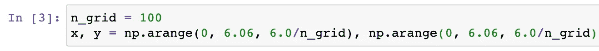

# Python 包简介:Numpy 和 Matplotlib

> 原文：<https://levelup.gitconnected.com/intro-to-python-numpy-matplotlib-233207a544db>

## 通过用 Python 构建数据可视化应用程序来学习 Numpy 和 Matplotlib

在今天的博客中，我们将探讨如何构建一个 Python 应用程序来创建和可视化数据集。我们将介绍如何安装包，生成`x`和`y`值，并绘制一个三维函数。我们将用图形显示 x 和 y 的正弦值。

## 安装和导入软件包

在下面的第一个单元格中，我们安装了来自 pandas 的包来存储和组织数据，我们还安装了 matplotlib 作为可视化库。

在第二个单元中，我们导入模块来访问这些包中开发的功能。我们从 matplotlib 导入特定的函数，这将允许我们可视化我们的数据。

## 生成数据

在下面的第三个单元格中，我们将`n_grid`定义为 100，并在第二行使用这个变量。我们用 numpy 的`arrange`函数定义`x`和`y`，在数据中创建步骤。该函数的参数为`start`、`stop`和`step`。

## 绘制数据

第四块从创建一个 plot 对象开始，并定义要创建的图形类型。`plot_surface`函数要求`x`、`y`和`z`变量为二维数组。我们使用`meshgrid`来制作`x`和`y`二维数组，并使用`x`和`y`的`sin`作为二维数组来创建`z`变量。我们利用`set_zlim`来设置`z`变量的上下参数，并调用`plt.show()`来显示图形。

我们现在有了一个在三维模型上显示 x 和 y 的正弦值的图形！要了解更多关于 Python 的知识并开始用这种语言编程，请访问[此链接](https://www.python.org/downloads/)。