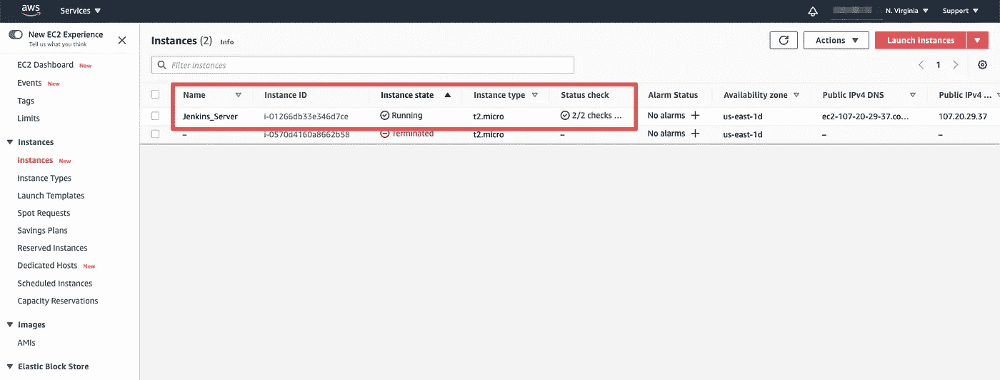
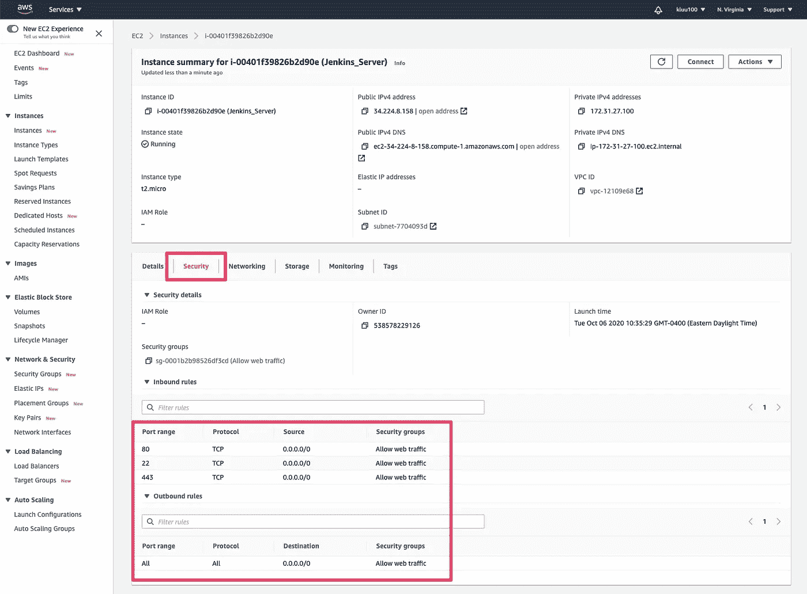
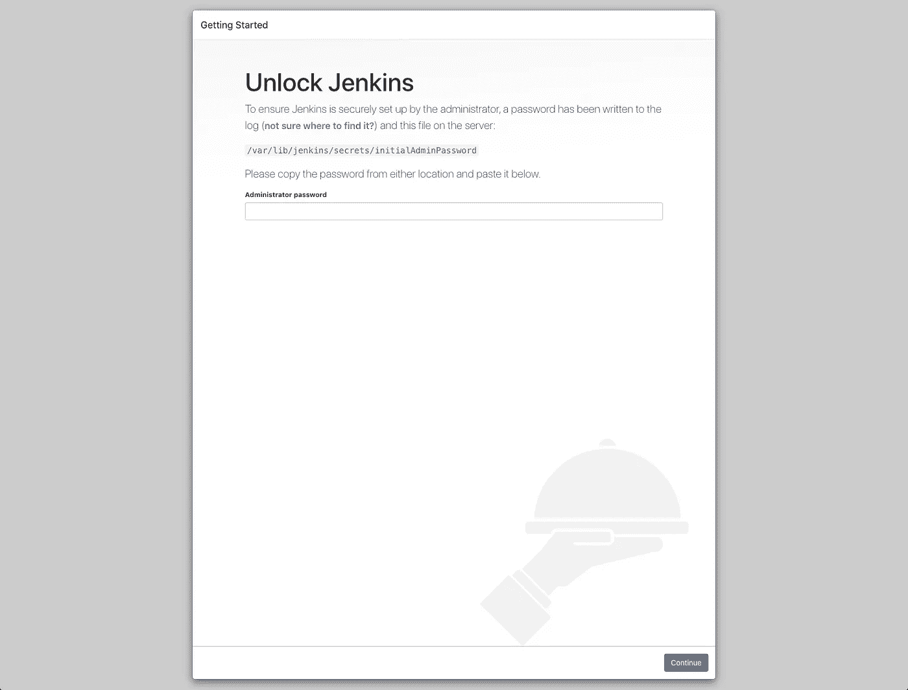

# Terraform 简介:供应 EC2 实例并安装 Jenkins

> 原文：<https://levelup.gitconnected.com/intro-to-terraform-provision-ec2-instance-and-install-jenkins-3ccb7e2d60f6>

如何轻松配置 EC2 实例并执行远程命令来安装 Jenkins


照片由[兰斯·安德森](https://unsplash.com/@lanceanderson?utm_source=medium&utm_medium=referral)在 [Unsplash](https://unsplash.com?utm_source=medium&utm_medium=referral) 上拍摄

# 介绍

Terraform 是一种工具，允许您快速构建和提供代码形式的基础设施，并与许多提供商兼容，如 AWS、Google Cloud、Digital Ocean 等。

在本文中，我将带您了解如何简单快速地利用 Terraform 在运行 Ubuntu 的 AWS 上提供 EC2 实例并安装 Jenkins。

# 先决条件

*   [安装地形](https://learn.hashicorp.com/tutorials/terraform/install-cli?in=terraform/aws-get-started)
*   一个 [AWS 帐户](https://aws.amazon.com/free/?all-free-tier.sort-by=item.additionalFields.SortRank&all-free-tier.sort-order=asc) —我们正在使用 AWS 免费层
*   您在本地配置的 [AWS 凭证](https://learn.hashicorp.com/tutorials/terraform/aws-build?in=terraform/aws-get-started)
*   安装了 AWS CLI
*   [AWS 密钥对](https://docs.aws.amazon.com/AWSEC2/latest/UserGuide/ec2-key-pairs.html#having-ec2-create-your-key-pair) —访问 EC2 实例
*   AWS 的一些基础知识

# 设置 EC2 实例

在撰写本文时，我正在运行 Terraform v0.13.4。让我们从为我们的工作目录创建一个文件夹并创建一个`main.tf`文件开始。

```
➜  ~ mkdir terraform-intro
➜  ~ cd terraform-intro
➜  terraform-into touch main.tf
```

在您最喜欢的文本编辑器中打开`main.tf`,然后粘贴以下内容。

provider 块定义了使用哪个提供者，在我们的例子中是 aws。在块内部，我们定义了相关的 aws `profile`和`region`。对于本教程，我建议使用离您最近的地区。

数据块允许我们从 aws 获取特定的参数。我们想抓取最新的`aws_ami` Ubuntu 20 图片。

资源块定义了要供应的资源。我们告诉 Terraform 提供一个`aws_instance`资源。第二个参数`jenkins`仅在从 Terraform 代码的其他部分引用该资源时使用。

在这个资源块中，我们指定了`ami`、`instance_type`和`tags`。对于`ami`，我们从上面的数据块中引用 ubuntu 镜像的 id。

在`tags`块中，`Name`将会显示在 EC2 控制台中。`"Terraform" : "true"`行用于标记 terraform 提供的资源。这可以帮助我们在 AWS 中轻松地搜索和过滤资源。

接下来，让我们保存我们的`main.tf`文件并启动它。

# 应用 Terraform 文件

为了验证到目前为止一切都配置正确，让我们尝试启动我们的 EC2 实例。打开终端，导航到`main.tf`文件所在的目录。

首先，我们需要运行`terraform init`来初始化 terraform 项目。Terraform 将下载并安装配置中使用的提供程序。

```
➜  terraform-into terraform initInitializing the backend...Initializing provider plugins...
- Finding latest version of hashicorp/aws...
- Installing hashicorp/aws v3.9.0...
- Installed hashicorp/aws v3.9.0 (signed by HashiCorp)The following providers do not have any version constraints in configuration,
so the latest version was installed.To prevent automatic upgrades to new major versions that may contain breaking
changes, we recommend adding version constraints in a required_providers block
in your configuration, with the constraint strings suggested below.* hashicorp/aws: version = "~> 3.9.0"Terraform has been successfully initialized!You may now begin working with Terraform. Try running "terraform plan" to see
any changes that are required for your infrastructure. All Terraform commands
should now work.If you ever set or change modules or backend configuration for Terraform,
rerun this command to reinitialize your working directory. If you forget, other
commands will detect it and remind you to do so if necessary.
```

接下来，运行`terraform validate`来验证我们的配置。如果配置有效，Terraform 将返回一条成功消息。

```
➜  terraform-into terraform validate
Success! The configuration is valid.
```

现在，我们可以应用我们的`main.tf`配置，通过运行`terraform apply`并在提示执行操作时输入`yes`来创建我们的 EC2 实例。

```
➜  terraform-into terraform applyAn execution plan has been generated and is shown below.
Resource actions are indicated with the following symbols:
  + createTerraform will perform the following actions:# aws_instance.jenkins will be created
  + resource "aws_instance" "jenkins" {
      + ami                          = "ami-0c43b23f011ba5061"
      + arn                          = (known after apply)
      + associate_public_ip_address  = (known after apply)
      + availability_zone            = (known after apply)
      + cpu_core_count               = (known after apply)
      + cpu_threads_per_core         = (known after apply)
      + get_password_data            = false
      + host_id                      = (known after apply)
      + id                           = (known after apply)
      + instance_state               = (known after apply)
      + instance_type                = "t2.micro"
      + ipv6_address_count           = (known after apply)
      + ipv6_addresses               = (known after apply)## ... Output truncatedPlan: 1 to add, 0 to change, 0 to destroy.Do you want to perform these actions?
  Terraform will perform the actions described above.
  Only 'yes' will be accepted to approve.Enter a value: yesaws_instance.jenkins: Creating...
aws_instance.jenkins: Still creating... [10s elapsed]
aws_instance.jenkins: Still creating... [20s elapsed]
aws_instance.jenkins: Still creating... [30s elapsed]
aws_instance.jenkins: Creation complete after 33s [id=i-01266db33e346d7ce]Apply complete! Resources: 1 added, 0 changed, 0 destroyed.
```

通过查看 EC2 控制台，验证新的 EC2 实例是否已经启动。注意`Name`值是我们在`aws_instance`资源块的`tags`块中指定的。



现在让我们通过在终端中运行`terraform destroy`来删除 EC2 实例。这将删除我们在执行 terraform apply 命令时所做的一切。

```
➜  terraform-into terraform destroy
data.aws_ami.ubuntu: Refreshing state... [id=ami-0c43b23f011ba5061]
aws_instance.jenkins: Refreshing state... [id=i-01266db33e346d7ce]An execution plan has been generated and is shown below.
Resource actions are indicated with the following symbols:
  - destroyTerraform will perform the following actions:# aws_instance.jenkins will be destroyed
  - resource "aws_instance" "jenkins" {
      - ami                          = "ami-0c43b23f011ba5061" -> null
      - arn                          = "arn:aws:ec2:us-east-1:538578229126:instance/i-01266db33e346d7ce" -> null
      - associate_public_ip_address  = true -> null
      - availability_zone            = "us-east-1d" -> null
      - cpu_core_count               = 1 -> null
      - cpu_threads_per_core         = 1 -> null
      - disable_api_termination      = false -> null
      - ebs_optimized                = false -> null
      - get_password_data            = false -> null
      - hibernation                  = false -> null
      - id                           = "i-01266db33e346d7ce" -> null
      - instance_state               = "running" -> null
      - instance_type                = "t2.micro" -> null## ... Output truncatedPlan: 0 to add, 0 to change, 1 to destroy.Do you really want to destroy all resources?
  Terraform will destroy all your managed infrastructure, as shown above.
  There is no undo. Only 'yes' will be accepted to confirm.Enter a value: yesaws_instance.jenkins: Destroying... [id=i-01266db33e346d7ce]
aws_instance.jenkins: Still destroying... [id=i-01266db33e346d7ce, 10s elapsed]
aws_instance.jenkins: Still destroying... [id=i-01266db33e346d7ce, 20s elapsed]
aws_instance.jenkins: Still destroying... [id=i-01266db33e346d7ce, 30s elapsed]
aws_instance.jenkins: Destruction complete after 30sDestroy complete! Resources: 1 destroyed.
```

# 配置安全组

在本节中，我们将配置安全组，使我们的 EC2 实例可以公开访问。

添加“aws_security_group”资源

这里，我们定义了一个`aws_security_group`资源块。提醒一下，`prod_web`是资源块的第二个参数，仅在 terraform 内部引用时使用。

在资源块中，我们定义了`name`和`description`。在第 15 行，我们使用了一个动态块，这样我们可以遍历一个端口号列表来允许进入。端口列表(80，443)可以在第 6 行找到，`ingressrules`变量。接下来，我们配置出口规则以允许所有流量。

现在我们需要将安全组附加到 aws_instance，如上面第 47 行所示。我们还需要[为实例创建/添加一个密钥对](https://docs.aws.amazon.com/AWSEC2/latest/UserGuide/ec2-key-pairs.html#having-ec2-create-your-key-pair)，这样我们就可以通过 SSH 访问服务器，见第 48 行。

让我们运行`terraform apply`来应用我们的新配置。如果一切都配置正确，您应该在 AWS 控制台内的 EC2 实例上看到附加的安全组。



让我们验证我们可以通过公共 DNS 名称通过 SSH 连接到 EC2 实例。公共 DNS 名称地址可以在网络选项卡上找到。用户名默认为“ubuntu”。

```
➜  ~ ssh -i kluu.pem [ubuntu@ec2-54-226-53-233.compute-1.amazonaws.com](mailto:ubuntu@ec2-54-226-53-233.compute-1.amazonaws.com)
Welcome to Ubuntu 20.04.1 LTS (GNU/Linux 5.4.0-1025-aws x86_64)## ... Output truncatedTo run a command as administrator (user "root"), use "sudo <command>".
See "man sudo_root" for details.ubuntu@ip-172-31-23-99:~$
```

# 执行远程命令

现在，我们要安装 Java，Jenkins，并在服务器上配置从端口 80 到 8080 的端口转发，这样我们就可以公开访问 Jenkins。我们可以使用 provisioner 和`aws_instance`块中的`“remote-exec”`在实例被提供后执行命令。`inline`参数将按顺序逐行执行每个命令。

在`connection`块中，我们指定了连接类型、主机、用户和私有密钥的路径。这就是 Terraform 在提供实例后连接到实例并运行我们的命令的方式。

让我们再次运行`terraform apply`命令。如果一切都配置和供应正确，您应该能够通过您的 web 浏览器使用公共 DNS 名称访问 Jenkins。

配置 Jenkins 超出了本文的范围，但是如果您在设置 Jenkins 时需要帮助，有许多关于如何设置 Jenkins 的文章。



Jenkins 安装在 EC2 实例上，可以公开访问

# 摘要

Terraform 是一个强大的工具，允许我们通过代码快速创建、破坏和重建基础设施。在本文中，我们仅仅触及了 Terraform 的皮毛。我肯定会查看 Terraform 文档[以真正深入了解 Terraform 所提供的功能。](https://www.terraform.io/docs/index.html)

在本文中，我们讨论了:

*   从最新的 Ubuntu AMI 创建 EC2 实例
*   学会了如何使用标签
*   为安全组创建入口/出口规则
*   如何将安全组附加到 EC2 实例
*   学习了如何使用动态块来迭代变量列表
*   如何从 Terraform 执行远程命令