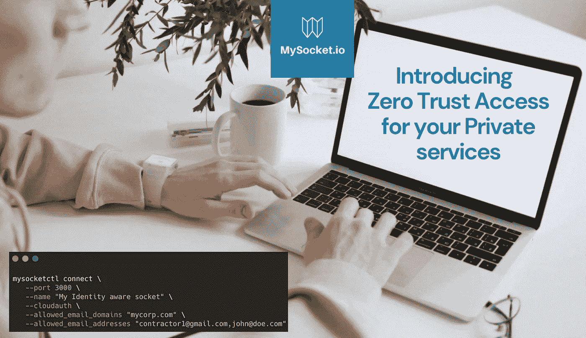
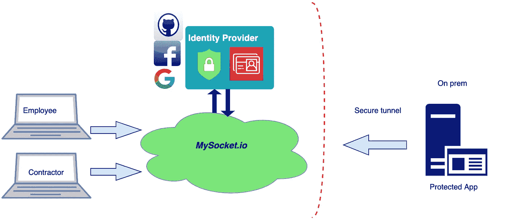
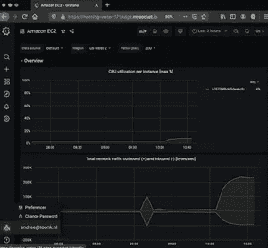

# 身份识别套接字介绍:为您的私有服务启用零信任访问

> 原文：<https://levelup.gitconnected.com/introducing-identity-aware-sockets-enabling-zero-trust-access-for-your-private-services-b8b49192f10e>



在这篇博文中，我们将介绍一个激动人心的新功能，在 Mysocket 的帮助下，你可以部署自己的超越公司设置。

# 什么是零信任

零信任背后的主要概念是，用户不应该仅仅因为他们在你的网络上就被信任。这种隐含的信任问题是我们在企业 VPN 中常见的。在大多数公司 VPN 中，一旦用户通过身份验证，用户就成为公司网络的一部分，因此可以访问公司基础设施中的许多资源。换句话说，一旦你上了 VPN，你就在城堡的围墙之内，你是可信的，并且你有很多横向访问。

世界在变，信任网络上设备的传统方式已经结束。几年前，Google 启动了名为 Beyond Corp .的零信任实施之旅，实现零信任模型的核心构件之一是身份感知应用程序代理。这些代理可以在每个应用程序的粒度上提供严格的访问控制，同时考虑用户的身份和环境，如位置和设备状态。

# 身份感知代理

到今天为止，Mysocket 代理已经支持 OpenID Connect，这样一来，您的套接字就可以识别身份了。这意味着 mysocket 用户现在可以为他们的服务启用身份验证并提供授权规则。

```
mysocketctl connect \
   --port 3000 \
   --name "My Identity aware socket" \
   --cloudauth \
   --allowed_email_domains "mycorp.com" \
   --allowed_email_addresses "[contractor1@gmail.com](mailto:contractor1@gmail.com)[,john@doe.com](mailto:,john@doe.com)"
```

上面的示例显示了我们如何使用“*cloud auth*”CLI 参数来启用身份验证。随着 *cloudauth* 的启用，用户将被要求在访问您的服务之前进行身份验证。目前，我们支持使用谷歌、脸书、Github 或本地创建的帐户进行身份验证。

身份验证流程使用 OpenID connect 与各种身份提供者(IDP)进行交互；因此，我们可以在将来轻松添加更多的身份提供者。我们也在考虑将 SAML 作为第二个认证流程。如果您需要更多的 IDP 或 SAML，请告诉我们，我们将与您合作。

# 授权规则

除了身份服务提供者(IDP)提供的内容之外，mysocket 还提供了两个授权规则。 *— allowed_email_domain* 允许用户指定逗号分隔的电子邮件域列表。如果您的用户使用他们的*mycorp.com*电子邮件地址进行身份验证，那么通过将该域添加为*允许的 _ 电子邮件 _ 域*，将确保只有拥有该域的用户将被授予访问权限。

由于支持多个身份提供商，因此很容易将访问权限扩展到承包商或其他第三方用户。为了提供对不属于您的 mycorp.com 域的外部承包商的访问，我们可以使用 *allowed_email_addresses* 参数来添加个人身份。这很好，因为现在您可以为这些承包商提供访问权限，而无需为他们创建公司帐户。

这只是两条授权规则；我们计划在不久的将来添加更多类型的规则。想到的其他授权规则有，基于地理的规则(只允许来自某些国家或地区的访问)或一天中的时间类型规则。如果您需要这些类型的规则或对其他授权规则有建议，请告诉我们！

# VPN 替换

mysocket 的一个独特特性是，源服务器发起到 Mysocket edge 的连接。这意味着源服务器可以位于只允许出站连接的高度安全的网络上。这意味着起源可以在严格的防火墙规则之后或者甚至在 NAT 之后被托管，例如私有的 AWS VPC。这样，您的源服务器保持私有和隐藏。

通过在 Mysocket 中添加身份验证和授权，我们现在可以在非常精细的基础上提供对您的私人服务的访问。结合安全出站隧道属性和身份识别套接字，我们现在可以考虑提供 VPN 的替代方案，同时提供对私有或公司资源的更细粒度的访问。



# 示例使用案例

想象一个场景，您与一个需要访问一个特定私有应用程序的承包商合作，比如一个内部 wiki、票证系统或您公司网络中的 git 服务器。对于传统的 VPN 设置，这意味着我们需要向承包商提供一个 VPN 帐户。通常，这意味着承包商现在是公司网络的一部分，拥有公司用户帐户，现在可以访问的不仅仅是所需的应用程序。

> *相反，我们真正想要的是* **仅** *提供对一个应用程序的访问，并在谁有权访问方面非常细化。随着身份识别套接字的加入，这现在成为可能。*

# 演示时间！

好了，让我们试一试，演示时间！在本演示中，我们正在制作一个 Grafana 实例，它位于私有网络上，位于两层 NAT 之后，可供我们的员工和承包商使用。

我们将从使用“mysocket connect”命令设置套接字和隧道开始。

这对于演示来说非常有用；对于更永久的设置，建议使用“我的套接字创建”和“我的套接字隧道创建”，以便您的服务有一个永久的 DNS 名称。

```
mysocketctl connect \
   --port 3000 \
   --name "My Identity aware socket" \
   --cloudauth \
   --allowed_email_domains "mycorp.com" \
   --allowed_email_addresses "[andree@toonk.io](mailto:contractor1@gmail.com)[,john@doe.com](mailto:,john@doe.com)"
```

这样，我们在 mysocket.io 基础设施上创建了一个套接字，启用了身份验证，并提供了一个授权规则列表。同一命令还创建了到最近的 mysocket.io 隧道服务器的安全隧道，我们将本地主机上的端口 3000 转发到新创建的套接字。

接下来，我们推出一个 Grafana 容器。出于好玩，我将传递我的 AWS cloudwatch 凭据，这样我就可以为我的 AWS 资源创建一些仪表板。我已经为代理认证配置了 grafana。这意味着它将信任 mysocket.io 来进行身份验证和授权。Grafana 将使用 mysocket 添加的 HTTP 头来确定用户信息。

```
[auth.proxy]
enabled = true
header_name = X-Auth-Email
header_property = username
auto_sign_up = true
headers = Email:X-Auth-Email
```

我使用的完整示例 grafana.ini 配置文件可以在这里找到。现在我们准备推出 Grafana。我用 Docker 在我的笔记本电脑上做这件事。

```
docker run -i -v grafana.ini:/etc/grafana/grafana.ini \
 -e “GF_AWS_PROFILES=default” \
 -e “GF_AWS_default_ACCESS_KEY_ID=$ACCESS_KEY_ID” \
 -e “GF_AWS_default_SECRET_ACCESS_KEY=$SECRET_ACCESS_KEY” \
 -e “GF_AWS_default_REGION=us-east-1” \
 -p 3000:3000 grafana/grafana
```



Grafana 现在监听本地主机端口 3000。我们之前创建的 mysocket 连接将经过身份验证和授权的流量中继到该本地套接字。有了这个，我们现在应该能够测试并查看我们是否可以访问 Grafana。

# 包扎

在本文中，我们介绍了身份识别套接字。我们看到了 Mysocket 用户如何轻松地为他们基于 HTTP(S)的套接字启用身份验证，以及 OpenID connect 如何用于到 Google、脸书或 Github 的身份验证流(目前)。然后，我们看了如何通过匹配电子邮件域甚至电子邮件地址列表来添加授权规则。

有了它，现在可以轻松地从任何设备、任何时间、任何地点访问内部应用，而无需 VPN。