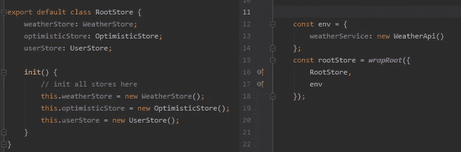
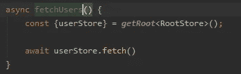
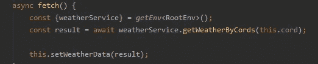
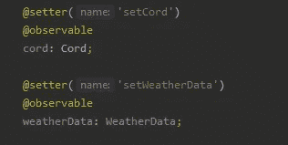
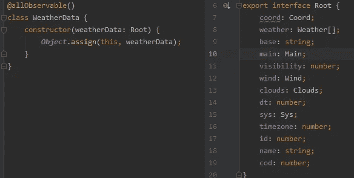
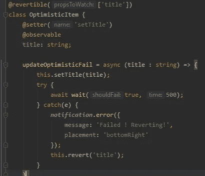
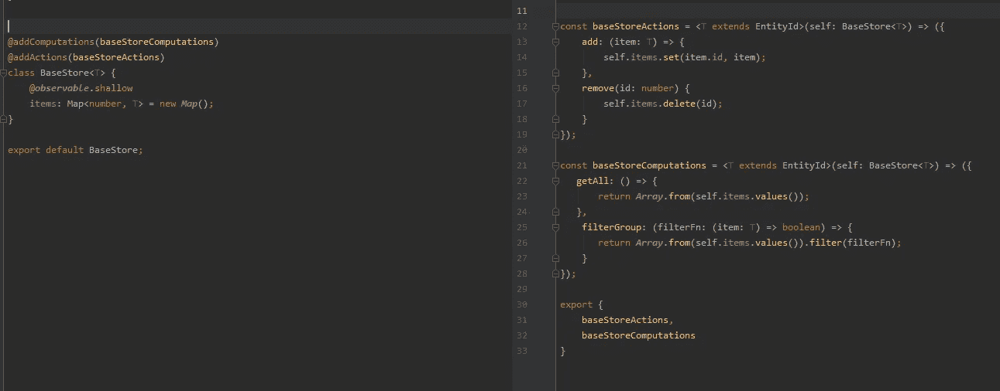

# 简单介绍 MobX

> 原文：<https://levelup.gitconnected.com/introducing-mobx-easy-cd281ace9e6e>

我很高兴向您介绍一个新的库，它位于 [**MobX**](http://github.com/mobxjs/mobx) 之上，它将使您的 MobX 生活更加轻松！ [**mobx-easy**](http://mobx-easy.georgy-glezer.com/docs/getting-started/)

在使用 MobX 一段时间后，您开始看到一些开箱即用所没有的常见模式和能力。我已经给了[mobx-**state**-tree](https://github.com/mobxjs/mobx-state-tree)一个尝试，但是对我来说，它好像去掉了 MobX 的简单性，所以我决定尽量保持简单，同时增加一些额外的功能。

让我们深入了解这些功能，并对每个功能进行更详细的解释:

*   [wrapRoot](http://mobx-easy.georgy-glezer.com/docs/getting-started/)
*   [removeRoot](http://mobx-easy.georgy-glezer.com/docs/remove-root/)
*   [getRoot](http://mobx-easy.georgy-glezer.com/docs/getting-root/)
*   [getEnv](http://mobx-easy.georgy-glezer.com/docs/getting-environment/)
*   [设定器](http://mobx-easy.georgy-glezer.com/docs/setter/)
*   [允许观察的](http://mobx-easy.georgy-glezer.com/docs/all-observable/)
*   [可逆](http://mobx-easy.georgy-glezer.com/docs/revertible/)
*   [加法计算](http://mobx-easy.georgy-glezer.com/docs/add-computations/)
*   [添加操作](http://mobx-easy.georgy-glezer.com/docs/add-actions/)

# wrapRoot + removeRoot

因此，为了在我们使用的项目中共享根和环境，我们首先需要从接收到以下内容的`wrapRoot`开始:

*   `RootStore`属性，可以是一个类或一个对象，上面有一个 **init** 函数(这很重要，这样我们可以初始化库中的根，以便稍后正确地传递它)。
*   `env`一个对象，可以是你需要在项目中共享的任何东西。
*   `wrapperName`是可选的，仅当您希望使用多个根时才需要。

通常，它应该用在最初的项目设置上，然后传递给应用程序。

此外，如果您需要在应用程序关闭时卸载组件，您需要使用`removeRoot`来删除根。它可以全局删除，也可以按根名称删除。

RootStore + wrapRoot 示例

# getRoot

在我们之前在项目中使用了`wrapRoot`之后，现在我们可以在任何我们想要的地方使用`getRoot`了！(在项目中)

`getRoot`为您提供了`RootStore`，即之前您将它提供给`wrapRoot`后创建的实例，现在简单地说，您可以调用这个函数并获取它，而不是将`rooStore`传递给每个构造函数，并可能将它保存在每个类/对象中。

调用 getRoot

# getEnv

与`getRoot`一样，`getEnv`为您提供了简单的依赖注入和一种在整个项目中共享服务/数据/任何您想要的东西的方法。

调用 getEnv

# 作曲者

顾名思义，`@setter`允许你通过传递名字和缺省值来设置一个快速设置函数。

当你有很多可观察的对象，并且每个对象都需要一个`@action`函数来表示你使用的每一秒`@observable`时，可以节省很多时间。

@setter 用法

# allObservable

这有助于你避免为每个你想添加的属性写新的参数，对于 mobx 类中使用的大类型非常有用，只需调用`@allObservable()`，你可以传递一个属性数组来排除。

想象一下，必须为每一个写下“可观察的”

# 应归还的

这个可以让我们很容易地实现乐观的 UI 更新，想象一下，你有一些你想马上更新的东西，而不需要等待服务器的响应，但是你突然收到错误，需要恢复到以前的状态…用`@revertible`你只需要调用你添加的`@revertible`类上的`revert`函数，并传递你想恢复的属性名，或者直接调用它，它会恢复所有的属性。

使用@revertible

# 加法计算+加法操作

最后两个更复杂，可以帮助实现类似功能(如商店和模型)之间的可重用性，并可以帮助在项目之间共享该功能，基本上，它只是提供了一种方法来重用具有组合的几个类之间的操作和计算。

好了，现在就这样`mobx-easy`，直到我们在库中找到更多可以添加或改进的东西:)

我已经创建了一个示例项目，展示了上述所有功能:

活生生的例子:[https://mobx-easy-examples.georgy-glezer.com/](https://mobx-easy-examples.georgy-glezer.com/)

回购示例:

 [## stolenng/mobx-简单-示例

### mobx 的例子-简单，完整的文档在这里:http://mobx-easy.georgy-glezer.com/这个项目是自举…

github.com](https://github.com/stolenng/mobx-easy-examples) 

mobx-简易回购:

 [## stolenng/mobx-easy

### MobX 变得更简单。在 GitHub 上创建一个帐户，为 stolenng/mobx-easy 开发做贡献。

github.com](https://github.com/stolenng/mobx-easy) 

对于任何问题，关于如何改进或添加内容的想法，请随时联系我:)

***9/20 更新***

我发布了一个关于 MobX 的广泛课程，请在这里随意查看:

 [## 使用 React 深入研究 MobX(Hooks+TypeScript)

### 高级软件开发人员-服务于以色列空军作为一个软件开发人员 3 年-工作作为一个…

www.udemy.com](https://www.udemy.com/course/mobx-in-depth-with-react/?referralCode=B7FD24C7EB1A51684160)