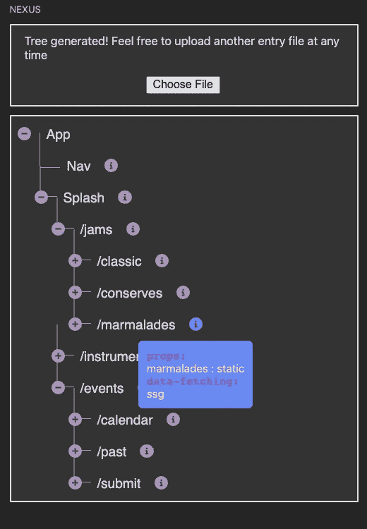

# Nexus 简介——next . js 的组件树可视化工具

> 原文：<https://levelup.gitconnected.com/introducing-nexus-a-component-tree-visualizer-for-next-js-1109f31e118e>

# 介绍

没多久我们就爱上了来自 [Vercel](https://vercel.com/) 的 [Next.js](https://nextjs.org/) 框架。

从其直观的基于目录的路由架构，到其与服务器端呈现功能挂钩的本机数据获取功能，再到其快速刷新功能(无需构建工具进行实时重新加载)，Next.js 创建了一个真正集成且功能强大的开箱即用的全栈开发人员体验。

由于我们主要在 React 的前端工作，选择 Next.js 是轻而易举的，因为它本质上是库的包装器。

在 [Vercel](https://vercel.com/) 的团队已经做出了一个杰出的框架。(他们还开发了许多其他伟大的技术和尖端产品，所以如果你还没有，一定要去看看。)

# 问题

在寻找专门针对 Next.js 开发人员的工具时，我们在寻找一个第三方 VSCode 扩展，该扩展围绕 Next.js 的独特功能构建，同时在功能上仍然尊重它是基于 React 库构建的这一事实。本质上，我们在寻找一个组件树可视化工具，它应该是 React 开发人员所熟悉的，但其结构类似于 Next.js 应用程序，同时给出有关数据获取的粒度信息。

Next.js 最大的优势之一是服务器端渲染能力；与“普通”的 React 应用相比，这一特性让开发人员能够更好地控制如何优化性能。然而，我们发现，如果没有对父/子层次结构中每个组件的呈现行为的高级理解，利用服务器端呈现的真正优化能力对实现和调试都是一个挑战。本质上，我们需要一个高层次的组件视图来查看属性是通过静态站点生成、服务器端渲染还是两者都不通过。

由于我们找不到像这样专门为 Next.js 设计的工具，[我们决定把它做成](https://nexus-js.com/)。

# 认识 Nexus…

…为 Next.js 开发设计的灵活、轻量级 VSCode 扩展。

使用 Nexus，您可以查看以树状结构表示的 Next.js 代码库，所有嵌套组件的相关数据获取信息就在您的指尖。此外，作为一个 VSCode 扩展，您可以在 ide 的侧边栏中快速识别服务器端呈现机会或瓶颈，从而提供流畅的调试体验。

## **如何使用**

一旦您从 VSCode marketplace 安装了扩展并打开了它，只需上传入口点脚本，您的前端组件树就会显示在侧栏中。

加载组件树后，通过单击展开图标展开任何组件以查看其子组件。您将知道组件是一个叶子，因为它没有展开图标。

将鼠标悬停在组件的信息图标上可以查看相应的属性和数据获取方法。

## 主要特征

*   快速组件树生成
*   基于 Next.js 代码库中页面目录架构的逻辑组件树层次结构
*   可在每个组件级别查看的属性和数据获取方法列表
*   悬停时以模式显示粒度信息，以获得简洁的用户界面
*   能够接受来自 Windows、WSL 环境或 MacOS 的条目文件

**此外**我们的扩展能够解析**next . js 代码库或“普通”React 代码库**——由你上传的文件决定——并显示相应的组件树。*打开扩展时的指令会根据代码库将你引导到合适的入口点文件。*

## 网络连接 2.0

Nexus 目前处于第一版，我们有很多想法可以让它变得更好。这里列出了我们打算在下一个版本中实现的一些特性。

*   查看为动态路由构建的模板组件
*   悬停模式中的附加静态路径信息，用于查看组件是否正在呈现动态组件
*   属性依赖于 API 调用的组件的数据依赖关系信息
*   单击树中的一个组件，打开一个 webview，其中包含有关该组件及其依赖项的数据的更多详细信息
*   在组件树中渲染链接组件
*   状态栏图标和交互式功能
*   检查前端的条目文件时出错

# 它是如何工作的

当用户上传文件时，React 中内置的前端使用 VSCode API 方法向 webview 发布消息，包括文件路径作为有效负载。

扩展“后端”在 Provider 中监听这个消息，这是编写 VSCode 扩展时的一个特殊类，然后创建我们的解析器类的一个新实例，用文件路径实例化它。

然后我们使用 [acorn 库](https://www.npmjs.com/package/acorn)创建一个抽象语法树，解析器递归地遍历它，通过跟踪每个组件中的导入和返回语句生成相关的节点和数据。特别是，解析器通过查找 getStaticProps 和 getServerSideProps 方法来捕获数据获取信息。

解析器将嵌套数据发送给提供者，然后提供者使用 VSCode API 方法将另一条消息发送给 webview，包括作为有效负载的解析数据。

然后，webview 前端使用解析的数据更新状态，并适当地递归呈现父组件或叶组件。

最后，当用户单击图标展开父组件的子组件时，我们用存储子组件的缓存来更新该组件的状态，从而呈现子组件。

# 捐助

如果您对该工具的潜力感到兴奋，我们欢迎您做出贡献！我们将此开发为一个开源项目，并邀请您参与其中，让 Nexus 变得更好。

只需前往我们的 [Nexus Github repo](https://github.com/oslabs-beta/Nexus) 并查看自述文件的贡献步骤部分。

## VSCode 扩展市场

你可以在 [Visual Studio 市场](https://marketplace.visualstudio.com/items?itemName=Nexus-tree.nexus-extension)亲自试用 Nexus。

## Nexus 团队

迈克·洪— [领英](https://www.linkedin.com/in/mykongee/) | [Github](https://github.com/mykongee)

Brian Chiang—[LinkedIn](https://www.linkedin.com/in/brian-chiang-849a181a7/)|[Github](https://github.com/BChiang4)

李尚义—[LinkedIn](https://www.linkedin.com/in/david-lee-39541411a/)|[Github](https://github.com/dplee123)

尼科·弗洛雷斯—[LinkedIn](https://www.linkedin.com/in/nicolasaflores/)|[Github](https://github.com/nicoflrs)

亚历克斯·赫斯勒—[LinkedIn](https://www.linkedin.com/in/alex-hersler/)|[Github](https://github.com/FoxEight)

## 网站(全球资讯网的主机站)

[https://nexus-js.com/](https://nexus-js.com/)

## 联系我们

电子邮件:[nexusjsadm@gmail.com](mailto:nexusjsadm@gmail.com)

推特: [@teamnexus_js](https://twitter.com/teamnexus_js)