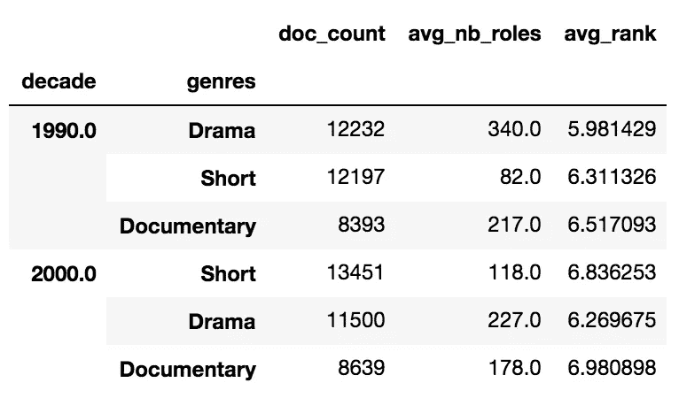

# pandagg 简介:熊猫启发的弹性搜索聚合库

> 原文：<https://levelup.gitconnected.com/introducing-pandagg-pandas-inspired-library-for-elasticsearch-aggregations-6647df33ce63>


在本文中，我将向您展示如何使用 **pandagg** 库有效地探索索引并计算 ElasticSearch 中索引数据的深度嵌套聚合。

在解释了编写这个库的动机之后(如果赶时间的话，*转至“*让我们开始吧*”一节*，我们将处理 IMDB 数据集并计算聚合，以回答需要越来越复杂的查询的问题。

它假设你有弹性搜索概念的基本知识。

> 这里涉及的所有概念在[库文档](https://pandagg.readthedocs.io/en/latest/)中有更详细的解释。github 库在这里可用[。](https://github.com/alkemics/pandagg)

# 动机

ElasticSearch 提供了一个强大的 API 来计算索引数据的聚合指标:聚合。其中一个致命的特性是能够嵌套聚合子句，桶聚合中提供了参数`aggs`。

```
{
    "per_genre": {
        "terms": {"field": "genres","size": 3},
        "aggs": {
            "rating_average": {"avg": {"field": "rank"}},
            "nb_roles_average": {"avg": {"field": "nb_roles"}
            }
        }
    }
}
```

但是如果您已经尝试过计算嵌套很深的查询，那么您可能很难解析查询的输出。

## 聚合异构结果格式

一个原因是聚合具有不同的结果格式。例如，让我们比较一下筛选器和术语聚合:

此`filters`聚合:

```
{"decade": {"filters": {"filters": {
  "1990-2000": {"range": {"year": {"lte": 2000,"gte": 1990}}},
  "1980-1990": {"range": {"year": {"lte": 1990,"gte": 1980}}}}}
  }}
```

…以映射“键”->“桶”的方式提供桶:

```
{
  "decade": {"buckets": {
      "1980-1990": {"doc_count": 56623},
      "1990-2000": {"doc_count": 91138}
  }}
}
```

而这个`terms`聚合:

```
{"genres": {"terms": {"field": "genres", "size": 3}}}
```

…以字典数组的形式提供存储桶，每个存储桶都包含自己的关键字:

```
{
  "genres": {
    "doc_count_error_upper_bound": 0,
    "sum_other_doc_count": 184804,
    "buckets": [
      {"key": "Short", "doc_count": 81013},
      {"key": "Drama", "doc_count": 72877},
      {"key": "Comedy", "doc_count": 56425}
    ]
  }
}
```

为了启用通用格式， **pandagg** 将为所有聚合响应使用一个公共接口:它将在内部考虑每个响应桶由以下各项组成:

*   a `level`:聚合的名称
*   一个`key`:那个桶的钥匙
*   一个或多个`values`:例如`doc_count`用于大多数桶聚合，或者`value`用于大多数度量聚合。这些值是返回感兴趣的值的 json 键。

以上面的例子为例，`decades`过滤器聚合返回两个桶:

```
{"level": "decade", "key": "1980-1990", "value": 56623}
{"level": "decade", "key": "1990-2000", "value": 91138}
```

…以及`genres`字段三上的术语聚合:

```
{"level": "genres", "key": "Short", "value": 81013}
{"level": "genres", "key": "Drama", "value": 72877}
{"level": "genres", "key": "Comedy", "value": 56425}
```

## 树形与表格形状

另一个原因是，许多用例需要表格格式的数据，而 ElasticSearch aggregations 响应具有树形结构。

```
{
    "per_genre": {
        "terms": {"field": "genres","size": 3},
        "aggs": {
            "rating_average": {"avg": {"field": "rank"}},
            "nb_roles_average": {"avg": {"field": "nb_roles"}
            }
        }
    }
}
```

会导致:

```
{
  "per_genre": {
    "doc_count_error_upper_bound": 0,
    "sum_other_doc_count": 241229,
    "buckets": [
      {
        "key": "Short",
        "doc_count": 81013,
        "rating_average": {
          "value": 6.39
        },
        "nb_roles_average": {
          "value": 2.63
        }
      },
      {
        "key": "Drama",
        "doc_count": 72877,
        "rating_average": {
          "value": 6.13
        },
        "nb_roles_average": {
          "value": 14.93
        }
      }
    ]
  }
}
```

这可以表示为:

```
_
├── **per_genre**=Drama                                    72877
│   ├── nb_roles_average                               14.93
│   └── rating_average                                  6.13
└── **per_genre**=Short                                    81013
    ├── nb_roles_average                                2.63
    └── rating_average                                  6.39
```

而表格格式在许多情况下更合适。它可以表示为:

```
 **doc_count  nb_roles_average  rating_average**
**per_genre**                                             
Short          81013              2.63            6.39
Drama          72877             14.93            6.13
```

这样做需要确定一个级别，在以下两者之间划一条线:

*   分组级别:那些将被用来识别行的级别(这里是`genres`，但是正如我们将在后面看到的，可以使用多个级别)
*   列级别:将用于填充列和单元格的级别(这里是`nb_roles_average`和`rating_average`)

表格格式特别适合具有`T`形状的聚合，例如:

```
group_level_1 -> group_level_2 -> column_level_A
                              ├─> column_level_B
                              └─> column_level_C
```

…可以分为:

```
 **lvl_A         lvl_B        lvl_C**
**lvl_1**    **lvl_2**                                             
key_1    key_11        xxx           xxx          xxx
key_2    key_21        xxx           xxx          xxx
key_2    key_22        xxx           xxx          xxx
```

因此，编写 **pandagg** 的最初目标是消除解析聚合响应的障碍，并能够轻松地将其转换为合适的格式。这就是本文将要展示的内容。

它提供了其他有用的功能，这些功能将在后面介绍。

# 我们走吧

在本文的其余部分，我们将处理从 IMDB 中提取的样本数据，这些数据在我用 Elastic Cloud 设置的 AWS 托管集群中进行索引，以便您在本教程中使用它们，这些数据可以在 [**这个地址**](https://beba020ee88d49488d8f30c163472151.eu-west-2.aws.cloud.es.io:9243/) 获得，用户`pandagg`，密码`pandagg`具有读取权限。

对于这个演示，我鼓励您在`ipython`中启动脚本进行交互使用，并安装`pandagg`和`pandas` (pandas 是一个软依赖)。在您的虚拟环境中:

```
pip install ipython pandagg pandas
```

在这一部分中，我们将了解如何:构建和执行聚合，将它们的响应解析为表格格式(在本例中，解析为 pandas [dataframes](https://pandas.pydata.org/pandas-docs/stable/reference/api/pandas.DataFrame.html) 以获得更好的可读性)和交互式树。

让我们来看看最具代表性的电影类型有哪些:

```
from pandagg.search import Search
from elasticsearch import Elasticsearchclient = Elasticsearch(hosts=['[https://beba020ee88d49488d8f30c163472151.eu-west-2.aws.cloud.es.io:9243/'](https://beba020ee88d49488d8f30c163472151.eu-west-2.aws.cloud.es.io:9243/')], http_auth=('pandagg', 'pandagg'))r = Search(index='movies', using=client)\
    .aggs("genres_counts", "terms", field="genres", size=4)\
    .size(0)\
    .execute()r
>>> <Response> took 1ms, success: True, total result >=10000, contains 10 hits
```

> 注意事项:
> 
> -如果不需要点击，请将大小设置为 0。
> 
> -这是声明该搜索查询的一种方式，所有可用的语法在 pandagg [文档](https://pandagg.readthedocs.io/en/latest/)中有详细说明
> 
> -我们在这里使用了官方 elasticsearch-dsl python 库中使用的语法，提供了(agg_name，agg_type，**body)参数。姑且称之为“平面语法”。

`Response`对象持有`hits`和`aggregation`属性。

聚合对象提供了几种方法来解析几种树或表格格式的响应，这些格式不需要`pandas`依赖项(`to_tabular`、`to_interactive_tree`等)。这里我们将重点关注具有更好显示的`to_dataframe`方法，因此在博客文章中看起来更好。

```
r.aggregations.to_dataframe()
```

这导致:


让我们每十年打破它，并计算其他指标:

```
r = Search(index='movies', using=client)\
    .groupby('decade', 'histogram', interval=10, field='year')\
    .groupby('genres', size=3)\
    .aggs({
        "avg_rank": {"avg": {"field": "rank"}},
        "avg_nb_roles": {"max": {"field": "nb_roles"}}
    })\
    .filter('range', year={"gte": 1990})\
    .execute()
```

> 我们在这里使用平面语法进行分组操作，并使用本地“dict”语法来声明 aggs 部分

```
r.aggregations.to_dataframe()
```



请注意，如果适合您来获得完全相同的结果，您实际上可以直接使用常规的 dict 语法:

```
r = Search(using=client, index="movies")\
  .aggs({
    "decade": {
      "histogram": {"field": "year", "interval": 10},
      "aggs": {
        "genres": {"terms": {"field": "genres", "size": 3},
        "aggs":{
          "avg_nb_roles": {"max": {"field":"nb_roles"}},
          "avg_rank": {"avg": {"field": "rank"}}}
        }
      }
    }
  })\
  .execute()
```

## 在聚合响应中导航

在其他聚合序列化方法中，我们来看看`to_interactive_tree`:

```
interactive_agg = r.aggregations.to_interactive_tree()
interactive_agg>>>
<IResponse>
root
├── decade=1990                                        79495
│   ├── genres=Documentary                              8393
│   │   ├── avg_nb_roles                               217.0
│   │   └── avg_rank                       6.517093241977517
│   ├── genres=Drama                                   12232
│   │   ├── avg_nb_roles                               340.0
│   │   └── avg_rank                       5.981429367965072
│   └── genres=Short                                   12197
│       ├── avg_nb_roles                                82.0
│       └── avg_rank                       6.311325829450123
└── decade=2000                                        57649
    ├── genres=Documentary                              8639
    │   ├── avg_nb_roles                               178.0
    │   └── avg_rank                       6.980897812811443
    ├── genres=Drama                                   11500
    │   ├── avg_nb_roles                               227.0
    │   └── avg_rank                       6.269675415719865
    └── genres=Short                                   13451
        ├── avg_nb_roles                               118.0
        └── avg_rank                        6.83625304327684
```

您可以使用自动完成功能在其中导航:

```
interactive_agg.decade_1990.genres_Drama>>>
<IResponse subpart: decade_1990.genres_Drama>
genres=Drama                                           12232
├── avg_nb_roles                                       340.0
└── avg_rank                               5.981429367965072
```

`get_bucket_filter`给你查询过滤属于给定桶的文档:

```
interactive_agg.decade_1990.genres_Drama.get_bucket_filter()>>>
{
    "bool": {
        "must": [
            {"range": {"year": {"gte": 1990.0, "lt": 2000.0}}},
            {"term": {"genres": {"value": "Drama"}}}
        ],
        "filter": [{"range": {"year": {"gte": 1990}}}]
    }
}
```

`list_documents`方法实际执行查询，列出属于 bucket 的文档:

```
interactive_agg.decade_1990.genres_Drama.list_documents(size=2, _source={"includes": ['name']})>>>
{
  "took": 13,
  "timed_out": false,
  "_shards": {"total": 1, "successful": 1, "skipped": 0, "failed": 0},
  "hits": {
    "total": {"value": 10000, "relation": "gte"},
    "max_score": 2.4539857,
    "hits": [
      {
        "_index": "movies", "_type": "_doc", 
        "_id": "706", "_score": 2.4539857, 
        "_source": {"name": "100 meter fri"}
      },
      {
        "_index": "movies", "_type": "_doc", 
        "_id": "714", "_score": 2.4539857, 
        "_source": {"name": "100 Proof"}
      }
    ]
  }
}
```

# 就这样？

不，实际上在 **pandagg** 中还有很多其他很酷的功能！这里是一个快速的概述，如果这个库引起了一些兴趣，我可能会进一步详述。

## 发现模块

发现模块允许快速浏览集群中的可用索引:

```
from elasticsearch import Elasticsearch
from pandagg.discovery import discoverclient = Elasticsearch(hosts=['[https://beba020ee88d49488d8f30c163472151.eu-west-2.aws.cloud.es.io:9243/'](https://beba020ee88d49488d8f30c163472151.eu-west-2.aws.cloud.es.io:9243/')], http_auth=('pandagg', 'pandagg'))indices = discover(client, index="mov*")# indices provides autocomplete on contained indices
indices
>>> <Indices> ['movies', 'movies_fake']movies = indices.movies
```

Indice 对象包含相关的`settings`、`mappings`和`settings`属性，以及用于构建查询的`search`方法:

```
recent_movies = movies.search().filter("range", year={"gte": 1990}).execute()
```

## 地图导航

`mapping`属性具有有趣的特性，它返回一个具有可导航自动完成功能的交互式树:

```
movies.mapping>>><Mapping>
_
├── directors                                     [Nested]
│   ├── director_id                                Keyword
│   ├── first_name                                 Text
│   │   └── raw                                  ~ Keyword
│   ├── full_name                                  Text
│   │   └── raw                                  ~ Keyword
│   ├── gender                                     Keyword
│   ├── last_name                                  Text
│   │   └── raw                                  ~ Keyword
│   └── role                                       Keyword
├── genres                                         Keyword
├── movie_id                                       Keyword
...
```

自动完成功能可用于无缝导航:

```
movies.mapping.directors.first_name>>>
<Mapping subpart: directors.first_name>
first_name                                        Text
└── raw                                         ~ Keyword
```

调用它将显示详细的字段体:

```
movies.mapping.directors.first_name()>>>
{
  "fields": {
    "raw": {
      "type": "keyword"
    }
  },
  "type": "text"
}
```

叶字段上的`a`属性列出了可以在该字段类型上计算的所有聚合，并计算它(同样使用自动完成):

```
movies.mapping.nb_roles.a.extended_stats()
```


```
movies.mapping.genres.a.terms()
```


## 其他功能包括:

*   **计算搜索操作的完整 DSL**(查询/聚合/post_filter 等)，具有灵活的语法，能够在特定位置插入查询子句，指定要在哪个指定的查询子句下/上插入新子句
*   选择加入自动嵌套功能，可在需要的地方自动将嵌套子句插入到聚合中

# 接下来呢？

未来的工作重点是:

*   文档:此处[有](https://pandagg.readthedocs.io/en/latest/)的文档，将根据更多的例子和反馈进行改进
*   交付每个主要 Elasticsearch 版本≥ 5 的版本(当前 **pandagg** 版本仅与 Elasticsearch ≥7.x.x 兼容，不与以前的版本兼容)
*   涵盖了大部分的弹性搜索操作。现在它主要关注于**读**操作，我想把它扩展到**写**操作

希望你觉得有用。欢迎并感谢每一个反馈、功能请求和对改进 **pandagg** 的帮助！

👋 🚀