# 介绍熊猫

> 原文：<https://levelup.gitconnected.com/introducing-pandas-e0581a6683c9>

## 这是让你开始进入数据科学世界的指南


在 [Unsplash](https://unsplash.com?utm_source=medium&utm_medium=referral) 上由[法扎德·纳齐菲](https://unsplash.com/@euwars?utm_source=medium&utm_medium=referral)拍摄的照片

P andas 是用 Python 写的**数据操作和分析**、
的库。这是一个开始 EDA 的完美库，
因为它允许你用
基本步骤读取、操作、聚集和绘制数据。

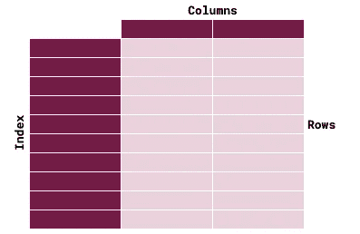

数据帧示例

## **数据帧**

简单地说，数据帧就像 SQL 中的 Excel 表或表格。它由**列**、**行、**和一个**索引**组成。当我们读取一些文件数据时，它就变成了一个数据帧。

## 熊猫为什么这么受欢迎？

1.  库的简单操作和使用。
2.  数据科学世界的入口。
3.  *在我看来，熊猫是制作 EDA 最好的库之一。❤*

## 补充库

熊猫从不孤独:

[**Seaborn**](https://seaborn.pydata.org/) ，统计数据可视化。

[**NumPy**](https://numpy.org/) ，用于数学函数的库。

[**Matplotlib**](https://matplotlib.org/) ，用于数据可视化的库。

[**Scikit-Learn**](https://scikit-learn.org/stable/index.html) ，我们用于**分类**，**聚类，**回归。

# 开始编码前

您应该设置一个 Anaconda 环境来运行这个库。我
推荐其中一种环境:

[](https://www.anaconda.com/products/individual#Downloads) [## 个人版|蟒蛇

### 🐍开源 Anaconda 个人版是世界上最受欢迎的 Python 分发平台，拥有超过 20…

www.anaconda.com](https://www.anaconda.com/products/individual#Downloads) [](https://code.visualstudio.com/docs/python/environments) [## 在 Visual Studio 代码中使用 Python 环境

### Python 中的“环境”是 Python 程序运行的上下文。一个环境由一个解释器和…

code.visualstudio.com](https://code.visualstudio.com/docs/python/environments) [](https://jupyter.org/) [## Jupyter 项目

### Jupyter 笔记本是一个基于网络的交互式计算平台。该笔记本结合了现场代码，方程式…

jupyter.org](https://jupyter.org/) 

# 安装熊猫

```
# jupyter cell
!pip install pandas# Terminal
pip install pandas
```

# 进口

```
import pandas as pd
```

# 读取数据文件

有很多选项可以读取你的数据，**正常启动 pd.read_[file]**

## [CSV](https://pandas.pydata.org/pandas-docs/stable/reference/api/pandas.read_csv.html)

```
df = pd.read_csv('file_path.csv', sep='separator character')df = pd.read_csv('sales_202005.csv', sep=';')
```

## [Excel](https://pandas.pydata.org/pandas-docs/stable/reference/api/pandas.read_excel.html)

```
df = pd.read_excel('file_path.xlsx', sheet_name='')df = pd.read_excel('sales_202005.xlsx', sheet_name='Jan')
```

# 显示数据

## [头](https://pandas.pydata.org/pandas-docs/stable/reference/api/pandas.DataFrame.head.html)

```
df.head()
```

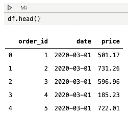

## [T](https://pandas.pydata.org/pandas-docs/stable/reference/api/pandas.DataFrame.T.html) (换位)

```
df.T
```

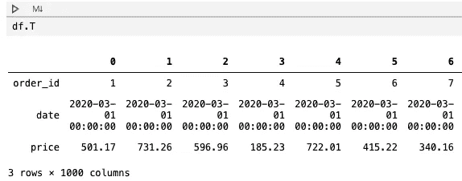

在列中显示线条

## 规模

返回行数和列数。

```
df.shape
```

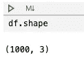

行和列

## 信息

```
df.info()
```

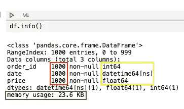

**红色**，返回行数不为空。**黄色**，数据类型栏。**绿色**，内存使用情况。

## 描述统计学

返回中心趋势测量值。

```
df.describe()
```

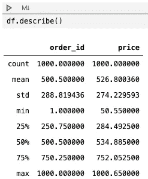

# 使用列

## 添加新列

```
df['column_name'] = value**df['month_nm'] = df['date'].dt.month_name()**
```

## 删除列

```
del df['column_name']
```

# 过滤数据帧

```
#OneCondition
df[ df['column_name' == 'XPTO' ]#MultipleCondition
df[ (condition 1) & (condition 2) ...  ]**#Exemple
df[ (df['date'] >= '2020-05-01') & (df['date'] <= '2020-05-31') ]**
```

# 透视或分组依据

## 在枢轴上转动

```
pd.pivot_table(df      #DataFrame Name
, index   = "day"      #Lines
, columns = "month_nm" #Columns
, values  = "price"    #Values
, aggfunc = "mean"     #Aggregation funtction
)
```

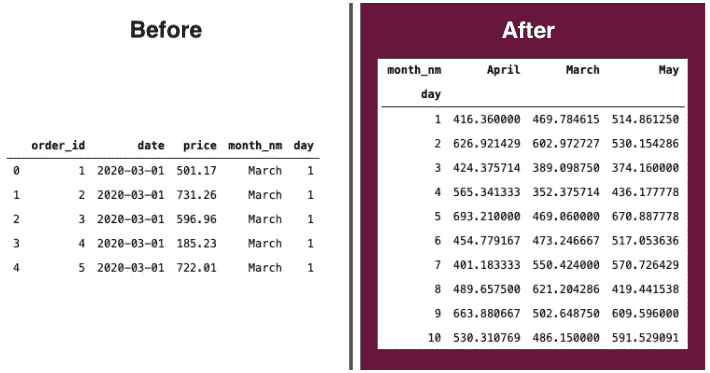

## 分组依据

```
df.groupby(['month_nm', 'day']).agg(
{  'price':   pd.Series.mean
, 'order_id': pd.Series.count
}
).reset_index()
```


# 形象化

> 我们通常在变量中添加图形来使用
> 其他属性作为标题、y 名称、x 名称、图例
> 和颜色。
> 
> [了解更多详情](https://pandas.pydata.org/pandas-docs/stable/user_guide/visualization.html)

## 箱线图

```
ax = df.boxplot(column=['price'])
```

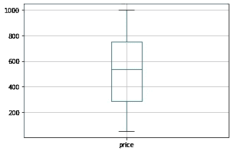

## 酒吧

```
ax = df.plot.bar(x='month', y='price', figsize=(16,5), rot=0)
```

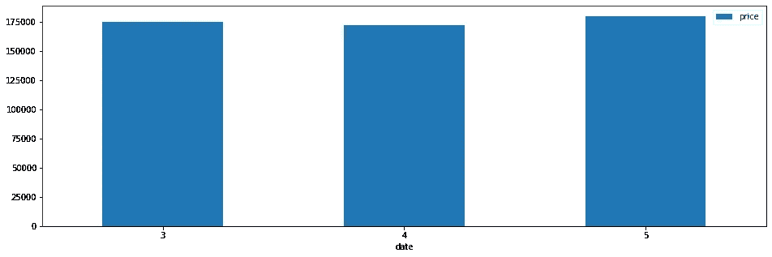

## 线条

```
ax = df.plot.line(x='date', y='price', figsize=(16,5), marker='o', legend=['price'])ax.set_xlabel('Date')
ax.set_ylabel('Price')
ax.set_title('Day Over Day x Total Sales Price')
ax
```

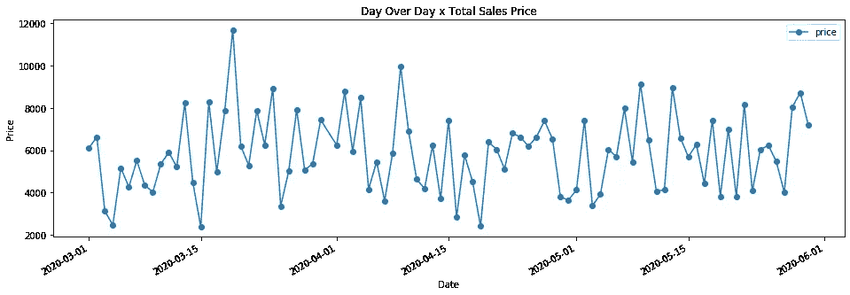

## 馅饼

```
ax = df.plot.pie(x='month_nm', y='price', figsize=(8,8))
```

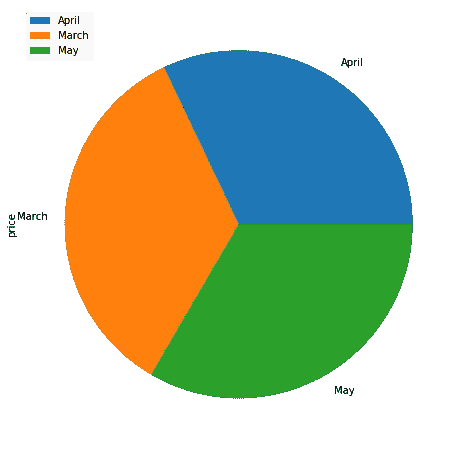

## 柱状图

```
ax = df['price'].hist(figsize=(10,5))
```

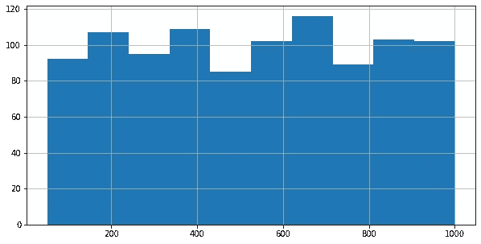

# lmplot-Seborn

[显示趋势线。我们通常在线性回归中使用该图](https://seaborn.pydata.org/generated/seaborn.lmplot.html)。

```
#New DF
dfLR = pd.DataFrame(
 df.groupby(['day', 'month_nm', 'month'])
  .agg(
   {'price': pd.Series.mean}
   ).reset_index()
)#Chart
**ax = sns.lmplot(
data  = dfLR       # DataFrame Name
, x   = "day"      # Line
, y   = "price"    # Column
, hue = "month_nm" # Points break (colors)
, col = "month"    # Charts break
)**
```

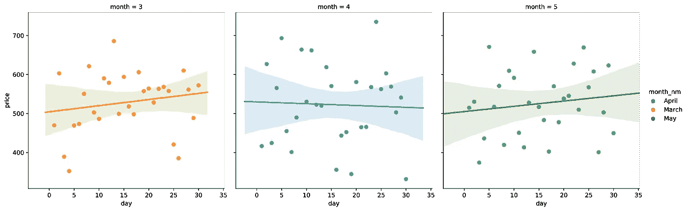

平均价格，每月的天数 X 线性回归线中的月份。

## 在 Github 上获取此代码

# 继续学习熊猫

 [## 熊猫 10 分钟-熊猫 1.0.3 文档

### 这是对熊猫的简短介绍，主要面向新用户。你可以在……中看到更复杂的食谱

pandas.pydata.org](https://pandas.pydata.org/pandas-docs/stable/getting_started/10min.html)  [## 食谱-熊猫 1.0.3 文档

### 这是一个简短而甜蜜的例子和有用的熊猫食谱链接的储存库。我们鼓励用户添加到…

pandas.pydata.org](https://pandas.pydata.org/pandas-docs/stable/user_guide/cookbook.html)