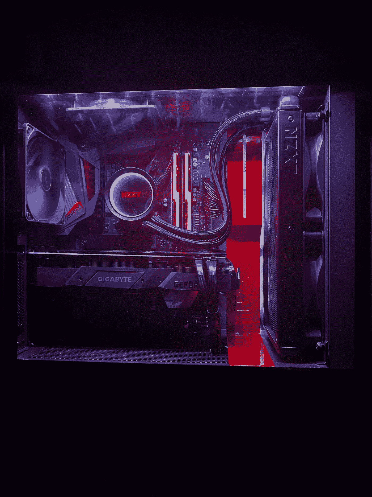

# 介绍普罗米修斯，我自己的深度学习武器库。

> 原文：<https://levelup.gitconnected.com/introducing-prometheus-my-very-own-deep-learning-arsenal-62b0f47a953>

## RTX 2070 超级/锐龙 7 3700x/ 32gb

> *本博客原载于 2020 年 6 月 21 日我的个人博客* [*这里*](https://harish3110.github.io/through-tinted-lenses/workstation/hardware/setup/2020/06/21/Introducing-Prometheus,-my-very-own-deep-learning-arsenal.html) *。*

希腊神话中的普罗米修斯，意为**“深谋远虑”**是一位泰坦神、文化英雄和魔术师，他被认为是用泥土创造了人类，他蔑视众神，从宙斯处窃取火种并赐予人类。普罗米修斯以他的智慧和人类的冠军而闻名，也被视为人类艺术和科学的作者

普罗米修斯

普罗米修斯装置

# 为什么要拥有一台深度学习工作站？

今天，有无数的云 GPU 选项可以用来涉足深度学习领域。在过去一年左右的时间里，我几乎使用了所有可能的选项，这些选项帮助我掌握了该领域的概念，因为它使任何人都可以轻松地以可承受的成本构建在该领域获得的知识。大多数这些服务还提供免费层选项，并提供对 GPU 实例的几乎立即访问。

我最喜欢的是谷歌的 GCP，它也为所有用户提供 300 美元的信用，以及新推出的 Colab Pro，在我看来，这对大多数 DL 爱好者来说是最物有所值的选择，因为它可以让你以象征性的月费访问多个 GPU 实例。GCP 的主要优势是可以完全通过命令行访问基于 Linux 的服务器，而 Colab 的界面也非常直观。直到最近，我的大部分原型工作都选择了 Colab Pro，并最终租用了一个 GCP 实例来按小时训练大型模型。

话虽如此，这种设置仍有缺点，当你开始长时间使用上述设置时，这一点变得非常明显，我相信任何在该领域工作足够长时间的人都可以很容易地证明这一点。尽管访问一个 GPU 实例已经变得太容易了，但这里的主要挫折点已经困扰了我足够长的时间，以至于我不得不花钱构建自己的 DL 装备:

*   按照正确的需求启动实例的设置过程可能会非常繁琐，并且需要一些时间来掌握每个可用云平台的情况。
*   可抢占实例是云服务提供的自由层选项，可能会令人讨厌，因为您可能会在培训过程中突然被踢出实例。
*   另一方面，经常担心关闭你的设备以避免账单增加是真实的。

简而言之，让您的工作站触手可及，让您可以随心所欲地构建模型原型，并消除使用云选项时的所有摩擦。这是詹姆斯·克利尔的建议“让它变得容易”的延伸，基本上是为了消除在执行长期有益的习惯时所涉及的摩擦。

> 人类的行为遵循最省力的法则。减少好习惯带来的摩擦。摩擦低的时候，习惯就容易了。”
> ——詹姆斯·克利尔

# 你应该建立你的工作站吗？

由于我缺乏硬件组件方面的经验，而且到目前为止还没有制造过个人电脑，所以在没有经验丰富的人的帮助下，我很紧张。许多经销商和公司提供构建 DL 工作站的服务，或者作为固定选项，或者也提供定制构建的选项。

一开始，我确信这是一个正确的选择，考虑到零件相当昂贵，很自然地会感到紧张，担心你可能会烧毁一个组件，从而浪费大量的钱。因此，我开始研究构建一个像样的 DL 工作站所需的所有组件。在这里，我想再次指出另一个蒂姆·德特默的博客，[深度学习的完整硬件指南](https://timdettmers.com/2018/12/16/deep-learning-hardware-guide/)，它塑造了我建立普罗米修斯的思维过程。

接下来是在 YouTube 上没完没了地观看各种 PC 构建，了解越来越多关于 PC 构建的迷人爱好。我花了几个小时观察人们如此令人瞠目结舌的构建，他们如此渴望构建我的电脑，我看到的越多，整个任务似乎就越不令人畏惧。我强烈推荐观看由 Linus Tech Tips 、 [Jays Two Cents](https://www.youtube.com/user/Jayztwocents) 和 [BitWit](https://www.youtube.com/user/AwesomeSauceNews) 根据您特别决定的组件构建的版本。

如果您想要一个一体化资源来构建一台基于构建像我这样的 DL 工作站所需组件的 PC，这可能是您唯一需要的资源:

[如何搭建一台 PC！通过](https://www.youtube.com/watch?v=IhX0fOUYd8Q)[位和](https://www.youtube.com/user/AwesomeSauceNews)位逐步执行

事后看来，我可以自信地说，建造我的个人电脑是一次美妙的学习经历，我很高兴我参与其中。尽管有人害怕，但值得指出的是，如果遵循正确的指南，这个过程尽管看起来很吓人，但却很容易。制造个人电脑的部件很昂贵，并被吹捧为相当脆弱，但平心而论，今天所有可用的部件都相当坚固，人们可以消除对损坏它们的不必要的担心。在我自己建立了整个系统之后，我对我在这个构建上的任何未来扩展计划都有完全的控制权，并且确切地知道这个过程是什么。我是一长串个人中的另一个，他们想把 PC 构建作为一个有价值的爱好。

话虽如此，如果你是那种不羡慕这一过程、不想处理构建机器的麻烦的人，我会建议看看 [Ant-PC](https://www.ant-pc.com/ai-and-deep-learning) ，他们提供针对深度学习的可定制构建，还提供现场保修，他们在运输之前对零件进行彻底的压力测试，相比之下，价格适中。

# 成分

用于构建的组件

## CPU 和主板:

*   每个工作站的核心都取决于这两个组件，选择 AMD 还是 Intel 将是一个主要决定，为您选择的其他组件铺平道路。
*   在过去的几年里，AMD 通过以具有竞争力的价格提供高性能的芯片，在推翻英特尔的统治方面取得了巨大的进步。
*   我选择了 AMD 的路线，并选择了锐龙 7 3700x 卡，这可能是在性能和成本方面的最佳选择。这是一款 8 核 12 线程处理器，支持高达 128Gb 的内存。
*   就主板而言，在所有预算范围内有太多的选项可供选择，但如果您打算购买高级版本，那么选择 X570 主板可以确保面向未来，因为它们支持 PCIe 第四代，并带有多个 M.2 插槽，可提供超快 SSD 存储选项。
*   寻找 X570 板有体面的 VRM(电压调节模块),这是唯一负责提供稳定的电压给你的主板。
*   具有出色 VRM 的最佳价值主张 X570 主板是华硕 TUF 游戏 X570 选项，这是我构建的第一选择，但由于当前全球疫情缺乏可用的部件，我不得不增加我的预算，选择更高端的 Aorus X570 Ultra 主板。
*   Aorus Ultra 板有非常惊人的 VRM，3 个全容量 PCIe 4 M.2 插槽，支持 NVIDIA 双向 SLI，Wi-Fi 6，蓝牙 5.0 和高级 Realtek 音频。它是当今市场上最好的中端 X570 主板之一，尽管成本高于华硕 TUF 游戏主板，但它为未来几年提供了足够的扩展和未来保障。

> ***注意:*** *尽管许多人都有这样的想法，但 AMD 的设置可以像英特尔主板一样高效地支持所有流行的深度学习库。*

## 存储:

*   使用固态硬盘来安装操作系统是至关重要的，购买高质量的 M.2 NVME 固态硬盘，而不是旧的 2.5 英寸 SATA 固态硬盘，在传输速度上有很大的不同。
*   出于存储目的，选择硬盘驱动器是有意义的。
*   我买了一个 500GB 的三星 970 Evo Plus M.2 NVMe 固态硬盘，主要用于安装 Linux，还有一个 1 TB 的 7200 RPM WD Blue 硬盘，用于存储和安装 Windows。
*   我会寻找交易来添加另一个 SSD 来加载 Windows，以获得更快更流畅的体验。

## GPU:

*   可以说是当今 PC 构建中最重要的组件，它对我的用例尤其重要，因为现在几乎所有训练 ML 模型的繁重工作都是由它完成的。
*   它几乎占了构建总成本的 50%，因此决定了这个组件是构建任何深度学习装备的最重要的方面之一。
*   Tim Dettmer 的博客[帖子](https://timdettmers.com/2019/04/03/which-gpu-for-deep-learning/)极大地影响了我对选择 GPU 的看法，他在博客中比较了最新 NVIDIA 卡的价格和性能。
*   在今天有点过时的博客帖子中，他推荐 RTX 2070 在成本效益和性能方面是最佳选择。但是自从 20 系列 RTX 超级卡发布以来，性能有了很大的改善。
*   我选择了 RTX 2070 Super，并特别选择了技嘉的 RTX 2070 Super Windforce OC，这是当今市场上公认的性价比最高的 GPU 之一。
*   自 1080Ti 以来的最新 NVIDIA 卡提供了在半精度点训练 DL 模型的可能性，即允许在 FP16 中训练而不是在 FP32 中进行全精度训练的可能性，这对于更快地训练大型模型和降低 GPU RAM 的使用至关重要，因为理论上这种类型的训练可以使 GPU RAM 加倍。
*   我很想选择 RTX 2080Ti，但老实说，我无法理解和证明这两者之间的价格差异。我已经以这样一种方式开发了我的构建，它可以支持多个 GPU 系统，所以也许以后会这样；).

## 电源:

*   选择 PSU 非常简单，只需寻找一个像样的品牌，并确保您购买的 PSU 能够充分供应您现有的和未来想要的所有组件。
*   为了保持添加另一个 GPU 的扩展可能性，我选择了安泰克 HCP 1000W PSU，这是一个完全模块化的电源，额定功率为 80+铂，配有体面的优质黑色套管电缆。
*   对于只有一个 GPU 的设置，一个 750 瓦的 PSU 就足够了，但值得确保 PSU 是 80+黄金级，为您的 PC 提供可靠的电源。

## 内存:

*   选择 RAM 时，要确保的主要标准是有足够的 RAM 来顺利执行原型制作。时钟速度和延迟并不重要。
*   对于英特尔处理器，人们可以很容易地选择较低的 RAM 速度，但 AMD 建议用户选择更高的时钟频率，理想情况下超过 3200Mhz。
*   还应该选择双通道或四通道设置，以实现理想的性能。
*   所以我决定选择双通道、G . Skill Trident RGB 16 * 2 3200 MHz RAM 包。

> ***注意:*** *制造商专门为英特尔或 AMD 或两者优化 RAM 棒，这值得一试，但据我所知，它们在性能上没有太大差异。*

## CPU 冷却器:

*   CPU 冷却存在的激烈争论的问题是在空气冷却和水冷却之间。
*   一个好的结实的空气冷却器可以以更低的成本提供同样好甚至更好的冷却性能，但代价是风扇噪音，这是有充分根据的。
*   AIO(多合一)冷却器确实提供了更安静的优势，并增加了美学因素。
*   在我最初的构建中，我使用了股票冷却器 AMD Prism 冷却器，但后来屈服于向我的构建中添加更多 RGB 和美学的冲动，选择购买 NZXT 北海巨妖 X63 冷却器。

AMD Stock Prism 冷却器

NZXT 北海巨妖 X63 AIO

*   值得注意的是，AIO 是最难修复的组件，因为需要调整它的方向并正确安装支架。
*   如果要购买 AMD 产品，请务必购买最新的 AM4 支架，因为它们更安全，这是我最初订购的 X62 AIO 中所缺少的，但后来换成了与前代产品价格相同的 X63 型号。

## 橱柜:

*   选择一个箱子/橱柜是一天结束时的喜好问题。
*   确保您的机箱经过适当的气流检查，这是保持您的组件处于理想温度并支持您的扩展需求所必需的。
*   我想得到 Phanteks P400 Digital 或 Fractal Meshify C，它具有最好的气流之一，价格合理，但由于缺乏 NZXT 510i 的可用性，NZXT 510 I 是一个非常小的外壳，可以提供出色的建筑体验。
*   NZXT 510i 缺少前网，因此与我最初选择的两款相比，在保持温度方面不太理想，但肯定是一款引人注目的最小机箱，具有出色的电缆管理、RGB 功能和更新的 IO 端口。

# 电缆管理

*   电缆管理无疑是构建中最耗时和最令人沮丧的任务，尤其是如果你像我一样痴迷于让事情看起来正确。
*   在这个过程中，拿一张纸并画出电线路径，以及电缆扎带、velcro 缠绕带和胶带非常有帮助。

## 之前:

糟糕的初始电缆管理

## 之后:

最终后视图

最终前视图

# 完整的安装零件清单

**CPU:** 锐龙 7 3700x
**主板:**技嘉 Aorus X570 Ultra
**GPU:** 技嘉 NVIDIA RTX 2070 Super wind force OC
**RAM:**G . Skill Trident RGB 3200 MHz C16 * 2
**CPU 散热:** NZXT 北海巨妖 X63
**机箱:** NZXT 510i 【T17

# 结论

总而言之，从头开始构建我自己的工作站是一次令人惊叹的学习经历，我绝对会向任何对从事数据科学职业感兴趣的人推荐这种体验。掌握这些东西肯定有一个学习曲线，但是一旦你过了这个阶段，你就会很清楚为什么 PC 构建对全世界的人来说都是如此受欢迎的爱好。求知欲和求知欲是了解 PC 构建的必经之路，从获得零件到构建自己的系统，看到一个成功的 post 屏幕绝对是一次值得珍惜的宝贵经历！

手头有一个强大的工作站无疑使快速原型制作变得非常容易，而不必为您的工作设置必要的要求，因为这只是一个一次性的过程。

我将在这篇博客之后发表另一篇博文，详细介绍我安装所有必要的 ML 库、对我的设置进行压力测试/基准测试以及设置远程服务器工作站的过程。

*如果你们中的任何人在构建自己的工作站方面需要任何帮助，需要任何帮助，请随时在 Twitter 上联系我* [*这里*](https://twitter.com/harish3110) *。*

普罗米修斯装置

*如果你觉得这很有趣，如果你有兴趣阅读更多关于深度学习的内容，并参加我的学习之旅，你可以查看我的个人* [*博客*](https://harish3110.github.io/through-tinted-lenses/) *。*

*关于我的工作，你可以随时联系我，在我的 Twitter*[*handle*](https://twitter.com/harish3110)*上就 ML 项目进行合作或者只是一般性地讨论 ML。*

保持安全和快乐的学习！:)