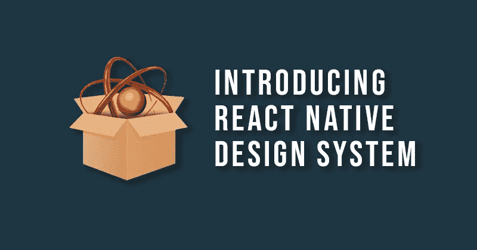
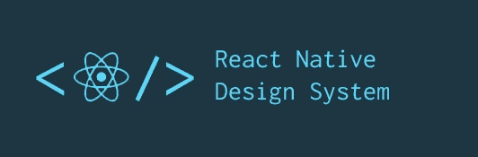
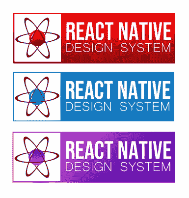

# 引进 React 本地设计系统(RNDS)🎉🎉

> 原文：<https://levelup.gitconnected.com/introducing-react-native-design-system-rnds-3969d1890d2>



嘿，伙计们，我已经做了一段时间的图书馆了。这是一个围绕 React Native 的设计系统，这篇博客回答了一些你在浏览 [repo](https://github.com/iamshadmirza/react-native-design-system) 时可能会遇到的常见问题。让我们开始吧😁。

# 什么是 RNDS 🧐？

`RNDS`简称`React Native Design System`。它是一组组件库和设计规则，让您可以更快地构建 React 本机应用程序。在`Android`、`iOS`、`Web`的生产和工作中都有记录、测试。访问此[链接](https://rnds.netlify.com)获取文档。

# 何必呢？

这个标题似乎比通用标题*动机*好一点。那么*为什么要费心去创建一个库呢？*

我在不同的项目中工作，复制粘贴我在过去一年中构建的组件。我认为(像大多数开发者一样)把它做成一个包并导入到任何项目中是一个好主意。我就是这么做的！我想要的东西原型更快，这是一个完美的解决方案。

起初，我决定添加一堆在所有组件中通用的道具，以获得较低的 API 表面积，因为说真的*谁想记住很多道具来使用组件库呢？*

我试着让它接近原生的反应，这样我就不用学习任何新的东西。我的目标是创造一些能让你在 10 分钟或更短时间内开始的东西。(我后来意识到，这并不容易😅).我将在下一节介绍我的方法`Failures`,因为这是奇迹发生的地方。

# 失败和教训

我将讨论我的失败和我在制作过程中学到的东西。如果你熟悉设计系统的话，大多数东西都是很普通的，但是我不得不艰难地学习。我在解决我自己的问题。

# 应用程序接口

我想要灵活、自由地快速创建任何组件，所以最初我添加了一些道具，比如`size`、`color`。

`Size` prop 应该采用类似于`size={17}`的整数值。创建一个适当大小的组件需要一些计算，但可能性是无穷的。我基本上可以创建一个从大小比如说`10`到`100`的组件。我只是试了一堆数字，看看有什么符合的。
`color`本来要取一个`hex code`的颜色，这会是一个分量的颜色说`Button`。当你在做一个项目时，你得到的只是一种颜色，很容易就通过了。那么什么失败了呢？

如果你是经验丰富的开发人员，你可能已经猜到我是一个白痴，但听我说完。问题是太多的自由带来了太多的矛盾。

我为项目中*的每种用法提供了`size`和`color`，比如说*和`Button`，当有这么多选项可用时，很难保持一致性。`size={16}`和`size={17}`看起来几乎相似，但其实不然。就像素完美的设计而言，这是一个巨大的失败。

第二个问题是将十六进制代码传递给`color` prop。真正的应用程序没有太多的按钮。这意味着我毫无理由地给每个按钮都传递了一种颜色😑。

解决方案是使用令牌化的配置系统，将可能性限制到最低限度，这涵盖了大多数情况。

> *关键是找到自由和一致的平衡点。*

# 定制和一致性

因此，正如我们上面所说的，不一致的解决方案是在一个文件中定义所有特定于组件的配置。它比预想的多解决了一个问题。现在，所有东西都在一个地方，定制组件就容易多了。假设，我有如下 7 种尺寸的按钮:

```
theme = {
  buttonSize: {
    'xxsmall': 8,
    'xsmall': 10,
    'small': 12,
    'medium': 14,
    'large': 16,
    'xlarge': 18,
    'xxlarge': 20,
  },
  ...
}
```

这意味着我可以根据自己的需求简单地分配不同的尺寸:

```
theme.buttonSize.medium = 15;
```

这也有助于保持事情的一致性。可以有 7 种不同大小的组件，我觉得这就足够了。超过这一点只会带来歧义。你可以随时修改主题文件中的内容(或者添加更多内容)。这也适用于颜色。假设，我们最初在主题文件中定义的颜色如下:

```
theme = {
  brandColor: {
    'primary': '#1e88e5',
    'secondary': '#f9a825',
    'tertiary': '#e53935',
    'background': '#f8f8f8',
    ...
  },
}
```

您可以轻松地将主要(或任何)品牌颜色更改为:

```
theme.brandColor.primary = '#aeea00';
```

太棒了。我们继续吧。

# 设计语言

一切都是相互联系的。解决了第一个和第二个问题就解决了第三个我不知道的问题。

对于早期的`size`和`color`方法，通信是一个问题。如果你想让别人为你创建一个按钮，你需要告诉确切的(数量)大小和(字符串)十六进制代码。基于令牌的主题和限制大小也解决了这个问题。

你只需要说"*嘿，你能创建一个带有原色的中等大小的按钮吗？*“就这样。它有利于更好的沟通，避免混乱。

# 设计规则

一个应用的原型不仅仅是把组件放到屏幕上。当您在前端工作时，空间比实际组件更重要。管理每个组件上的空间是我的第一个方法，但是很难。

我添加了几个单独的组件，只考虑空间。这些是`Layout components`，比如`Stack`、`Inline`、`Box`和`Card`。他们唯一的目的是给他们的孩子提供空间。您可以到文档中的 Stack 游乐场观看现场演示。
所有其他组件如`Button`、`Badge`等都有`0 margins`。

这将问题分成两部分:

1.  一个正常的组件应该只关心一件事:呈现适当大小的组件。
2.  布局组件应该只关心为组件提供空间。

还有一堆其他的规则将在这些文章的后面讨论(也可以在文档中找到)。

> *布局组件灵感/剽窃自* [*辫子设计系统*](https://github.com/seek-oss/braid-design-system#readme) *🙈*

# 证明文件

如果你不知道如何使用图书馆，那它有什么用？一个设计系统最起码是设计库+设计规则+文档的总和，它应该能提高你的生产力。如果你浪费时间去弄清楚如何使用一个组件，这当然是不可能的。

在创建了整个库之后，我立刻谷歌了“如何像专业人士一样记录你的库”，并决定使用 [React DocGen](https://github.com/reactjs/react-docgen) 。我写了一半的文档，但是效果不太好，所以我决定用 Docz。这真的很好，我为 Docz 重写了整个文档，但是…

然后我去了一个由 JSLovers 组织的[设计系统聚会](https://www.linkedin.com/posts/iamshadmirza_designsystem-activity-6607961343033212928-zumR)，有人建议用[故事书](https://storybook.js.org/)代替。这是完美的，正是我所需要的。这是一个交互式的游乐场，不仅可以帮助你探索组件，还可以更快地创建独立的组件。有了`StoryBook`，你甚至不必阅读整个文档。只是在操场上玩组件就够了。

所以，第三次，我决定用`MDX`的`StoryBook`重写整个文档，这就是你将在[rnds.netlify.com](https://rnds.netlify.com)看到的最终版本。

在 React Native 上使用`MDX`还有其他的复杂/障碍，但我不会说得那么详细。

# 标志；徽标

在如此努力地工作之后，我所想要的就是完美，看看我最初创造的东西😂 👇



第一个想法，肯定不好😣。所以，经过深思熟虑，我用 photoshop 技巧创作了这些照片:



看起来不错，但我可以做得更好。所以这是经过深思熟虑后的最终版本👇。


这看起来很令人满意，也表达了我对为什么要创建它的想法。

这些是我在做这个的时候的一些失败。从 webpack 配置到复合组件，我学到了很多东西，还有很多我无法在本文中涵盖的东西。我知道还有其他很棒的库可用，比如 [NativeBase](https://nativebase.io/) 和 [React Native Element](https://react-native-elements.github.io/react-native-elements/) ，但我只是试图解决我自己的问题，这是经历大量迭代的结果。

> [*Sanket Sahu*](https://twitter.com/sanketsahu)*和*[*Nader Debit*](https://twitter.com/dabit3)*对上面提到的库都做了很好的工作。* `*React Native Design System*` *这个名字是纳德自己提议的，我很感谢他帮我建造了这个。*

这个部分是这个库的核心，我花了大部分时间反复修改它，使它变得更好。这是基于我在创作时考虑的四个关键方面。

> *随便发个 PR 来指正，这些都是个人观点，我是来学习的。😅*

# 1.低表面积

大多数道具在所有组件中都是通用的，或者它们与从 React Native 导入的父组件相同。这可以确保你不必学习一整套额外的道具或者仅仅使用你已经知道的东西。
例如:

*   如果它是一个按钮，它接收 React Native 的所有可触摸组件的属性。
*   如果它是模态的，它接收模态的所有属性。
*   每个组件都有一个`size`道具，道具的值可以是:`xxsmall`、`xsmall`、`small`、`medium`、`large`、`xlarge`、&、`xxlarge`。你只需要用这些值中的一个来通过`size` prop 就可以了。
*   另一个例子可能是`color`道具。您可以将主题的`brandColor`中定义的一种颜色传递给任何组件。
*   如果是基于布局的组件，如`Box`、`Stack`、`Inline`或我们最好的朋友`Card`，那么它会收到一个`space`道具。这也取`xxsmall`和`xxlarge`之间的一个值(加上`space="none"`)，并在组件之间提供适当的间距。
*   每个组件接收一个`style`和一个`textStyle`道具(如果有文本的话)。这是在一些罕见的情况下，当您必须覆盖默认样式。最好调整`theme`来保持一致性，避免一次又一次地添加`style`。

这些道具是所有组件共有的。其他特定于组件的道具也非常简单。

# 2.速度

大多数情况下，像`size={medium}`或`space={medium}`这样的默认样式就足够了。在其他情况下，最多只需要两到三个道具就可以达到任何想要的效果。这使得原型制作更快。布局组件使得用`space`道具实现想要的屏幕布局更加容易。参见`Stack`文档中的操场。

像素完美设计的一个关键方面是组件之间的间距。这个设计系统提出了两件事:

1.  每个 UI 组件的边距都是 0。
2.  任何组件的间距将由其父布局组件决定。

关注点的分离使工作变得更容易。布局组件应该只关心`space`，UI 组件应该只关心 UI，即`color`或`size`。

# 3.一致性

自由和一致性的正确平衡很难达到。

1.  为了自由，你可以直接得到像`color`和`size`这样的道具。
2.  为了一致性，你需要在主题文件中定义这些配置，即**真实的单一来源**。

它有助于保持所有用法的一致性。它还允许您有多种选择，并根据需要使用它们。查看本指南的主题部分了解默认配置。

# 4.关系

当大问题被分成小块时，总是更容易处理。系统的设计语言被分解成颜色、字体、尺寸和空间。每个组件都遵循这些 API。

# 颜色

基本上有两种颜色:

*   **brandColor:** “初级”、“次级”、“三级”、“背景”、“禁用”、“半透明”。
*   **textColor:** “默认”、“标题”、“灰色”、“细微”、“禁用”和“白色”

# 排印

保持事情的简单和一致。有两种字体可供选择:

# 大小

*   您可以使用的尺寸有`"xxsmall"`、`"xsmall"`、`"small"`、`"medium"`、`"large"`、`"xlarge"`和`"xxlarge"`。缺省值是`"medium"`，如果没有传递任何东西，它将被应用。
*   字体大小也类似，范围从“xxsmall”到“xxlarge”。

# 空间

空间也与大小共享类似的 API，但是有一个额外的东西。也可以通过`"xxsmall"`到`"xxlarge"`范围内的`"none"`。空间是`Stack`、`Inline`、`Box`、`Card`等布局组件的专用道具。

> *你可以贡献主题。请分享一下你常用的颜色令牌是什么，你在任何 app 中常用的字体大小是什么等等。让我们一起使主题配置更加通用。*

# 安装

只需转到命令行并运行这个命令。

```
yarn add react-native-design-system
```

您可以根据自己的选择使用`yarn`或`npm`。

```
npm install react-native-design-system
```

这个库需要`react-native-vector-icons`，所以继续安装它来获得所有的酷图标。检查[安装导轨](https://github.com/oblador/react-native-vector-icons#installation)。

# 使用

# 第一步。导入`ThemeProvider`和`theme`，然后包装您的根组件。

这一步很重要。我们将`theme`作为每个组件将访问的上下文值进行传递。

```
//your root component
import { ThemeProvider, theme } from 'react-native-design-system';

function App(){
  return (
    <ThemeProvider value={theme}>
      <Root />
    </ThemeProvider>
  );
}
```

# 第二步。使用组件。

```
//inside any file
import { Button } from 'react-native-design-system';

function HomeScreen(){
  return (
    <Button>
      Press Me
    </Button>
  );
}
```

> *访问* [*本*](https://rnds.netlify.com/?path=/docs/guide-get-started--page) *了解更多信息。*

# 参考:

感谢每一个帮助我反馈的人。除此之外，这些谈话和文章有助于:

> 如果你觉得这很有趣，请在回购协议上打个星号。点击这个 [*链接*](https://github.com/iamshadmirza/react-native-design-system) *。
> 欢迎投稿，可以到达* [*这里*](https://github.com/iamshadmirza/react-native-design-system/blob/master/CONTRIBUTING.md) *阅读投稿指南。*

*最初发布于*[*https://iamshadmirza . hashnode . dev*](https://iamshadmirza.hashnode.dev/introducing-react-native-design-system-rnds-ck6ahmil904z289s1iw4dtlrc)*。*