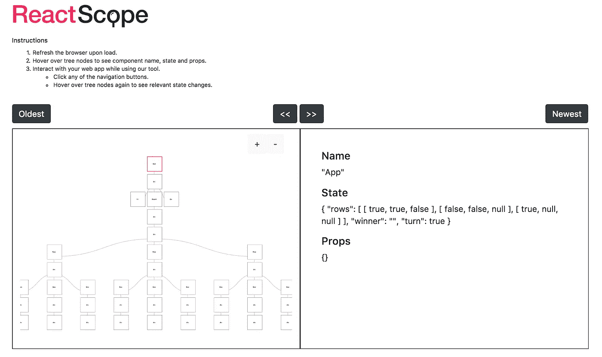

# 引入反应范围

> 原文：<https://levelup.gitconnected.com/introducing-react-scope-a87d9f5247df>

## 在与应用程序交互时，可视化 React 组件

随着 React 应用程序变得越来越复杂，跟踪组件、状态和道具变得越来越困难。上个月，我和几个开发人员致力于构建这个问题的解决方案。我们决定创建 [React Scope](http://reactscope.com/) ，这是一个 Chrome 扩展，提供了一个开发者 React 应用组件的层次树视图。

React 作用域也是交互式的；当开发人员在其应用程序中触发状态改变时(例如，通过“点击”事件或表单输入)，树形图相应地更新。可视化状态变化和识别道具传递到哪里的能力可以使调试 React 应用程序变得容易得多。

# **工作原理**

React Scope 利用 [React 开发工具](https://chrome.google.com/webstore/detail/react-developer-tools/fmkadmapgofadopljbjfkapdkoienihi?hl=en)来检索关于客户端应用程序的信息。然后，我们使用这些数据来呈现 DOM 树可视化。用户只需将鼠标悬停在树中的节点上，就可以看到每个组件的名称、状态和属性。

接下来，开发人员可以与他们的 React 应用程序交互来触发状态更改。React 作用域将这些数据保存在一个缓存中，该缓存连接到一个跟踪状态变化的侦听器函数。

最后，React Scope 提供了“上一个”和“下一个”按钮。单击这些按钮会将数据从缓存呈现到树中，允许开发人员在应用程序的当前状态和以前状态之间进行时间旅行。

# **技术挑战**

构建 React Scope 伴随着一系列挑战我们极限的技术挑战。但是随着挑战而来的是成长，我们确实从这个项目中学到了很多。

以下是我们必须解决的主要技术障碍:

## 正在检索客户端应用程序数据

我们利用 React Developer Tools 的纤程根(以及 React 15 和更低版本的渲染器)来获取客户端的应用程序数据，该数据返回一个对象。解析这个特别困难，因为这个对象嵌套很深。我们编写递归函数来提取必要的数据(组件名、状态和属性)，然后根据 [D3.js](https://d3js.org/) 的严格格式对其进行格式化。

## 处理异步事件

由于 iframes 和主浏览器窗口之间的异步关系，从 React 开发人员工具获取数据有点棘手。我们使用 Async/Await 来确保从用户应用程序传递到 React 范围的数据是准确的。

## 管理状态数据

最后，我们需要确定一个可行的缓存系统来存储初始和后续的状态变化数据。我们认为双向链表的线性结构最有意义。我们将客户机应用程序的初始状态存储为头/尾，并将任何新的状态数据添加到头中。然后，当用户单击“上一个”和“下一个”按钮时，我们应用链表逻辑来呈现相关的状态数据。例如，如果他们点击“previous”按钮，我们的应用程序将访问当前状态的“node.prev.value ”,并将该数据呈现到树形图中。

# 为什么我们相信它

我们相信 React Scope 有潜力简化 React 应用程序开发，特别是使用我们的状态时间旅行功能。例如，如果用户输入触发了意外的状态变化，开发人员可以简单地参考以前的状态来确定错误发生在哪里。

此外，能够容易地可视化道具是如何被传递的可以使调试更容易。例如，如果某个属性在某个组件中是不可访问的，用户可以在树中导航，以识别它未能被传递的位置。

# 入门指南

你可以从 [Chrome 网络商店](https://chrome.google.com/webstore/detail/react-scope/nkkiickggkoojpdiajhgkbdmfgcinlai)安装 React Scope。如果您有任何想法或建议，请给我们留下反馈。这是我们每个人的激情项目，我们也在积极探索改进的方法。

更多信息，请访问 React Scope 的[网站](http://reactscope.com/)和 [GitHub](https://github.com/React-Scope/React-Scope) 。

