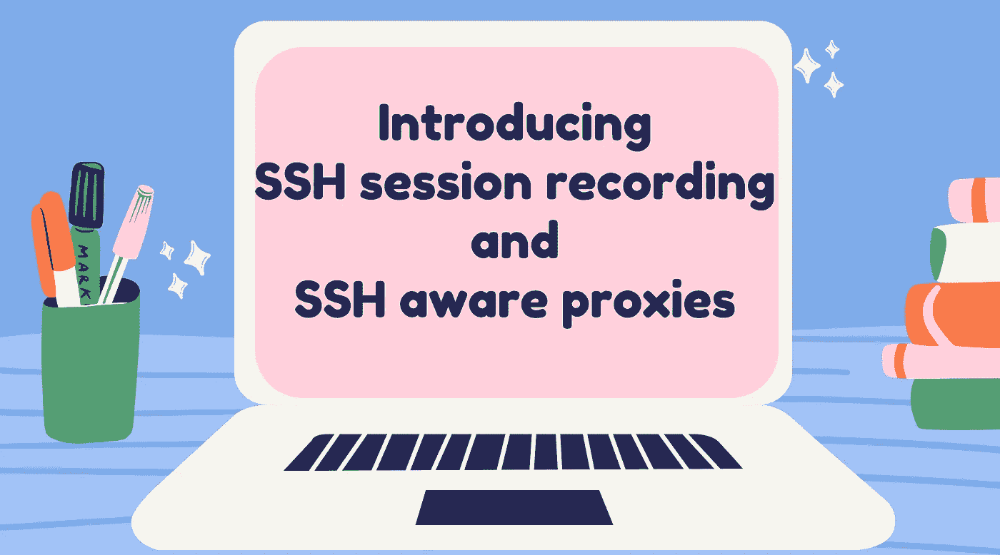
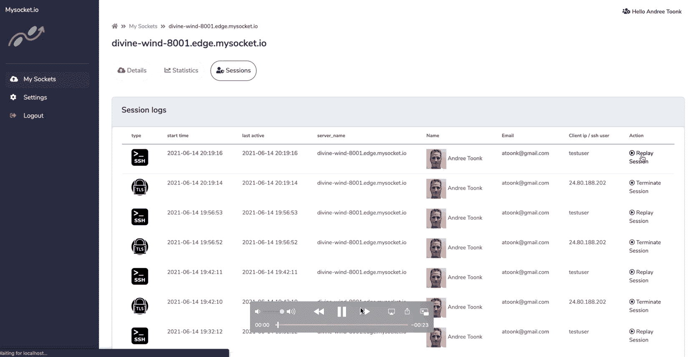
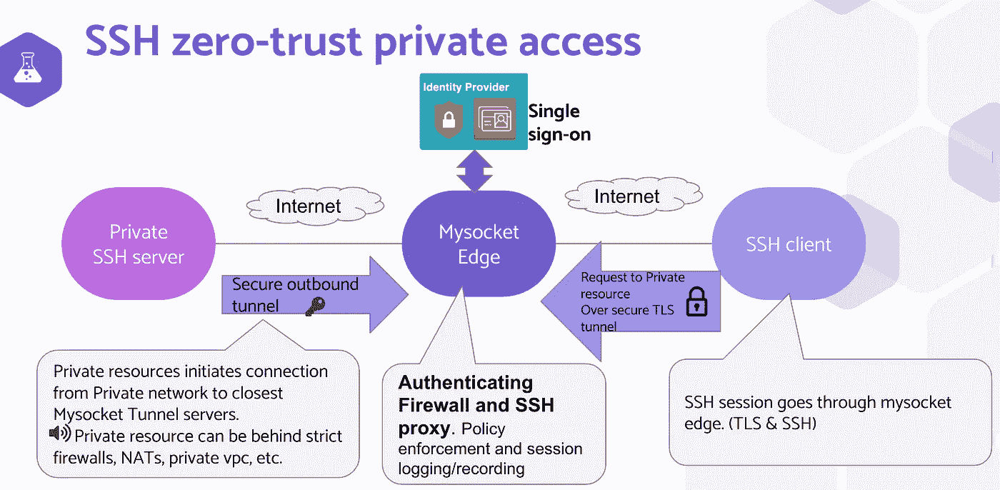
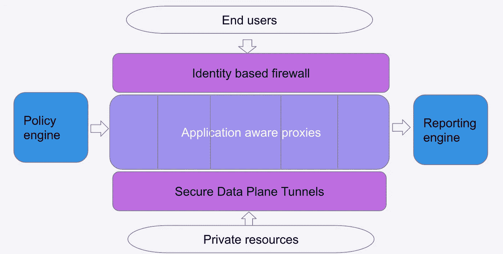

# 介绍 SSH 会话记录和 SSH 感知代理

> 原文：<https://levelup.gitconnected.com/introducing-ssh-session-recording-and-ssh-aware-proxies-869115f91df3>

**本文原载于** [**Border0**](https://www.border0.com/blogs/introducing-ssh-session-recording-and-ssh-aware-proxies) **。com 博客此处**

*在本文中，我们将介绍具有 SSH 会话记录和会话重放功能的* SSH 感知*套接字。引入更多应用感知代理是 Border0* 长期*愿景的一部分。拥有这些身份和应用感知代理允许 Border0 服务提供特定于应用的更细粒度的授权策略，以及更好的报告和日志记录。请务必观看此功能*的 [*演示录像*](https://www.youtube.com/watch?v=D0JNUKVLBw4&list=PLSqlOpN6fPZ1myn5we6UcOx4ll9oteG_8&index=1)

**

# *识别身份的 ssh 代理的优势。*

*我们之前已经讨论过 SSH 零信任，并且有几个演示视频 [展示了 SSH 用例的零信任私有访问的威力。那么今天的改进有什么不同呢？](https://www.mysocket.io/post/introducing-ssh-zero-trust-identity-aware-tcp-sockets)*

*随着 SSH 代理的引入，我们实际上说的是 SSH 协议。这意味着我们可以更深入地了解协议和流量，从而让我们了解每个 SSH 会话发生了什么。因此，我们可以开始构建特定于应用程序的策略和日志记录。*

**

*特定于 SSH 的策略的一个示例可能包括将用户的 SSH 会话限制为仅一个“shell”会话，并阻止用户建立 SSH 隧道或进行安全复制(SCP)。特定于应用程序的日志功能的一个很好的例子是 SSH 会话记录。*

# *SSH 会话记录。*

*新引入的套接字类型“SSH”为所有通过 Border0 平台的 SSH 会话提供会话记录。稍后可以在 Border0 门户中查看这些记录。*

*这为用户提供了在其网络中发生的活动的端到端可见性。并帮助回答审计问题:何时、何地、由谁发生了什么。[下面看演示](https://www.youtube.com/watch?v=D0JNUKVLBw4&list=PLSqlOpN6fPZ1myn5we6UcOx4ll9oteG_8&index=1)看看是什么样子！*

# *零信任私有 SSH 访问的用例*

*越来越多的人开始转向零信任私有访问解决方案，转而支持传统的远程访问 VPN。这是有道理的，因为我们真的不应该仅仅因为用户来自一个有很多横向访问的可信 IP 范围就信任他们。随着我们在各种云和本地数据中心部署资源，网络边界正在慢慢消失，这进一步加剧了这种情况。因此，我们需要以粒度访问为目标，只访问给定时间、身份和策略所需的资源。*

*随着越来越多的人在家或远程工作，我们都在经历工作的变化。这是满足日益分散的技术人员*和*SecOps 团队需求的一种方式，SecOps 团队缺乏传统的可见性和控制点！*

*团队还面临着对 SOC2 等合规性计划的需求压力。作为其中的一部分，网络控制、密钥轮换、秘密管理和审计都是需要解决的重要问题。使用 Border0 这样的零信任私有访问解决方案将有助于团队完成这一旅程。用户不再使用系统凭据或用户特定的密钥登录。相反，我们使用用户的单点登录(SSO)凭证和短暂的 SSH 密钥。最后，我们可以记录审计用例的所有会话。*

# *设置及其工作原理*

*下图显示了所有涉及的组件。对于现有的 Border0 用户来说，除了创建一个“SSH”类型的套接字之外，没有什么真正的改变。*

**

# *SSH 服务器*

*在左边，我们有管理员想要提供的 SSH 服务器。服务器建立到最近的任播边界 0 边缘服务器的加密出站隧道。因此，它可以位于 NAT 之后，在专用数据中心，或者例如专用 VPC；即。不需要改变防火墙。*

# *SSH 客户端*

*在右边，我们有终端用户。这些是需要 SSH 访问服务器的员工或承包商。他们安装了一个小型的[轻量级助手客户端](https://download.edge.mysocket.io/)，这个客户端确保认证工作流启动。当用户启动 SSH 会话时，会出现一个浏览器窗口，要求用户使用他们的 SSO 凭据进行身份验证。如果用户通过了身份验证和授权阶段，就会颁发经过签名的 TLS 和 SSH 证书，用户将使用这些证书对自己进行身份验证。*

# *Border0 身份识别 SSH 代理*

*在中间，我们看到 Border0 SSH 代理，它将使用 SSH 证书信息对用户进行身份验证和授权。最后，客户机(下游)和到 SSH 服务器的上游连接被缝合在一起，会话是活动的。在上游和下游会话之间复制数据的同时，它还记录所有命令和终端输出，以便以后可以回放。代理本身也使用 SSH 证书向上游 SSH 服务器验证自己。*

*如果您想亲自尝试一下，您所需要的就是使用 *border0* cli 或使用门户创建一个 *SSH* 套接字。最后一步是配置您的 OpenSSH 服务器接受签名的 SSH 证书。只需按照下面的 5 个步骤完成服务器上所需的配置更改。*

```
*# Define the Certificate Authority location
echo "TrustedUserCAKeys /etc/ssh/ca.pub" >>/etc/ssh/sshd_config # The CA for this socket can be found in the Border0 portal
# or using 'border0 socket show'
# Add it to /etc/ssh/ca.pub
echo $SSH_PUBLIC_CA > /etc/ssh/ca.pub#Define location of principle mapping file. 
echo "AuthorizedPrincipalsFile %h/.ssh/authorized_principals" >>/etc/ssh/sshd_config # Enable cert based  auth for user ubuntu (or any other user)
# All signed certs have mysocket_ssh_signed as a principle
echo "mysocket_ssh_signed" > ~ubuntu/.ssh/authorized_principals # Reload ssh and done! 
service ssh reload*
```

*这些变化与我们之前在[的博客](https://www.mysocket.io/post/using-your-gmail-account-to-to-ssh-to-your-servers)中描述的相似*

# *总结和展望*

*随着网络边界的不断消失，服务运行的基础设施变得无边界，对零信任访问解决方案的需求变得越来越迫切。SSH 代理的添加是我们向 Border0 引入更多应用感知代理的旅程中的又一步。这是我们战略的重要组成部分，旨在提供零信任、易于使用和管理的应用感知型私有访问解决方案，帮助提高用户的安全性、可见性和合规性。*

**

*我们只是刚刚开始触及可能的表面，现在我们可以做更多特定于应用程序的访问策略和日志记录。本博客中概述的 SSH 会话记录的例子是一个很好的例子，说明了什么是可能的。*