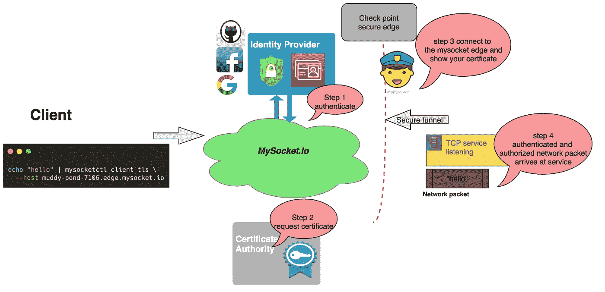

# 介绍 SSH 零信任、身份识别 TCP 套接字

> 原文：<https://levelup.gitconnected.com/introducing-ssh-zero-trust-identity-aware-tcp-sockets-c73cf65e57c>

> 在本文中，我们将看看 Mysocket 的零信任 ***云交付的认证防火墙。*** *允许* 你 ***用可信身份替换你的可信 IP 范围。***

上个月，我们引入了第一个零信任特性，引入了*身份识别套接字*的概念。很高兴看到人们对此进行尝试，并开始将其用作传统 VPN 的远程访问替代方案。

如今，大多数服务都是基于 HTTP 的，通常通过 HTTPS 提供。然而，还有一些其他常用的服务不是基于 HTTP 的，因此，直到今天，它们还没有从我们的身份识别套接字中受益。在本文中，我们将介绍对非基于 HTTP 的服务的零信任支持，以及身份感知 TCP 套接字。具体来说，我们将把为 SSH 提供零信任服务作为一个例子。

# 确定用户的身份、认证和授权

将您的 mysocket 服务转换为一个身份识别套接字非常简单，只需在创建服务时向 mysocketctl 添加— cloud_authentication 标志即可。在此过程中，您可以添加电子邮件域列表和/或电子邮件地址列表。现在，每次用户试图访问您的服务时，都会弹出一个浏览器，要求用户进行身份验证。身份验证完成后，我们知道用户的身份，如果该身份与授权用户列表相匹配，那么用户才会被放行。


创建识别身份的 TCP 套接字

如果你想想这里发生了什么，你会意识到我们这里有一个每个会话的 ***，认证防火墙*** 。只有在用户通过身份验证和授权后，我们才允许网络流量通过。请注意，这比您的传统防火墙先进得多；现在，**每个网络流都有一个身份**。那就是厉害！

这种重定向用户进行身份验证然后返回到服务的流程是可行的，因为它是在浏览器中完成的，并且主要由 HTTP 会话管理构建。现在我们想用非 HTTP 服务来扩展它，所以我们需要为 HTTP 会话部分找到一个替代方案。在 Mutual TLS (MTLS)的帮助下，这个问题得到了解决。MTLS 强制客户端在与服务器通信时进行自我验证。这是通过向服务器提供签名的客户端证书来实现的。

# 识别身份的 TCP 套接字

随着身份识别 TCP 套接字的引入，mysocket 边缘代理充当身份验证防火墙。由于我们依赖客户端 TLS 证书，所有流量都通过 TLS 连接安全地通过隧道传输。

正如您在下面的流程图中看到的，在用户可以通过之前，需要采取一些措施。为了让您的服务用户获得无缝体验，我们扩展了 mysocketctl 命令行工具，提供了启动身份验证流程所需的功能。它开始认证过程；之后，它会请求一个客户端证书(您的入场券),然后为您建立 TLS 隧道。之后，用户可以通过这个经过身份验证和加密的隧道发送流量。最简单的形式是这样的:

```
echo "hello" | mysocketctl client tls \
  --host muddy-pond-7106.edge.mysocket.io 
```

在上面的例子中，我们向 muddy-pond-7106 . edge . my socket . io 提供的服务发送字符串 hello。



运输流量

在字符串“hello”到达由 mysocket 保护的服务之前，mysocketctl 客户端将处理身份验证流，请求 TLS 客户端证书，并将通过 stdin 传入的任何内容发送到 mysocket edge 服务。

# SSH 零信任

现在我们已经理解了高级流程，让我们看一个更实际的例子。在这个例子中，我们有一个服务器，我想让 SSH 服务只对一部分用户可用。ssh 是在一个私有网络上，比如你的公司网络、你的家庭网络，甚至是在一个私有的 VPC 中，或者只是与互联网隔开。

首先，我们将在服务器端使用 mysocketctl 提供服务，并建立隧道。

```
mysocketctl connect \
  --name 'remote access for my ssh server' \
  --cloudauth \
  --allowed_email_addresses'[contractor@gmail.com](mailto:contractor@gmail.com)[,john@example.com](mailto:,andree@example.com)' \
  --allowed_email_domains 'mycorp.com' \
  --port 22 --host localhost \
  --type tls
```

在这个例子中，我创建了一个 TLS 类型的 mysocket 服务，并且我们启用了云认证。这将强制用户提供有效的客户端 TLS 证书。该证书只能发给使用 mycorp.com 电子邮件地址或使用 contractor@gmail.com 或 john@example.com 特定电子邮件地址认证的用户。相同的命令还将建立一个到最近的 mysocket 隧道服务器的安全隧道，并暴露在端口 22 上运行的 ssh 服务。


结果是，这个 SSH 服务现在只能由允许的用户访问，因为 crimson-thunder-8434 . edge . my socket . io:38676
只有具有有效客户端 TLS 票证的入站流量才能通过。有效的 TLS 客户证书只会颁发给拥有 mycorp.com 域名或我们指定的两个承包商电子邮件地址的用户。

## 设置 SSH 会话

好了，是时候测试并连接到这个 ssh 服务了。请记住，我们需要有效的 TLS 客户端证书。这些仅通过有效的令牌来发布，并且令牌仅分发给授权用户。为了使这一切更容易，我们扩展了 mysocketctl 工具来处理这个工作流。下面的例子显示了我们如何使用 ssh proxy 命令来简化这个过程，就像这样。

```
ssh ubuntu@crimson-thunder-8434.edge.mysocket.io \
  -o 'ProxyCommand=mysocketctl client tls --host %h'
```

这将告诉 ssh 通过这个 *mysocketctl 客户端*命令发送所有 ssh 流量。这将启动身份验证过程，为我们获取 TLS 客户端证书，建立到 mysocket 边缘服务器的 TLS 隧道，并通过这个经过身份验证的隧道传输 ssh 流量。用户现在可以使用您习惯的任何方法登录 ssh 服务器。

这样，我们就可以从互联网访问我们的私有 ssh 服务器，而认证 mysocket 防火墙的*只允许来自我们事先批准的客户端身份的会话。不需要 VPN。很酷，对吧？*

# *Mysocket SSH 证书颁发机构。*

**

*SSH 在工作流程方面与 TLS 非常相似。它也支持使用签名证书认证用户。*

*所以我们决定扩展这个功能。除了负责签署 TLS 证书的 API 端点之外，我们还创建了一个用于签署 SSH 密钥的 API 端点。*

*如果我们以上面的例子为基础，用户现在除了请求 TLS 客户机证书之外，还可以请求一个签名的 SSH 证书。我们的 SSH 证书签名服务将只在用户经过身份验证和授权的情况下对签名请求进行签名，使用与以前相同的逻辑。*

## *设置服务器*

*为了使用它，我们需要对 SSH 服务器做一些小的改动。要使用 CA 密钥启用身份验证，需要更改以下配置。*

```
*echo "TrustedUserCAKeys /etc/ssh/ca.pub" >>/etc/ssh/sshd_config
echo "AuthorizedPrincipalsFile %h/.ssh/authorized_principals" >>/etc/ssh/sshd_config
echo "mysocket_ssh_signed" > /home/ubuntu/.ssh/authorized_principals*
```

*最后，还要确保获得 CA 的公钥( *mysocketctl socket show)* ，并将其复制到 ca.pub 文件(`/etc/ssh/ca.pub)`*

*现在，服务器被配置为使用并允许基于来自 mysocket 证书颁发机构的签名 SSH 密钥进行身份验证。注意，所有签名的证书都有两个原则，被验证用户的电子邮件地址，以及' *mysocket_ssh_signed* '。在上面的配置示例中，我们告诉服务器将原则为' *mysocket_ssh_signed* '的用户映射到本地用户 ubuntu。*

*现在我们准备好连接了，但是我没有让 ssh 命令变得更长，而是将以下内容添加到我的 ssh 配置文件中~/。ssh/config*

```
*Host *.edge.mysocket.io
    ProxyCommand bash -c 'mysocketctl client ssh-keysign --host %h; ssh -tt -o IdentitiesOnly=yes -i ~/.ssh/%h %r@%h.mysocket-dummy >&2 <&1'Host *.mysocket-dummy
    ProxyCommand mysocketctl client tls --host %h*
```

*以上内容将确保对于所有到*.edge.mysocket.io 的 ssh 会话，我们启动身份验证流程，获取 TLS 客户端证书，并设置 TLS 隧道。我们还将提交一个 SSH 密钥签名请求，这将产生一个短期的签名 SSH 证书，该证书将用于认证 SSH 用户。*

*现在，用户可以像这样使用 SSH，整个工作流程就开始了。*

```
*ssh ubuntu@crimson-thunder-8434.edge.mysocket.io*
```

*对于那些感兴趣的人来说，ssh 证书将最终放在您的~/中。ssh/ directory，看起来像这样。*

```
*$ ssh-keygen -Lf ~/.ssh/nameless-thunder-8896.edge.mysocket.io-cert.pub
/Users/andreetoonk/.ssh/nameless-thunder-8896.edge.mysocket.io-cert.pub:
        Type: [ecdsa-sha2-nistp256-cert-v01@openssh.com](mailto:ecdsa-sha2-nistp256-cert-v01@openssh.com) user certificate
        Public key: ECDSA-CERT SHA256:0u6TICEhrISMCk7fbwBi629In9VWHaDG1IfnXoxjwlg
        Signing CA: ECDSA SHA256:MEdE6L0TUS0ZZPp1EAlI6RZGzO81A429lG7+gxWOonQ (using ecdsa-sha2-nistp256)
        Key ID: "[atoonk@gmail.com](mailto:atoonk@gmail.com)"
        Serial: 5248869306421956178
        Valid: from 2021-02-13T12:15:20 to 2021-02-13T12:25:20
        Principals:
                [atoonk@gmail.com](mailto:atoonk@gmail.com)
                mysocket_ssh_signed
        Critical Options: (none)
        Extensions:
                permit-X11-forwarding
                permit-agent-forwarding
                permit-port-forwarding
                permit-pty
                permit-user-rc*
```

*这样，用户就可以像以前一样 SSH 到同一个服务器，但是酷的是服务器不需要知道它的用户的任何传统的已知凭证。像密码或 authorized_keys 文件中的公钥条目这样的事情已经成为过去。相反，在 *mysocketctl* 的帮助下，用户将提供一个短期的签名 ssh 证书，服务器将信任该证书。*

*这样，我们为您的 SSH 服务器实现了真正的单点登录(SSO)。由于证书是短期的，从过去的五分钟(考虑到时间漂移)到未来的五分钟，我们可以确定每次登录的身份验证和授权流都是成功的。*

# *使用我的 SSH 服务器亲自尝试一下*

*如果你对用户来说是什么样子很好奇，想试一试？我有一个在 165.232.143.236 上运行的测试虚拟机，它有防火墙规则来阻止来自互联网的 SSH 流量，但使用 *mysocket* ，任何拥有 gmail.com 账户的人都可以访问它。我鼓励你试一试，这将花费你不到一分钟的时间来设置，只需复制粘贴一次性设置配置。*

## *一次性安装*

*如果您使用 Mac 笔记本电脑作为客户端，您将需要 mysockectl 工具，该工具将请求短期证书并建立 TLS 隧道。要安装客户端，只需复制粘贴以下内容(仅适用于 Mac，其他平台请参见 download.edge.mysocket.io)。*

```
*curl -o mysocketctl https://download.edge.mysocket.io/darwin_amd64/mysocketctl 
chmod +x ./mysocketctl
sudo mv ./mysocketctl /usr/local/bin/*
```

*为了便于使用，我们将把以下内容添加到我们的 ssh 客户端配置文件中。这是一次性设置，将确保通过 mysocketctl 客户端工具发送到*.edge.mysocket.io 的 ssh 流量。*

```
*cat <<EOF >> ~/.ssh/configHost *.edge.mysocket.io
 ProxyCommand bash -c ‘mysocketctl client ssh-keysign --host %h; ssh -tt -o IdentitiesOnly=yes -i ~/.ssh/%h %r@%h.mysocket-dummy >&2 <&1’Host *.mysocket-dummy
 ProxyCommand mysocketctl client tls --host %hEOF*
```

*现在您应该能够使用 ssh 连接到我的测试服务器了*

```
*ssh [testuser@frosty-feather-1130.edge.mysocket.io](mailto:testuser@frosty-feather-1130.edge.mysocket.io)*
```

*当浏览器弹出时，确保使用“使用谷歌登录”选项，因为这个套接字已被配置为只允许具有 Gmail.com 电子邮件地址的身份。*

# *包扎*

*在这篇文章中，我们展示了如何继续利用“身份识别*套接字*”来构建我们之前的工作。我们引入了对身份识别 TCP 套接字的支持，利用 TLS 隧道和双向 TLS 进行身份验证。*

> *我喜欢把它想象成一个 ***云交付的认证防火墙。*** 有了这个，我们就可以在非常精细的基础上让你的服务对互联网可用，并确保 ***每个流都有一个附属的身份*** 。也就是说，我们确切地知道，在每个 TCP 流的基础上，什么身份(用户)正在使用这个流。与传统的防火墙相比，这是一个非常强大的功能，在传统的防火墙中，我们必须允许来自特定网络范围的 SSH 流量被隐式信任。我们现在可以对这些身份识别套接字做的是重写这些防火墙规则，并用可信身份替换可信 IP 范围。对于那些需要严格遵守，需要回答谁(不是 IP，而是身份)何时连接到什么的人来说，这是非常强大的。*

*我们研究了如何使用它来提供对 SSH 服务器的零信任远程访问。以及如何通过使用新的 SSH 密钥签名服务来进一步扩展它。*

*这就是现在，我希望你发现这是有趣和有用的。一如既往，如果您有任何问题或反馈，请随时联系我们。*

*[渴望更多？点击这里查看我们在 Youtube 上的所有演示](https://www.youtube.com/playlist?list=PLSqlOpN6fPZ1myn5we6UcOx4ll9oteG_8)*

**