# 推出 SwiftNEWKit —毫不费力地展示“新功能”

> 原文：<https://levelup.gitconnected.com/introducing-swiftnewkit-show-whats-new-effortless-53850fefa8a5>

## 专为使用 SwiftUI 的苹果开发者设计。

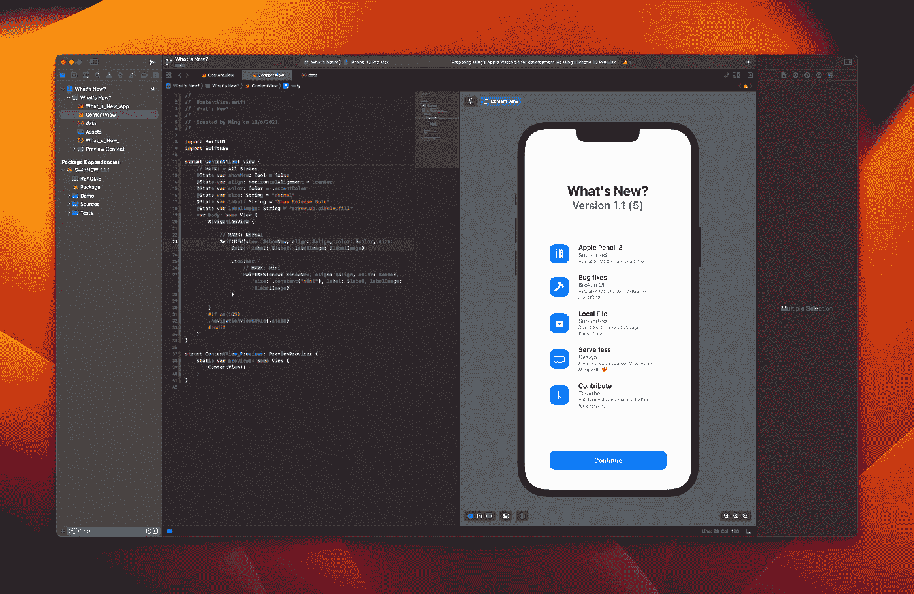

> 显示“最新动态？”使用#SwiftNEWKit 比以往任何时候都更容易

SwiftNEWKit 是一个新的开源 Swift 包，为苹果开发者向最终用户展示发行说明提供了一个简单的方法。它可以实现:

*   自动触发`.sheet`从版本和/或构建增加。
*   单行编码
*   JSON 兼容
*   版本控制(2.0 或更高版本)
*   本地可用
*   简单装订
*   简单模型
*   远程加载(3.0 或更高版本)
*   支持远程掉线通知(3.5.0 或以上)

# 环境

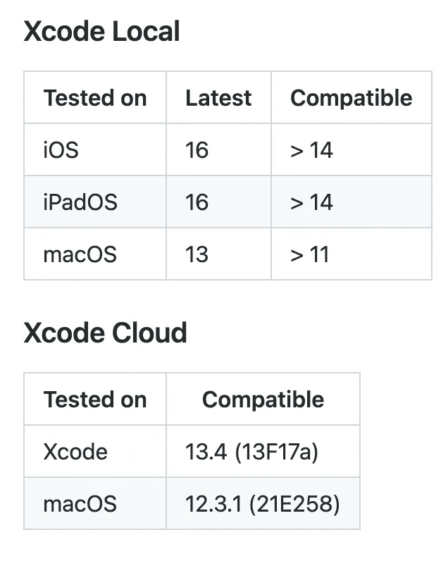

# 设置

1.  导航到根项目
2.  选择项目

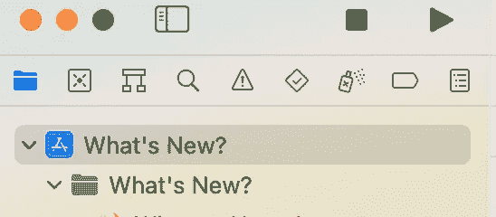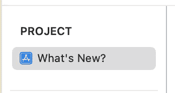

3.选择包依赖关系

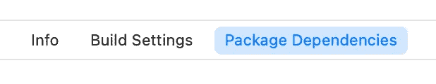

4.点击+并将`[https://github.com/1998code/SwiftNEWKit](https://github.com/1998code/SwiftNEWKit)`粘贴到搜索框中

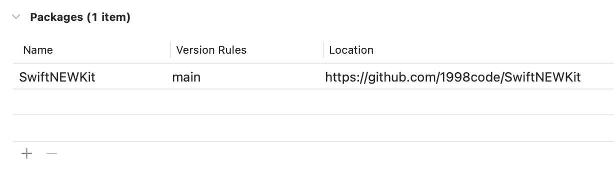

5L。如果你想在设备上加载数据，创建一个名为`**data.json**` Sample 的新文件:

[](https://github.com/1998code/SwiftNEWKit/blob/main/Demo/What%27s%20New%3F/data.json) [## swift newkit/data . JSON at main 1998 code/swift newkit

github.com](https://github.com/1998code/SwiftNEWKit/blob/main/Demo/What%27s%20New%3F/data.json) 

5R。如果您想要远程加载数据，请使用`https://…/{}.json`来提供数据。

# 使用

1.  用`import SwiftNEW`导入
2.  在变量`body`或任何`view`前添加状态:

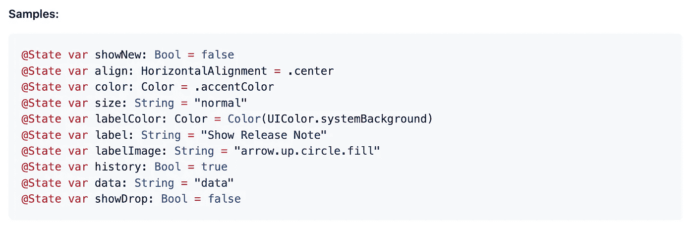

3.然后，将这段代码添加到主体或任何视图中。

```
SwiftNEW(show: $showNew, align: $align, color: $color, size: $size, labelColor: $labelColor, label: $label, labelImage: $labelImage, history: $history, data: $data)
```

4.完成后，您应该会看到如下所示的视图:

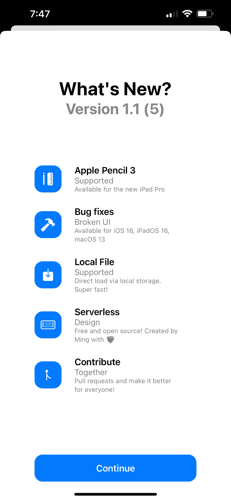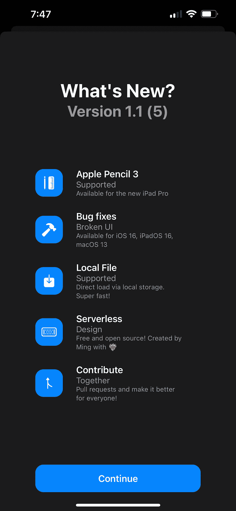

要修改内容，您可以编辑`**data.json**` 文件。

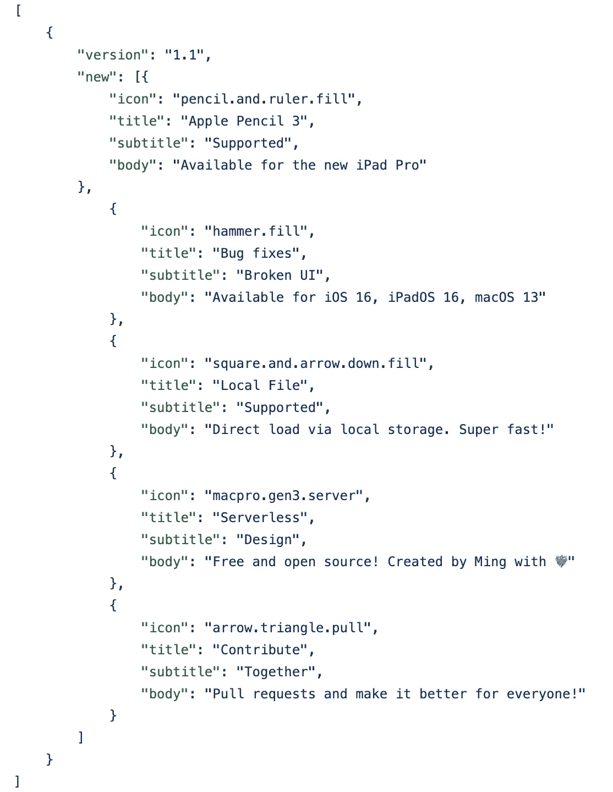

如果您希望修改布局，只需参考状态和选项。

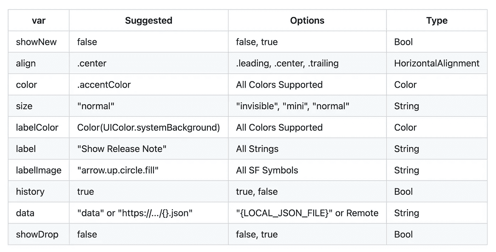

要了解更多信息，请访问 GitHub repo:

[](https://github.com/1998code/SwiftNEWKit) [## GitHub - 1998code/SwiftNEWKit:用 SwiftUI 显示“新功能”。

### 为苹果开发者向最终用户展示“新内容”提供了一种简单的方式。步骤描述截图 1 导航…

github.com](https://github.com/1998code/SwiftNEWKit) 

## 感谢阅读，享受 Swift 编码: )👏

## 今天在 Twitter 上关注我:

[](https://twitter.com/1998design) [## 明@ 1998 设计

twitter.com](https://twitter.com/1998design)