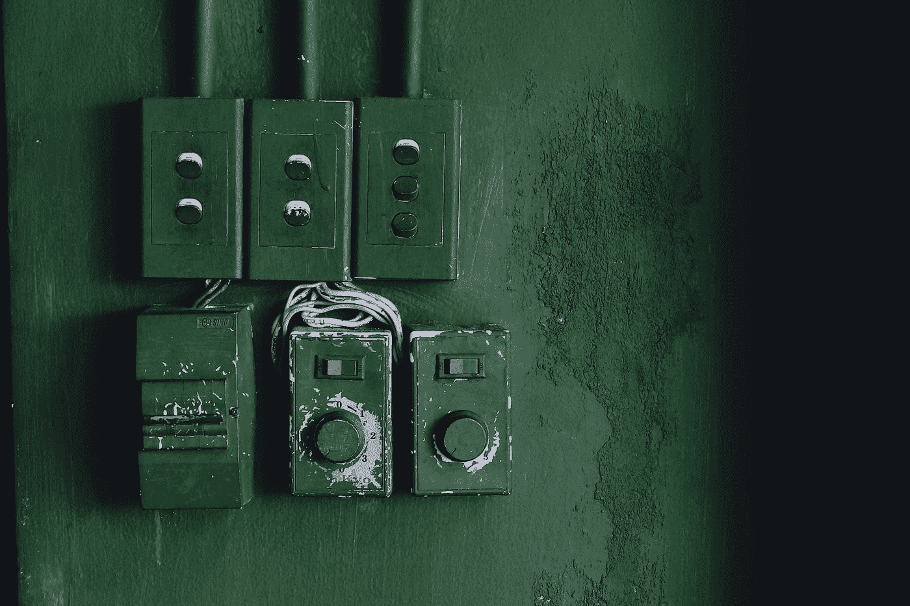

# JavaScript Switch 语句简介

> 原文：<https://levelup.gitconnected.com/introducing-the-javascript-switch-statement-d4c5ae6fa20c>



[Alex Cao](https://unsplash.com/@alexakafreak?utm_source=medium&utm_medium=referral) 在 [Unsplash](https://unsplash.com?utm_source=medium&utm_medium=referral) 上拍摄的照片

`switch`语句让我们根据表达式的返回值运行语句。这与拥有一系列`if`语句是一样的。

在本文中，我们将了解如何使用 switch 语句。

# 定义 Switch 语句

`switch`语句由一个`switch`块组成，每个案例都有`case`语句。

例如，我们可以将其定义如下:

```
const person = 'Joe';
switch (person) {
  case 'Jane':
    console.log('Hi Jane');
    break;
  case 'John':
    console.log('Hi John');
    break;
  case 'Joe':
    console.log('Hi Joe');
    break;
  case 'Mary':
    console.log('Hi Mary');
    break;
  default:
    console.log('Hi');
    break;
}
```

一个`switch`块由`switch`关键字组成，它告诉我们正在创建一个`switch`块。

在那之后，我们在括号里有了我们想要比较的表达式。在我们的示例中，我们想要将`person`与下面的`case`表达式中的值进行比较。

然后是`case`子句，我们将之后的值与`person`进行比较。

`case 'Jane'`比较`'Jane'`和`person`是否相等，`case 'John'`比较`'John'`和`person`是否相等，依此类推。

在每个`case`子句中，我们都有一个`break;`行，这样一旦找到匹配，其余的代码就不会被执行。

上面的代码应该记录`'Hi Joe'`，因为我们将`person`设置为`'Joe'`。

`default`子句执行的`person`与上面的`case`表达式中列出的任何值都不匹配。这意味着如果`person`不是`'Jane;`、`'John'`、`'Joe'`或`'Mary'`，它将运行。

因此，上面的`switch`语句与:

```
if (person === 'Jane') {
  console.log('Hi Jane');
} else if (person === 'John') {
  console.log('Hi John');
} else if (person === 'Joe') {
  console.log('Hi Joe');
} else if (person === 'Mary') {
  console.log('Hi Mary');
} else {
  console.log('Hi');
}
```

`case`和`default`子句是可选的，但是如果我们不定义它们中的任何一个，那么`switch`语句就不会非常有用。

# 将违约置于案例之间

我们可以把`default`子句放在 cases 和`switch`语句之间，仍然以同样的方式工作。

所以:

```
const person = 'Joe';
switch (person) {
  case 'Jane':
    console.log('Hi Jane');
    break;
  case 'John':
    console.log('Hi John');
    break;
  default:
    console.log('Hi');
    break;
  case 'Joe':
    console.log('Hi Joe');
    break;
  case 'Mary':
    console.log('Hi Mary');
    break;
}
```

得到的结果与原始示例中的结果相同。

# 多标准案例

我们可以将`case`子句与多个相等值进行比较。

例如，如果我们有:

```
const foo = 1;
switch (foo) {
  case 1:
  case 2:
  case 3:
  case 4:
    console.log('I like this number');
    break;
  case -1:
  case -2:
    console.log('I love this number');
    break;
  default:
    console.log('I don\'t like this number.');
}
```

然后我们得到`'I like this number'`，因为`foo`是 1，这是第一个`case`子句中的值之一。

如果我们设置`foo`为-1，那么我们得到`'I love this number'`。


托马斯·詹森在 [Unsplash](https://unsplash.com?utm_source=medium&utm_medium=referral) 上拍摄的照片

# 连锁表达式

省略 break 语句的一个有用用例是运行一系列表达式。

例如，如果我们有:

```
const foo = 1;
let output = '';
switch (foo) {
  case 0:
    output += 'So ';
  case 1:
    output += 'How ';
    output += 'Old ';
  case 2:
    output += 'Are ';
  case 3:
    output += 'You';
  case 4:
    output += '?';
    console.log(output);
    break;
  case 5:
    output += '!';
    console.log(output);
    break;
  default:
    console.log('Please pick a number from 0 to 5!');
}
```

然后，根据我们将`foo`设置为什么值，我们得到以下值:

*   `foo`为 0 — `'So How Old Are You?'`
*   `foo`为 1— `'How Old Are You?'`
*   `foo`是 2— `'Are You?'`
*   `foo`是 3— `'You?'`
*   `foo`是 4— `'?'`
*   `foo`是 5— `'!'`
*   `foo`还有别的吗— `‘Please pick a number from 0 to 5!’`

# S `witch`语句中的块范围变量

我们只能有一个同名的`let`或`const`表达式。否则，我们会得到一个错误。

例如，如果我们有:

```
const person = 'Joe';
switch (person) {
  case 'Jane':
    let name = 'Jane';
    break;
  case 'John':
    let name = 'John';
    break;
  case 'Joe':
    let name = 'Joe';
    break;
  case 'Mary':
    let name = 'Mary';
    break;
  default:
    let name = '';
    break;
}
```

我们将得到“名称已经声明”如果`case`子句没有用大括号括起来，它就不是一个块，但是`switch`块是一个块。

我们可以通过制作如下的`case`和`default`子句块来解决这个问题:

```
const person = 'Joe';
switch (person) {
  case 'Jane': {
    let name = 'Jane';
    console.log(name);
    break;
  }
  case 'John': {
    let name = 'John';
    console.log(name);
    break;
  }
  case 'Joe': {
    let name = 'Joe';
    console.log(name);
    break;
  }
  case 'Mary': {
    let name = 'Mary';
    console.log(name);
    break;
  }
  default: {
    console.log('No name');
    break;
  }
}
```

一旦我们把它括起来，那么我们就可以有同名的`let`和`const`声明。

# 结论

`switch`语句是一个块，我们可以用它来检查不同的值，并根据表达式的值做不同的事情。

这与一系列`if...else`语句相同，条件是比较每个语句中的值是否相等。

我们还可以在一个`case`子句中有多个`case`表达式来检查多个表达式。

`default`子句用于在`case`子句不匹配的情况下做一些事情。

如果我们想在`case`和`default`子句中用同名的`let`和`const`声明块范围的变量，我们可以通过用大括号将它们括起来，将它们转换成块。