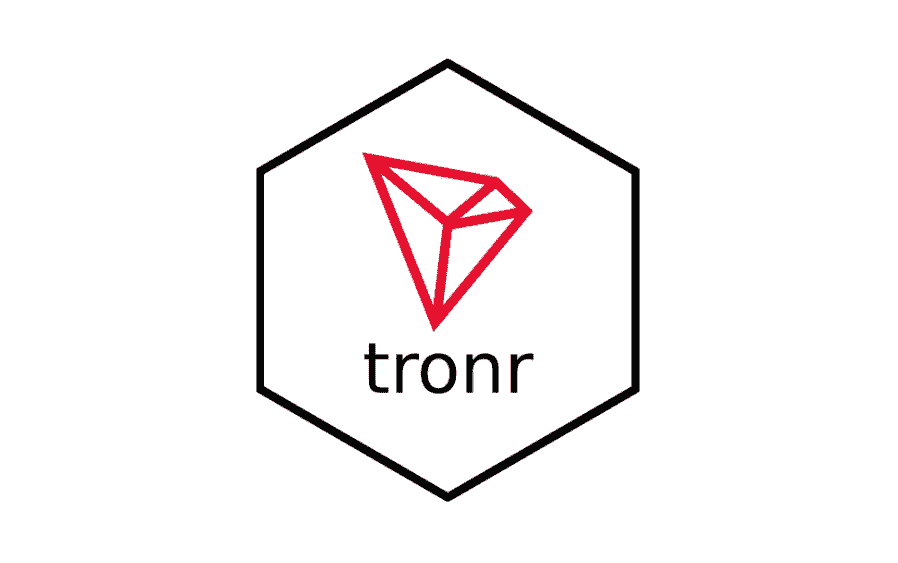
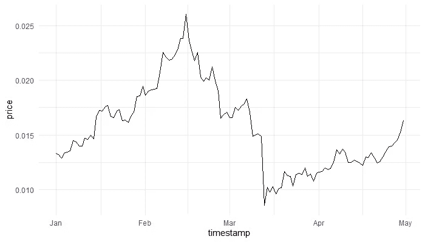

# 介绍 tronr，一个探索 TRON 区块链的 R 包

> 原文：<https://levelup.gitconnected.com/introducing-tronr-an-r-package-to-explore-the-tron-blockchain-f0413f38b753>

## 查询账户余额、交易、代币转账等等。



图片由谢尔盖·马斯蒂斯基提供。这张图片中的 TRON 徽标(“红色钻石”)源自官方图标包，可在 TRON 基金会的网站( [https://tron.network](https://tron.network/) )下载并免费使用

# 动机

由 [Justin Sun](https://en.wikipedia.org/wiki/Justin_Sun) 和devtools::install_github("next-game-solutions/tronr")

一旦我收集并整合了第一批用户的反馈，我也会在 CRAN 上发布。

# 例子

该软件包允许人们收集区块链的账户、交易、令牌转移和智能合约事件的数据。此外，用户可以查询 Tronix (TRX)的当前和历史市场状态。如何使用`tronr`的几个详细例子可以在它的[在线文档](https://next-game-solutions.github.io/tronr/)中找到。我还计划在 Medium 上发布一系列额外的例子。下面提供的只是几个问题，以便读者可以感受一下什么是可能的。

```
library(tronr)
library(dplyr)
library(ggplot2)

# Current price of TRX expressed in USD, EUR and BTC (Bitcoin):get_current_trx_price(vs_currencies = c("usd", "eur", "btc"))
#> # A tibble: 3 x 3
#>    trx_price vs_currency last_updated_at    
#>        <dbl> <chr>       <dttm>             
#> 1 0.0599     usd         2021-02-21 15:57:13
#> 2 0.0494     eur         2021-02-21 15:57:13
#> 3 0.00000104 btc         2021-02-21 15:57:13

# Querying the TRX market data for a historical period, and 
# plotting the evolution of price:(min_timestamp <- as.POSIXct("2020-01-01 00:00:00") %>% 
   to_unix_timestamp()
)
#> [1] "1577836800000"(max_timestamp = as.POSIXct("2020-05-01 00:00:00") %>%
   to_unix_timestamp()
)
#> [1] "1588287600000"

price_history <- get_trx_market_data_for_time_range(
  vs_currency = "usd",
  min_timestamp = min_timestamp,
  max_timestamp = max_timestamp
)

glimpse(price_history)
#> Rows: 121
#> Columns: 5
#> $ timestamp         <dttm> 2020-01-01, 2020-01-02, 2020-01-03,...
#> $ vs_currency       <chr> "usd", "usd", "usd", "usd", "usd",...
#> $ price             <dbl> 0.01329452, 0.01319943, 0.01284472,...
#> $ total_trading_vol <dbl> 1134528759, 1032624901, 1056549454,...
#> $ market_cap        <dbl> 877119319, 872350811, 848482045,...

price_history %>% 
  ggplot(aes(timestamp, price)) +
  geom_line() +
  theme_minimal()
```



```
# Information on the latest block generated on the chain:get_block_info(latest = TRUE) %>% 
  glimpse()
#> Rows: 1
#> Columns: 11
#> $ request_time    <dttm> 2021-02-21 15:57:33
#> $ block_number    <chr> "27844966"
#> $ timestamp       <dttm> 2021-02-21 15:56:24
#> $ hash            <chr> "0000000001a8e1666864254248f7f8d4b2e41...
#> $ parent_hash     <chr> "0000000001a8e1657f864801f99717577b481...
#> $ tx_trie_root    <chr> "uLCTnmEGhvpmUeqcZM3VvMxZjiPUd8sr8FPwK...
#> $ confirmed       <lgl> TRUE
#> $ size            <int> 34298
#> $ witness_address <chr> "TWkpg1ZQ4fTv7sj41zBUTMo1kuJEUWTere"
#> $ tx_count        <int> 135
#> $ tx              <list> [<tbl_df[135 x 4]>]

# Current balance of an account:get_account_balance("TQjaZ9FD473QBTdUzMLmSyoGB6Yz1CGpux") %>% 
  glimpse()
#> Rows: 1
#> Columns: 10
#> $ request_time <dttm> 2021-02-21 15:57:36
#> $ address      <chr> "TQjaZ9FD473QBTdUzMLmSyoGB6Yz1CGpux"
#> $ name         <chr> "SunTRXV3Pool"
#> $ total_tx     <int> 69012
#> $ bandwidth    <list> [<tbl_df[1 x 20]>]
#> $ trx_balance  <dbl> 5628275
#> $ n_trc20      <int> 16
#> $ trc20        <list> [<tbl_df[16 x 7]>]
#> $ n_trc10      <int> 12
#> $ trc10        <list> [<tbl_df[12 x 8]>]

# TRC-10 asset transfers to / from an account within a time range:get_trc10_transfers(
  related_address = "TMaBqmMRekKZMQEq3u3QrJpGDwPYZZo87V",
  min_timestamp = "1577837400000",
  max_timestamp = "1577837430000"
) %>% glimpse()
#> Rows: 2
#> Columns: 13
#> $ tx_id                    <chr> "675a3606a414f0ea09979688889df0237911d368d...
#> $ block_number             <chr> "15860788", "15860784"
#> $ timestamp                <dttm> 2020-01-01 00:10:27, 2020-01...
#> $ from_address             <chr> "TMaBqmMRekKZMQEq3u3QrJpGDwPY...
#> $ to_address               <chr> "TT5W8MPbYJih9R586kTszb4Loybz...
#> $ is_contract_from_address <lgl> FALSE, FALSE
#> $ is_contract_to_address   <lgl> FALSE, FALSE
#> $ contract_result          <chr> "SUCCESS", "SUCCESS"
#> $ confirmed                <lgl> TRUE, TRUE
#> $ amount                   <dbl> 10, 10
#> $ token_id                 <chr> "1002830", "1002830"
#> $ token_name               <chr> "AUP", "AUP"
#> $ token_abbr               <chr> "AUP", "AUP"
```

# 使用 tronr 时需要注意的事项

这个包的设计是相当固执己见的，这在其他方面意味着如下。

在幕后，大多数与交易相关的数据都是通过一个公共 API 在`tronr`中查询的，该 API 支持 [Tronscan 网站](https://tronscan.org/)。这有几个重要的含义:

*   [Tronscan API](https://github.com/tronscan/tronscan-frontend/blob/master/document/api.md) 比 [TronGrid API](https://www.trongrid.io/) 要慢得多，TronGrid API 是需要计算高效且健壮的机制来从 TRON 区块链提取大量数据的用例的推荐工具。然而，选择 Tronscan API 是因为它返回了更丰富、更符合模式的数据。随着 TronGrid API 的成熟，可能会重新考虑在`tronr`使用 Tronscan API 的决定。
*   使用`tronr`从同一 IP 地址执行频繁和/或“繁重”查询的尝试可能会被 Tronscan 服务器视为[拒绝服务攻击](https://www.cloudflare.com/en-gb/learning/ddos/glossary/denial-of-service/)，并导致该 IP 地址被列入黑名单。因此，恳请`tronr`的用户考虑周到，并在他们的代码中实现相应的保护措施(例如，将查询分成更小的块，中间有停顿)。
*   由于前面两点，`tronr`是*而不是*打算用于高负载分析应用程序的开发。

许多`tronr`函数以[嵌套表](https://tidyr.tidyverse.org/articles/nest.html)的形式返回数据(参见上面的例子)。可以说，鉴于这些数据的层次结构，这是它们的自然选择。选择嵌套 tibbles 也是因为它们代表了与`[tidyverse](https://www.tidyverse.org/)`工具包兼容的“整洁”数据格式。诚然，不是所有的 R 用户都喜欢使用`tidyverse`工具，这使得`tronr`对这些用户来说不那么容易接近和有吸引力。

# 结论

TRON 是一个令人兴奋的区块链项目，其受欢迎程度和影响力都在不断增长。在该区块链上生成的数据为分析应用提供了许多可能性(例如，监控趋势、记录账户间货币资产的移动、预测代币价格、识别流行的 dApps 和异常活跃的用户等)。).本文中介绍的`tronr`包将帮助 R 用户以熟悉的格式从 TRON 区块链收集数据，为下游分析做好准备。我将非常感谢来自这个包的用户的任何反馈、错误报告和贡献——详见该项目的 [Github 库](https://github.com/next-game-solutions/tronr)。

# 在你走之前

我提供数据科学咨询服务。[取得联系](mailto:sergey@nextgamesolutions.com)！