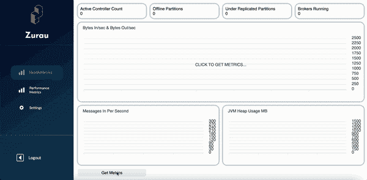
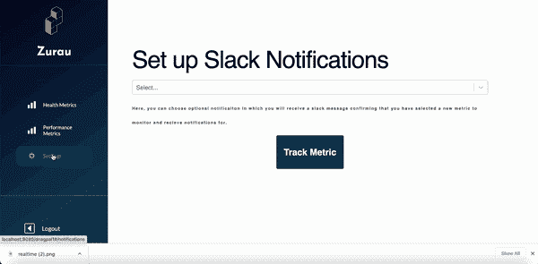

# 介绍 Kafka Peek:一个开源的可观察性和通知应用程序

> 原文：<https://levelup.gitconnected.com/introducing-zurau-an-all-in-one-kafka-monitoring-notification-app-for-devs-c5a13b7d95d>

众所周知，大数据是未来。数字证明了这一点:人们观看[**1.4 亿小时的网飞**](https://dataprot.net/statistics/netflix-statistics/) ，上传[**9500 万张图片和视频到 Instagram**](https://earthweb.com/how-many-pictures-are-on-instagram/#:~:text=The%20number%20of%20pictures%20and,videos%20shared%20on%20this%20platform.) ，在 LinkedIn *每日*产生超过 [**7 万亿个数据点。现在比以往任何时候，无论好坏，我们点击，所以我们是。**](https://engineering.linkedin.com/blog/2019/apache-kafka-trillion-messages)

虽然很难理解这些数字，但很容易理解各地的工程师每天面临的巨大任务，即确保跟踪这些指标永不中断。

这就是为什么我们的团队一起创建了 [**KafkaPeek**](https://www.kafkapeek.dev) ，这是一个开源应用程序，旨在帮助团队关注他们的 [**Kafka**](https://kafka.apache.org/) 部署。对于 KafkaPeek，我们心中只有一个目标:让日常开发操作变得更简单。

**卡夫卡是什么？**

KafkaPeek 是一个开源 GUI，它不仅可以跟踪重要的 Kafka 部署指标，还可以设置与这些指标的用户定义阈值相关的 Slack 通知。

KafkaPeek 仪表盘显示了关键的 Kafka 集群指标

在监控方面，KafkaPeek 版有两个主要仪表板:健康仪表板，用于跟踪:

*   活动控制器计数
*   脱机分区
*   复制不足的分区
*   经纪人运行
*   每秒输入字节数和输出字节数
*   每秒的邮件数
*   JVM 堆使用情况

…以及性能控制面板，可跟踪:

*   每秒请求数
*   响应队列时间
*   请求总时间
*   响应发送时间

在研究表明这些指标是决定 Kafka 部署健康状况的最重要的指标后，我们的团队选择了这些指标。(我们还计划增加几十个，所以一定要保持警惕！)

设置与用户定义的指标阈值相关的时差通知的过程

在通知方面，KafkaPeek 的特点是与大量选项进行了松散集成，用户可以选择定制指标阈值，以满足团队的各种需求。到底没有通知的监控有什么用？有了 KafkaPeek，确保任何需要了解部署当前情况的人都能立即了解*。*

***事实真相***

*我们的团队利用丰富的技术和他们给我们的工具，为开发人员创建了一个功能强大的应用程序。*

*首先，我们在前端有 [**React**](https://reactjs.org/) ，在后端有[**node . js**/](https://nodejs.org/en/)[**Express**](https://expressjs.com/)。我们实现了一个 [**WebSocket 库**](https://socket.io/) 来创建一个安全的、持续的二进制连接，作为 KafkaPeek 查询数据的桥梁。*

*用于抓取卡夫卡数据的技术被称为[普罗米修斯](https://prometheus.io/)，这是这方面的行业标准。然而，在这一点上，它需要一个 Kafka 集群来连接，所以我们[**将**](https://www.docker.com/) 一组 [**汇合**](https://www.confluent.io/) 图像(由一个集群、一个 zookeeper 和一个 JMX 导出器组成)转化来自 Prometheus 的基于 Java 的指标为 mBeans，我们可以输入到我们的前端。*

*然后，我们使用 Prometheus 的本地查询语言 [**PromQL**](https://prometheus.io/docs/prometheus/latest/querying/basics/) ，只提取我们感兴趣的指标。一旦被解析，这些指标将被发送到前端，以便使用 [**Apex 图表**](https://apexcharts.com/) 库进行可视化。*

*最后，实现 Slack 通知意味着利用消息传递应用程序的 webhook 功能来确保用户能够收到与其集群健康相关的通知。*

***技术挑战***

*最后，我们在 KafkaPeek 版本上的成功不言自明，但这并不意味着团队没有经历大量的考验和磨难。*

*例如，Kafka、Prometheus 和 Docker 对我们来说是全新的技术，为了更好地了解它并正确使用它，我们对这些技术进行了大量的研究和测试。因此，正确查询要通过 WebSocket 实例发送的数据块，并确定如何最好地使用 React 呈现该数据，同时避免不必要的重新呈现，是我们能够克服的一个关键挑战。*

*就像他们说的，没有什么值得做的事情是容易的！*

*今天就试试卡夫卡吧！*

**

*卡夫卡标志*

*KafkaPeek 入门再简单不过了。只需查看 [**的项目页面**](https://github.com/oslabs-beta/KafkaPeek) ，详细的自述文件将指导您只需几个步骤就可以启动并运行它！*

***如何投稿***

*我们很自豪 KafkaPeek 是一款开源应用。如果你想作出贡献，请不要犹豫克隆项目，四处打探，发现你想添加的东西，并提交一份公关！我们在编写代码时考虑到了社区，我们合作得越多，KafkaPeek 就变得越好！*

***支持我们的项目***

*你们的支持使 KafkaPeek 和 [**OSLabs**](https://opensourcelabs.io/) 的人们能够继续开发新的令人兴奋的开源产品。如果您想投稿，请:*

*   *⭐️⭐️ [在 GitHub 上开始、观看和/或分享我们的回购！](https://github.com/oslabs-beta/KafkaPeek) ⭐️⭐️*
*   *👏👏拍拍这篇文章，分享给你的朋友吧！​​👏👏*
*   *👍👍在 [LinkedIn](https://www.linkedin.com/company/kafkapeek) 、 [Twitter](https://www.twitter.com/kafkapeek) 和 [Youtube](https://youtu.be/BjO1mNr_6aU) 上关注我们！​​ 👍👍*
*   *📨📨在 LinkedIn、Twitter 和任何其他社交网络上分享这个项目！​​📨📨*

***见见团队！***

*如果您有任何反馈、问题或顾虑，请随时联系我们。我们喜欢听取用户的意见！*

***路易斯·纳瓦罗**@[GitHub](https://github.com/luis-e-navarro)| |[LinkedIn](https://www.linkedin.com/in/luis-e-navarro/)*

***娟康**@[GitHub](https://github.com/juanpakang)| |[LinkedIn](https://www.linkedin.com/in/juankang/)*

***Dipen Nagpal**@[GitHub](https://github.com/dnagpal1)| |[LinkedIn](https://www.linkedin.com/in/dipen-nagpal/)*

***Nicholas Echevarria**@[GitHub](https://github.com/nick-echevarria)| |[LinkedIn](https://www.linkedin.com/in/nicholasechevarria/)*