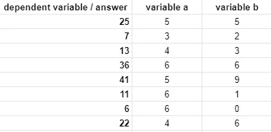
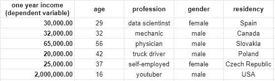
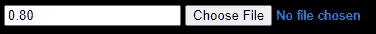
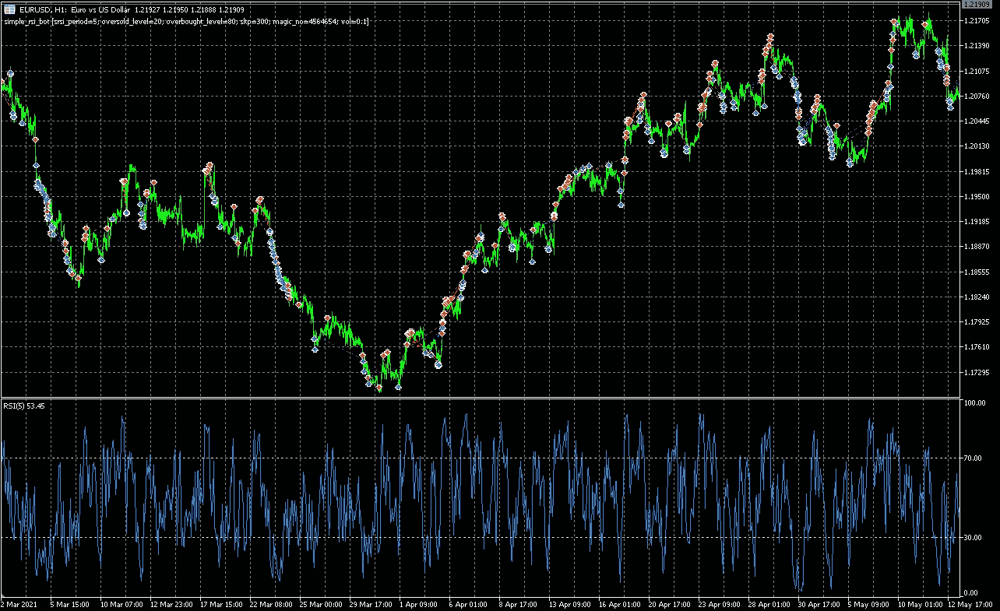
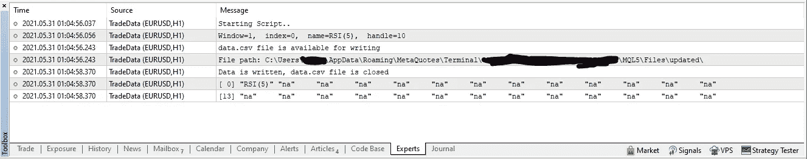
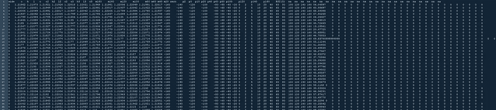
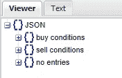
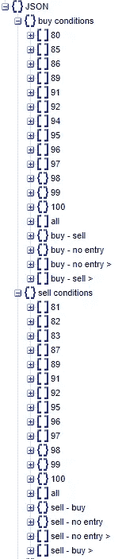
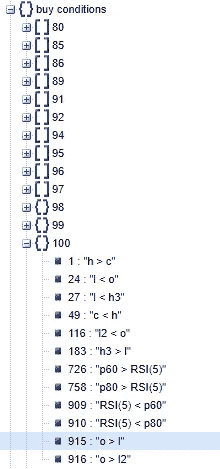
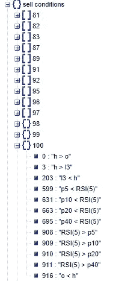

# 人工智能简介:从头开始构建基本线性回归算法的教程(包括源代码)

> 原文：<https://levelup.gitconnected.com/introduction-to-ai-an-a-to-z-tutorial-for-building-a-basic-linear-regression-algorithm-from-ab7faea53a0b>

我和艾的关系开始于不久前。是的，我小时候在电影《终结者》、《天网变得有自我意识并摧毁世界》中多次听说过它……但随着时间的推移，新闻文章和视频描述了游戏、自动驾驶和其他应用程序在现实生活中的突破。

在某个时候，我意识到人工智能实际上是不可避免的下一件事，而不是加密或其他东西(尽管加密在未来几年可能会有多种应用和粉丝群)……这不是因为人工智能是当今的热门话题之一，也不是因为人们认为它很酷，而是因为我们一直在朝着这个方向前进:

*   使用原始工具提高劳动生产率(从古代文明开始)；
*   自动化大规模生产线，使用基于蒸汽机的机器取代劳动力，更快地做更多的手工工作(工业化)；
*   发明计算机和互联网以更高精度做更多脑力劳动+使用可编程流水线机器人(信息时代)；

这里的关键词是**更自动化**，随着时间的推移，我们积累的经验和知识越来越多，我们自动化了越来越复杂的任务，任务越复杂，就需要更聪明的人来做，就需要更聪明的工具来取代那些人。

我们真的需要所有这些不断增长的生产力吗？几乎可以肯定的是，这种趋势并没有让我们更快乐，但是我们想要探索&扩展我们对宇宙的理解，为了探索和理解更多，我们必须能够做更多的事情。

所以我在 Udemy 上购买了一门课程，但没有完成。大约一年过去了，我在自己的项目中偶然发现了一个数据分析问题，如果手动完成，将需要大量的时间，因此我搜索了一下，果然我找到的解决方案之一是租用谷歌云的人工智能什么的，然后我在 youtube 上观看了一个视频教程，准备了我的数据，上传了它，选择了线性回归算法，并运行了几个小时。

一般来说，我非常相信不要重新发明轮子，如果我有一个简单的任务要做，即使我已经做了几个月这样的任务，并且我或多或少地擅长它，我更喜欢使用相关的库、框架等等来自动化它们。我认为从头开始做已经重复做过的事情是没有意义的，你可以使用你自己的类和代码片段(在软件项目中)或者其他人的，但是为什么你要写完全相同的代码 10 次甚至两次呢？我觉得没必要。

然而，几个小时后，谷歌提出了一个解决方案，但事实证明，该解决方案将用于相同的地方来分析其他数据集，这是我试图做的事情的简化版本:

在第一列中，有答案，算法应该遍历这个列表，并找出一个包含变量 **a** 和变量 **b** 的公式，该公式给出的正确答案百分比最高，因此让我们尝试一个公式`a*b`:

*   `**5*5 = 25 — OK**`
*   `3*2 = 6 — ERR`
*   `4*3 = 12 — ERR`
*   `**6*6 = 36 — OK**`
*   `5*9 = 45 — ERR`
*   `6*1 = 6 — ERR`
*   `4*6 = 24 — ERR`

7 个答案中只有 2 个(28.57%)被证明是正确的，您可以设置正确答案的最小可接受百分比，以及允许的偏差，您可能不在乎正确答案是否是 40，而是得到 42，但如果差异大于 2，答案将不会被接受。

让我们看一下最大可接受偏差为+/- 2 的同一列表:

*   `**5*5 = 25(0) — OK**`
*   `**3*2 = 6(-1)—OK**`
*   `**4*3 = 12(-1)—OK**`
*   `**6*6 = 36(0) — OK**`
*   `5*9 = 45(-4) — ERR`
*   `6*1 = 6(-5) — ERR`
*   `**4*6 = 24(+2)—OK**`

出于比较的目的，我们通常需要我们能得到的所有关于准确性的信息，在这种情况下，我们肯定需要平均偏差(绝对值):`**(0+1+1+0+4+5+2)/7=1.8571**`

在某些情况下，我们可能还需要找到一个缺失的变量，而不仅仅是两个已知变量之间的关系。我们没有达到 100%的准确性，所以我们现在甚至可能有一个丢失的变量。

这种研究用于确定性别、年龄和其他因素如何决定个人的期望工资，例如，

或者患者身上的哪一组体征可能预示着某种可能性很高的疾病…

这些迹象可能是血压的变化，体内某些激素产生的变化，这些综合起来可能是一些重要事情的迹象，但肉眼不会注意到，特别是在疾病的早期阶段，此时疾病更容易治疗，症状也不够严重，无法立即注意到。

实际上，我们很少拥有所有的因素/变量，因此不可能做出 100%准确的预测，线性回归算法通常会得出这些值的近似值，并给出该近似值的准确百分比。

现在，整体概念已经清楚了，让我们做一些实际的编码，并创建一个算法来逆向工程一个交易机器人，好吗？

> **剧透预警:**香草 PHP 前方:-)！

嗯……好消息是它有效……

用您选择的任何名称创建一个新的 PHP 文件，让我们开始吧:

我基本上为异常长的执行时间准备了环境，并创建了一些变量来存储统计数据。(PHP 版本是 7.x)。

我们需要一个函数来输出每一步的信息:

理解两个变量之间关系的简单函数，它只理解`>`、`<`和`=`:

我们将处理一个 CSV 文件，因此如果文件没有上传，我们将显示一个 HTML 文件上传表单:

我们也可以输入一个自定义的小数最小精度值`(0.8 = 80%, default = 80% )`

一旦我们有了第一行数据，我们就可以使用我们的`compare`函数比较其中的所有变量，这需要很多次迭代(`N²`，其中`N`是给定行中的变量数量)，所以让我们创建另一个函数来完成这项工作:

这是我们目前的网络界面:

一旦我们选择了文件，它将使用 javascript 自动提交，然后使用 PHP 进行处理:

**简要概述:**这个脚本逆向工程一个 MetaTrader 4 或 5 交易机器人，我们在 **MetaTrader 策略测试器**(可视模式)中运行该机器人，它在图表上显示所有交易(买入/卖出条目)。测试完成后，我们添加一系列不同的指标。如果你用肉眼观察图表，你可能会注意到在买入或卖出信号产生之前，某些条件正在发生，但是我们没有试图手动识别这些条件，而是导出所有的数据(指标值、买入/卖出的价格和时间、OHLC 价格数据等等)，并导入到我们的 PHP 脚本中进行处理。

为了导出数据，我们需要在这张图表上启动一个 MetaTrader 5 bot(专门为此创建的)(支持多达 26 个您选择的指标)，下面是源代码:

这里还有一个 PHP 文件的组合源代码:

值得注意的是，如果我们要分析的交易机器人使用超过 1 组的进入标准(当一组或另一组足以产生买入或卖出信号时)，这个脚本将不起作用，因此，让我们继续创建一个非常简单的机器人来完成本教程，看看会发生什么:

让我们在 MT5 策略测试器中编译并运行它，我在最后得到了这个图表，上面显示了所有的交易:

是时候启动 **TradeData** bot 了，这是我在`Toolbox > Experts`窗口中的输出:

它显示了图表上现在有哪些指标(在本例中，RSI 的周期为 5)，我们还可以看到我们的数据导出到了哪里，这是文件内部的样子:

在我们将它导入 PHP 脚本之前，请确保您的服务器已经将`upload_max_filesize`和`post_max_size` php.ini 设置为`256M`或更高。应启用文件上传。

如果你安装了 Microsoft Excel，它通常会自动分配`*.csv`文件给自己，PHP 会读取文件类型为`application/vnd.ms-excel`。请在 PHP 脚本中修改这一行:

`if ($file_arr[“type”] === “text/plain” || $file_arr[“type”] === “application/octet-stream”)`

像这样:

`if ($file_arr[“type”] === “application/vnd.ms-excel” || $file_arr[“type”] === “text/plain” || $file_arr[“type”] === “application/octet-stream”)`

您可能还需要在 PHP 文件的开头增加`init_set(‘max_execution_time’,300)`的值，以防执行时间变长。

等待一段时间后，我们得到了 JSON 格式的输出:

复制粘贴到 JSON 浏览器的某个地方，我用的是[http://jsonviewer.stack.hu/](http://jsonviewer.stack.hu/)。最初，有 3 个子节点:

*   购买条件
*   销售条件
*   没有条目

展开**买入条件**和**卖出条件**，你会看到一个列表:

我们的默认设置是 80%的最低准确率，我们有一个列表，包含**买入进入标准**(买入条件)和**卖出进入标准**(卖出条件)，按照准确率从 80%到 100%排序。之后我们有:

*   80% — 100%准确度范围内所有标准的总和；
*   仅在`buy`或`sell`交易期间出现的标准(没有`sell`的`buy`和没有`buy`的`sell`(或`buy` 减去`sell`条件和`sell`减去`buy`条件)。
*   然后我们有`buy`减去`no entry`和`sell`减去`no entry`。
*   列表中最后 2 个子节点和前面 2 个子节点是一样的，但是重复的都被去掉了，比如说如果 buy 的一个标准是:`close price > open price`，`open price < close price`就会被过滤掉，因为只是一样的东西反过来了。

值得注意的是，最后 4 个子节点考虑了我们的精度设置，包括 80–100%精度范围内的所有标准，我们可以选择更高的值，但现在，让我们打开 100%精度标准:

首先，我们有通常的嫌疑人:

*   `high > low`
*   `low < high`以此类推...反正几乎都是真的，没意思…

例如，`p60`表示加 60 或者零上 60，或者仅仅是 60，`m60`就会是-60。`ohlc`分别是开盘价、最高价、最低价和收盘价，如果它们带有数字，则是历史价格数据中的一个指数，`o`是当前的开盘价，`o1`是之前的开盘价，以此类推。

在买入条件下，我们看到周期为 5 `RSI(5)`的 RSI 指标在 100%的时间里小于 60(当然也是 80)。

在卖出条件下，`RSI(5)`大于 40 的时间为 100%。

这两种情况确实 100%正确，但是机器人使用的实际超卖/超买水平分别是 20 和 80，而不仅仅是 60 和 40。

出于某种原因，算法挖掘得不够深入。这肯定可以在下一篇教程中解决。

感谢阅读！更多人工智能教程，请随意查看下面的链接:

 [## 用 C#构建生成量化交易策略的人工智能(第 6 部分)

### 最后，在这里…

levelup.gitconnected.com](/build-ai-for-generating-quant-trading-strategies-in-c-part-6-addb194f42fb)  [## 用 C#构建生成量化交易策略的人工智能(第 5 部分)

### 智能人工智能附加策略的快速原型和验证

levelup.gitconnected.com](/build-ai-for-generating-quant-trading-strategies-in-c-part-5-479fb00745ae)  [## 用 C#构建生成量化交易策略的人工智能(第 4 部分)

### 如何将 MetaTrader 5 的历史价格数据导出到 CSV？

levelup.gitconnected.com](/build-ai-for-generating-quant-trading-strategies-in-c-part-4-cfb3024483d4)  [## 用 C#构建生成量化交易策略的人工智能(第 3 部分)

### 这是系列教程的第三篇文章:为自动生成 quant 交易策略构建人工智能，为…

levelup.gitconnected.com](/build-ai-for-generating-quant-trading-strategies-in-c-part-3-da04c0fdd90f)  [## 用 C#构建生成量化交易策略的人工智能(第 2 部分)

### 这是系列教程的第二篇:构建自动生成 quant 交易策略的人工智能…

levelup.gitconnected.com](/build-ai-for-generating-quant-trading-strategies-in-c-part-2-87cef6fccc3c)  [## 用 C#构建生成量化交易策略的人工智能(第 1 部分)

### 让我以一个问题开始:你听说过 Citadel LLC，文艺复兴科技，两个适马，或者，也许，D. E…

levelup.gitconnected.com](/part-one-building-ai-for-generating-quant-trading-strategies-in-c-8cc2afb88955) 

# 你想要更多免费的东西吗？

> 免责声明:这些包含附属链接，如果您使用它们，我可能会收到报酬。

在几秒钟内部署您的下一个应用:**使用此链接从数字海洋**获得 100 美元的云积分:【https://m.do.co/c/8c5a2698b1a2】T2

[**【140 美元起 FBS**](https://fbs.com/promo/trade-100usd?ppu=193551) **:** 这家经纪公司受 IFSC 监管，是历史最悠久、最老牌的机构之一，自 2009 年开始运营。

**要求:**

*   [注册一个有 140 美元的新账户](https://fbs.com/promo/trade-100usd?ppu=193551)
*   利用 1:500 的杠杆，让你的利润最大化
*   你可以提取所有利润

**可用市场:**加密货币、股票、差价合约、金属、商品、外汇

[**【tick mill】30 美元**](https://secure.tickmill.com/redirect/index.php?cii=15604&cis=1&lp=https%3A%2F%2Ftickmill.com%2Fpromotions%2Fwelcome-account%2F) :受 FSA 监管，该经纪商自 2015 年开始运营。

**要求:**

*   注册一个有 30 美元的新账户
*   使用高达 1:500 的杠杆来最大化您的利润
*   在 5 手交易后提取利润
*   最高取款金额是 300 美元

**可用市场:**股票指数，石油，贵金属，债券，外汇。

[**【Roboforex】30 美元**](http://www.roboforex.com/clients/promotions/welcome-program/?a=arag) :受 CySEC 和 IFSC 监管，Roboforex 自 2009 年开始运营，是当今交易者中最受欢迎和信任的经纪商之一。

**要求:**

*   [开立账户](http://www.roboforex.com/clients/promotions/welcome-program/?a=arag)并存入 10 美元以验证您的支付方式(可随时提取)并获得 30 美元作为礼物
*   **利润可无限制提取**
*   如果你交易了必要数量的手，你也可以提取 30 美元

**可用市场:**股票(所有纽交所、纳斯达克、美国证券交易所股票+德国和中国上市公司)、股票差价合约(所有股票差价合约、*、美国上市股票每笔交易费 1.5 美元)*、指数、ETF、商品、金属、能源商品、加密货币、加密指数、外汇。

祝您愉快！