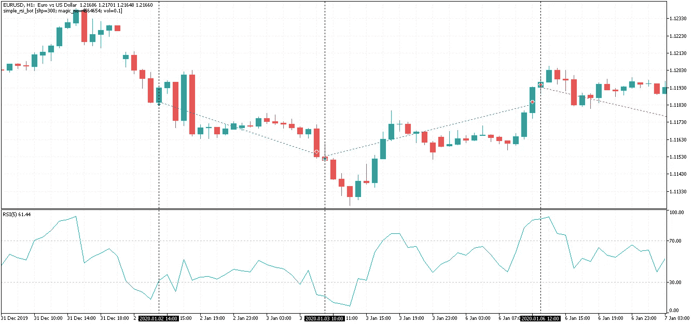
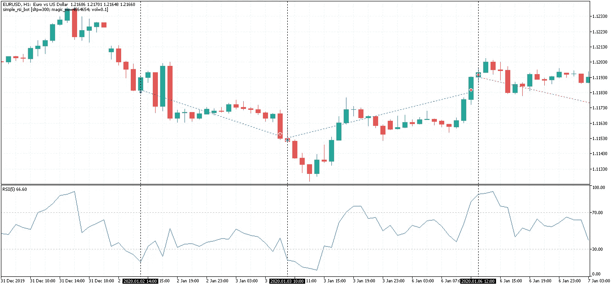
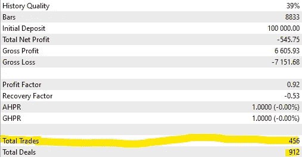
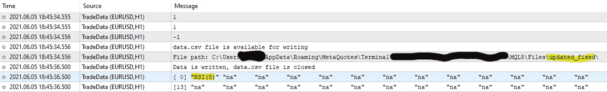
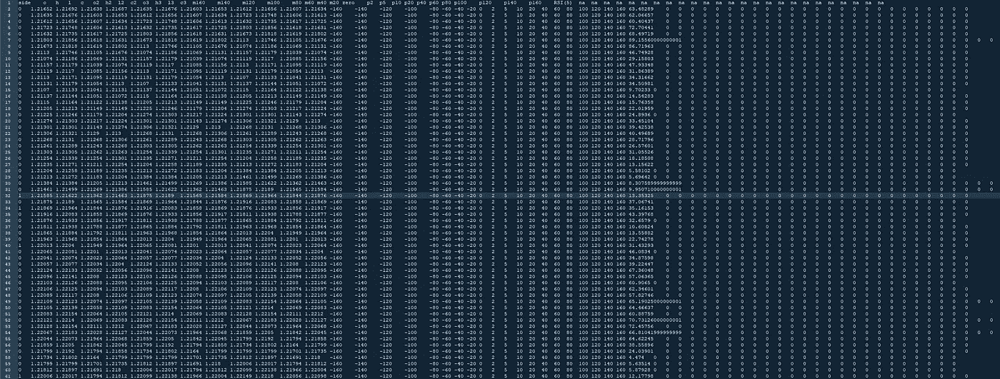
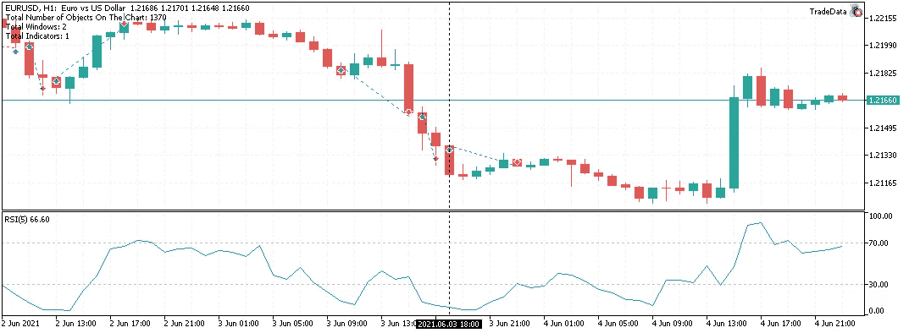
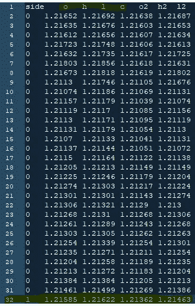
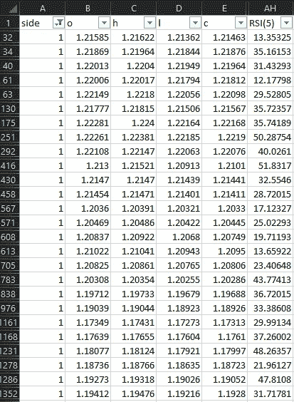

# 人工智能简介:改进我们的线性回归算法

> 原文：<https://levelup.gitconnected.com/introduction-to-ai-refining-our-linear-regression-algorithm-d0f6c80a89b9>

在第一部分中，我偶然发现了一个问题，该算法没有深入到足以生成它试图反向工程的编译程序的准确源代码，所以在这里，我们将一步一步地检查该算法，看看需要改变或添加什么，以便它给我们提供我们所需要的准确结果。

顺便说一句，如果你还没看过之前的教程，你可以看看:

[](/introduction-to-ai-an-a-to-z-tutorial-for-building-a-basic-linear-regression-algorithm-from-ab7faea53a0b) [## 人工智能简介:从 A 到 Z 的教程，从…

### 我和艾的关系开始于不久前。是的，小时候在电影里听过好多次…

levelup.gitconnected.com](/introduction-to-ai-an-a-to-z-tutorial-for-building-a-basic-linear-regression-algorithm-from-ab7faea53a0b) 

如果你对如何将线性回归应用于逆向工程编译程序感到有点困惑，对于一项极其困难的任务来说，这似乎是一种过于简单的方法——在这种情况下，软件是一个交易机器人，它处理历史价格数据以生成买卖交易信号，我们知道什么样的数据进入和输出，这就是线性回归的优势所在，然而， 这种方法不适用于将两个或更多交易逻辑结合在一起的交易机器人，我们需要特定的输入、特定的输出，并且只有一个算法对该输出负责。 我并不是说对更复杂的程序进行逆向工程是不可能的，但是要做到这一点需要的不仅仅是编码技能…

首先，我需要确保我的交易机器人正在做它应该做的事情:



我添加了垂直线，以便容易地识别 RSI 值在哪里，我认为我们错过了一个关键的组成部分:正如你在第一次交易中看到的，RSI 在 20 以上，这没有什么错，因为机器人根据前一根蜡烛的价格进行了买入交易，或者当下一根蜡烛被打开时，RSI 是基于收盘价的。为了验证这一点，我们可以更改 RSI 设置，使其适用于公开价格:



完全正确，我们的价格数据导出机器人可能有问题，它可能不是在输入之前导出蜡烛线数据，而是输入蜡烛线数据，如果确实如此，那么在我们稍微修改的图表上，一切都将完美地工作。

如你所见，我们在回溯测试中有 456 笔交易，我们稍后需要这个数字进行比较:



下面是我们的数据导出机器人的输出:



让我们看看我们有什么:



据此，我们的最后一笔交易是买入，这是事实:



OHLC 的数据与实际的 OHLC 相符吗？



一点也不 bot 导出的最后一笔交易实际上是最后一笔交易之前的交易，但是，导出的交易正好有 456 笔，RSI 值在导出的数据中到处都是:



似乎我们发现了一个问题—在我们的数据中。现在让我们手动修改数据，并确保算法有效，我将所有买入 RSI 值设置为 5，所有卖出 RSI 值设置为 95，如果 AI 正确识别了进入条件，它就可以完美地工作，我们只需要修复数据导出问题，我们的输出显示 456 笔交易，让我们检查一下其余的…

```
2021–06–05 03:31:59 displaying final raw results..
2021–06–05 03:31:59 # of sell trades is 241
2021–06–05 03:31:59 # of buy trades is 215
2021–06–05 03:31:59 displaying the number of trades by side..
2021–06–05 03:31:59 Array ( [1] => 215 [-1] => 241 [0] => 0 )
```

**买入条件减去(不含)卖出条件:**

```
l2 > l &&
h3 > h &&
c2 > c &&
l3 > l &&
o > c &&
o2 > c &&
c3 > c &&
o3 > c &&
o3 > l2 &&
h3 > o &&
h3 > c2 &&
o3 > l &&
o2 > l &&
h2 > c &&
h3 > c &&
c3 > l &&
h3 > l &&
**10 > RSI5[1] &&**
**20 > RSI5[1] &&**
40 > RSI5[1] &&
60 > RSI5[1] &&
80 > RSI5[1]
```

# 完美！

**和现在卖出条件减去(没有)买入条件:**

```
c2 > o3 &&
o > o3 &&
c > o &&
h > h2 &&
c > c2 &&
h > h3 &&
c > o2 &&
c > c3 &&
c > o3 &&
h2 > o3 &&
c2 > l3 &&
o > l3 &&
c > l2 &&
c > l3 &&
h > o2 &&
h > o3 &&
h > c3 &&
h > l3 &&
RSI5[1] > 5 &&
RSI5[1] > 10 &&
RSI5[1] > 20 &&
RSI5[1] > 40 &&
RSI5[1] > 60 &&
**RSI5[1] > 80**
```

**再次完美！**正如您所看到的，这是由我们的人工智能算法生成的实际源代码(交易逻辑),我们可以将它复制并粘贴到 Metaeditor IDE 中，它还会生成 JSON 输出，其中包含我们在之前的教程中介绍的有关统计数据和准确性的详细信息。

**感谢阅读！**

如需更多机器学习教程，请查看下面的链接:

[](/build-ai-for-generating-quant-trading-strategies-in-c-part-6-addb194f42fb) [## 用 C#构建生成量化交易策略的人工智能(第 6 部分)

### 最后，在这里…

levelup.gitconnected.com](/build-ai-for-generating-quant-trading-strategies-in-c-part-6-addb194f42fb) [](/build-ai-for-generating-quant-trading-strategies-in-c-part-5-479fb00745ae) [## 用 C#构建生成量化交易策略的人工智能(第 5 部分)

### 智能人工智能附加策略的快速原型和验证

levelup.gitconnected.com](/build-ai-for-generating-quant-trading-strategies-in-c-part-5-479fb00745ae) [](/build-ai-for-generating-quant-trading-strategies-in-c-part-4-cfb3024483d4) [## 用 C#构建生成量化交易策略的人工智能(第 4 部分)

### 如何将 MetaTrader 5 的历史价格数据导出到 CSV？

levelup.gitconnected.com](/build-ai-for-generating-quant-trading-strategies-in-c-part-4-cfb3024483d4) [](/build-ai-for-generating-quant-trading-strategies-in-c-part-3-da04c0fdd90f) [## 用 C#构建生成量化交易策略的人工智能(第 3 部分)

### 这是系列教程的第三篇文章:为自动生成 quant 交易策略构建人工智能，为…

levelup.gitconnected.com](/build-ai-for-generating-quant-trading-strategies-in-c-part-3-da04c0fdd90f) [](/build-ai-for-generating-quant-trading-strategies-in-c-part-2-87cef6fccc3c) [## 用 C#构建生成量化交易策略的人工智能(第 2 部分)

### 这是系列教程的第二篇:构建自动生成 quant 交易策略的人工智能…

levelup.gitconnected.com](/build-ai-for-generating-quant-trading-strategies-in-c-part-2-87cef6fccc3c) [](/part-one-building-ai-for-generating-quant-trading-strategies-in-c-8cc2afb88955) [## 用 C#构建生成量化交易策略的人工智能(第 1 部分)

### 让我以一个问题开始:你听说过 Citadel LLC，文艺复兴科技，两个适马，或者，也许，D. E…

levelup.gitconnected.com](/part-one-building-ai-for-generating-quant-trading-strategies-in-c-8cc2afb88955) 

你想知道我是做什么的吗？我是 Proxify Network 的高级软件开发人员。

现在 Proxify 正在寻找新的开发人员，所以我想在这里分享一些我的经历——与我在职业生涯中尝试的其他事情相比:
1️⃣友好和专业的 Proxify 团队以及他们对每个候选人的关心程度
2️⃣招聘过程非常简单，可以充分展示你的技能
3️⃣，最重要的是，Proxify 是寻找远程工作的理想方式，有无穷无尽的项目和公司可供选择。

在这里申请加入我的代理:[https://bit.ly/3hd64mN](https://bit.ly/3hd64mN)

# 祝您愉快！