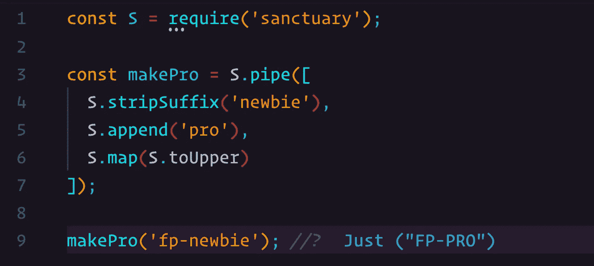

# 代数结构介绍—面向 JavaScript 开发人员的函数式编程

> 原文：<https://levelup.gitconnected.com/introduction-to-algebraic-structures-functional-programming-for-javascript-developers-cdd627943a4d>



恭喜你点击了一篇标题为“代数结构”的文章。我发现你不是那么容易被吓到的，我年轻的徒弟。我向你致敬！

玩笑归玩笑，今天我们来看看函数式程序员使用的一些常用术语。这个术语包含一些最初用于数学的定律。但是一些非常聪明的人发现这些定律也可以应用于计算机编程。

欢迎来到面向 JavaScript 开发人员的函数式编程的第七部分。我一直对报道这个话题很紧张。原因很简单，因为很容易混淆一些定义。所以，声明一下，我不是数学家。我只是一个发现函数式编程并爱上它的人。

不要把这篇文章看作是对这些理论的深入探究。在这样的一篇文章中涵盖它们简直是不可能的。坦率地说，我远不是合适的人告诉你非常先进的东西。然而，这篇文章应该包含足够的内容来教你你需要知道的基础知识。此外，我希望这篇文章能激起你的好奇心，让你去探索更多。

你现在进入了将懒惰的开发人员和那些想要成为他们领域专家的人分开的阶段。走到这一步，你很可能是后者。

# 身份功能

首先，让我们来看看什么是身份函数。抓紧了，它会让你大吃一惊的。准备好了吗？在这里！

```
//    id :: a -> a
const id = x => x;or function id (x) {
    return x;
}
```

你印象深刻吗？没有吗？

*顺便说一句，如果你想知道这段代码块顶部的注释，你可能应该看看关于* [*类型签名*](/type-signatures-functional-programming-for-javascript-developers-28ea03dc1192) *的文章。*

因此，identity 函数接受任何类型的参数。并返回同样的*东西*。像这样…

```
id (1); // 1
id ('hello'); // 'hello'
id (Just ([1, 2, 3])); // Just([1, 2, 3])
```

好吧，我承认，这看起来一点也不令人印象深刻。但是我提到这个特定的函数有一个很好的理由。当我们讨论不同代数结构的规律时，恒等函数被大量使用。所以从现在开始，当你看到这个函数，你就知道我在说什么了。

# 什么是代数结构

先来看类型`String`。您可能已经知道可以对其执行某些操作。你可以用另一个`String`来`concat`，你可以检查一个`String`是否等于另一个`String`的*，等等。这些都是很基本的东西，对吧？代数结构给了我们一种通用的语言，我们可以用我们的类型做“东西”，以及它们遵循什么规则。好了，我们再深入挖掘一下。*

看看等式，你可以对一个变量做`===`来比较它和另一个变量。是不是所有类型都有这个特点？让我们看一看…

```
'a'  === 'a'  // true
 1   ===  1   // true
true === true // true
[1]  === [1]  // false
```

嗯……看起来`Array Integer`型缺乏提供预期结果的能力。所以，平等并不是所有类型的特征。好吧，我们如何解决这个问题？这里有一个疯狂的建议，如果我们做一个新的函数呢？

警告！以下代码用于演示目的。不要这样操作`Array.prototype`。基于[幻想世界规范](https://github.com/fantasyland/fantasy-land)构建的库在这方面有很大不同。

现在，我们已经操作了内置的`Array`类型，这样我们就可以比较两个数组(一级深度)。这让我们开始学习我们的第一个代数结构的名字`Setoid`。类型在实现 equals 方法时会形成一个`Setoid`。

```
equals :: Setoid a => a ~> a -> Boolean
```

*我从来没跟你说过* `*~>*` *。这样读这个签名:* `*a*` *有一个叫* `*equals*` *的方法，它接受一个同类型的实参，返回一个* `*Boolean*` *。*

如果我们在代码中实现了上述的`Array.prototype.equals`，那么`Array String`、`Array Integer`和`Array Boolean`就是`Setoids`的例子。

值得注意的是，我们自己为所有内置类型定义方法并不理想(我们必须为`String`、`Integer`等等做同样的事情)。这就是强烈推荐使用像 [Sanctuary](https://sanctuary.js.org) 这样的标准库的原因。它将为您定义所有内置类型的`equals`方法，而不会污染`prototype`，正如我在上面的例子中所做的那样。当然不仅限于`Setoids`。它也会给你提供其他的代数结构。

为什么知道我们有一个`Setoid`很有用？好吧，现在，让我们先解决这个问题——现在，当你和我在一个实现了这个的项目中查看代码时，我们可以有一个共同的语言。我可以告诉你，比如说`Array Integer`是一个`Setoid`，这意味着你可以在它上面运行`equals`方法，通过提供另一个`Array Integer`，它保证会返回给你一个`Boolean`。

在这一点上，这似乎不是很有用。但是一旦你开始看到更多的代数结构，你会看到这些“单词”给我们提供了多少有用的信息。

# 函子

在关于类型签名的文章中，我简单回顾了一下`Functor`。但我没有告诉你细节。`Functor`是代数结构。那么关于`Functors`我们还能说些什么呢？首先，一个`Functor`必须实现`map`方法。

```
map :: Functor f => f a ~> (a -> b) -> f b
```

`*Functor a*` *，有一个方法，取一个从* `*a*` *到* `*b*` *的函数，返回* `*Functor b*` *。*

但是要成为一个`Functor`，必须遵守另外两个法则:

1.  函子同一律:
    如果我们提供`Identity`函数作为自变量，`map`函数一定返回同样的东西，就像这样:
    `[1, 2].map(x => x) // [1, 2]`
2.  函子合成法则:
    `[1].map(f).map(g) === [1].map(x => g (f (x)))` 意味着用函数`f`映射到`Functor`，然后用函数`g`映射，应该返回与用`x => g (f (x))`映射到`Functor`一次相同的结果。这通常有助于我们找到更有效的制图方法。

如果不遵守这些规则，我们就没有`Functor`。但是知道如果我告诉你一个类型是一个`Functor`，你可以安全地`map`，甚至相应地重构，这是非常有帮助的。

# 代数结构和关系

我不可能在一篇文章中涵盖所有的代数结构，因为它们太多了。但是我可以告诉你如何开始自己做研究。请看下图。


这张图片显示了在[幻想世界规范](https://github.com/fantasyland/fantasy-land)中定义的不同代数结构。希望现在你已经知道了这些都代表了一些行为和法则。现在，看看以`Functor`开始的树。在最底层，你会发现另一个叫做`Monad`的代数结构。这个图像告诉你`Monad`是一个`Applicative`，它也是一个`Apply`，最后是一个`Functor`。这应该告诉你`Monad`是一个相当强大的结构。因为我们知道，它遵循着它下面一切事物的规则。因此，如果有人告诉你一个类型是一个`Monad`，你有一个相当大的工具箱，你可以安全地做一些事情。但是首先，知道它下面的类型是如何工作的会很有帮助。

# 如何进一步了解代数结构

我想向您介绍一些资源，以便您可以了解更多关于不同结构的信息。我所知道的深入研究《幻境》中定义的代数结构的最佳资源是汤姆·哈丁的系列文章。通读这篇文章(没什么可读的)，我保证你会对所有的东西是如何组合在一起有一个很好的想法。

我也强烈推荐詹姆斯·辛克莱尔的四篇文章，关于“我希望有人解释过的关于函数式编程的事情”。这个系列对我的理解做了很多。

另外，如果你想开始动手，我推荐图书馆[避难所](https://sanctuary.js.org)。在我看来，这是遵循 JavaScript 中严格类型函数编程规则的最完整的库。它还有我见过的最友好的聊天工具。因此，如果你陷入困境，我保证你会在那里找到好的帮助。

最后，我希望你继续阅读我的系列文章。我们将在适当的时候讨论其他的代数结构。接下来还有很多。

在这里的最后是一些智慧的话。如果你一开始很难理解这个话题，不要气馁。就我个人而言，我也认为自己是个初学者。但是如果你和我一样，这个过程应该会启发你。作为一名开发人员，你正在经历巨大的飞跃。即使你不会作为一个函数式程序员全力以赴，这些都不是浪费。如果你通过了这篇文章，你就是少数认真的人之一。没有什么能阻止你成为最好的开发者。如果需要，我会一直在这里帮助你。

我们即将看到一些现实生活中的例子。敬请关注！下次再见，祝你好运！