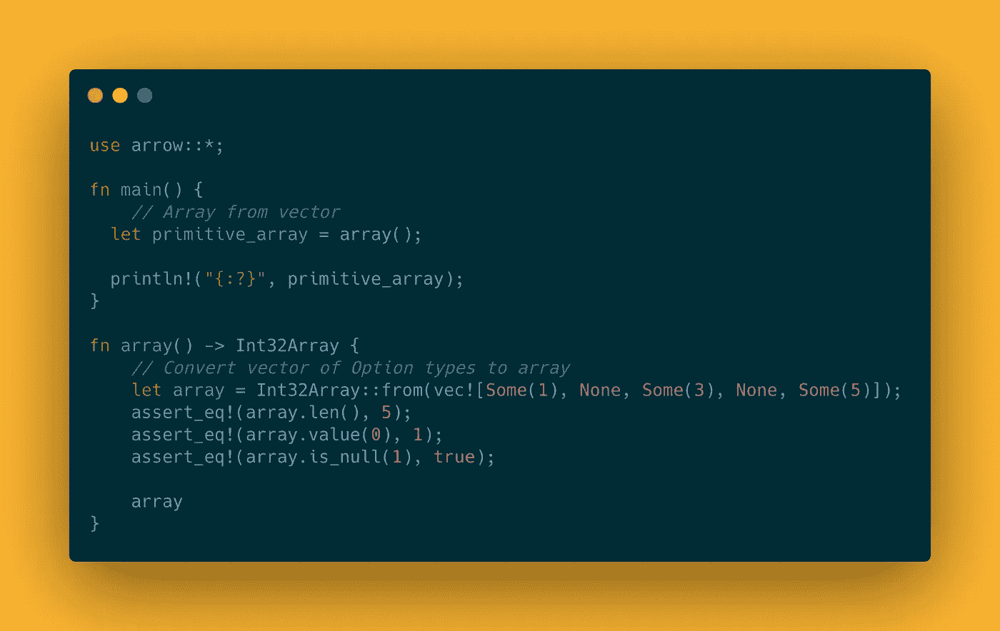
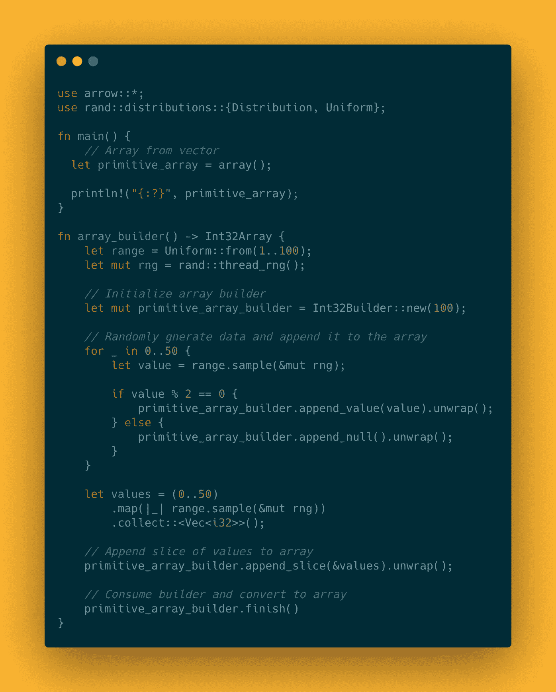
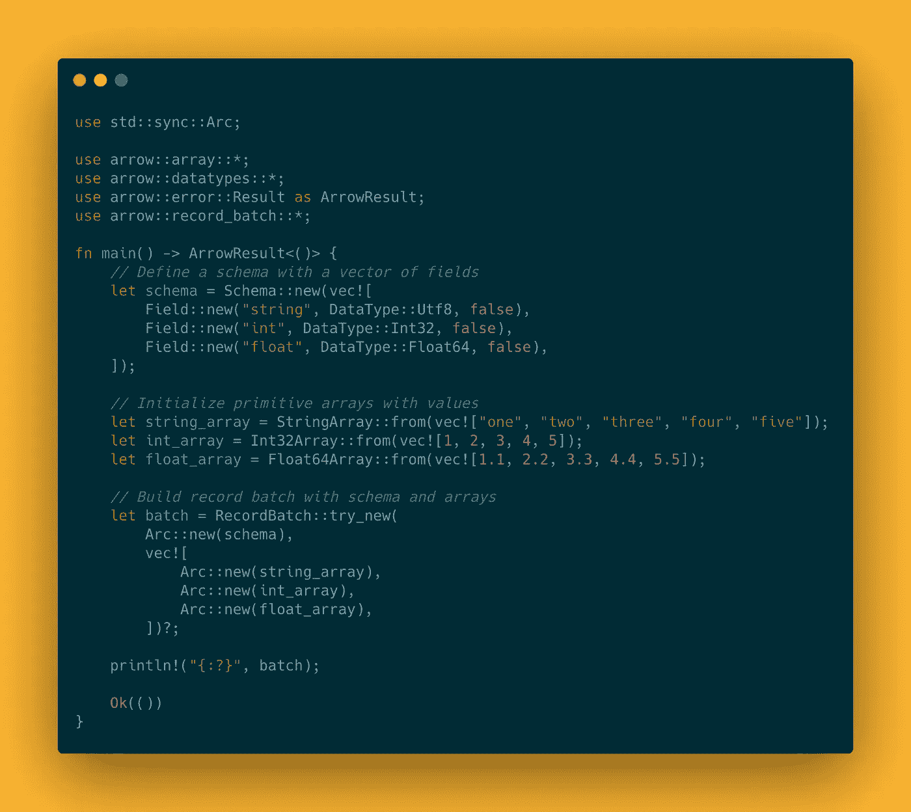
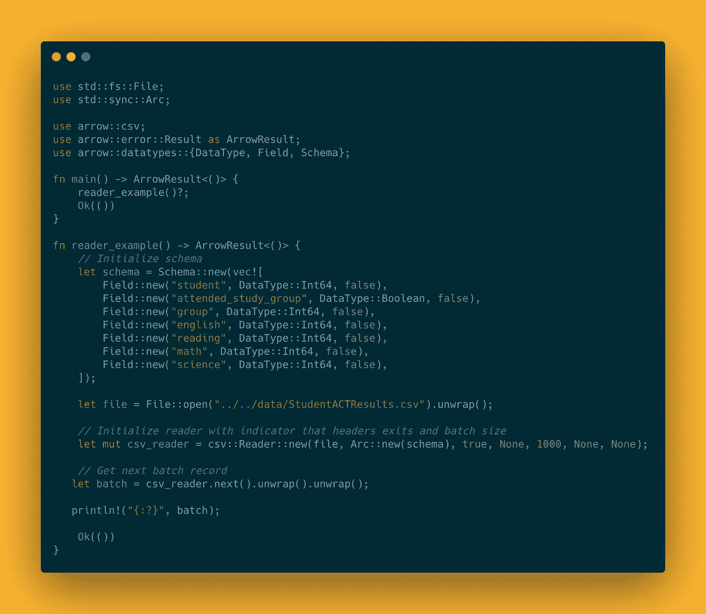
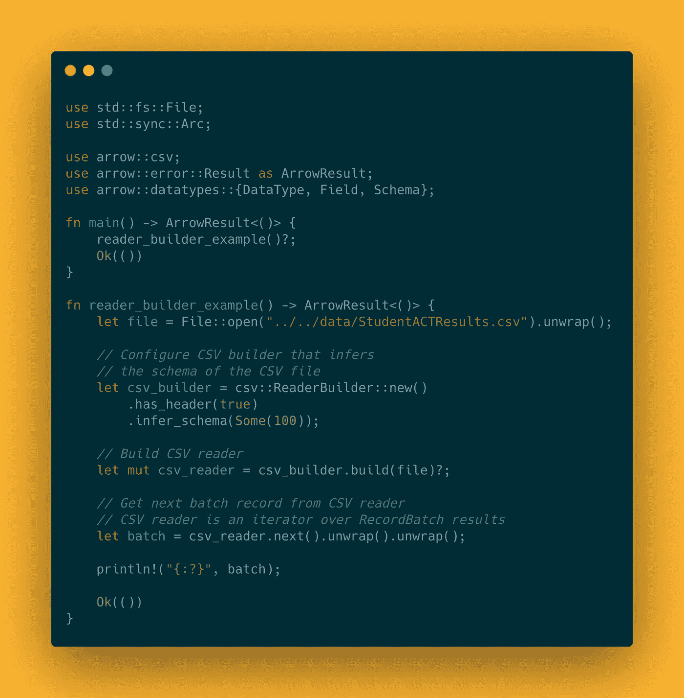
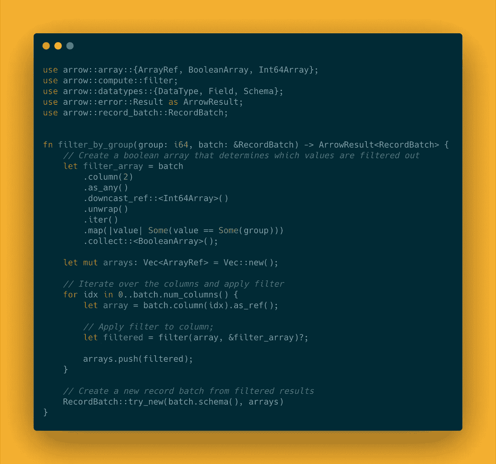
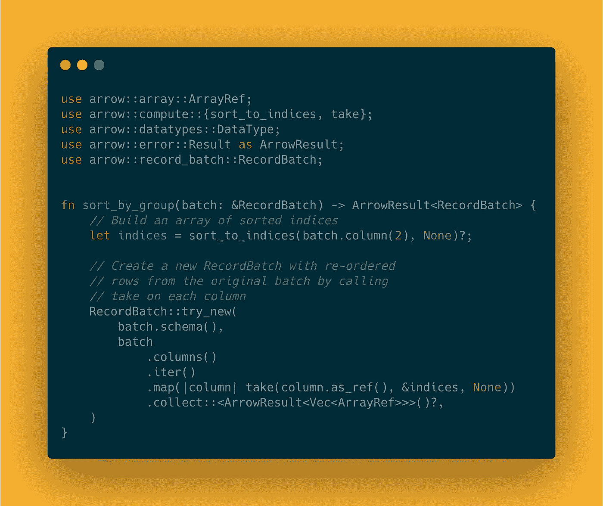
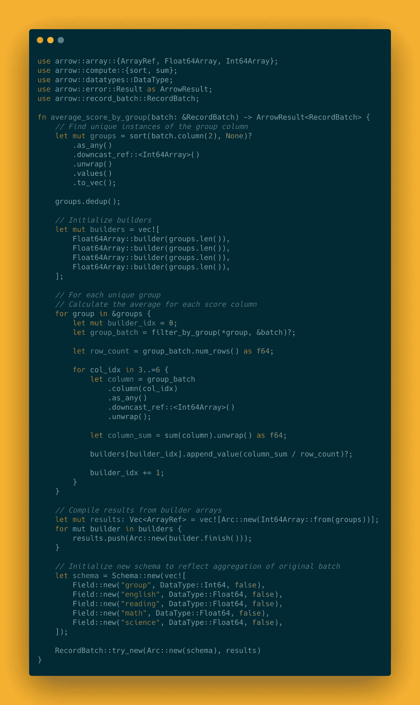

# 带锈阿帕奇箭简介

> 原文：<https://levelup.gitconnected.com/introduction-to-apache-arrow-with-rust-394f391ea455>

在过去的几个月里，我一直在开发一个负责处理内存数据的应用程序。这个项目令我兴奋有两个原因。一个是项目完全用 Rust 编写，另一个是了解新主题和库的机会。本文探讨了我在使用 Apache Arrow 时所学到的东西。

当我刚开始从事这个项目时，我并不知道 Apache Arrow。我只是需要一种尽可能高效地聚合数据的方法。我甚至构建了一个概念验证，它提供了我需要的大部分功能，包括连接。这是一个粗略的草稿，但我已经可以看出有一些性能问题。一个基本问题是聚合函数在数据结构上的性能，该数据结构以基于行的格式表示数据集。这种设计意味着基于列的操作，如过滤和数学运算，成本很高。还有一些其他的问题，所以我决定做更多的研究，最终导致我的阿帕奇箭头。

# 什么是阿帕奇箭

Apache Arrow 是一个语言无关的软件开发平台，用于构建处理和传输大型数据集的应用程序。该产品不仅提供了面向列的数据格式，还提供了其他一些有用的库和由 Apache 软件基金会维护的开发人员生态系统。

## 存储格式

Apache Arrow 的核心特性是其内存中的列数据格式，这是一种在内存中构建表格数据集的规范，并提供了一个定义良好的类型系统。这使得该格式成为数据库系统或数据框库等项目的理想构建块。这种内存格式的一个主要优点是，它擅长处理大块数据，并支持使用 SIMD 运算进行矢量化。

## 图书馆

其他库作为 Apache Arrow 的伙伴提供。它们提供了您不想自己实现的常见功能。我发现两个特定于 Rust 的库很有用，它们是[数据融合](https://crates.io/crates/datafusion)和[箭头飞行](https://crates.io/crates/arrow-flight)。DataFusion 是一个基于 Apache Arrow 构建的查询引擎，它提供了数据框架和 SQL 查询 API。Arrow Flight 是一个序列化库，用于通过网络传输数据。我将在后面的文章中更详细地介绍这些库。

## 开发者生态系统

决定使用 Apache Arrow 的一个重要因素是开发者生态系统。Apache Arrow 由 Apache 软件基金会维护，该基金会提供了一个管理机构和决策过程。该基金会还致力于维护一个对所有人开放的开源开发者社区。

# 铁锈箭头实施

Apache Arrow 有多种实现方式，但我将重点介绍 [Rust 版本](https://crates.io/crates/arrow)。本节将分为四个部分:低级数组、高级构造、数据读取器和计算内核。不是库的每一个方面都将被涵盖，但仅仅足够得到一个如何使用它的好主意。

## 低级阵列

Rust 实现的关键部分是数组特征。它表示一个通用的、固定大小的、不可变的、线程安全的可空元素数组。构造数组有两种方法:转换器方法和生成器方法。

converter 方法用于从本地 Rust 类型的向量中构造数组实例。在我看来，这种方法是最常见的，因为迭代一组数据并将这些数据收集到一个向量中是非常常见的。使用 converter 方法可能如下所示:

用转换器构造的原始数组

在这个代码片段中，`Int32Array`是一个`Array`，它表示一个可选的 32 位有符号整数数组。`from`方法采用一个由`Option<i32>`个值组成的向量来构造数组。有几个`Array`特征的实现，所以一定要查看文档中`Array`的正确类型。

builder 方法是一种通过向数组追加值来构造数组的方法。这对于从值动态构造数组很有用。下面是一个使用 builder 方法的示例:

从生成器构造的原始数组

在上面的例子中，`Int32Builder`用于初始化一个容量为 100 个元素的构建器实例。对于前 50 个元素，如果生成的值是偶数，则将其追加到数组中，否则，将追加一个空值——这不是一个实际的`null`值。对于最后 50 个元素，生成的值被收集到一个向量中，然后作为一个切片附加到数组中。`finish`方法将构建器实例转换成数组实例。

## 高层建筑

数组是处理数据的一种非常强大的抽象。然而，它们并没有提供一种处理表格数据集的简单方法。这就是这些高级结构出现的原因。三种数据结构与低级数组一起表示一个数据集:

*   `Field` —定义单列数据的元数据
*   `Schema` —定义数据集的元数据，包含一个矢量`Field`
*   `RecordBatch` —定义一个二维数据集，包含相同长度的低级数组和一个与数组类型匹配的`Schema`

`RecordBatch`类型为处理数据集提供了一个方便的接口，是计算和序列化等任务最常见的结构。下面是使用这些类型表示数据集的示例:

由记录批、模式、字段类型表示的数据集

在上面的例子中，`RecordBatch`类型成为包装模式和原始数组的顶级组件。需要注意的一点是`RecordBatch`由指向模式和单个原始数组的原子引用计数指针组成。使用这种类型的引用是 Apache Arrow 能够提供零拷贝读取的一个重要原因。

## 数据阅读器

从 Apache Arrow 的核心组件构建数据集的能力具有有限的用例。有一种明确的需求，即不需要太多的努力就可以将数据读入 Apache Arrow 内存格式。在 Apache Arrow 的 Rust 实现中，提供的数据读取器之一是 CSV 读取器。

CSV 阅读器从 CSV 文件中读取记录，然后根据模式将列转换为适当的原始数组类型。CSV 阅读器可以直接使用，也可以通过自定义设置从构建器对象生成。直接使用 CSV 阅读器可能如下所示:

使用 CSV 阅读器读取数据

在此示例中，定义了一个模式来表示 CSV 文件中的数据。CSV 阅读器是使用打开的文件、对模式的引用和一些配置细节(如文件是否有头和批处理大小)创建的。批量大小是一个有趣的参数，因为它决定了将生成多少批记录。例如，如果您有一个包含 10，000 条记录的 CSV 文件，并且批量大小为 1000，那么读取器最终将返回 10 个`RecordBatch`实例的集合。另一个有趣的特性是 CSV 阅读器是一个迭代器。这意味着读取器可以用于 Rust 中的 for 循环或任何其他迭代方法。

CSV 阅读器也可以从 builder 对象生成，这提供了更多的灵活性。使用构建器方法可能如下所示:

用阅读器构建器构建阅读器

这个例子演示了如何使用`ReaderBuilder`创建一个 builder 对象，该对象被配置为期望文件中的头，并试图从文件的前 100 条记录中推断出模式。`build`方法将尝试使用构建器，并返回一个具有与文件中的内容相匹配的模式的读取器。

## 计算内核

计算内核是 Apache Arrow 的核心。提供了许多内核函数，但是本节将只详细介绍过滤和排序函数。

filter 函数引用一个数据数组和一个布尔值数组，指示该位置的元素是否应该被过滤。要过滤一个`RecordBatch`对象中的数组，过滤函数必须应用于所有使用相同布尔数组的数组。例如，通过`group`列过滤 CSV 数据可能如下所示:

使用 filter 方法的示例

在这个例子中，通过比较`group`列的每个元素和`group`参数的值来创建一个过滤器数组。然后，使用过滤器阵列来过滤批次中的每一列。使用原始模式和过滤后的数组创建并返回一个新的`RecordBatch`实例。

Apache Arrow 提供了一些与排序相关的函数。与本例相关的是`sort_to_indices`函数，它引用一个数据数组和一个可选的`SortOptions`对象，并返回一个表示数组中元素新位置的无符号整数数组。这里有一个例子:

使用排序方法的示例

这个例子通过调用引用了`group`列并且没有排序选项的`sort_to_indices`函数构建了一个索引数组。然后将`take`函数映射到所有列，根据排序后的索引对数组进行重新排序。使用相同的模式和排序后的数组创建并返回一个新的`RecordBatch`对象。

Apache Arrow 库专注于底层操作。这意味着一些常见的数据聚合操作不是 API 的一部分。例如，没有按功能分组。但是，group by 功能可以通过筛选、排序和选择聚合函数来实现。这里有一个例子:

通过以下方式实现组的示例

该示例首先通过对`group`列进行排序、将值收集到一个向量中并删除重复值来查找唯一的`group`列值。构建器数组的向量被初始化以保存每个分数列的平均分数。对于每个独特的组，`filter_by_group`函数用于查找所有相应的分值。计算该组中每一列的平均值，并将其附加到相应的生成器中。然后收集构建器的结果，创建一个表示新结构的新模式，并返回一个`RecordBatch`实例。

# 最后的想法

还有许多其他的主题要探讨，但是主要目标是提供 Apache Arrow 和 Rust 实现的概述。我使用 Apache Arrow 的体验是非常积极的。本库没有提供您可能需要的高级聚合方法，但这不是本库的目的。它提供了构建模块，但你必须将它们组合在一起。

# 谢谢

感谢阅读！如果你想联系或想提供反馈，请随时通过 [LinkedIn](https://www.linkedin.com/in/andrewleverette/) 联系我。

# 相关文章

 [## 在 Rust 中使用 CSV 数据

### CSV 文件格式是存储表格数据的一种非常常用的方法。这篇文章涵盖了阅读和…

levelup.gitconnected.com](/working-with-csv-data-in-rust-7258163252f8) 

# 资源

*   [CSV 文件模式](https://mockaroo.com/42fd4a20)
*   [代码示例](https://github.com/andrewleverette/data_wrangling_with_rust/tree/main/introduction_to_apache_arrow_with_rust)
*   [阿帕奇箭头](https://arrow.apache.org/)
*   [生锈箭头文档](https://docs.rs/arrow/3.0.0/arrow/)