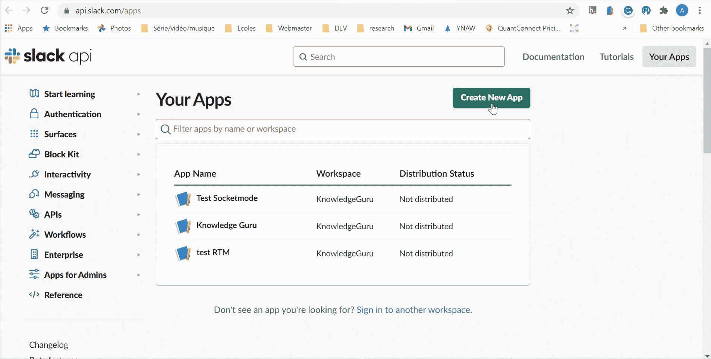
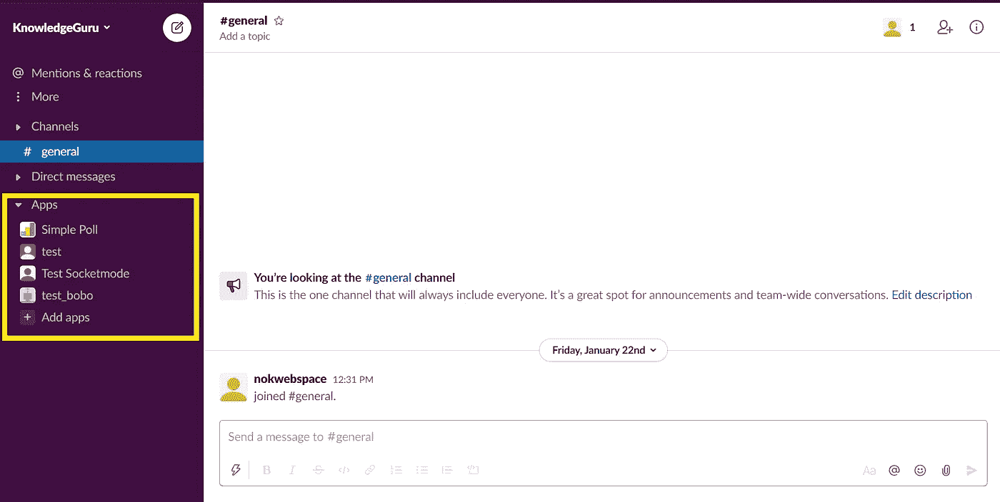
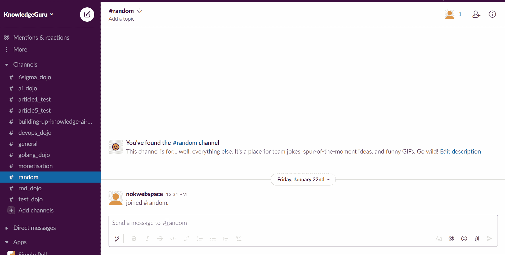
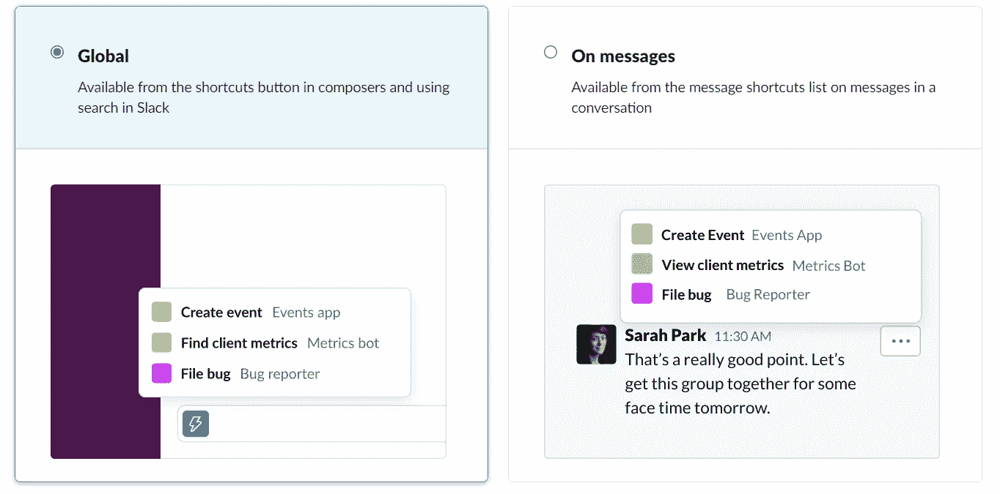

# App Manifest 简介:Slack 应用开发者期待已久的功能现已进入测试阶段

> 原文：<https://levelup.gitconnected.com/introduction-to-app-manifest-a-long-awaited-feature-by-slack-app-developers-is-now-in-beta-fe35e8f914ee>

lack 过去没有正式的方法将你的应用程序配置成代码。因此，为了让你的 SlackBot 能够做一些你过去通过 Slack 专用 UI 手动激活你想要的特性的事情。假设你清楚那里有什么特征。

照片由[亚伦·伯顿](https://unsplash.com/@aaronburden?utm_source=medium&utm_medium=referral)在 [Unsplash](https://unsplash.com?utm_source=medium&utm_medium=referral) 上拍摄

上周早些时候，我很高兴地发现 Slack 在测试版中推出了**应用清单**。一种从配置文件配置应用程序的简单方法，您可以将配置文件与代码放在一起。

> *使用我们的应用清单系统轻松创建、配置和复制您的 Slack 应用。* [*正式文档*](https://api.slack.com/reference/manifests)

我很高兴发现这个特性的原因是，我总是发现在 Slack 管理 UI 和文档中导航很困难，但是这个新特性实际上充当了在创建 Slack 应用程序时您可能想要了解的所有特性的索引。

因此，我希望这篇文章不仅能介绍**应用清单**，还能作为所有 Slack 应用特性的**词汇表。**

# 松弛应用清单概述

从清单创建完全配置的应用程序是一个简单的三步过程。你不需要写很长的文档来说明需要配置什么来让机器人工作。你只需要一个简单明了的 YAML 配置。从现在开始，我将亲自提交我的应用清单和代码。

从清单创建应用程序的三个步骤

让我们从大图开始，然后深入了解您可以使用 Slack App Manifest 配置什么。下面是 Slack 为我的一个项目生成的清单的例子。

值得一提的是，Slack 正在提供三个 App 清单的例子。这些例子都附有教程。如果你还没有自己创建一个 Slack Bot，这些教程是最好的起点之一。当然，这个特性对于教程来说是很棒的，它去掉了繁琐的设置部分。自己看:

*   [发布互动通知](https://api.slack.com/tutorials/tracks/actionable-notifications)
*   [按时间表发布消息](https://api.slack.com/tutorials/tracks/scheduling-messages)
*   [收集产品反馈](https://api.slack.com/tutorials/tracks/collecting-feedback)

我确信现在每个教程都会有一个预定义的应用清单，帮助读者只需点击几下鼠标就可以设置好。然而，到目前为止，**我没有看到从应用清单**部分编辑配置的选项，这意味着您仍然必须使用 UI 来更新现有应用的配置。让我们期待更新功能在未来出现😟。

> 在这一点上，App Manifest 更像是一个 boostrap 配置，而不是 GitOps 类型的配置。

我们可以注意到四个重要的部分`display_information`、`features`、`oauth_config`、`settings`。让我们深入其中的每一个，并发现 Slack 应用程序的关键特性。

# 深入了解松弛的应用配置

## 显示信息

您的申请的一般信息可以在`display_information`下定义。该信息将反映在[应用程序目录](https://slack.com/intl/en-ca/apps%22)(又名。Slack App Marketplace)和[应用主页](https://api.slack.com/start/overview#app_home)的“关于”部分。

## Oauth 配置(Web API)

你想用 [Slack Web API](https://api.slack.com/methods) 做的一切都需要一个特定的`scope`；无论您是希望通过 [chat.postMessage](https://api.slack.com/methods/chat.postMessage) 在频道中发布消息，还是使用 [user.info](https://api.slack.com/methods/users.info) 获取用户姓名来个性化消息，您都需要添加所需的`scopes`。例如:

## 设置(事件 API 和交互消息)

从我的角度来看，`settings`似乎把所有涉及到 Slack 的事件驱动部分的东西都分组了，即 [Slack 事件 API](https://api.slack.com/apis/connections/events-api) 和 [Slack 交互消息](https://api.slack.com/interactivity)

有了 App Manifest，激活交互消息和配置回调 URL 就变得简单了。

订阅您想要接收的事件也非常简单

相反，如果你不想公开暴露你的 Slack 应用程序，你可以使用[套接字模式](https://api.slack.com/apis/connections/socket)，并以同样的方式订阅你想要接收的事件。

# 深入了解 Slack 应用程序的功能

**现在你到达了最好的部分👌**。仅仅使用事件 API 和 Web API 就可以做很多事情。所有与对话相关的东西都存在于这两个 API 中。但我最喜欢 Slack 的是那些额外的功能，让你定制 Slack 本身，为你的用户提供更好的体验。

> 在这一节中，我将带您浏览所有可用的 Slack 特性。

## 应用主页

[应用主页](https://api.slack.com/surfaces/tabs)是用户与你的应用进行一对一交流的地方。

应用主页在 Slack UI 中的位置

App Home 由三个不同的部分组成:

*   **Home** 是一个空间，您可以完全定制它来创建一个专用于您的应用程序的 UI
*   **Messages** 跟踪您与应用程序的所有交互和消息。这是显示帮助消息、后台任务更新等的理想选择。
*   **关于**是你的文档所属的地方，让你的用户知道你的应用是关于什么的，以及在哪里可以找到相关信息。

为了使用**主页**或**消息**部分，您需要启用它们。**关于**始终存在，因为它提供了关于应用程序的基本文档。以下是如何使用应用清单激活每个功能:

## 斜线命令

斜线命令是一种让你的用户与你的应用程序交互的简单方法。它丰富了他们的体验，只需输入“/”，然后输入命令的名称，他们就可以直接向您的应用程序发送指令。例如，您可以通过在对话框中键入“/”来发现所有本机 Slack slash 命令。

如何查看本机时差命令

我最喜欢的斜杠命令之一是“/giphy ”,它是一个很好的例子，说明了使用 Slack 命令可以实现什么。

/giphy 的演示

当然，App Manifest 允许你注册你的 slack 命令。您需要定义命令的名称，包括“/”、描述、如何使用该命令的示例(`usage_hint`)、每当用户使用该命令时 Slack 应调用的 URL，以及是否提及(@someone)频道(#channel)和链接(【http://abc.com】T21)必须转义。

注意，如果使用[套接字，则](https://api.slack.com/apis/connections/socket)模式`url`不是必需的。

## 快捷指令

[应用快捷方式](https://api.slack.com/interactivity/shortcuts)是延长空闲时间的另一种常见方式。它们非常类似于 slack 命令，但是我倾向于发现它们对于非开发人员来说更加用户友好。

快捷方式有两种:**全局快捷方式**和**消息快捷方式**。第一个向由闪电符号表示的对话栏添加了一个附加选项。第二种快捷方式是当你点击信息上的三个点时显示出来。

两种类型的时差快捷方式

全局快捷键非常简单，可以轻松替换 Slack 命令。如前所述，我发现全局快捷方式比 Slack 命令更加用户友好，因为它们只是被添加到快捷菜单中，我们不希望用户发送参数。相反，每当使用这种快捷方式时，我们会开始一个交互式对话或打开一个模型。

创建消息快捷方式更复杂，因为你的应用程序需要与消息有一些联系，否则用户使用它们可能没有意义。除非你有一个好的用例，否则这种类型的快捷方式可能对你没用。

要使用应用清单注册快捷方式，您需要一个名称、一个描述、类型(可以是全局或消息)和回调 Slack 将随任何快捷方式一起发送的唯一标识符)，以便您识别它。

## 工作流程步骤

[应用程序](https://api.slack.com/workflows/steps)中的工作流程步骤允许您扩展[工作流程构建器](https://api.slack.com/workflows#intro)的功能。用户可以将这些步骤添加到他们的工作流中，并调用您的应用程序来处理该步骤的执行。我相信这个特性是这种通信平台的最佳集成过程自动化工具。

将工作流步骤集成到 Slack 应用程序分两个阶段进行:

*   当用户使用工作流生成器将您的步骤添加到其工作流中时。Slack 调用您的应用程序，这样您就可以与用户交互，让他/她通过一个模态来设置步骤。
*   在工作流中触发步骤时。Slack 会呼叫您，以便您可以执行任务，并等待任务完成或失败。

注册工作流步骤非常简单，只需要一个名称和一个唯一的标识符。

## 展开域

如果你在你的应用程序之上提供了一个 SaaS 应用程序，你可能想要处理任何与你的域名相关的链接。这样，您可以自定义消息和更多与您的应用程序相关的选项。例如，JIRA 应用程序展开所有包含`.jira.com`的 URL。它可以获取门票信息，而不是让你点击链接去 JIRA 用户界面。展开域让您可以直接将信息带到 Slack，这样您的用户就不必在 Slack 和您的 web 应用程序之间来回切换。

该配置由域名列表组成。

# 最后的想法

应用程序清单旨在帮助您从清单中快速创建新应用程序或复制您的应用程序配置。这个功能不支持更新，现在，让我们希望它将在未来被添加。

尽管如此，这是一个很好的特性，可以让您更清楚地了解应用程序在范围、事件和特性方面使用了什么。你可以把配置和代码一起保存，这样别人就可以很容易地使用开源的 Slack 应用。您不需要编写关于应用程序需要配置什么才能工作的文档。

最后，拥有一个统一的配置文件可以让您一眼就能看出哪些特性是存在的，并且在应用程序中实现这些特性可能会很有意思。

# 现在何去何从？

正如介绍中提到的，下面的三个教程是一个非常好的起点。他们提供了 JavaScript、JAVA 和 Python 的例子。

*   [发布互动通知](https://api.slack.com/tutorials/tracks/actionable-notifications)
*   [按时发布消息](https://api.slack.com/tutorials/tracks/scheduling-messages)
*   [收集产品反馈](https://api.slack.com/tutorials/tracks/collecting-feedback)

发现由开源社区创建的现有可用工具的长列表:[https://api.slack.com/community](https://api.slack.com/community)。这包括几乎每种语言驱动程序。

如果你有兴趣在 Golang 中创建你的应用程序，请查看[我的库](https://github.com/xNok/slack-go-demo-socketmode)获取更多教程。

# 参考

*   [https://api.slack.com/reference/manifests](https://api.slack.com/reference/manifests)