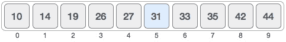

# 二分搜索法简介

> 原文：<https://levelup.gitconnected.com/introduction-to-binary-search-b3ce843b1221>


# 1.二进位检索

二分搜索法是一种有效的算法，用于从元素的排序列表中寻找元素。它是一种基于**分而治之**设计范式的搜索算法。与最坏情况下的线性搜索的 O(n)相比，它给出了相当不错的运行时间 **O(log n)** 。在这个算法中，我们递归地将数组一分为二，直到我们找到要搜索的元素，或者列表缩小到一个与我们的元素不匹配的元素。

# 2.二分搜索法的需要

我们在日常生活中以这样或那样的形式使用二分搜索法。例如，当我们需要在字典中搜索一个单词时，我们不会像线性搜索那样一个单词一个单词一页一页地搜索。根据我们对这个单词可能在哪里的猜测，我们从字典中随机选择一页。然后我们查看页面上是否有这个单词，然后我们决定我们需要再次搜索书的哪个分区，我们丢弃其他知道我们要搜索的单词的分区。最后，我们要么找到这个单词，要么找到可能包含这个单词的最后一页，然后决定这个单词在字典中不存在。还有许多其他的例子，比如在一本书里找页码，在一个街区里找房子，等等。

如果我们对项目进行排序，并使用二分搜索法搜索一个项目，我们可以实现复杂度为 **O(log n)** 。**使用二分搜索法，搜索结果所花费的时间随着数据集的大小而增加，但不是成比例的。**

# 3.二分搜索法算法

现在，让我们探索二分搜索法是一个简单而有效的算法，以及它是如何工作的。二分搜索法将要搜索的元素与数据集中间的元素进行比较。

它基于以下步骤:

**第一步:**计算中间元素。

**第二步:**检查中间元素的值。可能有三种情况:

1.  列表的中间元素**等于被搜索的元素**。
    在这种情况下，你找到了你要找的东西，你停下来了。
2.  列表的中间元素**小于被搜索的元素**。
    在这种情况下，我们将想要搜索的列表作为中间元素到最后一个元素之后的列表。
3.  列表的中间元素大于被搜索的元素。
    在这种情况下，我们将我们想要搜索的列表作为从第一个元素到中间元素之前的元素的列表。

**步骤 3:** 重复步骤 1 和 2，直到我们得到要搜索的元素的位置，或者我们要搜索的列表只剩下一个元素，该元素不是必需的元素，因此列表中不存在该元素。

**注意:**我们可以使用下面的公式来计算列表中的中间元素:

```
**mid = left + (right - left) / 2**
```

这里左边的**是我们要搜索的列表的起始索引**，右边的**是该列表的最后一个索引**。

# 4.二分搜索法的例子

现在，让我们通过一个示例来看看二分搜索法算法的预演或工作情况:

正如我们之前提到的，二分搜索法的强制条件是**列表应该被排序**。因此，让我们来看一个包含 10 个元素的列表，如下所示:



## 4.1.案例:列表中存在要搜索的元素

让我们**搜索列表中存在的元素 31** 。

正如我们在上面解释的算法中看到的，最初这些变量将具有以下值:

```
left = 0
right = 9
mid = 0 + (9 – 0) / 2 = 4.5 = 4 (as we need integer value for index)
key = 31
```

现在，根据算法，我们将索引 4 处的元素与我们的密钥进行比较。这里，我们看到 mid 元素的值为 27。因为 27 不等于 31。

实际上，我们知道元素在列表的下半部分。因此，我们遵循算法并改变搜索列表:


现在，中间元素的新计算索引是 5。根据算法，我们发现中间的元素是关键元素，即 31。

```
left = mid + 1 = 5
right = 9
mid = 5 + (9 – 5) / 2 = 7
```

4.2.案例:列表中不存在要搜索的元素


假设，我们需要**搜索列表中不存在的元素 32** 。


继续上一步，我们看到 31 < 32\. So, we redefine the search list:

```
left = 5
right = mid - 1 = 6
mid = 5 + (6 – 5) / 2 = 5
```


Now, the new calculated index of the middle element is 6\. Again, we compare the value at this index with our key. The value of the middle element is 33\. Since 33 > 32。我们再次修改列表:


## 我们可以看到，现在右索引**比左索引**小，但这在列表中是不可能的。因此，我们断定列表中不存在**元素。**

我们可以从上面的例子中推断出，当我们停止算法时，有两种情况。首先是我们找到所需的元素。第二是右索引变得比左索引小。

5.Java 中的二分搜索法实现

```
left = mid + 1 = 6
right = 6
mid = 6 + (6 – 6) / 2 = 6
```

我们现在有了实现二分搜索法算法所需的所有知识和信息。二分搜索法最基本和直观的实现是通过递归，因为我们用不同的值递归地做同样的事情几次。但是您可能已经知道，通过递归实现的每个代码也可以通过迭代实现。我们将通过 Java 中的递归和迭代来了解实现。

```
left = 6
right = mid - 1 = 5
```

5.1.递归实现

5.2.迭代实现

# 6.二分搜索法的复杂性

6.1.时间复杂度

## 二分搜索法的时间复杂度为 O(log n)。最好的时间复杂度是 O(1 ),其中列表的中间元素是被搜索的元素。最坏的情况可能是被搜索的元素要么在列表的末端，要么不在列表中。

## 6.2.空间复杂性

# 二分搜索法的空间复杂度取决于算法的实现。

## 在迭代实现的情况下，空间复杂度为 O(1)。而在递归实现的情况下，空间复杂度是 O(log n)。

7.结论

## 二分搜索法算法是计算领域中广泛使用的算法。这是一个简单、可靠、高效的搜索算法，在大数据集和小数据集上都可以很好地工作。

在本文中，我们学习了二分搜索法算法及其在 Java 中的递归和迭代实现。

In the case of iterative implementation, the space complexity is O(1). While in the case of recursive implementation, the space complexity is O(log n).

# 7\. Conclusion

The binary search algorithm is a widely used algorithm in the computational domain. It is a simple, reliable, and efficient search algorithm that can work well on both big and small datasets.

In this article, we learned about the Binary Search Algorithm and its recursive and iterative implementations in Java.