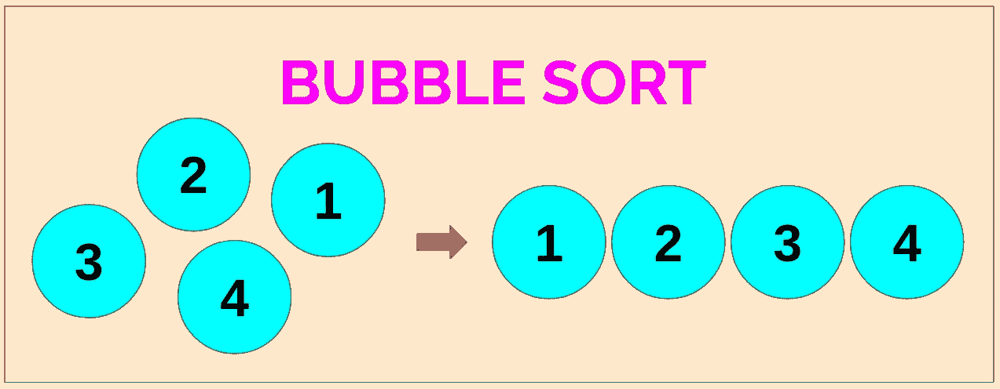
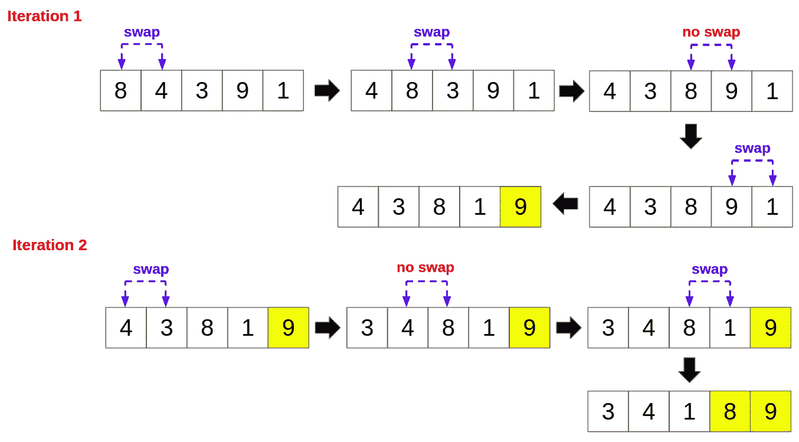
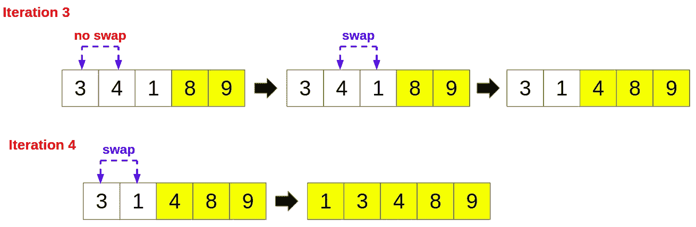
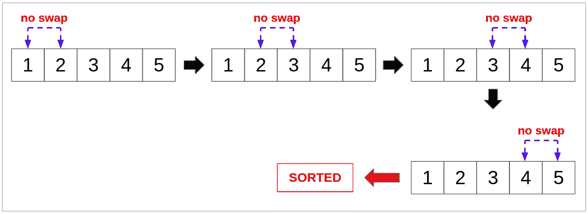
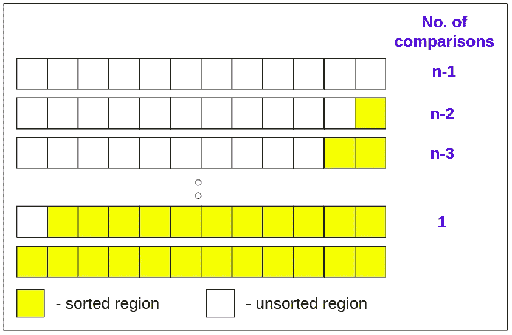
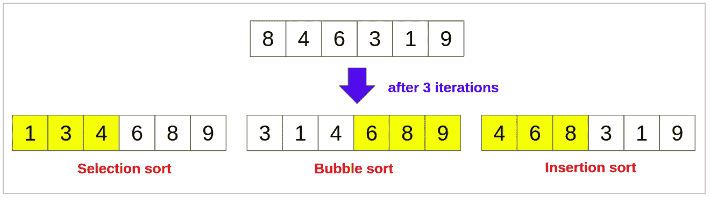

# 冒泡排序简介

> 原文：<https://levelup.gitconnected.com/introduction-to-bubble-sort-e3f454f6976c>

## 排序算法 03

作者图片

在排序算法系列的前两篇文章中，我们看了 [*选择排序*](https://medium.com/nerd-for-tech/introduction-to-selection-sort-19de8e72c89f) 和 [*插入排序*](https://medium.com/star-gazers/introduction-to-insertion-sort-756821945e3e) 。冒泡排序是另一种简单的排序算法，易于理解和实现。这个想法是比较相邻的元素，如果它们的顺序不正确，就交换它们。让我们用一个例子来理解冒泡排序是如何工作的。

假设要排序的数组是(8，4，3，9，1)，下图说明了冒泡排序如何执行多次迭代，直到数组被完全排序。

作者图片

在第一次迭代中，我们从比较前两个元素 8 和 4 开始。从 8 > 4 开始，我们交换它们。然后我们比较第二个和第三个元素，8 和 3。从 8 > 3 开始，我们交换它们。然而，当我们比较接下来的两个元素 8 和 9 时，它们的顺序是正确的(8 < 9). Hence we do not swap them. We continue this process until the last two elements are compared. At the end of the first iteration, the largest element 9 is brought to the end of the array. Similarly, the second largest element 8 is brought to its correct position at the end of the second iteration. Also note that in the *i* ᵗʰ迭代，我们必须比较直到(n - *i* )ᵗʰ元素，其中 n 是数组中元素的总数，并且 *i* ≥ 0。例如，在上述示例的第二次迭代中，我们不考虑 9(最后一个元素)；在第三次迭代中，我们不考虑最后两个元素。

在上述示例中，数组按升序排序。要按降序对数组进行排序，我们应该只在左边的元素小于右边的元素时交换元素(与我们在示例中所做的相反)。

经过 *m* 次迭代后，数组的最后 *m* 个元素将排序。

## 用 C 实现

## 冒泡排序分析

*   冒泡排序是一种就地算法，这意味着它不需要额外的内存空间来执行排序。
*   冒泡排序的最佳时间复杂度为 O(n)。当数组已经排序时(这是最好的情况)，冒泡排序可以在一次迭代中检测到它并将终止。如果在一次迭代中没有执行交换，则表明数组已经排序(见下图)。上述实现中交换的布尔变量*服务于该目的。*

作者图片

*   冒泡排序在最坏情况和一般情况下的时间复杂度为 O(n)。假设数组的大小为 n，它应该在第一次迭代中执行(n-1)次比较，在下一次迭代中执行(n-2)次比较，这种模式一直持续到最后一次迭代(见下图)。因此，比较的总数将是(n - 1) + (n - 2) + …… + 1 = n(n-1)/2，因此为 O(n)。

*   由于二次最坏情况时间复杂度，当要排序的元素数量很大时，冒泡排序是低效的。
*   由于冒泡排序的就地排序功能，当可用的空闲内存有限时，可以使用它。然而，在现实世界的应用中，插入排序经常取代冒泡排序，因为它的性能更好。

## 冒泡排序 vs 插入排序 vs 选择排序

*   所有这三种排序算法在最坏情况和平均情况下的时间复杂度均为 O(n)。插入排序和冒泡排序的最佳时间复杂度为 O(n)，而选择排序的最佳时间复杂度为 O(n)。
*   都是原地算法(空间复杂度为 O(1))。
*   假设元素将按升序排序，在冒泡排序的 *i* 次迭代之后，数组中最后的 *i* 元素将是排序顺序中最大的 *i* 元素。类似地，对于选择排序，数组的第一个 *i* 元素将是排序顺序中最小的 *i* 元素。然而，插入排序将只排序第一个 *i* 元素。下图将有助于更好的理解。(*请注意，这可能会根据算法的实现方式而改变。例如，阵列也可以从右向左移动*

希望这篇文章对你有用！