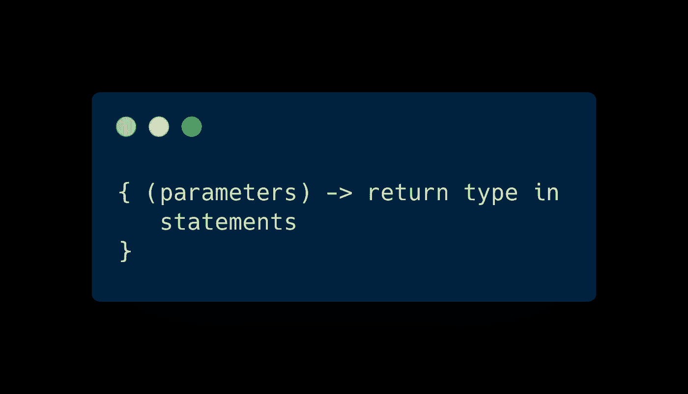
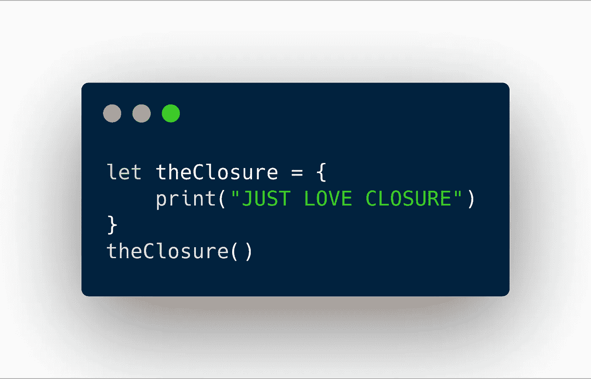
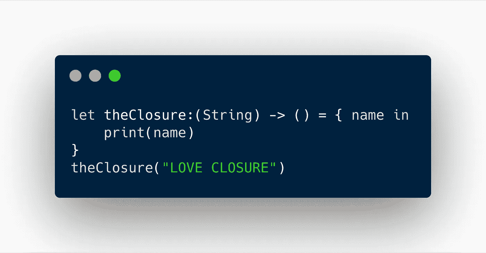
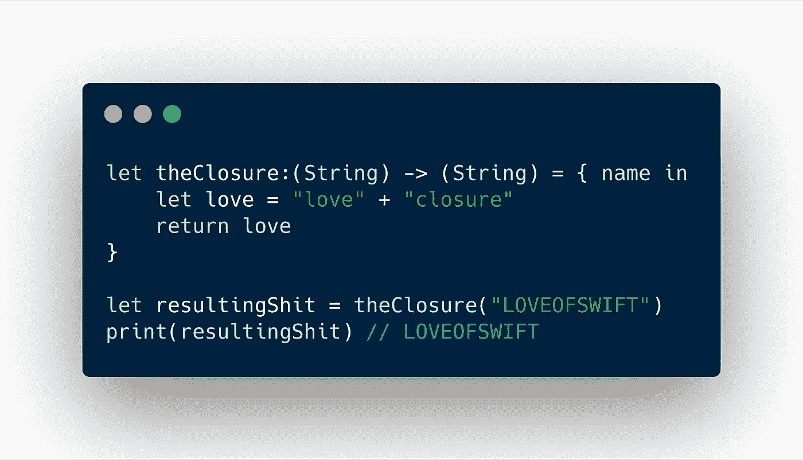
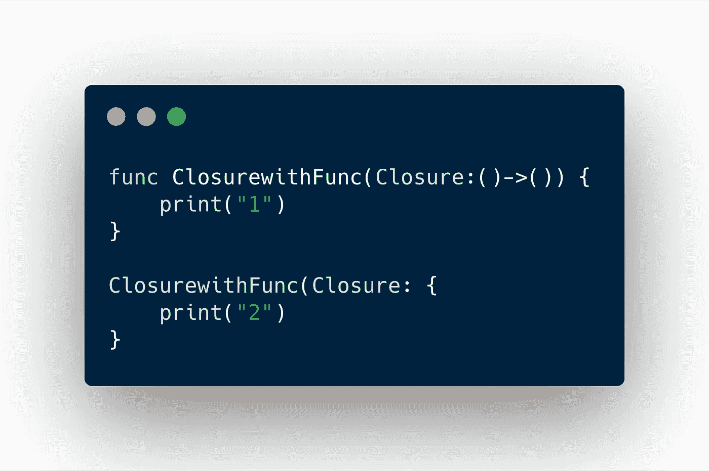
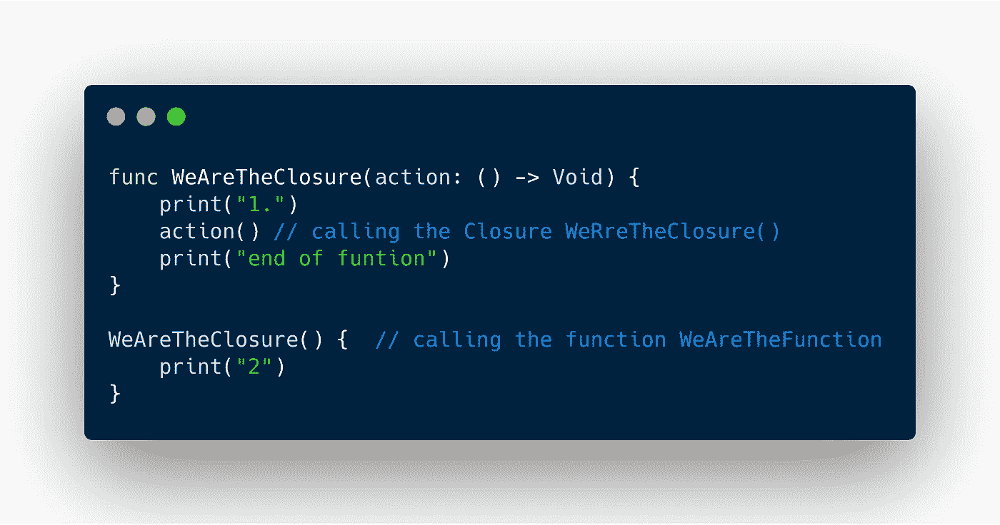
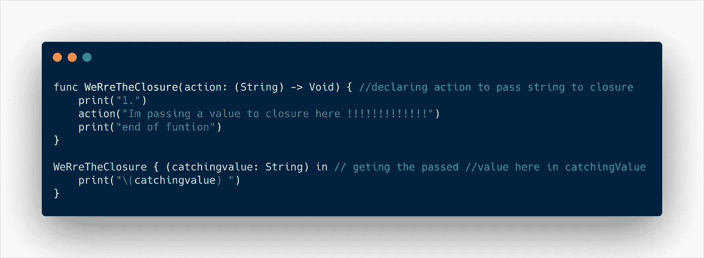
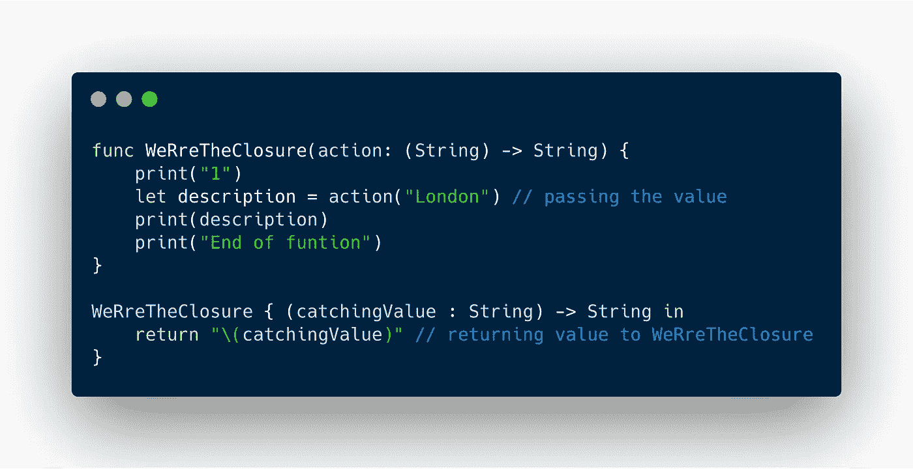
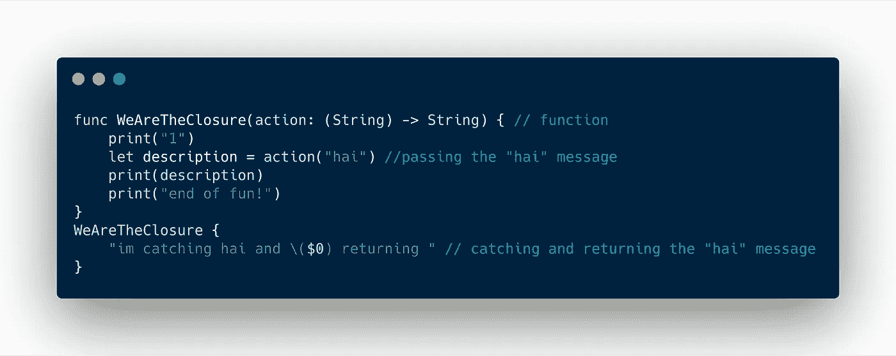
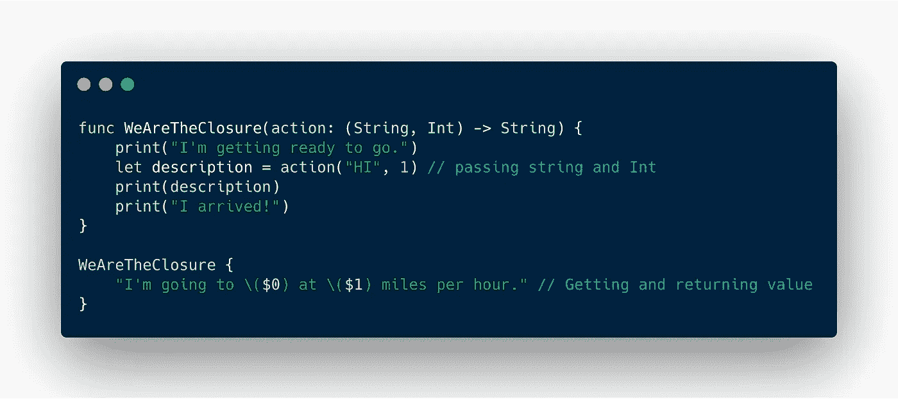

# Swift 中的闭包介绍

> 原文：<https://levelup.gitconnected.com/introduction-to-closures-in-swift-ea75477e8f0b>

## 新手对新手的终结


## **为什么您需要了解闭包？**

当您想要将一段代码作为参数传递给想要异步执行的方法时。

它们是 Swift 中特殊的一类函数，称为**闭包，**不用关键字 ***func*** 和函数名就可以定义。

## **什么是闭包？**

> *“闭包*是自包含的功能块，可以在代码中传递和使用。”—苹果公司

闭包可以捕获和存储对任何常量(let)和变量(var)的引用。

闭包的语法:



句法

让我用一个例子来解释一下



示例 1

这是一个简单的关闭它将打印**‘只是爱关闭’**。这里我们称闭包为`***theClosure()***`，这个闭包不接受任何参数，也不返回任何值，所以很简单。

让我们看一个接受参数的闭包:



这里我们将一个字符串传入`theClosure`。(字符串)用于声明传递的值是一个字符串。在名称(变量)中声明传递的字符串

`**in**`是将参数名与语句分开的关键字

`***->( )***`就是接受字符串，并返回我们需要的东西。

糟糕..！我们在这里不返回任何东西，所以我们`**()**`把它留为空，否则我们会留下任何我们想要返回的数据类型。

返回的另一个例子:



这里我们传递一个字符串并返回一个字符串。

```
let resultingShit = ClosuretheHell("LOVEOFSWIFT")
```

这里用的这行是通过`resultingShit`传递并得到返回值。

希望你们理解，如果不遵循以下代码:

```
while true { if you == "yes im understand"{ break }}// come from first until you get it
```

抱歉，如果我的基本知识让你感到厌烦，现在让我们再深入一点。

将闭包作为函数参数传递



这里第一个闭包类 **func** `ClosurewithFunc`(函数)并打印(" 1 ")，然后它**不会打印(" 2")** *因为我们在这里没有调用闭包(*，所以它会有一种孤独的感觉并打印任何东西

*让我们看看同时调用 **func 和 closure:***

```
*func ClosurewithFunc(Closure:()->()) {
    print("1")
    Closure()
}

ClosurewithFunc(Closure:  {

    print("2")
})*
```

*代码将打印(" 1 ")，然后在函数中我们调用 closure 作为`Closure()`，所以现在 closure 也将打印(" 2 ")*

*现在向**尾随关闭问好。***

## ***什么是尾随闭包？***

*Swift 允许您使用一种叫做*尾随闭包语法*的特殊语法。您不是将闭包作为参数传递，而是直接在大括号()内的函数之后传递它。这看起来很酷，尾随闭包语法在 Swift 中极其常见，所以值得习惯。*

*让我们举一个例子*

**

```
*here output be like 1 2“end of function”*
```

*看这个例子*

**

*我们一直使用`() -> Void`来表示“不接受参数，不返回任何东西”，但是您可以继续使用您的闭包应该接受的任何参数的类型来填充`()`。*

```
*// OUTPUT BE LIKE 
1I'm passing value to closure here !!!!!!!!!!!!!!!!!!end of function* 
```

*嘿，来，让我们返回一些值，看看*

**

*我们一直使用`() -> Void`来表示“不接受参数，不返回任何东西”，但是您可以用任何类型的数据来替换这个`Void`，以强制闭包返回值。*

# *速记参数名*

*Swift 有一个速记语法，可以让你写得更短(哇，多么简单)。我们可以让 Swift 为闭包的参数自动命名，而不是编写`**string (variable) in**` **，**。这些是用美元符号命名的，然后是从 0 开始计数的数字。*

*速记参数名称的示例:*

**

***我们不需要任何变量来传递和返回值* **

```
*OUTPUT BE LIKE :
“1”“im catching “hai” and hai returning”“hai”*
```

# *多参数闭包*

***(String，Int)** String **- >** 为第一个参数， **Int** **- >** 为第二个参数，依次类推。*

*例子*

**

*并返回 **$0，$1** ，并根据您的需要继续返回多个参数。*

> *哦，结束，你就像曼莫汉·辛格博士一样简单*

*好了，伙计们，让我停在这里。正如标题所示，我是一个新手，我从自己的错误中学到了很多，所以在这个博客中的任何错误，请通知我。*

****觉得这本书好看吗？****

**推荐本帖(点击*👏*按钮)这样其他人也能看到……* 推特上联系我*[***托尼***](https://twitter.com/Tonywilson_jpg)**