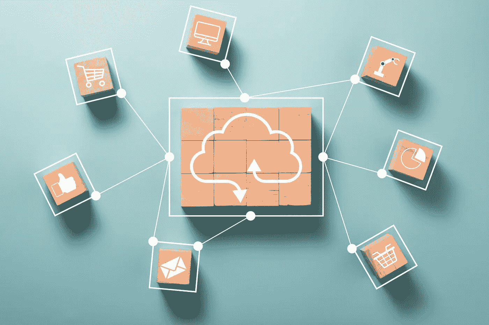
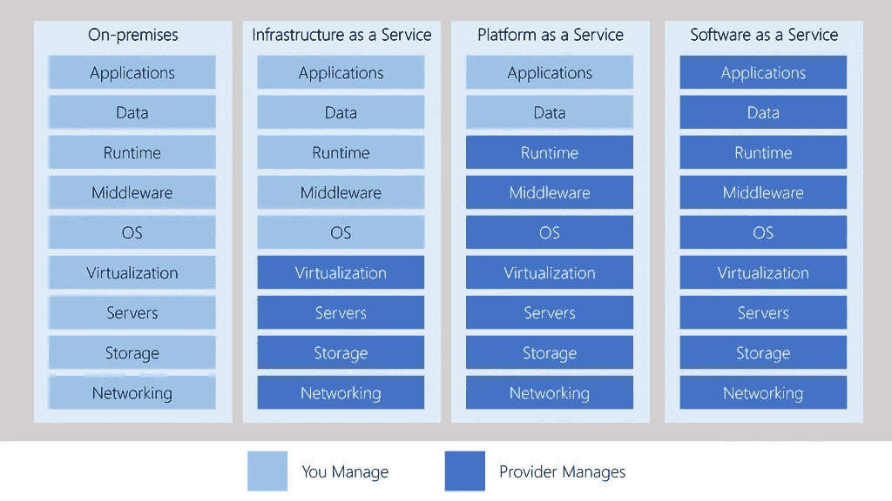
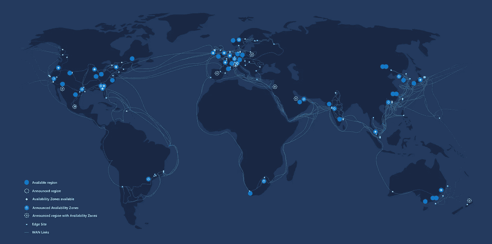

# 云计算简介

> 原文：<https://levelup.gitconnected.com/introduction-to-cloud-computing-235e530b9fe0>

## Azure 和云

## 云计算是软件利用、开发和托管的现在和未来。让我给你介绍一下它的基本情况。

# 云计算的早期发展

## 过去的数据中心

直到最近，大约 10 到 15 年前，每家公司都有自己的数据中心，其服务器用于不同的目的，可能运行在不同的硬件上，甚至使用不同的操作系统。

每台服务器都有自己的 CPU、硬盘和 RAM 内存，并且每台服务器都需要足够的资源供高峰时间使用。

这还意味着，平均而言，大多数服务器都没有得到充分利用，组织在硬件上花费了大量资金，但大部分时间甚至没有利用其 10%的能力。

## 虚拟化

然后，我们开始实施虚拟化，这允许我们在一台虚拟主机(物理服务器)上运行多个虚拟机。因此，我们能够更好地利用硬件，减少空间冷却，当然还有成本。

然而，即使有了虚拟化，我们仍然有一些劣势，例如高昂的前期成本。因此，我们需要购买功能强大的虚拟主机，然后我们将这些主机保存五年以摊销成本。

我们仍然需要支付数据中心的空间费用，以及冷却和其他服务器需求的电费和水电费。此外，硬件维护仍然是必需的，因为这可能会出故障，网卡可能会坏，等等。

虚拟化比专用硬件更具成本效益，但仍有改进的空间。这就是云计算的由来。

## 云计算

[*云计算*](https://searchcloudcomputing.techtarget.com/definition/cloud-computing) *使公司能够将虚拟机、存储或应用程序等计算资源作为公用事业来使用，就像电力一样，而不必在内部构建和维护计算基础架构。* [来源](https://searchcloudcomputing.techtarget.com/definition/cloud-computing)。

 [## 如何一步一步创建免费的 Azure 帐户

### 创建免费 Azure 帐户指南。有哪些可以免费使用的服务？什么是目录或订阅，什么是…

medium.com](https://medium.com/@danielrusnok/how-to-create-a-free-azure-account-step-by-step-348d4991ae6e) 

在云环境中，云提供商拥有他们的数据中心，并管理他们的所有硬件、网络，当然还有虚拟化。云完全建立在虚拟化的原则之上。没有客户端可以直接访问硬件。简单来说，它的虚拟化环境。

所有资源被集中在一起，然后共享给多个客户端，这些客户端都使用该共享硬件。这种客户端不需要知道它们运行在什么服务器上，或者它们的环境运行在多少服务器上。他们只是消费服务，而云提供商是确保有足够的共享资源来处理需求的人。

用户只选择他们想要使用的服务。每个服务都有自己的利用率定义。一次可以按用户计费，一次可以按分钟计费。云基础架构应由用户自助服务，云提供商应完全自动进行配置，并以几乎即时的方式交付。

# 云服务的基本划分

每个云提供商都有自己的服务列表，但是这些服务可以分为两种基本服务。

## 计算能力

计算能力是指计算机能做多少处理工作。例如，当您购买新的家用电脑时，您可能会选择一台具有 8 GB 内存和最新处理器的电脑来运行当前的软件。但是，随着计算机负载的增加，你会发现它变慢了。

借助云计算，您可以根据需要增加或减少计算能力。这可以节省你的成本，因为你只为你使用的资源付费。

## 储存；储备

存储是可以存储在计算机上的大量数据。传统计算机的硬盘空间有限。借助云计算，您可以根据需要请求更多存储。

此外，我们可以根据用户需求将云服务分为三类。

## 基础设施即服务(IaaS)

IaaS 旨在直接向客户提供对硬件的控制。这并不意味着对物理机器的控制。这就意味着对硬件的完全控制变成了在线界面。客户将获得对虚拟机、存储或操作系统的控制权。

常见用法:

*   负载迁移。
*   仓库。
*   备份和恢复。

## 平台即服务(PaaS)

PaaS 为软件应用的开发、测试和部署提供了一个环境。目标是快速创建应用程序，无需考虑基础架构。

常见用法:

*   开发框架(软件资源如 [Azure Fabric Service](https://medium.com/@danielrusnok/my-introduction-into-azure-service-fabric-de65cc72a7b5) )。
*   分析和商业智能。

## 软件即服务(SaaS)

SaaS 为没有软件业务的公司供货。所以我们谈论的是像 Office365 或 Skype 这样的软件。

## **责任表**

[来源](https://docs.microsoft.com/en-us/learn/modules/principles-cloud-computing/media/5-layer-diagram.png)

*   **IaaS** —需要对所有云服务进行大部分用户管理。
*   **平台即服务** —需要更少的用户管理。云提供操作系统，用户负责应用和数据。
*   **SaaS** —所有责任都由云提供商承担。

# 云计算的优势

*   **经济高效的** — Azure 预付费或基于消费的订阅。
*   **可扩展性** —您可以在任何给定时间根据需求或工作负载增加或减少所使用的资源和服务。
*   **弹性** —当你的工作负载因需求的增加或减少而改变时，云计算系统可以通过自动添加或删除资源来进行补偿。
*   **当前** —不再负责软件更新和其他管理任务。
*   **可靠** —当你在经营一家企业时，你希望确信你的数据会一直在那里。
*   **全球** —微软 Azure 在世界各地都有数据中心。
*   **安全** —谁可以进入大楼，谁可以操作服务器机架，等等。这就是**物理安全**。谁能通过网络连接到你的系统和数据？这是**数字安全**。

微软遍布全球的 Azure 数据中心— [来源](https://docs.microsoft.com/en-us/learn/modules/explore-azure-infrastructure/2-azure-datacenter-locations)

## 来源

*   弗拉德·卡特林内斯库的多视球场。
*   微软学习平台。

 [## 丹尼尔·鲁斯诺克的时事通讯

### 每个月我都会给你发一封电子邮件，列出我的最新文章。这当然是友好的联系…

www.danielrusnok.com](https://www.danielrusnok.com/daniel-rusnoks-newsletter) 