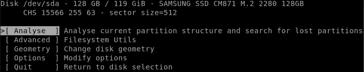
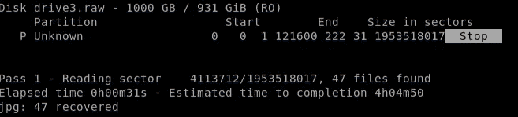
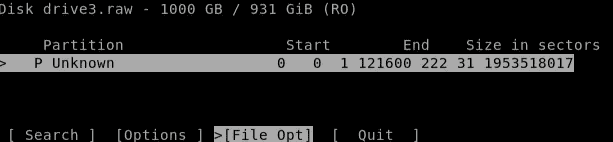
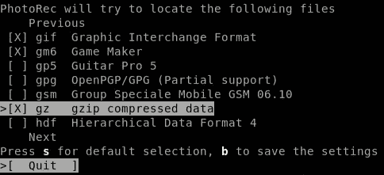
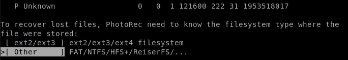

# 免费 Unix 工具数据恢复简介

> 原文：<https://levelup.gitconnected.com/introduction-to-data-recovery-with-free-unix-tools-8dd2bb9ace34>

我不得不从一个损坏的外部硬盘上恢复数据，我的典型恢复软件失败了( [*TestDisk*](https://www.cgsecurity.org/wiki/TestDisk) )，因为磁盘的硬件严重损坏。

*保证:我不是数据恢复方面的专业人士。这是我从朋友损坏的硬盘上恢复数据的经验。我对任何数据的丢失不承担任何责任。仅当您的数据对您不重要时，才遵循以下步骤。*

## 症状

OMG！一位朋友在将一个 2 TB WD elements 外置硬盘连接到正在进行写操作的 PC 时，它掉了下来。

当然，Windows nor Ubuntu 无法再挂载磁盘，磁盘管理器将第一个主分区显示为 *RAW* ，Windows 提示:

> 驱动器没有格式化，您想现在格式化吗

可能丢失的数据量约为 40 GB 的图片/视频和 1 GB 的文档，如。docx，。ppt，和. pdf。

## 必要工具的安装

您要么使用一个可引导的实时系统，如 [KNOPPIX](http://www.knopper.net/knoppix/index-en.html) ，它附带了所有需要的工具，要么在您的机器上手动安装它们:

*   [TestDisk](https://www.cgsecurity.org/wiki/TestDisk_Download) :如果问题是由非机械问题引起的，比如当您得到一个损坏的分区表时，那么 *TestDisk* 应该能够恢复损坏的磁盘。这个过程实际上很简单，并且有很好的文档记录。
*   [ddrescue](https://www.gnu.org/software/ddrescue/) :将硬盘、光盘等故障块设备复制到文件或其他块设备。

# 丑陋的一面——机械硬件故障

对我来说，TestDisk 的分区结构分析算法失败了，因为有太多损坏的扇区。



TestDisk 试图分析和恢复丢失的分区

开始时，对故障设备的分析看起来没问题，但是每次尝试都失败了。找不到分区。

现在怎么办？

## 尽可能多地恢复数据！

# 使用 ddrescue 创建原始光盘映像副本

*   *ddrescue* 可用于对硬盘进行低级访问，并对整个设备进行复制。
*   与众所周知的 dd 命令相反，它执行智能复制算法，跳过坏扇区并尝试首先复制所有好扇区。
    关于检测到的坏扇区的信息存储在一个日志文件中，该文件可用于在下次运行时进行重新读取

## **小心**

*   如果您对 Unix 和终端不熟悉，请不要继续。你可以通过误用 *ddrescue* 轻易地破坏你的整个系统，例如当你把错误的设备名传给 *ddrescue* 时。
*   一般来说，在一个机械损坏的硬盘上执行太多的 IO 操作不是一个好主意。一个坏扇区可能首先像一个微小的整体，但你越是试图访问那里的数据，这个整体就会变得越大，更多的数据会永远丢失。

[来自官方手册:](https://www.gnu.org/software/ddrescue/manual/ddrescue_manual.html)

> 永远不要试图拯救一个读/写挂载分区。由此产生的副本可能是无用的。最好要拯救的设备或分区根本没有挂载，甚至不是只读的。
> 
> 不要试图修复有 I/O 错误的驱动器上的文件系统；您可能会丢失更多的数据。
> 
> 如果您使用设备或分区作为目标，存储在那里的任何数据都将被覆盖。

有很多方法可以找回数据，比如使用[取证数据恢复工具，最重要的是](https://linuxconfig.org/how-to-recover-deleted-files-with-foremost-on-linux)，但是直接在光盘上应用一堆不同的恢复工具并不是一个好主意，因为这可能会恶化光盘的状态。

创建一个包含尽可能多的数据的原始磁盘映像，并从那里开始。

**1。了解您安装的设备**

你必须识别你损坏的设备。使用 *lsblk* 列出所有连接到系统的块设备。

```
$ lsblk -o name,label,size,fstype,model
sda             119,2G          SAMSUNG SSD CM87
├─sda1            512M vfat     
└─sda2          118,8G ext4     
sdb               1,8T          Elements 10B8   
└─sdb1 Elements   1,8T ntfs
```

在那个例子中， *sda* 是我的操作系统， *sdb* 是一个外部硬盘。

建议在应用 ddrescue 之前卸载光盘。



```
$ sudo unmount /dev/sdb1
$ lsblk | grep sdb1
  sdb1   8:17   0   1,8T  0 part
```

**2。作为一个新手，我更喜欢将原始磁盘映像存储到文件中，而不是重写一个实际的附加硬盘。**

首先尝试最基本的选项:

```
$ ddrescue -d -n /dev/sdc1 /path/to/backup/drive3.raw ddrescue.logwith options:
-d direct disc access, bypasses the kernel's IO cache
-n get most good areas by skipping the scraping phase; Avoid trying to rescue difficult parts;
```

不幸的是操作卡住了，我不得不用“Control + C”停止。我得到了一个大约 20 GB 的磁盘映像(drive 3 . raw)——对于开始来说还不错。幸运的是，ddrescue 可以随时停止，并在以后使用不同的设置继续运行。

```
$ ddrescue -e +2 -d -r1 -T 1s /dev/sdc1 /path/to/backup/drive3.raw ddrescue.logwith options:-e maximum number of bad areas allowed before giving up
-T interval, maximum time since last successful read allowed before giving
-r3 retry bad sectors (3 times) detected on a previous run
```

由于复制过程需要几个小时，而且仍然会任意冻结，所以我编写了一个小脚本来多次重新运行 ddrescue，以扩展创建的备份。

```
$ ddresc-copy.sh /dev/sdc1 /path/to/backup/drive3.raw ddrescue.log// ddresc-copy.sh
#!/bin/shcounter=0while [ $counter -lt 5 ]
do 
 OUTPUT=$(ddrescue -e +0 -d -r1 -T 1s $1 $2 $3)
 counter=$(( $counter + 1 ))echo "done: $OUTPUT"if [[ $OUTPUT == *"Finished"* ]]; then
  exit 0
 fiecho "new run $counter"
 sleep 3
done
```

最后我有了一个 1 TB 大小的副本！不是整个光盘，但足以找到一些文件肯定。

**3。调查原始磁盘副本**

我已经怀疑过了，但是 *parted* 找不到任何东西 *TestDisk* 也无法恢复分区表。

没有适当的文件系统结构，就无法重建文件夹结构或读取文件名。但是，仍然可以找到文件扩展名正确的原始数据！

```
$ parted drive3.raw
Disk /media/christian/Elements/Backups/drive3.raw: 1000GB
Sector size (logical/physical): 512B/512B
Partition Table: msdos
Disk Flags:Number  Start  End  Size  Type  File system  Flags
```

查看日志文件会发现一些坏扇区。

```
# Mapfile. Created by GNU ddrescue version 1.22
# Command line: ddrescue -i8200MiB -s5GiB -e +0 -d -r1 -T 3s -n /dev/sdc1 /media/christian/Elements/Backups/backup.raw ddrescue.log
# Start time:   2020-05-14 08:52:58
# Current time: 2020-05-14 08:52:58
# current_pos  current_status  current_pass
0x00000000     ?               1
#      pos        size  status
0x00000000  0x200800000  ?
0x200800000  0x140000000  ?
0x340800000  0xE5A0238200  ?
```

# 从原始分区副本恢复数据

## **Photorec**

*Photorec* 与 *TestDisk* 出自同一家开发商，可用于从原始图像中提取数据。如果原始文件系统格式是已知的，那就更好了。我用的是最新的测试版 7.2。

不出所料，分区未被识别。



选择要恢复的文件扩展名

浏览列表并选择文件类型。



[以下是支持文件的列表](https://www.cgsecurity.org/wiki/File_Formats_Recovered_By_PhotoRec)

尽管确切的硬盘格式无法辨认，但我知道它是 FAT32。



选择文件系统格式

Photorec 将输出每种类型的恢复文件的数量。


**恢复的数据**

是啊！Photorec 检索到 47 GB 的实际未损坏的文件！

```
$ du -sh recovered_data
47G
```

然而，这些文件是随机命名的，没有结构，并被附加到名为 recup_dir.X 的文件夹中。

```
$ ll recovered_data
drwxrwxrwx 1 christian christian 232K Mai 14 16:22 recup_dir.1
drwxrwxrwx 1 christian christian 232K Mai 14 17:23 recup_dir.10
drwxrwxrwx 1 christian christian 228K Mai 14 17:28 recup_dir.11
drwxrwxrwx 1 christian christian 216K Mai 14 17:32 recup_dir.12
drwxrwxrwx 1 christian christian 160K Mai 14 17:33 recup_dir.13
drwxrwxrwx 1 christian christian 160K Mai 14 17:34 recup_dir.14
drwxrwxrwx 1 christian christian 164K Mai 14 17:34 recup_dir.15
drwxrwxrwx 1 christian christian 112K Mai 14 17:35 recup_dir.16
```

为了使数据可用，一些分析和分类是必要的。

盒子里有什么？

对于如此大量的非结构化文件，我想知道仅使用*查找管道*找到了什么类型的数据。

```
$ find recovered_data -type f | rev | cut -d. -f1 | rev  | tr '[:upper:]' '[:lower:]' | sort | uniq --count | sort -rn
  25276 jpg
   1204 docx
    612 png
    126 mp4
    124 doc
     73 pptx
     38 pdf
     20 mov
     19 ppt
     16 3gp
     11 xlsx
      6 zip
      6 avi
      3 wmv
      3 plist
      2 odt
      2 msg
      1 xml
      1 txt
      1 notebook
      1 lnk
```

看起来棒极了！

```
*|-type f* :find all files within that directory
recovered_data/f0477104.JPG*| rev* : reverse file-path to capture file extension in front (“JPG.4017740f/1.rid_pucer/atad_derevocer”)*| cut -d.* :split string on the dot and keep first column (the extension)
“GPJ”| rev : reverse again
“JPG”| tr ‘[:upper:]’ ‘[:lower:]’: convert all upper cased characters to lower case
“jpg”| uniq --count : get all unique strings with their respective amount of files| sort -rn : sort file types in descending numeric order
```

## 排序恢复的数据

下一步是根据文件类型和内容等标准对非结构化数据进行排序和组织。

我使用并改进了一个 [Python 脚本](https://github.com/ChrizH/sort-PhotorecRecoveredFiles)，它在根据文件扩展名对文件进行分组方面做得很好。

此外，它还根据拍摄的年月来区分 jpg。此外，它还可以检测在周末旅行等多天拍摄的照片。

```
$ python recovery.py <path to files recovered_data by Photorec> <destination> -m
```

**新文件夹结构**

```
<destination>
|- DOC
|- PDF
|- PNG
|- JPG
  |- 2020   # Year
    |- 1    # Month January
        |- 2020-01-10__to__01_13 # event, trip 1
        |- 2020-01-23__to__01_24 # event, trip 2
```

# 结论

我只能用免费的 Unix 工具从损坏的外部硬盘上恢复丢失的数据。

*ddrescue* 用于创建原始分区副本。首先，所有未损坏的扇区都已复制到文件中。在额外的迭代中*从坏扇区中刮出数据，直到我对 1 TB 大小的结果感到满意。*

*Photorec* 在恢复众所周知的数据类型方面做得很好。
但是，结构和文件名都没有了。

非结构化文件按扩展名分组，JPG 图像按创建时间排序和分组。

在我的下一个故事中，我将讨论为恢复的文本文档找到合适的文件名的问题。doc，。ppt 或. pdf。

# 资源

来自 Level1Linux 的优秀视频

CGSecurity

[](https://www.cgsecurity.org/wiki/TestDisk_Step_By_Step) [## 逐步测试磁盘- CGSecurity

### 这个恢复示例引导您一步一步地通过 TestDisk 来恢复丢失的分区和修复损坏的…

www.cgsecurity.org](https://www.cgsecurity.org/wiki/TestDisk_Step_By_Step) [](https://www.cgsecurity.org/wiki/After_Using_PhotoRec#Using_a_more_complex_Python_script) [## 使用 photo RC-CG security 后

### usr/bin/env python import OS import OS . path import shutil import sys source = sys . argv[1]destination = sys . argv[2]…

www.cgsecurity.org](https://www.cgsecurity.org/wiki/After_Using_PhotoRec#Using_a_more_complex_Python_script)